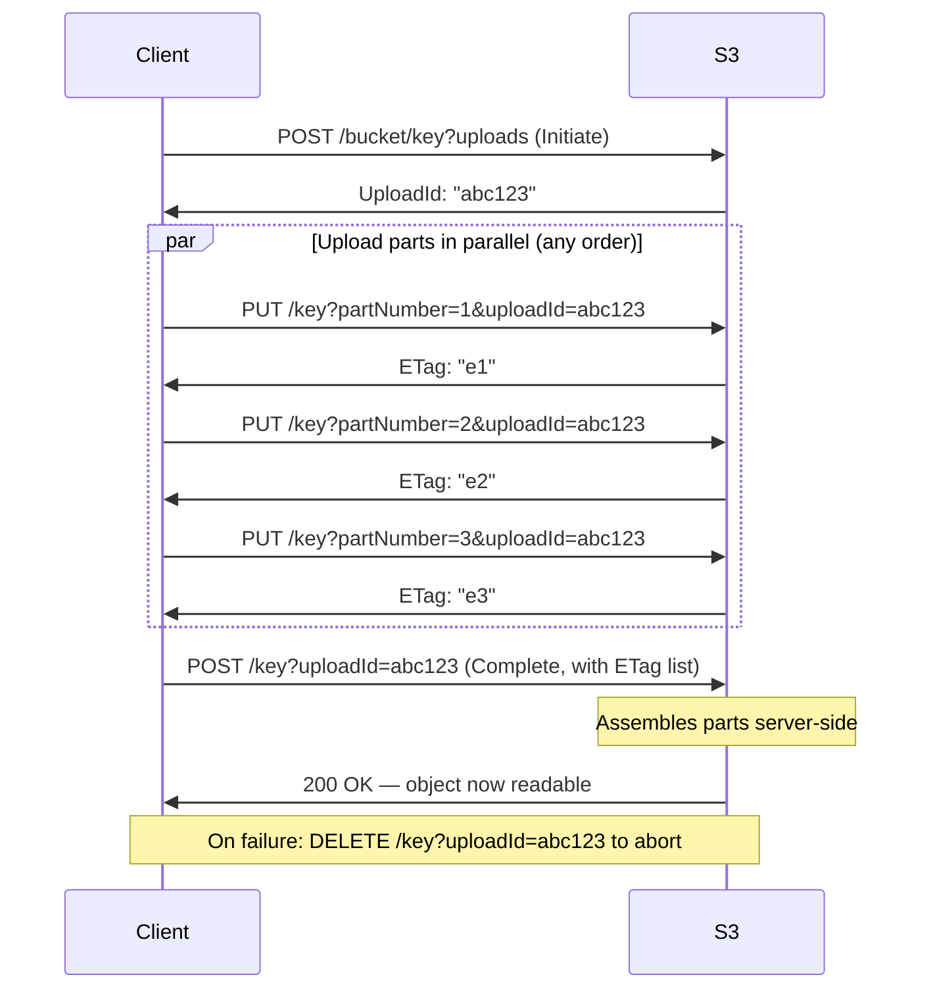
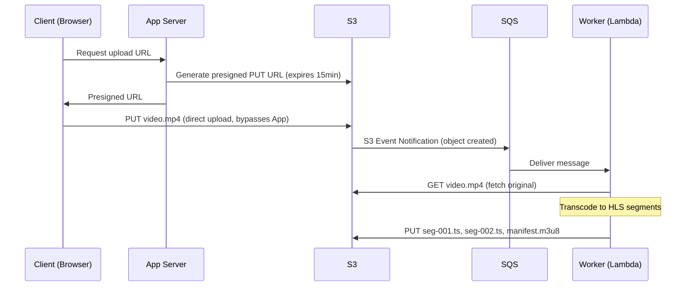

Object storage is the backbone of modern data infrastructure — not just for user uploads, but for data lakes, ML training sets, backups, and static asset delivery at any scale. S3 is the canonical implementation; understanding its design explains why it works differently from block or file storage.

## Core Model: Flat Namespace

Object storage has no real directory hierarchy. A bucket is a flat keyspace. The apparent "folder" structure (`images/2024/jan/photo.jpg`) is just a key string — the `/` delimiter is cosmetic. There are no directories to create or delete.

```
Bucket: my-app-assets
  Key: images/2024/jan/photo.jpg    ← one atomic object
  Key: images/2024/feb/photo.jpg    ← another atomic object
  Key: videos/intro.mp4

# "images/2024/" is not a directory — it is a key prefix.
# Listing objects with prefix "images/2024/jan/" scans the keyspace.
```

**Three components per object:**
- **Key** — the unique identifier within a bucket (max 1,024 bytes UTF-8)
- **Data** — the object body (bytes, up to 5 TB per object)
- **Metadata** — system metadata (Content-Type, ETag, Last-Modified) + up to 2 KB of user-defined key-value pairs; stored separately from data, returned on HEAD requests without fetching the body

Objects are **immutable** — you cannot append or partially update. Every write creates a new version of the object. This immutability is what makes consistency and replication tractable at global scale.

## Internal Architecture

```
                        ┌─────────────────────────────┐
Client ──── HTTPS ──────►      S3 Frontend (API layer)  │
                        └────────────┬────────────────┘
                                     │
                    ┌────────────────▼────────────────┐
                    │   Metadata Service               │
                    │   (bucket → object key → data    │
                    │    node location mapping)        │
                    └────────────────┬────────────────┘
                                     │ locate data nodes
           ┌─────────────────────────▼──────────────────────────┐
           │              Data Layer (distributed storage nodes)  │
           │   Node A     Node B     Node C    Node D    Node E  │
           │  [chunk 1]  [chunk 2]  [chunk 3] [parity1] [parity2]│
           └─────────────────────────────────────────────────────┘
```

The metadata service (a distributed key-value store internally) maps `(bucket, key)` → object location on data nodes. The data layer stores the actual bytes, split into chunks and protected with erasure coding. A read requires one metadata lookup followed by data fetches from the appropriate nodes.

## Object Operations and Semantics

| Operation | HTTP | Behavior |
|-----------|------|---------|
| `PUT Object` | `PUT /bucket/key` | Upload object (up to 5 GB in one request; use multipart above 100 MB) |
| `GET Object` | `GET /bucket/key` | Download full object; use `Range` header for partial fetch |
| `HEAD Object` | `HEAD /bucket/key` | Returns metadata only — no body transfer; use for existence checks |
| `DELETE Object` | `DELETE /bucket/key` | With versioning: adds a delete marker. Without: permanent deletion |
| `COPY Object` | `PUT` with `x-amz-copy-source` | Server-side copy — no data leaves AWS; instant for same-region |
| `LIST Objects` | `GET /bucket?prefix=&delimiter=` | Paginated key listing; expensive on large buckets |

**Byte-range fetches:** Download a specific byte range of a large object without fetching the whole thing. Enables parallel download of large files — split into N ranges, fetch concurrently, reassemble.

```
GET /bucket/large-file.parquet
Range: bytes=0-10485759      # first 10 MB

GET /bucket/large-file.parquet
Range: bytes=10485760-20971519  # second 10 MB
```

This is how Spark and Athena read Parquet column groups — they fetch only the column byte ranges they need, not the full file.

## Multipart Upload

For objects larger than 100 MB, multipart upload is recommended (required above 5 GB). It enables parallel upload, reduced retry scope on failures, and streaming uploads where total size is unknown.



**Part sizing:** Minimum 5 MB per part (except last). Maximum 10,000 parts per upload. For a 50 GB file: 10,000 parts × 5 MB = 50 GB — exactly at the limit. For 100 GB files, use 10 MB parts.

**Resume on failure:** Each part is independently checksummed (ETag = MD5 of part bytes). If part 7 fails, only part 7 is re-uploaded. The other parts remain staged on S3.

**Upload directly from client (presigned URL):** Generate a presigned `PUT` URL server-side; the client uploads directly to S3 without routing bytes through your application servers.

```
# Server generates presigned URL (valid for 15 minutes)
url = s3.generate_presigned_url(
    "put_object",
    Params={"Bucket": "my-bucket", "Key": "uploads/photo.jpg",
            "ContentType": "image/jpeg"},
    ExpiresIn=900
)
# → https://my-bucket.s3.amazonaws.com/uploads/photo.jpg?X-Amz-Signature=...

# Client uploads directly:
PUT https://my-bucket.s3.amazonaws.com/uploads/photo.jpg?X-Amz-Signature=...
Content-Type: image/jpeg
[binary body]
```

This offloads upload bandwidth from your servers entirely. A 4K video upload goes directly from the user's browser to S3.

## Consistency Model

S3 provides **strong read-after-write consistency** for all operations (since December 2020):

- A successful `PUT` is immediately visible to subsequent `GET` and `LIST` requests
- A successful `DELETE` is immediately not visible
- `LIST` after `PUT` reflects the new object

This replaced the previous eventual consistency model for overwrites and deletes. There is no longer a window where a stale object or missing key could be returned after a successful write.

**One exception: cross-region replication lag.** If you configure cross-region replication (CRR), the replicated bucket in the secondary region is eventually consistent with the source — there is a replication lag (typically seconds to minutes).

## Durability and Replication

S3 Standard achieves **99.999999999% (11 nines) durability** — losing an object is essentially impossible in practice. This is achieved through erasure coding, not raw replication.

**Erasure coding (Reed-Solomon):** An object is split into data chunks and parity chunks. S3 Standard uses an erasure coding scheme across multiple Availability Zones. Even if an entire AZ fails (losing several nodes), the object can be fully reconstructed from the remaining data and parity chunks.

```
Object → split into chunks
         [D1] [D2] [D3] [D4]   ← data chunks (AZ-a, AZ-b, AZ-c, AZ-d)
         [P1] [P2]             ← parity chunks (different AZs)

AZ failure → lose D2
         [D1] [  ] [D3] [D4] [P1] [P2]
→ reconstruct D2 from remaining chunks — object fully recoverable
```

**Availability:** S3 Standard SLA is 99.99% availability (52 minutes of downtime/year). This is different from durability — availability is "can I access it right now?" while durability is "will the bytes still exist?"

## Storage Classes

Objects are not all equally hot. S3 offers tiered storage classes with different cost and retrieval tradeoff.

| Storage Class | Use case | Retrieval | Storage cost | Retrieval cost |
|--------------|---------|-----------|-------------|---------------|
| **S3 Standard** | Actively accessed data | Milliseconds | Highest | None |
| **S3 Intelligent-Tiering** | Unknown or changing access pattern | Milliseconds | Variable (auto-tier) | None |
| **S3 Standard-IA** | Infrequently accessed, rapid retrieval | Milliseconds | Lower | Per-GB retrieval fee |
| **S3 One Zone-IA** | IA but single AZ only — lower durability | Milliseconds | Lower | Per-GB retrieval fee |
| **S3 Glacier Instant** | Archive with instant retrieval | Milliseconds | Low | Higher |
| **S3 Glacier Flexible** | Archive, retrieval in hours | 1–12 hours | Very low | Retrieval fee |
| **S3 Glacier Deep Archive** | Long-term archive, rarely accessed | 12–48 hours | Lowest | Retrieval fee |

**Lifecycle policies** automate transitions:

```json
{
  "Rules": [{
    "Filter": { "Prefix": "logs/" },
    "Transitions": [
      { "Days": 30,  "StorageClass": "STANDARD_IA" },
      { "Days": 90,  "StorageClass": "GLACIER" },
      { "Days": 365, "StorageClass": "DEEP_ARCHIVE" }
    ],
    "Expiration": { "Days": 2555 }   // delete after 7 years
  }]
}
```

## Event-Driven Patterns

S3 can trigger downstream systems on object creation, deletion, or restore completion.

```
S3 PUT → EventBridge / SNS → Lambda (thumbnail generation)
                           → SQS   (async processing queue)
                           → SQS   (data pipeline trigger)
```

**Common pattern — async media processing:**



**S3 Select:** Execute SQL-like queries directly on S3 objects (CSV, JSON, Parquet) without downloading the full file. Useful for filtering large log files or sampling Parquet columns.

```sql
SELECT * FROM S3Object WHERE status = 'error' LIMIT 1000
```

## Object Storage vs Block Storage vs File Storage

| | Object Storage (S3) | Block Storage (EBS) | File Storage (EFS/NFS) |
|---|---|---|---|
| **Access** | HTTP API (GET/PUT) | Raw block device (mounted as disk) | POSIX filesystem (mount, read, write, seek) |
| **Mutability** | Immutable (replace whole object) | In-place read/write at any offset | In-place read/write, append |
| **Latency** | Tens to hundreds of ms | Sub-ms (NVMe SSD) | Low ms (network-attached) |
| **Throughput** | Very high (parallel objects) | Limited per volume | Limited per mount |
| **Scale** | Unlimited (exabytes) | Up to 64 TB per volume | Petabytes |
| **Cost** | Very low (~$0.023/GB) | Higher (~$0.10/GB SSD) | Higher (~$0.30/GB) |
| **Best for** | Media, backups, data lakes, static assets | Database volumes, OS disks | Shared config, CMS, legacy apps needing POSIX |

## Use Cases and Anti-Patterns

**Good fits:**
- **User-uploaded media** — photos, videos, documents; presigned URLs for direct uploads
- **Static asset delivery** — JS bundles, images; serve via CloudFront CDN
- **Data lake** — raw and processed Parquet/ORC files; queried by Athena/Spark
- **Backups and snapshots** — database dumps, VM snapshots with Glacier lifecycle
- **ML training data** — petabyte-scale datasets; S3 → training cluster via high-throughput parallel reads
- **Software distribution** — firmware, installers; versioned and globally available

**Poor fits:**
- **Database storage** — S3 latency (ms) vs block storage (μs); databases need in-place writes
- **Frequently mutated files** — each update replaces the entire object; overhead for small changes
- **POSIX-dependent applications** — file locks, atomic rename, directory traversal — S3 doesn't support these
- **Small objects at massive volume** — millions of tiny objects (< 1 KB) incur high per-request API cost relative to storage cost; consider batching into archives or using a database instead


The key design principle: **size objects for your read unit**. If you always read a day's worth of logs together, store them as one object per day — not one object per log line. The per-request API cost and latency make many tiny objects expensive; fewer large objects with byte-range fetches is almost always more efficient.

