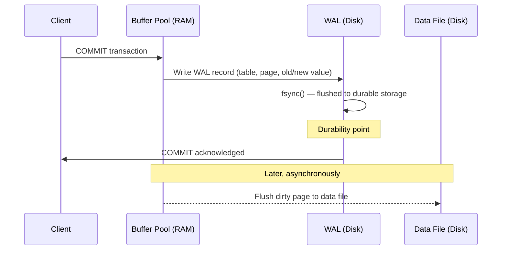
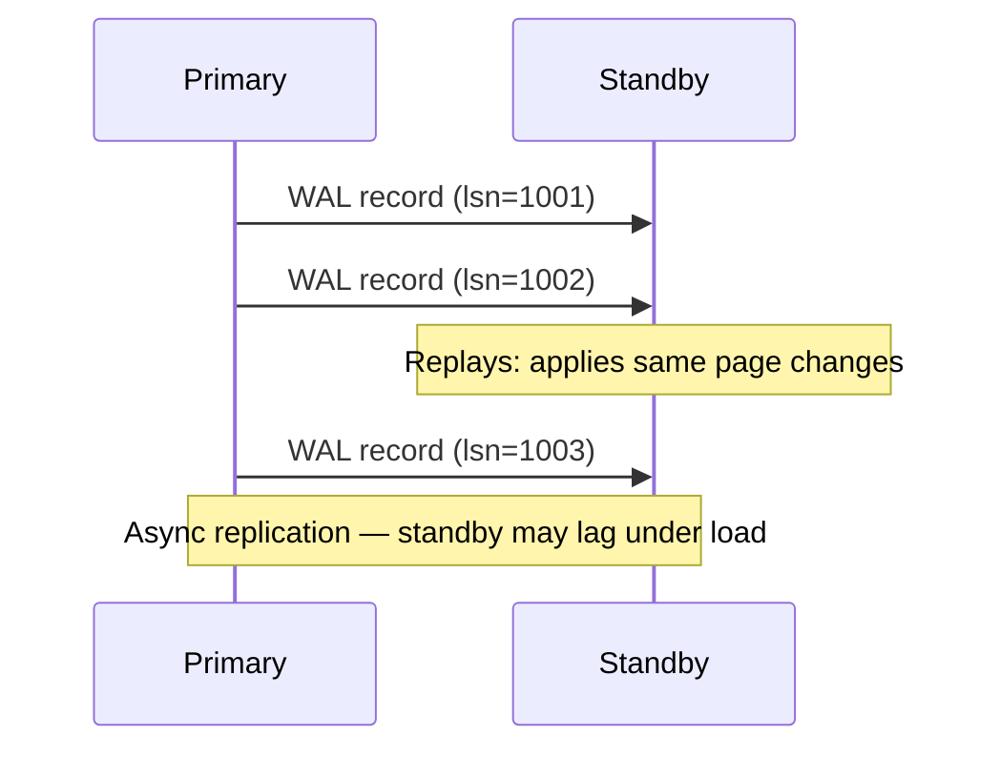

Understanding how a relational database works internally — not just how to query it — is what separates system design answers that sound credible from ones that sound rehearsed. These internals directly explain why PostgreSQL and MySQL behave the way they do at scale.

## ACID

ACID is four independent guarantees. Each is implemented by a different internal mechanism.

### Atomicity

All changes in a transaction commit together or none do. Partial writes are never visible.

**Implementation: undo log (rollback log)**

Before modifying a row, the database writes the original value to an undo log. If the transaction aborts (explicit `ROLLBACK`, constraint violation, crash), the engine replays undo records in reverse order to restore the original state.

```
BEGIN;
UPDATE accounts SET balance = balance - 100 WHERE id = 1;  -- undo: restore balance
UPDATE accounts SET balance = balance + 100 WHERE id = 2;  -- undo: restore balance
-- crash here → both updates rolled back via undo log
COMMIT;
```

In PostgreSQL, undo information is embedded in the WAL (there is no separate undo log file). In MySQL InnoDB, undo logs live in the rollback segment within the system tablespace (or separate undo tablespace).

### Consistency

Data must satisfy all declared constraints before and after every transaction. If a transaction would violate a constraint, it is aborted.

**What the database enforces:** `NOT NULL`, `UNIQUE`, `PRIMARY KEY`, `FOREIGN KEY`, `CHECK` constraints, and data type domains.

**What the database does not enforce:** business logic consistency is the application's responsibility. A `FOREIGN KEY` ensures referential integrity; it does not ensure that a transfer between accounts is logically correct.

### Isolation

Concurrent transactions do not see each other's uncommitted changes. The degree of isolation is configurable via isolation levels — higher isolation prevents more anomalies at the cost of more contention.

| Isolation Level | Dirty Read | Non-Repeatable Read | Phantom Read |
|----------------|-----------|---------------------|-------------|
| Read Uncommitted | ✅ possible | ✅ possible | ✅ possible |
| **Read Committed** | ❌ prevented | ✅ possible | ✅ possible |
| **Repeatable Read** | ❌ prevented | ❌ prevented | ✅ possible* |
| Serializable | ❌ prevented | ❌ prevented | ❌ prevented |

*PostgreSQL Repeatable Read prevents phantoms in practice via MVCC snapshot. MySQL InnoDB Repeatable Read prevents phantoms via gap locks.

Default isolation levels: **PostgreSQL → Read Committed**, **MySQL InnoDB → Repeatable Read**.

**Implementation:** MVCC — covered in the next section.

### Durability

A committed transaction survives crashes, power loss, and restarts.

**Implementation: Write-Ahead Log (WAL)**

Before any data page is modified on disk, the change is first written to a durable sequential log. On `COMMIT`, the WAL record is `fsync`'d to disk before the commit returns to the client. Even if the process crashes immediately after, the committed change can be replayed from the WAL.

## MVCC

MVCC (Multi-Version Concurrency Control) is the mechanism that allows readers and writers to operate concurrently without blocking each other. **Readers never block writers; writers never block readers.**

### Row Versioning

Every row in PostgreSQL carries two hidden system columns:

| Column | Meaning |
|--------|---------|
| `xmin` | Transaction ID that created this row version |
| `xmax` | Transaction ID that deleted/updated this row (0 if still live) |

A transaction can see a row version if:
- `xmin` was committed before the transaction's snapshot was taken
- `xmax` is 0, or `xmax` was not committed before the snapshot (i.e., another concurrent transaction deleted it but hasn't committed yet)

```
-- Two concurrent transactions

Txn A (snapshot at xid=100):       Txn B (xid=101):
  sees rows where xmin <= 100         UPDATE accounts SET balance = 500
  and xmax is null or > 100            → creates new row version (xmin=101, xmax=0)
                                        → marks old row version (xmax=101)
  Txn A still sees the OLD version
  until it takes a new snapshot
```

This is why Read Committed and Repeatable Read behave differently:
- **Read Committed:** each SQL statement gets a fresh snapshot → sees committed changes from other transactions that committed before the statement started
- **Repeatable Read:** snapshot is taken once at transaction start → same query returns the same result no matter what other transactions commit during the transaction


**PostgreSQL vs InnoDB MVCC implementation:** PostgreSQL writes new row versions alongside old ones directly in the heap — an `UPDATE` leaves the old tuple in place and writes a new one; `VACUUM` reclaims dead tuples. InnoDB stores the latest row version in the data page and maintains older versions in a separate **undo log chain**. Both achieve equivalent MVCC semantics but with different operational tradeoffs: PostgreSQL's approach is simpler but causes table bloat without regular vacuuming; InnoDB's undo log is cleaned up more aggressively but adds write overhead on every update.


### Vacuum and Dead Tuples

Updated or deleted row versions are not immediately removed — they become **dead tuples**. MVCC requires keeping them until no active transaction could still need them.

**VACUUM** reclaims dead tuples and dead index entries. Without regular vacuuming:
- Table bloat: dead tuples occupy disk space indefinitely
- Index bloat: dead index entries slow scans
- **Transaction ID wraparound**: PostgreSQL uses 32-bit transaction IDs. After ~2 billion transactions, the counter wraps. PostgreSQL runs **autovacuum** aggressively to freeze old tuples before this happens — failing to vacuum can cause the database to shut down to prevent data corruption.

**autovacuum** (PostgreSQL) runs VACUUM and ANALYZE automatically in the background. Tuning `autovacuum_vacuum_scale_factor` and `autovacuum_analyze_scale_factor` is important for write-heavy tables.

## Write-Ahead Log (WAL)

The WAL is a sequential append-only log of all changes made to the database. It is the foundation for both crash recovery and replication.

### Write Path



The data file write is deferred. WAL is enough for recovery — if the dirty page never makes it to disk before a crash, the WAL replays the change.

### Crash Recovery

On startup after a crash, PostgreSQL:
1. Finds the last **checkpoint** record in WAL (a checkpoint marks that all dirty pages at that moment have been flushed to disk)
2. Replays all WAL records after the checkpoint — **redo** phase
3. Rolls back any transactions that were in progress at the time of the crash using undo information embedded in the WAL

### Streaming Replication

The WAL stream is also the replication mechanism. A standby connects to the primary and continuously receives WAL records, replaying them to stay in sync. This is **physical replication** — it replicates at the byte level, not the SQL level.



**Replication lag** = how far behind the standby is, measured in WAL bytes or time. A standby under heavy load may fall behind; reads on the standby may return stale data.

**Synchronous replication:** `COMMIT` does not return until the WAL record has been acknowledged by at least one standby. Eliminates data loss on primary failure at the cost of commit latency.

### Checkpointing

A **checkpoint** records a point in time at which all dirty pages have been flushed to disk. After a checkpoint, WAL records prior to that checkpoint are no longer needed for crash recovery and can be archived or deleted.

**Checkpoint I/O spike:** flushing all dirty pages at once causes a burst of disk writes. `checkpoint_completion_target = 0.9` (PostgreSQL) spreads the dirty page writes over 90% of the checkpoint interval, reducing the spike.

## Buffer Pool

The buffer pool (PostgreSQL: `shared_buffers`) is an in-memory cache of 8 KB data pages. All reads and writes go through it — the database never reads from or writes to data files directly.


The 8 KB page is the same unit as a B+ tree node — [B+ Tree Internals](../b-plus-tree) covers how page size determines fan-out, tree height, and the number of disk I/Os required to answer a query.


```
Query: SELECT * FROM orders WHERE id = 42
          │
          ▼
    Buffer pool (hit?)
    ├── YES → return page directly from RAM
    └── NO  → read page from disk into buffer pool → return
                    (evict another page if pool is full)
```

### Dirty Pages and Flushing

When a transaction modifies a row, the page containing that row is updated in the buffer pool and marked **dirty**. The dirty page is not immediately written to disk — that would serialize every write to disk I/O.

The **background writer** (PostgreSQL) and **page cleaner** (InnoDB) continuously flush dirty pages to disk in the background, smoothing out I/O. The **checkpointer** forces all dirty pages to disk at checkpoint time.

### Sizing the Buffer Pool

```
shared_buffers = 25% of RAM       ← PostgreSQL rule of thumb
innodb_buffer_pool_size = 70–80%  ← MySQL InnoDB rule of thumb (dedicated server)
```

PostgreSQL keeps `shared_buffers` deliberately smaller than InnoDB because it relies on the OS page cache for the rest. InnoDB bypasses the OS cache (via O_DIRECT) and manages its own buffer pool, so it should claim most of the RAM directly.

### Double-Write Buffer (InnoDB)

InnoDB writes dirty pages to a sequential **double-write buffer** on disk before writing them to their actual locations. If a crash occurs mid-write (a torn page — only part of the 16 KB page was written), InnoDB uses the complete copy from the double-write buffer to recover. PostgreSQL relies on the WAL for torn-page recovery instead — it logs full page images on the first modification after each checkpoint (`full_page_writes = on`).

## Query Planner and EXPLAIN

Before executing a query, the database builds an **execution plan** — a tree of physical operators (scan, join, sort, aggregate) that defines how rows flow from base tables to the final result. The planner evaluates many possible plans and picks the one with the lowest estimated cost.

### Reading EXPLAIN Output

`EXPLAIN` shows the plan the optimizer chose. `EXPLAIN ANALYZE` actually runs the query and adds real timing.

```sql
EXPLAIN ANALYZE
SELECT o.id, c.name
FROM orders o
JOIN customers c ON o.customer_id = c.id
WHERE o.total > 100
ORDER BY o.created_at DESC
LIMIT 20;
```

```
Limit  (cost=1250.42..1250.47 rows=20 width=36) (actual time=3.2..3.3 rows=20 loops=1)
  ->  Sort  (cost=1250.42..1262.15 rows=4693 width=36) (actual time=3.2..3.2 rows=20 loops=1)
        Sort Key: o.created_at DESC
        Sort Method: top-N heapsort  Memory: 27kB
        ->  Hash Join  (cost=25.00..1132.80 rows=4693 width=36) (actual time=0.5..2.8 rows=4820 loops=1)
              Hash Cond: (o.customer_id = c.id)
              ->  Seq Scan on orders o  (cost=0.00..1095.00 rows=4693 width=20) (actual time=0.01..1.9 rows=4820 loops=1)
                    Filter: (total > 100)
                    Rows Removed by Filter: 45180
              ->  Hash  (cost=15.00..15.00 rows=1000 width=20) (actual time=0.4..0.4 rows=1000 loops=1)
                    ->  Seq Scan on customers c  (cost=0.00..15.00 rows=1000 width=20) (actual time=0.01..0.2 rows=1000 loops=1)
```

Key fields in each node:

| Field | Meaning |
|-------|---------|
| `cost=startup..total` | Estimated cost in arbitrary units (sequential page reads ≈ 1.0). Startup cost is time before the first row is emitted. |
| `rows` | Estimated number of rows output by this node |
| `actual time` | Real wall-clock time in milliseconds (only with `ANALYZE`) |
| `loops` | How many times this node was executed (e.g., inner side of nested loop) |
| `Rows Removed by Filter` | How many rows were scanned but didn't pass the `WHERE` condition — high values signal a missing index |

### Common Plan Nodes

| Node | What it does | When it appears |
|------|-------------|-----------------|
| **Seq Scan** | Reads every row in the table | No usable index, or optimizer estimates sequential scan is cheaper than index scan |
| **Index Scan** | Traverses B+ tree index, then fetches heap tuple | Selective filter on indexed column |
| **Index Only Scan** | Answers query from the index alone (covering index) | All selected columns are in the index and visibility map says tuple is visible |
| **Bitmap Index Scan** | Builds a bitmap of matching pages, then does a single pass over the heap | Medium selectivity — too many rows for index scan, too few for seq scan |
| **Nested Loop** | For each outer row, scans the inner relation | Small outer set, indexed inner |
| **Hash Join** | Builds hash table from one input, probes with the other | Equi-join, larger datasets that fit in `work_mem` |
| **Merge Join** | Merges two sorted inputs | Both inputs already sorted (e.g., index-ordered) or sort is cheap |
| **Sort** | Sorts input rows | `ORDER BY`, merge join input, or `DISTINCT` |
| **Aggregate** | `COUNT`, `SUM`, `GROUP BY` | Aggregation query |

The planner uses cost units (I/O pages + CPU cycles weighted by `random_page_cost`, `seq_page_cost`, `cpu_tuple_cost`) to compare plans. Lowering `random_page_cost` from `4.0` to `1.1` on SSDs makes the planner more likely to choose index scans, since random reads are no longer dramatically slower than sequential ones.

### When Each Join Algorithm Is Picked

```sql
-- Hash join likely:
SELECT o.id, c.name
FROM orders o JOIN customers c ON o.customer_id = c.id;
-- orders: 50M rows, customers: 5M rows
-- → planner builds hash table on customers (smaller), probes with orders

-- Nested loop likely:
SELECT * FROM orders o JOIN customers c ON o.customer_id = c.id
WHERE o.id = 42;
-- → orders filtered to 1 row → nested loop into indexed customers lookup

-- Merge join likely:
SELECT * FROM orders o JOIN order_items i ON o.id = i.order_id
ORDER BY o.id;
-- → both sides already sorted by the join key (PK / FK index) → no sort step
```

### Diagnostic Fields in EXPLAIN ANALYZE

Beyond the headline cost/rows, watch these signals when running `EXPLAIN (ANALYZE, BUFFERS)`:

| Field | What to look for |
|-------|-----------------|
| `rows=X (actual rows=Y)` | Large discrepancy → stale statistics → run `ANALYZE` |
| `Buffers: hit=X read=Y` | High `read` → data not in buffer pool; consider increasing `shared_buffers` or adding an index |
| `Sort (external)` / `Sort Method: external merge` | Sort spilled to disk — `work_mem` too low for this query |
| `Hash Batches: N` (N > 1) | Hash table didn't fit in `work_mem` — spilled to disk |
| `Planning time` vs `Execution time` | Planning ≫ execution → complex query with many join options; tune `join_collapse_limit` or `from_collapse_limit` |

### Why Plans Go Wrong

The optimizer relies on **table statistics** stored in `pg_statistic` (PostgreSQL) and refreshed by `ANALYZE`:

- **Row count** per table
- **Column cardinality** (number of distinct values)
- **Most common values** and their frequencies
- **Value histograms** (distribution buckets — used for selectivity estimates)
- **Correlation** between physical row order and sorted order (affects index vs seq scan cost)

If statistics are stale, the planner makes bad estimates, which lead to bad plans.

```sql
-- PostgreSQL: force a statistics refresh
ANALYZE orders;

-- Check when statistics were last updated
SELECT relname, last_analyze, last_autoanalyze
FROM pg_stat_user_tables
WHERE relname = 'orders';
```

Common symptoms of stale statistics:
- **Nested Loop where Hash Join would be better** — planner underestimates the row count
- **Seq Scan on a large table with a selective WHERE** — planner overestimates matching rows, thinks index scan isn't worth it
- **Hash Join with spill to disk** — planner underestimates join cardinality, allocates too little `work_mem`


**`EXPLAIN` without `ANALYZE` shows estimates only — not what actually happened.** A plan that looks fine may hide a 10x row-count misestimate. Always use `EXPLAIN ANALYZE` (with `BUFFERS` for I/O detail) when diagnosing performance. Be careful running `EXPLAIN ANALYZE` on `DELETE`/`UPDATE` — it executes the statement. Wrap destructive statements in a transaction and `ROLLBACK`.


### Practical Workflow

```
1. Identify slow query         → pg_stat_statements or slow query log
2. Run EXPLAIN (ANALYZE, BUFFERS)
3. Look for:
   - Seq Scan on large table   → missing index?
   - High "Rows Removed"       → filter not pushed to index
   - Nested Loop with high     → row estimate wrong, ANALYZE table
     loop count
   - Sort with disk spill      → increase work_mem or add index
4. Fix: add index, rewrite query, ANALYZE, or adjust work_mem
5. Re-run EXPLAIN ANALYZE to confirm improvement
```


**Interview tip:** When discussing database performance, say: "I'd start with `EXPLAIN ANALYZE` to see the actual execution plan. The most common issue I look for is a Seq Scan on a large table where an Index Scan is expected — that usually means either a missing index or stale statistics. Running `ANALYZE` refreshes the planner's statistics; if the plan still chooses Seq Scan, I'd check if the filter selectivity is too low for an index to help." This shows you debug from evidence, not guesswork.


## Test Your Understanding


This is a **write-write conflict** (lost update). The behavior depends on the isolation level:

- **Read Committed (PostgreSQL default):** The second transaction's UPDATE blocks until the first commits. Then it re-evaluates the WHERE clause against the committed data. If the row still matches, it proceeds. No lost update — but the second transaction sees the first's changes mid-flight.
- **Repeatable Read / Snapshot Isolation:** The second transaction gets a serialization error (`ERROR: could not serialize access due to concurrent update`) and must retry. This prevents lost updates but requires application-level retry logic.
- **Serializable:** Same error, stricter checks. Also catches write skew anomalies.

**Key insight:** MVCC doesn't prevent write conflicts — it prevents **read** blocking. Write conflicts are still resolved via locking or error-and-retry.



**Dead tuples and bloat.** Under MVCC, UPDATE creates a new row version and marks the old one as dead (but doesn't delete it). DELETE similarly marks rows dead. These dead tuples accumulate until `VACUUM` reclaims them.

Additionally:
- **Index bloat:** Each dead row version has corresponding dead index entries
- **WAL files:** pg_wal/ can accumulate if archiving or replication falls behind
- **TOAST tables:** Large column values stored out-of-line may have bloated TOAST tables

**Fix:** Run `VACUUM FULL` (rewrites the entire table — requires exclusive lock and doubles disk usage temporarily) or use `pg_repack` (online rebuild without exclusive lock). For ongoing prevention, tune autovacuum to be more aggressive: lower `autovacuum_vacuum_scale_factor` from 0.2 to 0.01 for large tables.



**No — if WAL (Write-Ahead Log) is configured with `synchronous_commit = on` (the default).** The WAL entry is fsynced to disk before the database returns success to the client. On recovery, the database replays the WAL and reconstructs the committed state.

**However:** With `synchronous_commit = off` (a performance optimization), the database returns success before the WAL is fsynced. A crash in that window loses the transaction. This is a deliberate durability-for-latency trade-off — useful for metrics or logs where losing a few seconds of data is acceptable.

The WAL → dirty page → checkpoint cycle is the core of ACID durability: changes hit the WAL first (sequential write, fast), then accumulate in the buffer pool as dirty pages, and are flushed to data files during checkpoints (batched, efficient).



**It depends on whether the inner side has an index.** With an index on the join column, each of the 10,000 loops does an index lookup (O(log n)) — total cost is 10,000 × ~3 I/Os = ~30,000 I/Os. This is efficient.

**Without an index:** Each loop does a full scan of the 1M-row inner table — 10,000 × 1M = 10 billion row comparisons. This is catastrophically slow.

**When the planner chooses Nested Loop:** It expects the outer side to be small AND the inner side to have an indexed lookup. If `actual rows` in EXPLAIN is much higher than `rows` estimate, the planner made a bad choice due to stale statistics → run `ANALYZE`.

**Alternatives the planner might choose:** Hash Join (build hash table on smaller table, probe with larger — good for equality joins) or Merge Join (both sides sorted on join key — good when both inputs are already ordered via indexes).



**Replication lag.** Streaming replication is asynchronous by default — the primary sends WAL records to the replica, but doesn't wait for confirmation before acknowledging the client's write. The replica applies WAL records as they arrive, which introduces a delay (milliseconds to seconds under normal load, minutes under heavy write load).

**Fixes:**
1. **Synchronous replication:** Primary waits for at least one replica to confirm WAL receipt before acknowledging. Eliminates lag but increases write latency.
2. **Read-your-writes routing:** After a write, route that user's reads to the primary for a short window (e.g., 5 seconds), then switch back to the replica.
3. **Check `pg_last_wal_replay_lsn()`** on the replica and compare to the write's LSN — only serve the read if the replica has caught up.

