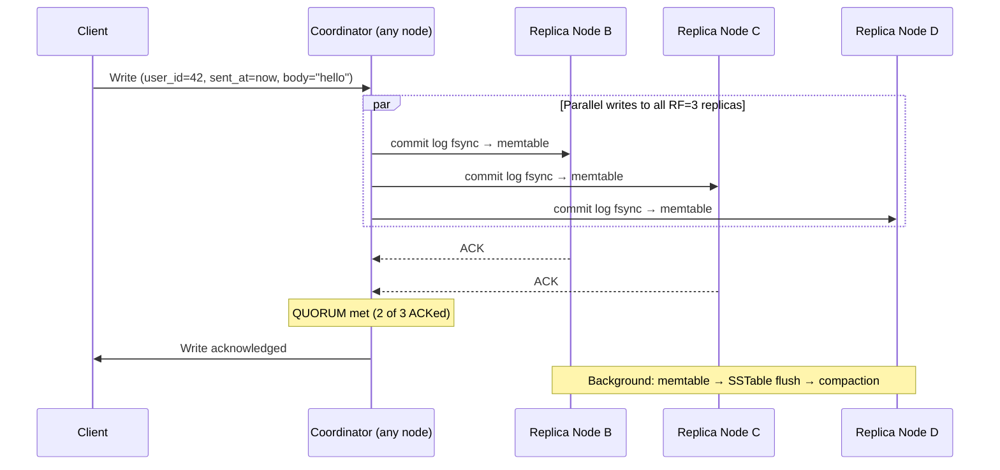
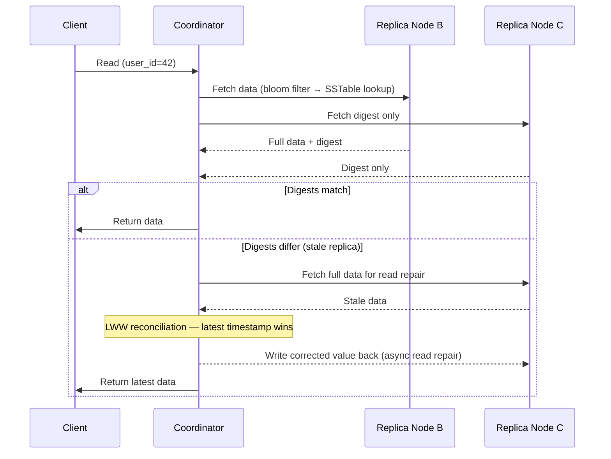

Cassandra is a leaderless, distributed wide-column store built for high write throughput and linear horizontal scale. It uses [LSM trees](../lsm-trees) for storage and [consistent hashing](../consistent-hashing) for data distribution. Every architectural decision in Cassandra is a deliberate tradeoff: writes are always fast, reads are bounded, and consistency is tunable per operation.

## Data Model

Cassandra's data model looks like SQL tables but behaves fundamentally differently. The schema is a query specification — you design tables around access patterns, not around entities.

Every table has three components:

```
CREATE TABLE messages (
    user_id   UUID,         -- partition key: determines which node stores this row
    sent_at   TIMESTAMP,    -- clustering key: sort order within the partition
    msg_id    UUID,         -- clustering key (secondary sort)
    body      TEXT,         -- column value
    PRIMARY KEY ((user_id), sent_at, msg_id)
)
WITH CLUSTERING ORDER BY (sent_at DESC, msg_id ASC);
```

| Component | Role | Analogy |
|-----------|------|---------|
| **Partition key** | Routes to the correct node(s); all rows with the same partition key live on the same node | Shard key |
| **Clustering key** | Sorts rows within a partition; enables range queries within a partition | `ORDER BY` + row grouping |
| **Columns** | The actual values; sparse — different rows can omit different columns | Column values |

**What this enables:** `SELECT * FROM messages WHERE user_id = ? ORDER BY sent_at DESC LIMIT 50` is a single-node, sequential disk read — extremely fast. `SELECT * FROM messages WHERE body LIKE '%hello%'` is not supported — there is no index and no cross-partition scan.

**Composite partition key:** Spread data across more partitions by adding a column to the partition key:

```sql
PRIMARY KEY ((user_id, year_month), sent_at, msg_id)
-- messages for user_id=42 in month 2024-01 form one partition
-- messages for user_id=42 in month 2024-02 form another partition
```

## Distribution: Token Ring and Virtual Nodes

Cassandra places nodes on a circular hash ring. Each key's partition key is hashed to a 64-bit token (`-2^63` to `2^63 - 1`). The key is assigned to the first node clockwise on the ring that "owns" that token range.

```
                    Node A
                  (0 → 3000)
              ↗               ↘
   Node D               ──────────    Node B
(9000 → 0)                          (3000 → 6000)
              ↖               ↙
                    Node C
                 (6000 → 9000)

key "user:42" → hash → token 4200 → owned by Node B
```

**Virtual nodes (vnodes):** Instead of each physical node owning one contiguous arc, each node owns ~256 small token ranges scattered around the ring. Benefits:
- Adding a node takes small ranges from many existing nodes — no single node is overwhelmed
- Node failure redistributes load across all remaining nodes instead of one neighbor
- Heterogeneous hardware: assign more vnodes to larger machines

**Replication factor (RF):** Each partition is stored on RF nodes — the owning node plus the next RF-1 nodes clockwise. RF=3 is standard: one primary replica and two additional replicas.

```
RF=3: key → Node B (primary), Node C (replica 1), Node D (replica 2)
```

## Write Path

Cassandra writes are always fast because they are sequential I/O operations — the same LSM tree write path.



**Coordinator:** Any node in the cluster can act as the coordinator for a request. The coordinator routes writes to the correct replica nodes and waits for acknowledgements according to the consistency level.

**Hinted handoff:** If a replica node is temporarily down during a write, the coordinator stores the write locally as a "hint." When the down node comes back online, the coordinator delivers the pending hints, ensuring the replica eventually catches up. Hints expire (default 3 hours) — if a node is down longer, manual repair is needed.

## Read Path

Reads are more expensive than writes. Cassandra must merge data from multiple SSTables and check multiple replicas depending on the consistency level.



**Bloom filter:** Before touching any SSTable, Cassandra checks a per-SSTable Bloom filter. If the filter says "definitely not here," that SSTable is skipped. This is the critical optimization that prevents reading every SSTable on every query.

**Read repair:** When replicas return different data (stale replica due to missed write), the coordinator reconciles using last-write-wins (LWW) timestamp ordering and asynchronously writes the correct value back to the stale replica.

## Consistency Levels

Cassandra's consistency is tunable per operation. The `W + R > RF` formula determines whether a read always sees the latest write (strong consistency).

| Level | Nodes that must acknowledge | Strong consistency (RF=3)? | Latency |
|-------|---------------------------|---------------------------|---------|
| `ONE` | 1 | ❌ (may miss latest write) | Lowest |
| `LOCAL_ONE` | 1 in local datacenter | ❌ | Lowest |
| `QUORUM` | Majority: `floor(RF/2) + 1` = 2 of 3 | ✅ (W=QUORUM + R=QUORUM → 2+2>3) | Medium |
| `LOCAL_QUORUM` | Majority in local DC only | ✅ within DC | Medium |
| `ALL` | All RF nodes | ✅ | Highest — loses availability if any replica is down |

**The practical choice:** `LOCAL_QUORUM` for both reads and writes is the standard production setting. It provides strong consistency within a datacenter while tolerating one replica failure, and avoids the cross-datacenter latency of `QUORUM`.

```
QUORUM write + QUORUM read = strong consistency:
  Write acknowledged by 2/3 nodes → at least one node has the latest write
  Read from 2/3 nodes → that read set always overlaps the write set
```

**Consistency vs availability tradeoff:**
- `ONE`: maximum availability, minimum consistency — fine for append-only event logging
- `QUORUM`: balanced — the default for most OLTP-like access
- `ALL`: maximum consistency, minimum availability — rarely used (one node failure = unavailable)

## Compaction Strategies

Cassandra accumulates SSTables from memtable flushes. Compaction merges them, removes tombstones, and maintains read performance. The strategy choice depends on the workload.

| | SizeTieredCompaction (STCS) | LeveledCompaction (LCS) |
|---|---|---|
| **How it works** | Merge SSTables of similar size into larger ones | Organize into levels; L1 and above have non-overlapping key ranges |
| **Read amplification** | Higher — many SSTables may contain the same key | Low — at most one SSTable per level contains a given key |
| **Write amplification** | Low — each key rewritten fewer times | High — keys cascades through levels |
| **Space amplification** | High — up to 2× temp space during compaction | Low |
| **Best for** | Write-heavy (time-series, logging, high ingest) | Read-heavy, latency-sensitive, space-constrained |
| **Default** | Yes | No (opt-in per table) |

```sql
CREATE TABLE sensor_readings (...)
WITH compaction = {'class': 'LeveledCompactionStrategy', 'sstable_size_in_mb': 160};
```

**Tombstone warning:** Deleted rows leave tombstone markers rather than immediate removal. Tombstones are only purged during compaction after the `gc_grace_seconds` period (default 10 days — allows hinted handoff to deliver missed deletes before they're gone). A table with heavy deletions accumulates tombstones that slow reads until compaction runs. Monitor `tombstone_scanned` in query traces.

## Schema Design Rules

Cassandra enforces a discipline that SQL does not: **design one table per query pattern**. This is not a workaround — it is the intended approach.

**Rule 1: Know your queries before designing your schema.**
What are the exact `WHERE` clauses? Those become partition keys and clustering keys.

**Rule 2: Denormalize intentionally.**
The same data may exist in multiple tables serving different query shapes. This is correct — Cassandra trades storage for query efficiency.

```sql
-- Query 1: "get all messages for a user, newest first"
CREATE TABLE messages_by_user (
    user_id UUID, sent_at TIMESTAMP, msg_id UUID, body TEXT,
    PRIMARY KEY ((user_id), sent_at, msg_id)
) WITH CLUSTERING ORDER BY (sent_at DESC);

-- Query 2: "get all messages in a conversation, newest first"
CREATE TABLE messages_by_conversation (
    conv_id UUID, sent_at TIMESTAMP, msg_id UUID, body TEXT,
    PRIMARY KEY ((conv_id), sent_at, msg_id)
) WITH CLUSTERING ORDER BY (sent_at DESC);
```

Both tables store the same message — written to twice, stored twice. Reads are single-partition, sequential, and fast on both.

**Rule 3: Bound your partition size.**
An unbounded partition grows forever and becomes a hot spot. A `messages_by_user` table where one user sends 10 billion messages creates a partition that no single node can serve efficiently.

Fix: add a time bucket to the partition key to cap partition size.

```sql
PRIMARY KEY ((user_id, bucket), sent_at, msg_id)
-- bucket = YYYY-MM (month bucket) or YYYY-WW (week bucket)
-- each partition holds at most one month of messages per user
```

## Hot Partition Problem

A hot partition is a partition key that receives disproportionately more traffic than others — one node becomes the bottleneck regardless of cluster size. This is the most common production performance problem in Cassandra.

**Causes:**
- Partition key with low cardinality (e.g., `status = 'pending'` — all pending orders in one partition)
- A "celebrity" entity (a popular user, a viral post) whose partition receives orders of magnitude more reads/writes
- Time-based partition key with current time bucket receiving all writes

**Mitigation strategies:**

| Strategy | How | When to use |
|----------|-----|------------|
| **Random suffix (write-time salting)** | Append a random suffix to partition key: `user_id + random(0,N)` → write to N partitions | Write hot spots; reads must scatter-gather across all N partitions |
| **Time bucketing** | Split monotonic time key into `(entity_id, YYYY-MM)` or `(entity_id, YYYY-WW)` | Unbounded append-only partitions (time-series, logs) |
| **Composite partition key** | Add a dimension to spread keys: `(region, user_id)` instead of just `user_id` | When a secondary dimension provides natural spread |
| **Pre-computed aggregates** | Instead of reading a hot partition, write aggregates to a summary table | High-read hot partitions (leaderboards, counters) |


Secondary indexes in Cassandra (`CREATE INDEX`) scatter queries across all nodes — every node is queried and results are merged. They appear convenient but are a performance trap for high-cardinality columns or high-traffic queries. Use materialized views or explicit denormalized tables instead.


## When to Use Cassandra

| Fits well | Poor fit |
|-----------|---------|
| Time-series data (IoT, metrics, events) | Ad-hoc queries (unknown WHERE clauses at schema time) |
| Write-heavy workloads (millions of writes/sec) | Multi-entity ACID transactions |
| Append-only logs and activity feeds | Complex joins across entities |
| Multi-datacenter active-active replication | Small datasets (operational overhead not justified) |
| Linear horizontal scale with no single point of failure | Frequent deletes (tombstone accumulation) |


**Interview tip:** When the question is "how would you store a billion messages a day?", I'd reach for Cassandra and immediately explain the schema is query-driven: "I'd design one table per query pattern — `messages_by_user` partitioned on `user_id`, `messages_by_conversation` partitioned on `conv_id` — and accept that I'm storing each message twice. Denormalization isn't a workaround in Cassandra, it's the design." I'd bound partition size with a time bucket like `(user_id, year_month)` to avoid unbounded partitions, run `LOCAL_QUORUM` reads and writes for strong consistency within a DC at one-replica-failure tolerance, and explicitly call out the hot-partition problem as the most common production failure mode — fixing it with random suffixing or sharded counters when needed. I'd avoid Cassandra secondary indexes; they scatter queries across every node and become a performance trap.

