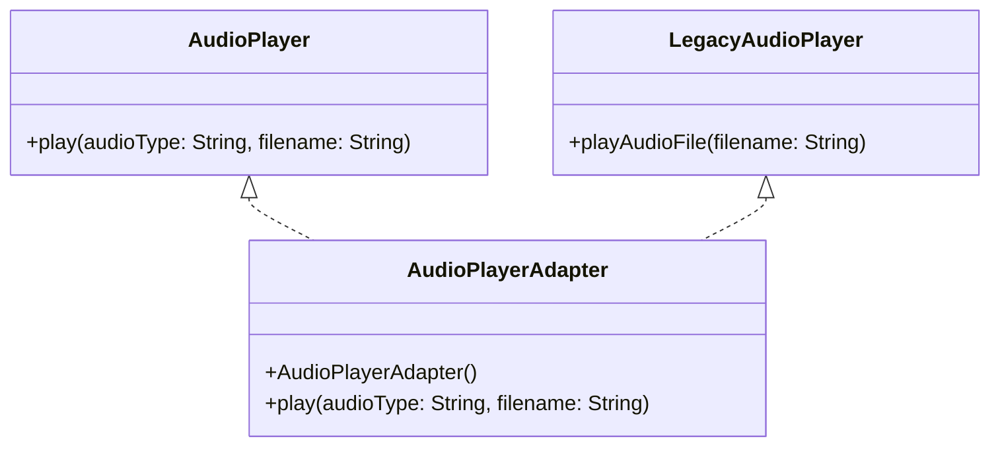
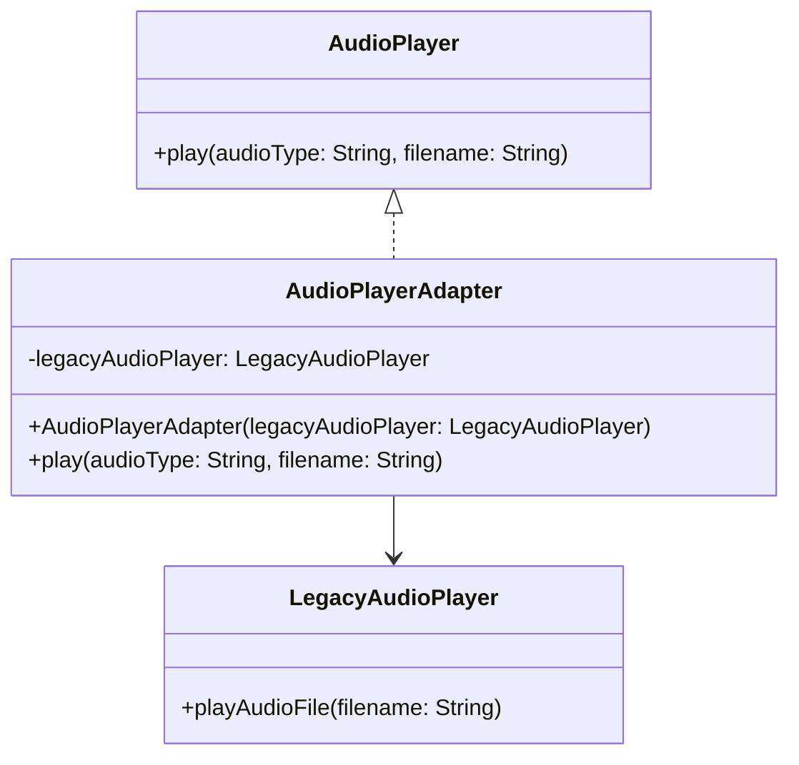

The Adapter design pattern is a structural pattern that allows objects with incompatible interfaces to work together. It acts as a bridge between two incompatible interfaces, providing a way for objects to collaborate without modifying their existing code.

The Adapter pattern involves creating an intermediary class, known as the "adapter," which translates one interface into another, making them compatible.

### Participants

- **Target Interface:** This is the interface that the client code expects to interact with. It defines the methods that the client uses to communicate with objects.
- **Adaptee:** This is the existing class with an incompatible interface that needs to be integrated or used by the client. The Adaptee class typically has methods that need to be adapted to match the Target Interface.
- **Adapter:** This is the class that implements the Target Interface and wraps an instance of the Adaptee. It serves as an intermediary, forwarding calls from the client to the Adaptee and translating the calls as needed.

### Adapter Variants
There are two common variants of the Adapter pattern:

- **Class Adapter:** In this variant, the Adapter class inherits from both the Target Interface and the Adaptee class. It "adapts" the Adaptee's interface to match the Target Interface. Multiple inheritance is typically used in languages that support it.
- **Object Adapter:** In this variant, the Adapter class contains an instance of the Adaptee class. It implements the Target Interface and delegates the calls to the Adaptee's methods, performing any necessary translations in the process. This approach is more flexible and can be used in languages that do not support multiple inheritance.

### Class Based Adapter (Inheritance)




    
    ```java
    // Adaptee
    public class LegacyAudioPlayer {
        public void playAudioFile(String filename) {
            System.out.println("Playing legacy audio file: " + filename);
        }
    }

    // Target Interface
    public interface AudioPlayer {
        void play(String audioType, String filename);
    }

    // (Class-Based Adapter)
    public class AudioPlayerAdapter extends LegacyAudioPlayer implements AudioPlayer {
        @Override
        public void play(String audioType, String filename) {
            if (audioType.equalsIgnoreCase("legacy")) {
                playAudioFile(filename);
            } else {
                System.out.println("Unsupported audio type: " + audioType);
            }
        }
    }

    // Client
    public class Main {
        public static void main(String[] args) {
            AudioPlayerAdapter adapter = new AudioPlayerAdapter();
            adapter.play("legacy", "old_song.mp3");
        }
    }
    ```
    
    
    ```python
    # Target Interface
    class AudioPlayer:
        def play(self, audio_type, filename):
            pass

    # Adaptee
    class LegacyAudioPlayer:
        def play_audio_file(self, filename):
            print(f"Playing legacy audio file: {filename}")

    # Adapter
    class AudioPlayerAdapter(LegacyAudioPlayer, AudioPlayer):
        def play(self, audio_type, filename):
            if audio_type.lower() == "legacy":
                self.play_audio_file(filename)
            else:
                print(f"Unsupported audio type: {audio_type}")

    # Client Code
    def main():
        adapter = AudioPlayerAdapter()
        adapter.play("legacy", "old_song.mp3")

    if __name__ == "__main__":
        main()

    ```
    
    
    ```go
    package main

    import "fmt"

    // Target Interface
    type AudioPlayer interface {
        Play(audioType, filename string)
    }

    // Adaptee
    type LegacyAudioPlayer struct{}

    func (la *LegacyAudioPlayer) PlayAudioFile(filename string) {
        fmt.Printf("Playing legacy audio file: %s\n", filename)
    }

    // Adapter
    type AudioPlayerAdapter struct {
        LegacyAudioPlayer
    }

    func (apa *AudioPlayerAdapter) Play(audioType, filename string) {
        if audioType == "legacy" {
            apa.PlayAudioFile(filename)
        } else {
            fmt.Printf("Unsupported audio type: %s\n", audioType)
        }
    }

    // Client Code
    func main() {
        adapter := &AudioPlayerAdapter{}
        adapter.Play("legacy", "old_song.mp3")
    }
    ```
    


### Object Based Adapter (Composition)



    
    ```java
    // Adaptee
    public class LegacyAudioPlayer {
        public void playAudioFile(String filename) {
            System.out.println("Playing legacy audio file: " + filename);
        }
    }

    // Target Interface
    public interface AudioPlayer {
        void play(String audioType, String filename);
    }

    // Object-based Adapter
    public class AudioPlayerAdapter implements AudioPlayer {
        private LegacyAudioPlayer legacyAudioPlayer;

        public AudioPlayerAdapter(LegacyAudioPlayer legacyAudioPlayer) {
            this.legacyAudioPlayer = legacyAudioPlayer;
        }

        @Override
        public void play(String audioType, String filename) {
            if (audioType.equalsIgnoreCase("legacy")) {
                legacyAudioPlayer.playAudioFile(filename);
            } else {
                System.out.println("Unsupported audio type: " + audioType);
            }
        }
    }

    // Client
    public class Main {
        public static void main(String[] args) {
            LegacyAudioPlayer legacyPlayer = new LegacyAudioPlayer();
            AudioPlayerAdapter adapter = new AudioPlayerAdapter(legacyPlayer);
            adapter.play("legacy", "old_song.mp3");
        }
    }

    ```
    
    
    ```python
    # Target Interface
    class AudioPlayer:
        def play(self, audio_type, filename):
            pass

    # Adaptee
    class LegacyAudioPlayer:
        def play_audio_file(self, filename):
            print(f"Playing legacy audio file: {filename}")

    # Adapter
    class AudioPlayerAdapter(AudioPlayer):
        def __init__(self, legacy_audio_player):
            self._legacy_audio_player = legacy_audio_player

        def play(self, audio_type, filename):
            if audio_type.lower() == "legacy":
                self._legacy_audio_player.play_audio_file(filename)
            else:
                print(f"Unsupported audio type: {audio_type}")

    # Client Code
    def main():
        legacy_player = LegacyAudioPlayer()
        adapter = AudioPlayerAdapter(legacy_player)
        adapter.play("legacy", "old_song.mp3")

    if __name__ == "__main__":
        main()

    ```
    
    
    ``` go
    package main

    import "fmt"

    // Target Interface
    type AudioPlayer interface {
        Play(audioType, filename string)
    }

    // Adaptee
    type LegacyAudioPlayer struct{}

    func (la *LegacyAudioPlayer) PlayAudioFile(filename string) {
        fmt.Printf("Playing legacy audio file: %s\n", filename)
    }

    // Adapter
    type AudioPlayerAdapter struct {
        legacyAudioPlayer *LegacyAudioPlayer
    }

    func (apa *AudioPlayerAdapter) Play(audioType, filename string) {
        if audioType == "legacy" {
            apa.legacyAudioPlayer.PlayAudioFile(filename)
        } else {
            fmt.Printf("Unsupported audio type: %s\n", audioType)
        }
    }

    // Client Code
    func main() {
        legacyPlayer := &LegacyAudioPlayer{}
        adapter := &AudioPlayerAdapter{legacyAudioPlayer: legacyPlayer}
        adapter.Play("legacy", "old_song.mp3")
    }

    ```
    
