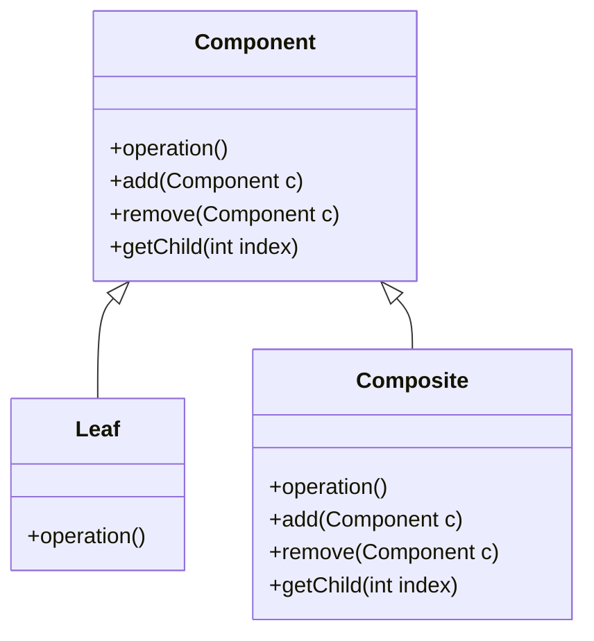
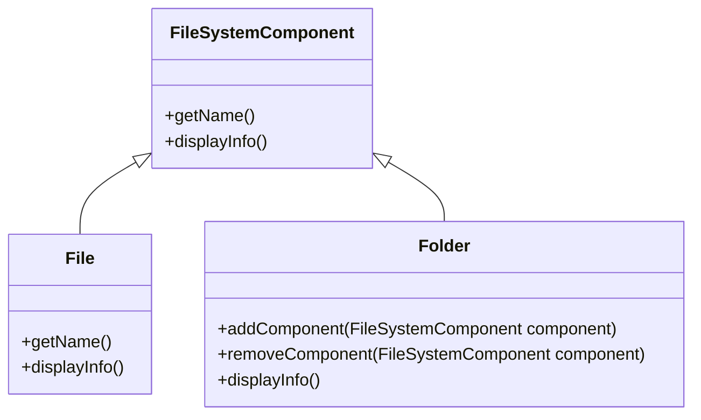
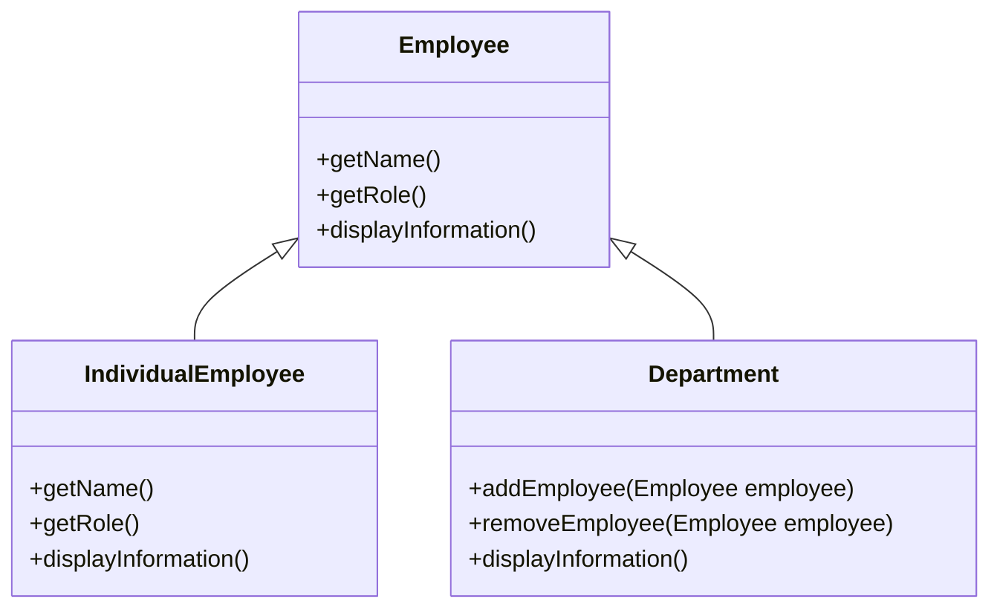
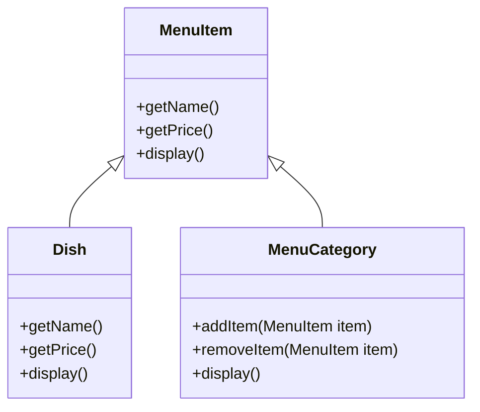

The Composite pattern organizes objects into tree structures, making them work together like one. It lets clients treat individual objects and compositions of objects in a similar way.

This is useful when dealing with things organized in a tree-like structure, such as files and folders in a computer's file system.


### Key Participants:

- **Component:** This is the base interface or abstract class that declares the common operations for both leaf objects and composite objects. It defines methods for accessing, manipulating, and iterating through child components.
- **Leaf:** Leaf objects are the individual objects that don't have any child components. They implement the operations defined in the Component interface.
- **Composite:** Composite objects are containers that can hold child components. They implement the operations defined in the Component interface but also manage a collection of child components.

```text
  +------------------+
  |     Component    |
  +------------------+
          /   \
         /     \
+-------+    +-----------+
|  Leaf |    | Composite |
+-------+    +-----------+
```



### Examples

#### Files and Folders




    
    ```java

    import java.util.ArrayList;
    import java.util.List;

    // Component interface
    interface FileSystemComponent {
        String getName();
        void displayInfo();
    }

    // Leaf class
    class File implements FileSystemComponent {
        private String name;

        public File(String name) {
            this.name = name;
        }

        public String getName() {
            return name;
        }

        public void displayInfo() {
            System.out.println("File: " + name);
        }
    }

    // Composite class
    class Folder implements FileSystemComponent {
        private String name;
        private List<FileSystemComponent> contents = new ArrayList<>();

        public Folder(String name) {
            this.name = name;
        }

        public String getName() {
            return name;
        }

        public void addComponent(FileSystemComponent component) {
            contents.add(component);
        }

        public void removeComponent(FileSystemComponent component) {
            contents.remove(component);
        }

        public void displayInfo() {
            System.out.println("Folder: " + name);
            System.out.println("Contents:");
            for (FileSystemComponent component : contents) {
                component.displayInfo();
            }
        }
    }

    public class Main {
        public static void main(String[] args) {
            FileSystemComponent file1 = new File("document.txt");
            FileSystemComponent file2 = new File("image.jpg");
            FileSystemComponent file3 = new File("presentation.ppt");

            FileSystemComponent folder1 = new Folder("Documents");
            folder1.addComponent(file1);
            folder1.addComponent(file3);

            FileSystemComponent folder2 = new Folder("Pictures");
            folder2.addComponent(file2);

            FileSystemComponent rootFolder = new Folder("Root");
            rootFolder.addComponent(folder1);
            rootFolder.addComponent(folder2);

            rootFolder.displayInfo();
        }
    }

    ```
    


#### Employees and Departments




    
    ```java
    import java.util.ArrayList;
    import java.util.List;

    // Component interface
    interface Employee {
        String getName();
        String getRole();
        void displayInformation();
    }

    // Leaf class
    class IndividualEmployee implements Employee {
        private String name;
        private String role;

        public IndividualEmployee(String name, String role) {
            this.name = name;
            this.role = role;
        }

        public String getName() {
            return name;
        }

        public String getRole() {
            return role;
        }

        public void displayInformation() {
            System.out.println("Name: " + name + ", Role: " + role);
        }
    }

    // Composite class
    class Department implements Employee {
        private String name;
        private String description;
        private List<Employee> employees = new ArrayList<>();

        public Department(String name, String description) {
            this.name = name;
            this.description = description;
        }

        public String getName() {
            return name;
        }

        public String getRole() {
            return "Department";
        }

        public void addEmployee(Employee employee) {
            employees.add(employee);
        }

        public void removeEmployee(Employee employee) {
            employees.remove(employee);
        }

        public void displayInformation() {
            System.out.println("Department: " + name + " (" + description + ")");
            System.out.println("Employees:");
            for (Employee employee : employees) {
                employee.displayInformation();
            }
        }
    }

    public class Main {
        public static void main(String[] args) {
            Employee john = new IndividualEmployee("John Smith", "Software Engineer");
            Employee mary = new IndividualEmployee("Mary Johnson", "Project Manager");

            Department engineering = new Department("Engineering", "Develops software products");
            engineering.addEmployee(john);

            Department management = new Department("Management", "Oversees projects");
            management.addEmployee(mary);

            Department company = new Department("Company", "Global technology firm");
            company.addEmployee(engineering);
            company.addEmployee(management);

            company.displayInformation();
        }
    }
    ```
    



#### Menu Item and Menu Category



        
    ```java
    import java.util.ArrayList;
    import java.util.List;

    // Component interface
    interface Employee {
        String getName();
        String getRole();
        void displayInformation();
    }

    // Leaf class
    class IndividualEmployee implements Employee {
        private String name;
        private String role;

        public IndividualEmployee(String name, String role) {
            this.name = name;
            this.role = role;
        }

        public String getName() {
            return name;
        }

        public String getRole() {
            return role;
        }

        public void displayInformation() {
            System.out.println("Name: " + name + ", Role: " + role);
        }
    }

    // Composite class
    class Department implements Employee {
        private String name;
        private String description;
        private List<Employee> employees = new ArrayList<>();

        public Department(String name, String description) {
            this.name = name;
            this.description = description;
        }

        public String getName() {
            return name;
        }

        public String getRole() {
            return "Department";
        }

        public void addEmployee(Employee employee) {
            employees.add(employee);
        }

        public void removeEmployee(Employee employee) {
            employees.remove(employee);
        }

        public void displayInformation() {
            System.out.println("Department: " + name + " (" + description + ")");
            System.out.println("Employees:");
            for (Employee employee : employees) {
                employee.displayInformation();
            }
        }
    }

    public class Main {
        public static void main(String[] args) {
            Employee john = new IndividualEmployee("John Smith", "Software Engineer");
            Employee mary = new IndividualEmployee("Mary Johnson", "Project Manager");

            Department engineering = new Department("Engineering", "Develops software products");
            engineering.addEmployee(john);

            Department management = new Department("Management", "Oversees projects");
            management.addEmployee(mary);

            Department company = new Department("Company", "Global technology firm");
            company.addEmployee(engineering);
            company.addEmployee(management);

            company.displayInformation();
        }
    }

    ```
    

