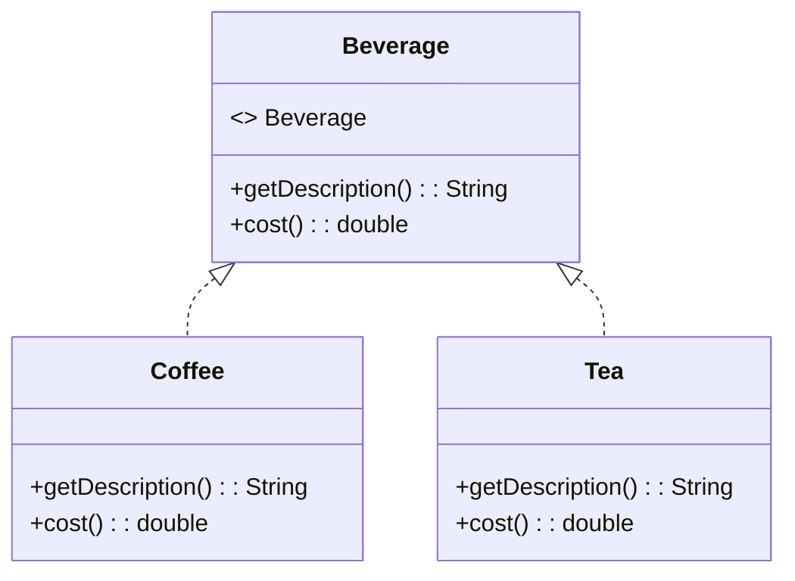
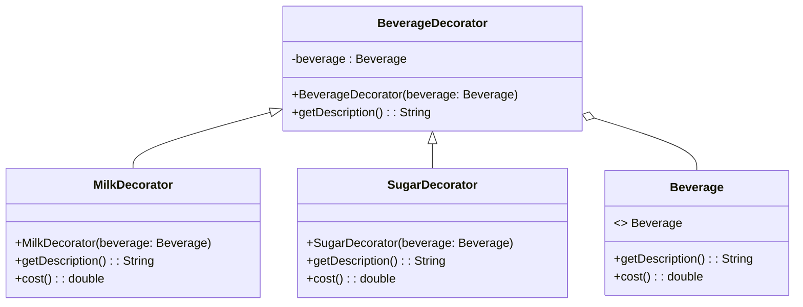
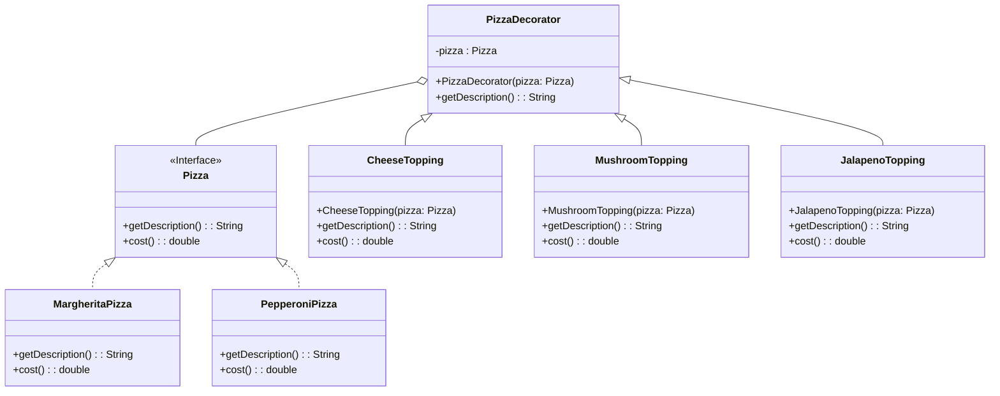

The Decorator design pattern is a structural design pattern that allows you to add behavior or responsibilities to objects dynamically, without altering their code. It is one of the Gang of Four design patterns and is used to achieve flexibility in object composition by allowing behavior to be added or removed from individual objects, rather than modifying the entire class hierarchy. 

This pattern is particularly useful when you have a set of objects with similar functionalities, but you want to provide a way to extend or modify their behavior in a flexible manner.

It provides an alternative to subclassing for extending functionality, allowing behavior to be added or overridden at runtime.

### Structure
The key components of the Decorator pattern are:

1. **Component**: This is the base interface or abstract class that defines the common interface for all concrete components and decorators.

2. **Concrete Component**: This is the basic implementation of the Component interface. It defines the core behavior that decorators can augment.

3. **Decorator**: This is an abstract class or interface that extends the Component interface and holds a reference to a Component object. It has the same interface as the Component, allowing it to wrap around concrete components and add additional behavior.

4. **Concrete Decorator**: These are classes that extend the Decorator class and provide concrete implementations of additional behaviors. They can add new methods, fields, or modify the behavior of the wrapped Component.

### Examples

#### Breverage Ordering System

Let's take the example of a beverage ordering system. We have a base component `Beverage` with two concrete components: `Coffee` and `Tea`.


We want to add decorators for adding additional options like milk, sugar, and whipped cream.



1. **Component (Beverage)**:


    
    ```java
    public interface Beverage {
        String getDescription();
        double cost();
    }
    ```
    



2. **Concrete Components (Coffee and Tea)**:


    
    ```java
    public class Coffee implements Beverage {
        public String getDescription() {
            return "Coffee";
        }

        public double cost() {
            return 2.0;
        }
    }

    public class Tea implements Beverage {
        public String getDescription() {
            return "Tea";
        }

        public double cost() {
            return 1.5;
        }
    }
    ```
    


3. **Decorator (BeverageDecorator)**:


    
    ```java
    public abstract class BeverageDecorator implements Beverage {
        protected Beverage beverage;

        public BeverageDecorator(Beverage beverage) {
            this.beverage = beverage;
        }

        public abstract String getDescription();
    }
    ```
    


4. **Concrete Decorators (MilkDecorator, SugarDecorator)**:


    
    ```java
    public class MilkDecorator extends BeverageDecorator {
        public MilkDecorator(Beverage beverage) {
            super(beverage);
        }

        public String getDescription() {
            return beverage.getDescription() + ", Milk";
        }

        public double cost() {
            return beverage.cost() + 0.5;
        }
    }

    public class SugarDecorator extends BeverageDecorator {
        public SugarDecorator(Beverage beverage) {
            super(beverage);
        }

        public String getDescription() {
            return beverage.getDescription() + ", Sugar";
        }

        public double cost() {
            return beverage.cost() + 0.2;
        }
    }
    ```
    



**Usage:**


    
    ```java
    Beverage coffee = new Coffee();
    coffee = new MilkDecorator(coffee);
    coffee = new SugarDecorator(coffee);

    System.out.println(coffee.getDescription()); // Output: Coffee, Milk, Sugar
    System.out.println(coffee.cost()); // Output: 2.7
    ```
    


In this example, the Decorator pattern allowed us to dynamically add milk and sugar as decorators to the coffee object, altering its description and cost without changing the original Coffee class.

#### Pizzas and Toppings



### Implementation

**1. Base Pizza Component:**

This represents the basic pizza. It will be our base component, and we'll add toppings to it using decorators.


    
    ```java
    public interface Pizza {
        String getDescription();
        double cost();
    }
    ```
    



**2. Concrete Pizza Types:**

We'll have two types of pizzas: `MargheritaPizza` and `PepperoniPizza`.


    
    ```java
    public class MargheritaPizza implements Pizza {
        public String getDescription() {
            return "Margherita Pizza";
        }

        public double cost() {
            return 8.0;
        }
    }

    public class PepperoniPizza implements Pizza {
        public String getDescription() {
            return "Pepperoni Pizza";
        }

        public double cost() {
            return 10.0;
        }
    }
    ```
    



**3. Toppings (Decorators):**

Now, let's define some toppings that can be added to the pizzas.


    
    ```java
    public abstract class PizzaDecorator implements Pizza {
        protected Pizza pizza;

        public PizzaDecorator(Pizza pizza) {
            this.pizza = pizza;
        }

        public abstract String getDescription();
    }

    public class CheeseTopping extends PizzaDecorator {
        public CheeseTopping(Pizza pizza) {
            super(pizza);
        }

        public String getDescription() {
            return pizza.getDescription() + ", Cheese";
        }

        public double cost() {
            return pizza.cost() + 1.5;
        }
    }

    public class MushroomTopping extends PizzaDecorator {
        public MushroomTopping(Pizza pizza) {
            super(pizza);
        }

        public String getDescription() {
            return pizza.getDescription() + ", Mushrooms";
        }

        public double cost() {
            return pizza.cost() + 1.0;
        }
    }

    public class JalapenoTopping extends PizzaDecorator {
        public JalapenoTopping(Pizza pizza) {
            super(pizza);
        }

        public String getDescription() {
            return pizza.getDescription() + ", Jalapenos";
        }

        public double cost() {
            return pizza.cost() + 0.75;
        }
    }
    ```
    



**Usage:**

Now let's create some pizzas and add various toppings to them.


    
    ```java
    Pizza margherita = new MargheritaPizza();
    margherita = new CheeseTopping(margherita);
    System.out.println(margherita.getDescription()); // Output: Margherita Pizza, Cheese
    System.out.println(margherita.cost()); // Output: 9.5

    Pizza pepperoni = new PepperoniPizza();
    pepperoni = new CheeseTopping(pepperoni);
    pepperoni = new MushroomTopping(pepperoni);
    pepperoni = new JalapenoTopping(pepperoni);
    System.out.println(pepperoni.getDescription()); // Output: Pepperoni Pizza, Cheese, Mushrooms, Jalapenos
    System.out.println(pepperoni.cost()); // Output: 13.25
    ```
    


### Benefits of the Decorator Pattern

1. **Flexible extension**: You can add or remove responsibilities from objects at runtime, making it easy to create different combinations of behaviors.

2. **Open-closed principle**: You can extend the behavior of objects without modifying their source code, promoting the open-closed principle of software design.

3. **Single Responsibility Principle**: The pattern allows for separation of concerns by breaking down functionalities into small, focused classes.

### Drawbacks of the Decorator Pattern

1. **Complexity**: The pattern can lead to a large number of small classes if not carefully managed, which might be difficult to understand and maintain.

2. **Order of wrapping**: The order in which decorators are added can impact the final behavior, and this might be confusing in some scenarios.

In conclusion, the Decorator design pattern is a powerful tool for enhancing the functionality of individual objects while maintaining a clear separation of concerns and adhering to the principles of object-oriented design.