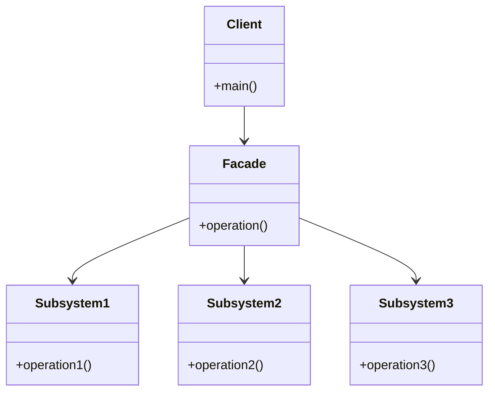
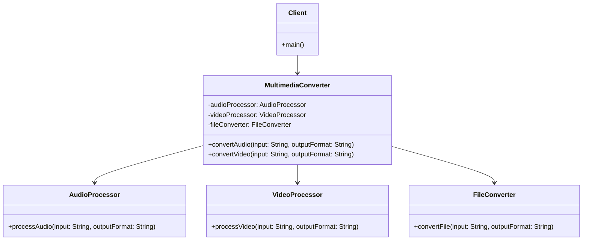

The Facade design pattern is a structural design pattern that provides a simplified interface to a complex system of classes, objects, or subsystems. It acts as a unified interface that hides the complexities of the underlying system and provides a higher-level, easier-to-use interface for the client code.

This can be particularly useful when dealing with large or intricate systems, as it promotes loose coupling and separation of concerns.

### Key Participants in the Facade Pattern:

- **Facade:** This is the central class of the pattern, acting as an entry point for client code. It knows which subsystem classes are responsible for a particular request and delegates the client's request to the appropriate objects within the subsystem. The facade does not perform any significant work itself; its primary purpose is to simplify and coordinate interactions.

- **Subsystem Classes:** These are the classes or components that make up the complex system. They are responsible for carrying out specific tasks or providing specific functionality. The subsystem classes are not directly accessible to the client code; instead, the facade mediates the interactions between the client and the subsystem.



### Example

#### Multimedia Converter




    
    ```java
    // Subsystem classes
    class AudioProcessor {
        public void processAudio(String input, String outputFormat) {
            System.out.println("Processing audio: " + input + " to " + outputFormat);
            // Actual audio processing logic
        }
    }

    class VideoProcessor {
        public void processVideo(String input, String outputFormat) {
            System.out.println("Processing video: " + input + " to " + outputFormat);
            // Actual video processing logic
        }
    }

    class FileConverter {
        public void convertFile(String input, String outputFormat) {
            System.out.println("Converting file: " + input + " to " + outputFormat);
            // Actual file conversion logic
        }
    }

    // Facade class
    class MultimediaConverter {
        private AudioProcessor audioProcessor;
        private VideoProcessor videoProcessor;
        private FileConverter fileConverter;

        public MultimediaConverter() {
            audioProcessor = new AudioProcessor();
            videoProcessor = new VideoProcessor();
            fileConverter = new FileConverter();
        }

        public void convertAudio(String input, String outputFormat) {
            audioProcessor.processAudio(input, outputFormat);
            fileConverter.convertFile(input, outputFormat);
        }

        public void convertVideo(String input, String outputFormat) {
            videoProcessor.processVideo(input, outputFormat);
            fileConverter.convertFile(input, outputFormat);
        }
    }

    // Client code
    public class Main {
        public static void main(String[] args) {
            MultimediaConverter converter = new MultimediaConverter();

            // Client uses the Facade to perform operations
            converter.convertAudio("audio.mp3", "wav");
            converter.convertVideo("video.mp4", "avi");
        }
    }

    ```
    

