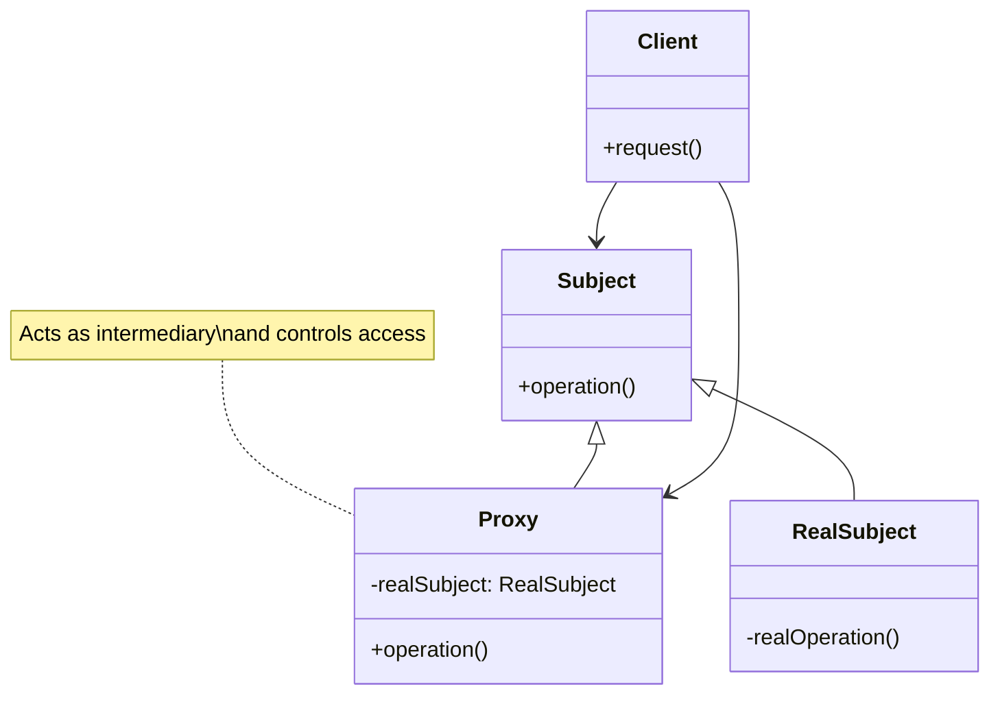
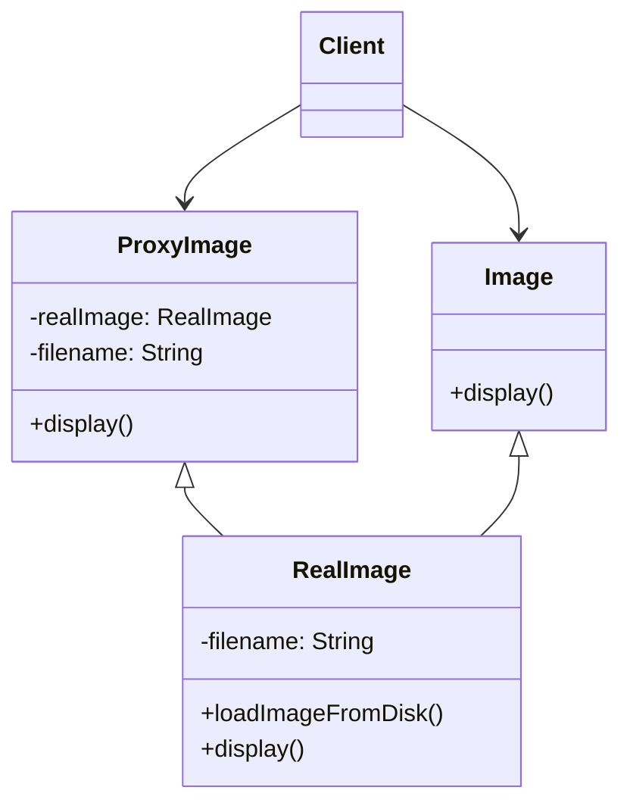

The Proxy design pattern is a structural design pattern that provides a surrogate or placeholder for another object to control access to it. In other words, the Proxy pattern is all about controlling access to an object and adding some extra functionality while keeping the interface consistent.

### Participants:

- **Subject:** This is the interface that both the RealSubject (the actual object) and the Proxy implement. It defines the common operations that the RealSubject and the Proxy can perform.
- **RealSubject:** This is the actual object that the Proxy represents. It implements the operations defined in the Subject interface.
- **Proxy:** The Proxy class implements the same interface as the RealSubject. It holds a reference to the RealSubject and controls access to it. The Proxy can add additional behavior before or after invoking the RealSubject's methods.

### UML Class Diagram



### Types of Proxies:

- **Virtual Proxy:** Creates a placeholder object that stands in for the expensive-to-create RealSubject. The Virtual Proxy delays the creation of the RealSubject until it is actually needed.
- **Remote Proxy:** Acts as a local representative for an object that resides in a different address space, often on a remote server. The Remote Proxy handles communication and marshalling/unmarshalling of data between the client and the remote object.
- **Protection Proxy:** Controls access to a sensitive object by adding an extra layer of authorization or security checks. The Protection Proxy can restrict certain clients from accessing the RealSubject directly.
- **Cache Proxy:** Stores the results of expensive operations and returns the cached result when the same operation is requested again. This can help improve performance by avoiding redundant calculations.
- **Logging Proxy:** Logs method invocations and their parameters, providing a way to monitor and debug the behavior of the RealSubject.
9 **Smart Reference Proxy:** Performs additional actions when the RealSubject is accessed, such as counting references or releasing resources when they are no longer needed.

### Examples



### Implementation


    
    ```java
    // Image interface
    interface Image {
        void display();
    }

    // RealImage class - Resource-intensive object
    class RealImage implements Image {
        private String filename;

        public RealImage(String filename) {
            this.filename = filename;
            loadImageFromDisk();
        }

        private void loadImageFromDisk() {
            System.out.println("Loading image from disk: " + filename);
        }

        public void display() {
            System.out.println("Displaying image: " + filename);
        }
    }

    // ProxyImage class - Virtual Proxy
    class ProxyImage implements Image {
        private RealImage realImage;
        private String filename;

        public ProxyImage(String filename) {
            this.filename = filename;
        }

        public void display() {
            if (realImage == null) {
                realImage = new RealImage(filename);
            }
            realImage.display();
        }
    }

    public class ProxyPatternExample {
        public static void main(String[] args) {
            // Using the ProxyImage to load and display the image
            Image image = new ProxyImage("sample.jpg");

            // Image is loaded only when display() is called
            image.display();

            // Image is already loaded, so it's displayed immediately
            image.display();
        }
    }

    ```
    
    
    ``` python
    class Image:
        def display(self):
            pass

    class RealImage(Image):
        def __init__(self, filename):
            self.filename = filename
            self.load_image_from_disk()

        def load_image_from_disk(self):
            print("Loading image from disk:", self.filename)

        def display(self):
            print("Displaying image:", self.filename)

    class ProxyImage(Image):
        def __init__(self, filename):
            self.real_image = None
            self.filename = filename

        def display(self):
            if self.real_image is None:
                self.real_image = RealImage(self.filename)
            self.real_image.display()

    def main():
        # Using ProxyImage to load and display the image
        image = ProxyImage("sample.jpg")

        # Image is loaded only when display() is called
        image.display()

        # Image is already loaded, so it's displayed immediately
        image.display()

    if __name__ == "__main__":
        main()

    ```
    
    
    ``` go
    package main

    import "fmt"

    // Subject interface
    type Image interface {
        Display()
    }

    // RealImage struct
    type RealImage struct {
        filename string
    }

    func NewRealImage(filename string) *RealImage {
        return &RealImage{filename: filename}
    }

    func (ri *RealImage) LoadImageFromDisk() {
        fmt.Println("Loading image from disk:", ri.filename)
    }

    func (ri *RealImage) Display() {
        fmt.Println("Displaying image:", ri.filename)
    }

    // ProxyImage struct
    type ProxyImage struct {
        realImage *RealImage
        filename  string
    }

    func NewProxyImage(filename string) *ProxyImage {
        return &ProxyImage{filename: filename}
    }

    func (pi *ProxyImage) Display() {
        if pi.realImage == nil {
            pi.realImage = NewRealImage(pi.filename)
        }
        pi.realImage.Display()
    }

    func main() {
        // Using ProxyImage to load and display the image
        var image Image = NewProxyImage("sample.jpg")

        // Image is loaded only when Display() is called
        image.Display()

        // Image is already loaded, so it's displayed immediately
        image.Display()
    }
    ```
    


### Benefits of Using Proxy:

- **Control:** The Proxy pattern allows you to control the access to an object, enforcing certain behavior or restrictions.
- **Lazy Loading:** Virtual Proxies can delay the creation of resource-intensive objects until they are actually needed, improving performance.
- **Security:** Protection Proxies can add security checks to control who can access certain objects and operations.
- **Caching:** Cache Proxies can help reduce the computational load by storing and reusing previously computed results.