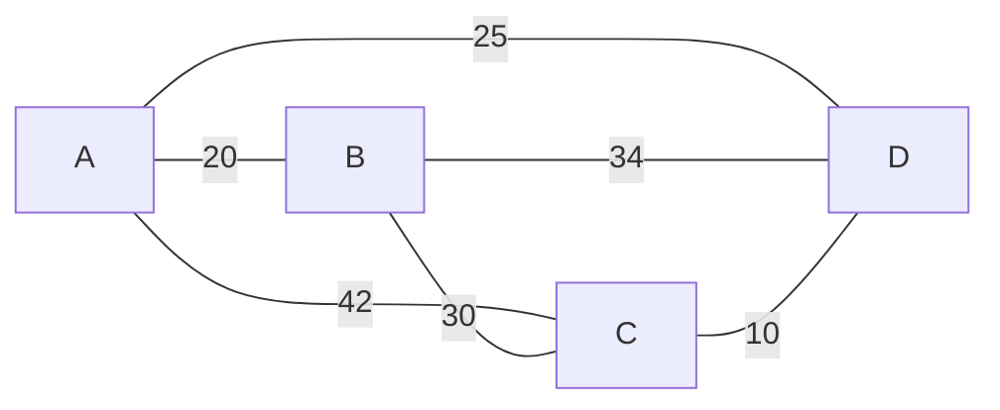
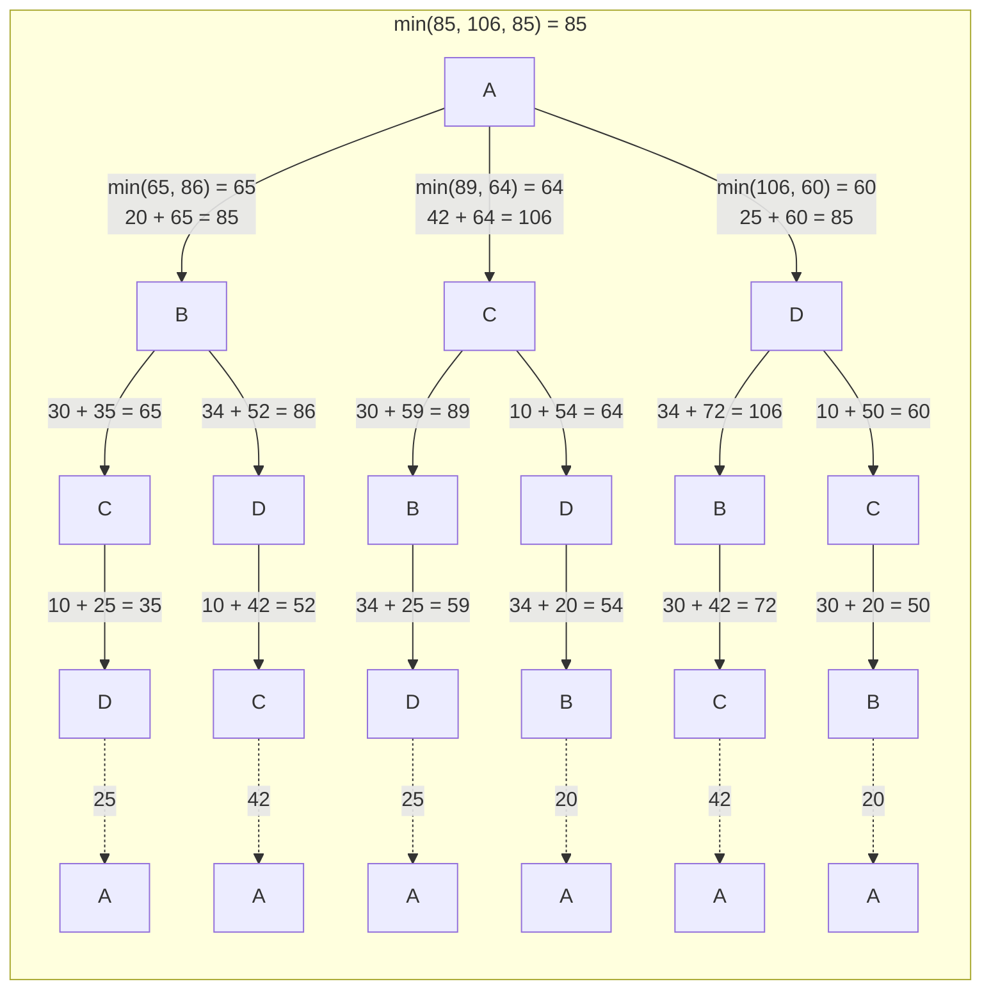

The Traveling Salesman Problem (TSP) can be viewed as finding a Hamiltonian cycle in a weighted graph (where the weights represent distances or costs), with the additional constraint that this cycle must have the minimum total weight. In other words, TSP seeks the shortest possible tour that visits each city exactly once and returns to the starting city.

## Pre Requisities

### Hamiltonian Path and Hamiltonian Cycle:

**Hamiltonian Path:**
A Hamiltonian path in a graph is a path that visits each vertex exactly once. In other words, it's a way to traverse the graph such that every node is visited once and only once. If a Hamiltonian path exists that starts at one vertex and ends at another, it is known as a Hamiltonian circuit.

**Hamiltonian Cycle:**
A Hamiltonian cycle is a special case of a Hamiltonian path. It is a cycle that visits each vertex exactly once, and it returns to the starting vertex, forming a closed loop.

## Real World Problem Statement:

A real-world problem related to Hamiltonian paths and cycles could be the **Delivery Route Problem**:

**Problem Statement:**
Imagine a delivery person needs to visit a set of locations (represented as nodes in a graph) to drop off packages. The goal is to find the shortest route that starts and ends at the same location, while visiting each location exactly once.

In this problem, the locations can be represented as nodes in a graph, and the connections between them (representing valid paths) are the edges. The graph would be **undirected** because the delivery person can travel in both directions along a road.

### Assumptions

The Traveling Salesman Problem (TSP) is typically formulated with several assumptions:

1. **Complete Graph**: This implies that the problem is defined on a complete graph, where every city is directly reachable from every other city.

2. **Symmetric Distances**: The distance or cost of traveling between two cities is assumed to be the same regardless of the direction. This means that the distance from City A to City B is the same as the distance from City B to City A.

3. **Triangle Inequality**: In the context of TSP, this means that the direct path between any two cities must be shorter than or equal to the sum of the direct paths through any other city. In other words, `AB <= AC + CB`.

4. **Non-Negative Distances**: Distances or costs between cities are non-negative. This is a practical assumption, as distances cannot be negative in real-world scenarios.

5. **Single Salesman**: There is only one salesman who is responsible for visiting all the cities.



## Brute Force Approach

**What Needs to Be Found Out**

The objective is to find a **Hamiltonian cycle with minimum weight** in this context. This would be the optimal route for the delivery person to visit all locations exactly once and return to the starting point.

**Hamiltonian Cycle vs TSP**

In this case, Hamiltonian tour exists (because the graph is complete) and in fact, many such tours exist, the problem is to find the minimum weight Hamiltonian cycle.

The Path `A - B - C - D - A` is a hamiltonian cycle. There exists many such cycles. Since this is a complete graph, there are `n!` possibilities.

### Starting from Node A:

| Row | Path                      | Weight |
|-----|---------------------------|--------|
| 1   | A -> B -> C -> D -> A     | 85     |
| 2   | A -> B -> D -> C -> A     | 106    |
| 3   | A -> C -> B -> D -> A     | 131    |
| 4   | A -> C -> D -> B -> A     | 106    |
| 5   | A -> D -> B -> C -> A     | 131    |
| 6   | A -> D -> C -> B -> A     | 85     |

### Starting from Node B:

| Row | Path                      | Weight |
|-----|---------------------------|--------|
| 7   | B -> A -> C -> D -> B     | 106    |
| 8   | B -> A -> D -> C -> B     | 85     |
| 9   | B -> C -> A -> D -> B     | 131    |
| 10  | B -> C -> D -> A -> B     | 85     |
| 11  | B -> D -> A -> C -> B     | 131    |
| 12  | B -> D -> C -> A -> B     | 106    |

### Starting from Node C:

| Row | Path                     | Weight |
|-----|--------------------------|--------|
| 13  | C -> A -> B -> D -> C     | 106    |
| 14  | C -> A -> D -> B -> C     | 131    |
| 15  | C -> B -> A -> D -> C     | 85     |
| 16  | C -> B -> D -> A -> C     | 131    |
| 17  | C -> D -> A -> B -> C     | 85     |
| 18  | C -> D -> B -> A -> C     | 106    |

### Starting from Node D:

| Row | Path                     | Weight |
|-----|--------------------------|--------|
| 19  | D -> A -> B -> C -> D     | 85     |
| 20  | D -> A -> C -> B -> D     | 131    |
| 21  | D -> B -> A -> C -> D     | 106    |
| 22  | D -> B -> C -> A -> D     | 131    |
| 23  | D -> C -> A -> B -> D     | 106    |
| 24  | D -> C -> B -> A -> D     | 85     |

If we know the starting node,  the total number of Hamiltonian paths in a complete graph with n nodes can be calculated as: `(n−1) × (n−2) × (n−3) × … × 1`, which is equivalent to `(n−1)!`. Note that the weight of a Hamiltonian cycle is equal to that of its reverse due to symmetrical distances. So, the complexity of this approach is `(n-1)! / 2`

### Recursion Tree



### Implementation


    
    ```java
    public class TSP {
        // Recursive function to find the minimum cost of a Hamiltonian cycle
        public static int tsp(int[][] graph, boolean[] visited, int current, int n, int count) {
            // Base case: If all nodes have been visited 
            if (count == n && graph[current][0] > 0) {
                // Return the total cost of the path from current node to starting node
                return graph[current][0]; 
            }

            visited[current] = true; // Mark the node as visited
            int minCost = Integer.MAX_VALUE; // Initialize minimum cost

            // Try visiting each unvisited node from the current node
            for (int i = 0; i < n; i++) {
                if (!visited[i] ) {
                    int newCost = graph[current][i] + tsp(graph, visited, i, n, count + 1);

                    // Update minimum cost if a shorter path is found
                    minCost = Math.min(minCost, newCost); 
                }
            }
            // Backtrack: Mark the node as unvisited
            visited[current] = false; 
            return minCost; // Return the minimum cost
        }

        // Main function to solve TSP
        public static void solveTSP(int[][] graph) {
            int n = graph.length; // Get the number of nodes in the graph
            boolean[] visited = new boolean[n]; // Array to keep track of visited nodes
            // Initialize all nodes as unvisited
            // Arrays.fill(visited, false); 

            // Call the recursive function to find minimum cost
            int minCost = tsp(graph, visited, 0, n, 1); 

            // Print the results
            System.out.println("Minimum Cost: " + minCost);
        }

        public static void main(String[] args) {
            int[][] graph = {
                {0, 20, 42, 25},
                {20, 0, 30, 34},
                {42, 30, 0, 10},
                {25, 34, 10, 0}
            };

            solveTSP(graph); // Call the function to solve TSP
        }
    }
    ```
    
    
    ```python
    def tsp(graph, visited, current, n, count):
        # Base case: If all nodes have been visited and there is a valid edge back to the starting node
        if count == n and graph[current][0] > 0:
            return graph[current][0]  # Return the total cost of the path from current node to starting node

        visited[current] = True  # Mark the current node as visited
        min_cost = float('inf')  # Initialize minimum cost to a very large value

        # Try visiting each unvisited node from the current node
        for i in range(n):
            if not visited[i]:
                new_cost = graph[current][i] + tsp(graph, visited, i, n, count + 1)

                # Update minimum cost if a shorter path is found
                min_cost = min(min_cost, new_cost)

        visited[current] = False  # Backtrack: Mark the current node as unvisited
        return min_cost  # Return the minimum cost


    def solve_tsp(graph):
        n = len(graph)  # Get the number of nodes in the graph
        visited = [False] * n  # Initialize an array to keep track of visited nodes

        # Call the recursive function to find minimum cost
        min_cost = tsp(graph, visited, 0, n, 1)

        # Print the minimum cost
        print(f"Minimum Cost: {min_cost}")


    # Define the graph as an adjacency matrix
    graph = [
        [0, 20, 42, 25],
        [20, 0, 30, 34],
        [42, 30, 0, 10],
        [25, 34, 10, 0]
    ]

    # Call the function to solve TSP
    solve_tsp(graph)
    ```
    
    
    ```go
    package main

    import (
        "fmt"
        "math"
    )

    // Function to find the minimum cost of a Hamiltonian cycle using recursion
    func tsp(graph [][]int, visited []bool, current, n, count int) int {
        // Base case: If all nodes have been visited and there is a valid edge back to the starting node
        if count == n && graph[current][0] > 0 {
            return graph[current][0] // Return the total cost of the path from current node to starting node
        }

        visited[current] = true // Mark the current node as visited
        minCost := math.MaxInt64 // Initialize minimum cost to a very large value

        // Try visiting each unvisited node from the current node
        for i := 0; i < n; i++ {
            if !visited[i] && graph[current][i] > 0 {
                newCost := graph[current][i] + tsp(graph, visited, i, n, count+1)

                // Update minimum cost if a shorter path is found
                if newCost < minCost {
                    minCost = newCost
                }
            }
        }

        visited[current] = false // Backtrack: Mark the current node as unvisited
        return minCost // Return the minimum cost
    }

    // Function to solve the TSP
    func solveTSP(graph [][]int) {
        n := len(graph) // Get the number of nodes in the graph
        visited := make([]bool, n) // Initialize an array to keep track of visited nodes

        // Call the recursive function to find minimum cost
        minCost := tsp(graph, visited, 0, n, 1)

        // Print the minimum cost
        fmt.Printf("Minimum Cost: %d\n", minCost)
    }

    func main() {
        graph := [][]int{
            {0, 20, 42, 25},
            {20, 0, 30, 34},
            {42, 30, 0, 10},
            {25, 34, 10, 0},
        }

        // Call the function to solve TSP
        solveTSP(graph)
    }
    ```
    


### Complexity Analysis

**Time Complexity**
- The time complexity of this approach is **O(n^2 * 2^n)**. Here, n is the number of nodes in the graph.

**Space Complexity**
- The space complexity is O(n * 2^n). This is due to the space required for the recursion stack (which can have at most n levels deep), and the additional space used for the visited array which keeps track of visited nodes.

## Dynamic Programming

From the above implementation it is clear that we are depending on two variables i.e., `visited` and `current`. Using a straightforward approach, we might need a 2D array to store the state of all possible subsets of nodes. This can be extremely memory-intensive and impractical for large graphs.

```java
// visited it self is an array
dp [visited][current]
```

[**Bit masking**](#bit-masking) is used to efficiently represent and track the state of visited nodes in a more memory-efficient manner. By using bit masking, we can represent the set of visited nodes as a binary number. Each bit corresponds to a node, where 1 indicates the node has been visited and 0 indicates it hasn't. This representation significantly reduces the memory footprint compared to a 2D array.

## Bit Masking

**Bit Masking** is a technique used in programming where we manipulate individual bits of a number. It involves performing bitwise operations (like AND, OR, XOR) on binary representations of numbers.

In the context of the Traveling Salesman Problem (TSP), we can use bit masking to represent the visited nodes. Instead of using an array of booleans to keep track of visited nodes, we can use an integer where each bit represents the visited status of a node.

For example, if we have 4 nodes, we can represent the visited status as follows:

| Visited Array | Binary Representation | Bitmask Num | Comment                   |
| ------------- | --------------------- | ----------  | ------------------------- |
| [0, 0, 0, 0]  | 0000                  | 0           | All nodes unvisited       |
| [0, 0, 0, 1]  | 0001                  | 1           | Only node A is visited    |
| [0, 0, 1, 0]  | 0010                  | 2           | Only node B is visted     |
| [0, 0, 1, 1]  | 0011                  | 3           | Nodes A and B are visited |
| [1, 1, 1, 1]  | 1111                  | 15          | All nodes are visited     |

Using bit masking in TSP reduces the space complexity, especially when dealing with a large number of nodes.

### Implementation


    
    ```java
    public class TSPBitMasking {
        // Recursive function to find the minimum cost of a Hamiltonian cycle using bit masking
        public static int tsp(int[][] graph, int visited, int current, int n, int count) {
            // Base case: If all nodes have been visited and there is a valid edge back to the starting node
            if (count == n && (visited & 1) == 1) {
                return graph[current][0];  // Return the total cost of the path from current node to starting node
            }

            int minCost = Integer.MAX_VALUE;

            for (int i = 0; i < n; i++) {
                // Check if node 'i' has not been visited and there exists an edge from 'current' to 'i'
                if ((visited & (1 << i)) == 0 && graph[current][i] != 0) {
                    int newMask = visited | (1 << i);  // Update the visited nodes using bitwise OR
                    int newCost = graph[current][i] + tsp(graph, newMask, i, n, count + 1);
                    minCost = Math.min(minCost, newCost);  // Update minimum cost if a shorter path is found
                }
            }

            return minCost;
        }

        // Function to solve the TSP using bit masking
        public static void solveTSP(int[][] graph) {
            int n = graph.length;  // Get the number of nodes in the graph
            int mask = 1;  // Initialize the bitmask with the starting node (node 0)
            int minCost = tsp(graph, mask, 0, n, 1);  // Call the recursive function to find minimum cost
            System.out.println("Minimum Cost: " + minCost);  // Print the minimum cost
        }

        public static void main(String[] args) {
            int[][] graph = {
                {0, 20, 42, 25},
                {20, 0, 30, 34},
                {42, 30, 0, 10},
                {25, 34, 10, 0}
            };

            solveTSP(graph);  // Call the function to solve TSP
        }
    }
    ```
    
    
    ```python
    def tsp(graph, visited, current, n, count):
        # Base case: If all nodes have been visited and there is a valid edge back to the starting node
        if count == n and visited & 1:
            return graph[current][0]  # Return the total cost of the path from current node to starting node

        min_cost = float('inf')

        for i in range(n):
            # Check if node 'i' has not been visited and there exists an edge from 'current' to 'i'
            if not (visited & (1 << i)) and graph[current][i] != 0:
                new_mask = visited | (1 << i)  # Update the visited nodes using bitwise OR
                new_cost = graph[current][i] + tsp(graph, new_mask, i, n, count + 1)
                min_cost = min(min_cost, new_cost)  # Update minimum cost if a shorter path is found

        return min_cost

    def solve_tsp(graph):
        n = len(graph)  # Get the number of nodes in the graph
        mask = 1  # Initialize the bitmask with the starting node (node 0)
        min_cost = tsp(graph, mask, 0, n, 1)  # Call the recursive function to find minimum cost
        print(f"Minimum Cost: {min_cost}")  # Print the minimum cost

    if __name__ == "__main__":
        graph = [
            [0, 20, 42, 25],
            [20, 0, 30, 34],
            [42, 30, 0, 10],
            [25, 34, 10, 0]
        ]

        solve_tsp(graph)  # Call the function to solve TSP
    ```
    
    
    ```go
    package main
    import "fmt"

    // Function to find the minimum cost of a Hamiltonian cycle using bit masking
    func tsp(graph [][]int, visited int, current, n, count int) int {
        if count == n && visited&1 == 1 {
            return graph[current][0]
        }

        minCost := int(^uint(0) >> 1) // Initialize minimum cost to maximum possible value

        // Try visiting each unvisited node from the current node
        for i := 0; i < n; i++ {
            if visited&(1<<i) == 0 && graph[current][i] != 0 {
                newMask := visited | (1 << i)      // Update the visited nodes using bitwise OR
                newCost := graph[current][i] + tsp(graph, newMask, i, n, count+1) // Calculate new cost
                if newCost < minCost {
                    minCost = newCost  // Update minimum cost if a shorter path is found
                }
            }
        }

        return minCost
    }

    // Function to solve the TSP using bit masking
    func solveTSP(graph [][]int) {
        n := len(graph) // Get the number of nodes in the graph
        mask := 1       // Initialize the bitmask with the starting node (node 0)
        minCost := tsp(graph, mask, 0, n, 1) // Call the recursive function to find minimum cost
        fmt.Printf("Minimum Cost: %d\n", minCost) // Print the minimum cost
    }

    func main() {
        graph := [][]int{
            {0, 20, 42, 25},
            {20, 0, 30, 34},
            {42, 30, 0, 10},
            {25, 34, 10, 0},
        }

        solveTSP(graph) // Call the function to solve TSP
    }
    ```
    


### Complexity Analysis

This implementation has a similar time complexity of **O(n^2 * 2^n)**, but the space complexity is improved to **O(n * 2^n)** due to the reduced space required for the bitmask.

### Dp with Bit Mask



    
    ```java
    public class TSPMemoization {
        public static int tsp(int[][] graph, int visited, int current, int n, int count, int[][] memo) {
            if (count == n && (visited & 1) == 1) {
                return graph[current][0];
            }

            if (memo[current][visited] != -1) {
                return memo[current][visited];
            }

            int minCost = Integer.MAX_VALUE;

            for (int i = 0; i < n; i++) {
                if ((visited & (1 << i)) == 0 && graph[current][i] != 0) {
                    int newMask = visited | (1 << i);
                    int newCost = graph[current][i] + tsp(graph, newMask, i, n, count + 1, memo);
                    minCost = Math.min(minCost, newCost);
                }
            }

            memo[current][visited] = minCost;
            return minCost;
        }

        public static void solveTSP(int[][] graph) {
            int n = graph.length;
            int mask = 1;
            int[][] memo = new int[n][1 << n];
            for (int[] row : memo) {
                Arrays.fill(row, -1);
            }
            int minCost = tsp(graph, mask, 0, n, 1, memo);
            System.out.println("Minimum Cost: " + minCost);
        }

        public static void main(String[] args) {
            int[][] graph = {
                {0, 20, 42, 25},
                {20, 0, 30, 34},
                {42, 30, 0, 10},
                {25, 34, 10, 0}
            };

            solveTSP(graph);
        }
    }
    ```
    
    
    ```python
    def tsp(graph, visited, current, n, count, memo):
        if count == n and visited & 1:
            return graph[current][0]

        # check if already computed
        if memo[current][visited] != -1:
            return memo[current][visited]

        min_cost = float('inf')

        for i in range(n):
            if not (visited & (1 << i)) and graph[current][i] != 0:
                new_mask = visited | (1 << i)
                new_cost = graph[current][i] + tsp(graph, new_mask, i, n, count + 1, memo)
                min_cost = min(min_cost, new_cost)

        # update the memo cache
        memo[current][visited] = min_cost
        return min_cost

    def solve_tsp(graph):
        n = len(graph)
        mask = 1
        memo = [[-1 for _ in range(1 << n)] for _ in range(n)]
        min_cost = tsp(graph, mask, 0, n, 1, memo)
        print(f"Minimum Cost: {min_cost}")

    if __name__ == "__main__":
        graph = [
            [0, 20, 42, 25],
            [20, 0, 30, 34],
            [42, 30, 0, 10],
            [25, 34, 10, 0]
        ]

        solve_tsp(graph)
    ```
    
    
    ```go
    package main
    import "fmt"

    func tsp(graph [][]int, visited int, current, n, count int, memo [][]int) int {
        if count == n && visited&1 == 1 {
            return graph[current][0]
        }
        // check if already computed
        if memo[current][visited] != -1 {
            return memo[current][visited]
        }

        minCost := int(^uint(0) >> 1)

        for i := 0; i < n; i++ {
            if visited&(1<<i) == 0 && graph[current][i] != 0 {
                newMask := visited | (1 << i)
                newCost := graph[current][i] + tsp(graph, newMask, i, n, count+1, memo)
                if newCost < minCost {
                    minCost = newCost
                }
            }
        }
        // update the cache
        memo[current][visited] = minCost
        return minCost
    }

    func solveTSP(graph [][]int) {
        n := len(graph)
        mask := 1
        memo := make([][]int, n)
        for i := range memo {
            memo[i] = make([]int, 1<<n)
            for j := range memo[i] {
                memo[i][j] = -1
            }
        }
        minCost := tsp(graph, mask, 0, n, 1, memo)
        fmt.Printf("Minimum Cost: %d\n", minCost)
    }

    func main() {
        graph := [][]int{
            {0, 20, 42, 25},
            {20, 0, 30, 34},
            {42, 30, 0, 10},
            {25, 34, 10, 0},
        }

        solveTSP(graph)
    }
    ```
    
