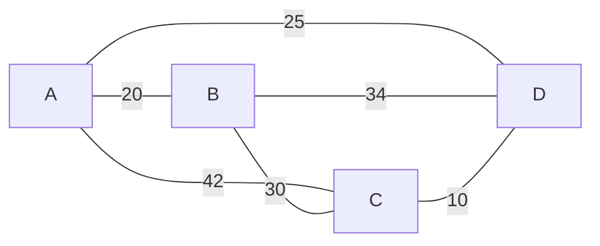
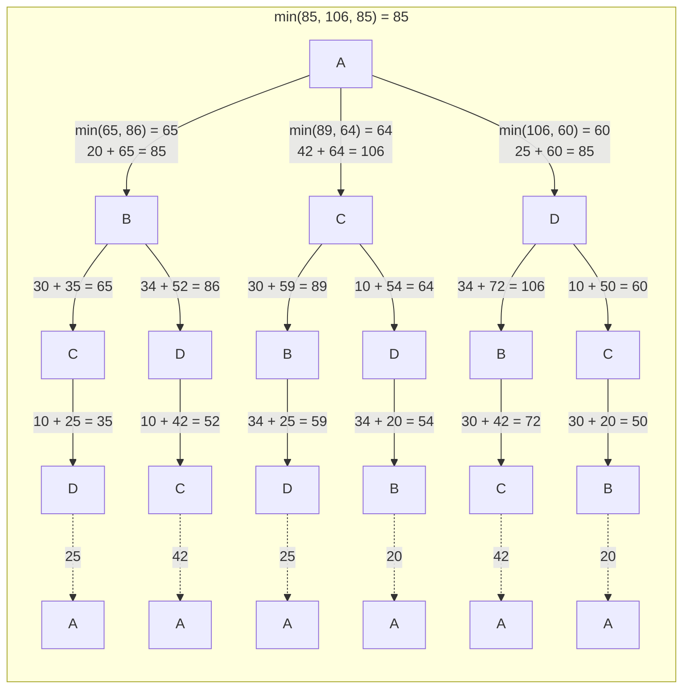

The Traveling Salesman Problem (TSP) can be viewed as finding a Hamiltonian cycle in a weighted graph (where the weights represent distances or costs), with the additional constraint that this cycle must have the minimum total weight. In other words, TSP seeks the shortest possible tour that visits each city exactly once and returns to the starting city.

## Pre Requisities

### Hamiltonian Path and Hamiltonian Cycle:

**Hamiltonian Path:**
A Hamiltonian path in a graph is a path that visits each vertex exactly once. In other words, it's a way to traverse the graph such that every node is visited once and only once. If a Hamiltonian path exists that starts at one vertex and ends at another, it is known as a Hamiltonian circuit.

**Hamiltonian Cycle:**
A Hamiltonian cycle is a special case of a Hamiltonian path. It is a cycle that visits each vertex exactly once, and it returns to the starting vertex, forming a closed loop.

## Real World Problem Statement:

A real-world problem related to Hamiltonian paths and cycles could be the **Delivery Route Problem**:

**Problem Statement:**
Imagine a delivery person needs to visit a set of locations (represented as nodes in a graph) to drop off packages. The goal is to find the shortest route that starts and ends at the same location, while visiting each location exactly once.

In this problem, the locations can be represented as nodes in a graph, and the connections between them (representing valid paths) are the edges. The graph would be **undirected** because the delivery person can travel in both directions along a road.

### Assumptions

The Traveling Salesman Problem (TSP) is typically formulated with several assumptions:

1. **Complete Graph**: In the standard formulation, it is assumed that there is a direct connection (i.e., a path) between every pair of cities. This implies that the problem is defined on a complete graph, where every city is directly reachable from every other city.

2. **Symmetric Distances**: The distance or cost of traveling between two cities is assumed to be the same regardless of the direction. This means that the distance from City A to City B is the same as the distance from City B to City A.

3. **Triangle Inequality**: In the context of TSP, this means that the direct path between any two cities must be shorter than or equal to the sum of the direct paths through any other city. In other words, `AB <= AC + CB`.

4. **Non-Negative Distances**: Distances or costs between cities are non-negative. This is a practical assumption, as distances cannot be negative in real-world scenarios.

5. **Single Salesman**: There is only one salesman who is responsible for visiting all the cities.

## Brute Force Approach

**What Needs to Be Found Out**

The objective is to find a **Hamiltonian cycle with minimum weight** in this context. This would be the optimal route for the delivery person to visit all locations exactly once and return to the starting point.

**Hamiltonian Cycle vs TSP**

In this case, Hamiltonian tour exists (because the graph is complete) and in fact, many such tours exist, the problem is to find the minimum weight Hamiltonian cycle.

The Path `A - B - C - D - A` is a hamiltonian cycle. There exists many such cycles. Since this is a complete graph, there are `n!` possibilities.

### Starting from Node A:

| Row | Path                      | Weight |
|-----|---------------------------|--------|
| 1   | A -> B -> C -> D -> A     | 85     |
| 2   | A -> B -> D -> C -> A     | 106    |
| 3   | A -> C -> B -> D -> A     | 131    |
| 4   | A -> C -> D -> B -> A     | 106    |
| 5   | A -> D -> B -> C -> A     | 131    |
| 6   | A -> D -> C -> B -> A     | 85     |

### Starting from Node B:

| Row | Path                      | Weight |
|-----|---------------------------|--------|
| 7   | B -> A -> C -> D -> B     | 106    |
| 8   | B -> A -> D -> C -> B     | 85     |
| 9   | B -> C -> A -> D -> B     | 131    |
| 10  | B -> C -> D -> A -> B     | 85     |
| 11  | B -> D -> A -> C -> B     | 131    |
| 12  | B -> D -> C -> A -> B     | 106    |

### Starting from Node C:

| Row | Path                     | Weight |
|-----|--------------------------|--------|
| 13  | C -> A -> B -> D -> C     | 106    |
| 14  | C -> A -> D -> B -> C     | 131    |
| 15  | C -> B -> A -> D -> C     | 85     |
| 16  | C -> B -> D -> A -> C     | 131    |
| 17  | C -> D -> A -> B -> C     | 85     |
| 18  | C -> D -> B -> A -> C     | 106    |

### Starting from Node D:

| Row | Path                     | Weight |
|-----|--------------------------|--------|
| 19  | D -> A -> B -> C -> D     | 85     |
| 20  | D -> A -> C -> B -> D     | 131    |
| 21  | D -> B -> A -> C -> D     | 106    |
| 22  | D -> B -> C -> A -> D     | 131    |
| 23  | D -> C -> A -> B -> D     | 106    |
| 24  | D -> C -> B -> A -> D     | 85     |

If we know the starting node,  the total number of Hamiltonian paths in a complete graph with n nodes can be calculated as: `(n−1) × (n−2) × (n−3) × … × 1`, which is equivalent to `(n−1)!`. Note that the weight of a Hamiltonian cycle is equal to that of its reverse due to symmetrical distances. So, the complexity of this approach is `(n-1)! / 2`

### Recursion Tree

### Implementation
