**Bubble sort** is a simple comparison-based sorting algorithm. It works by repeatedly swapping adjacent elements if they are in the wrong order. The pass through the list is repeated until the list is sorted.

### Example

Consider a sample array:  `[5, 4, 3, 2, 1]`:

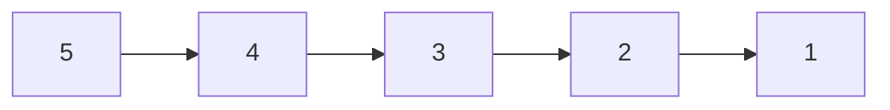

Now, let's go through one pass of the bubble sort algorithm:

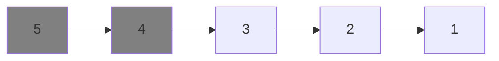

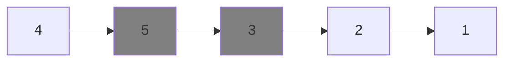

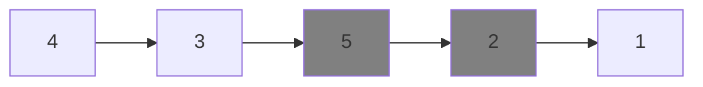

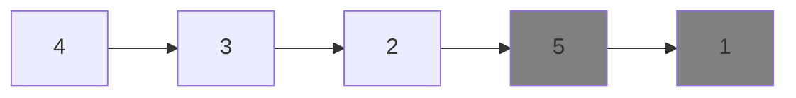

**After the first pass:**

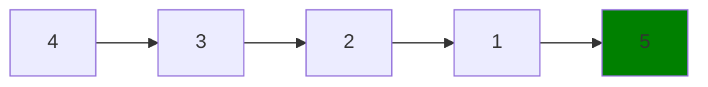

**After the second pass:**

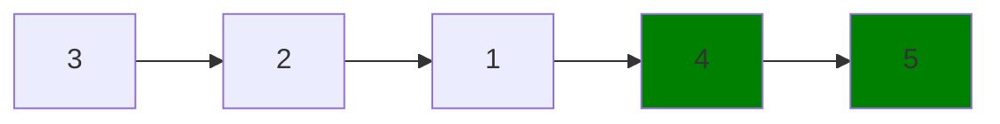

**After the third pass:**

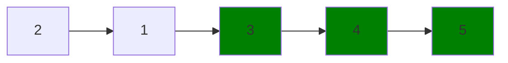

**After the fourth pass:**

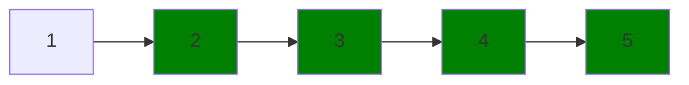

**After the fifth pass (final pass):**

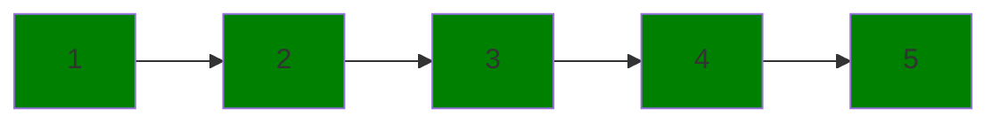

### Flow chart

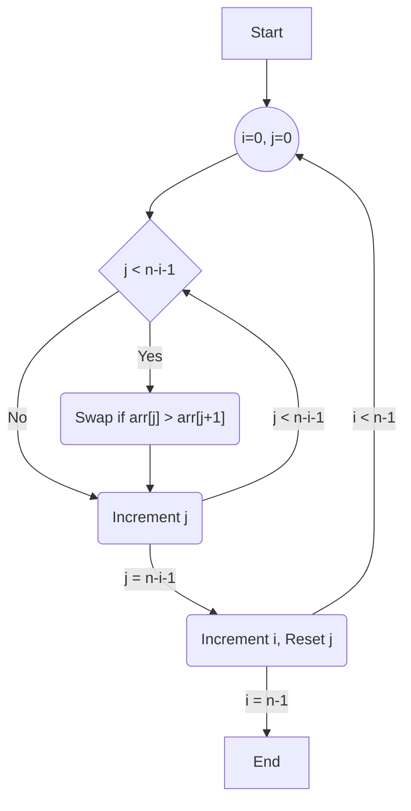

### Implementation


    
    ```java
    public class BubbleSort {
        public static void bubbleSort(int arr[]) {
            int n = arr.length;
            boolean swapped;
            
            for (int i = 0; i < n-1; i++) {
                swapped = false;
                for (int j = 0; j < n-i-1; j++) {
                    if (arr[j] > arr[j+1]) {
                        // Swap arr[j] and arr[j+1]
                        int temp = arr[j];
                        arr[j] = arr[j+1];
                        arr[j+1] = temp;
                        swapped = true;
                    }
                }
                // If no two elements were swapped, break the loop
                if (!swapped)
                    break;
            }
        }

        public static void main(String args[]) {
            int arr[] = {64, 34, 25, 12, 22, 11, 90};
            bubbleSort(arr);
            System.out.println("Sorted array:");
            for (int i : arr) {
                System.out.print(i + " ");
            }
        }
    }
    ```
    
    
    ```python
    def bubble_sort(arr):
        n = len(arr)
        for i in range(n):
            # Initialize swapped to False
            swapped = False
            for j in range(0, n-i-1):
                if arr[j] > arr[j+1]:
                    # Swap arr[j] and arr[j+1]
                    arr[j], arr[j+1] = arr[j+1], arr[j]
                    swapped = True
            # If no two elements were swapped, break the loop
            if not swapped:
                break

    arr = [64, 34, 25, 12, 22, 11, 90]
    bubble_sort(arr)
    print("Sorted array:")
    print(arr)
    ```
    
    
    ```go
    package main

    import "fmt"

    func bubbleSort(arr []int) {
        n := len(arr)
        for i := 0; i < n-1; i++ {
            swapped := false
            for j := 0; j < n-i-1; j++ {
                if arr[j] > arr[j+1] {
                    // Swap arr[j] and arr[j+1]
                    arr[j], arr[j+1] = arr[j+1], arr[j]
                    swapped = true
                }
            }
            // If no two elements were swapped, break the loop
            if !swapped {
                break
            }
        }
    }

    func main() {
        arr := []int{64, 34, 25, 12, 22, 11, 90}
        bubbleSort(arr)
        fmt.Println("Sorted array:")
        fmt.Println(arr)
    }
    ```
    



These implementations use an optimized version of the Bubble Sort algorithm with a flag (`swapped`) that helps break out of the loop early if the array is already sorted. This reduces the time complexity in cases where the array is mostly sorted.

### Complexity Analysis

For the optimized Bubble Sort implementation:

**Time Complexity**
- **Worst-case Time Complexity**: O(n^2)
- **Best-case Time Complexity**: O(n)
- **Average-case Time Complexity**: O(n^2)

**Space Complexity**

- **Space Complexity**: O(1)
