Selection sort is a simple comparison-based sorting algorithm. It works by dividing the input list into two parts: the sorted portion on the left and the unsorted portion on the right. Initially, the sorted portion is empty, and the unsorted portion contains the entire list.

The algorithm repeatedly finds the smallest (or largest, depending on the sorting order) element from the unsorted portion and swaps it with the first element in the unsorted portion. This effectively extends the sorted portion by one element. The process is repeated until the entire list is sorted.

Here's a step-by-step explanation of how the selection sort algorithm works:

1. **Step 1**: Find the smallest element in the unsorted portion of the list.
2. **Step 2**: Swap it with the first element in the unsorted portion.
3. **Step 3**: Move the boundary between the sorted and unsorted portions one element to the right.

Repeat steps 1-3 until the entire list is sorted.

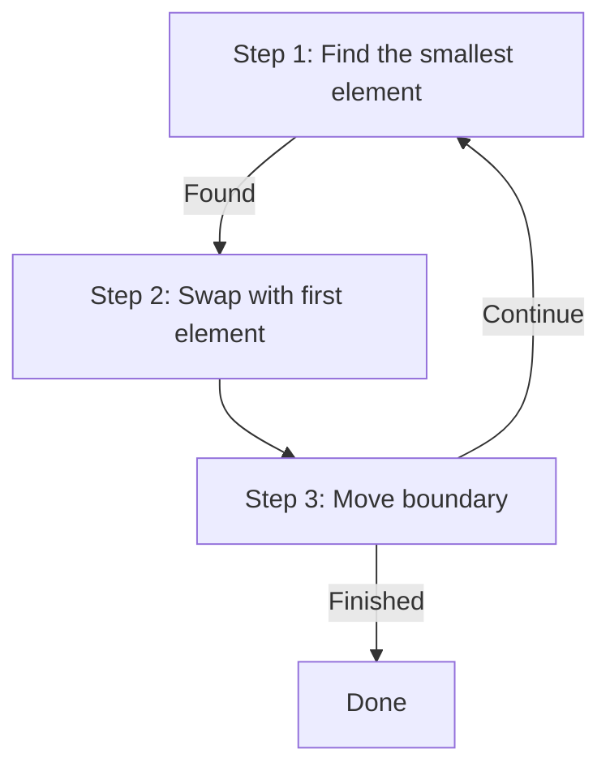

### Example

Consider a sample array:  `[64, 25, 12, 22, 11]`:

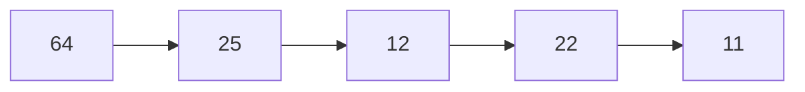

Find the smallest element and swap it with the first element

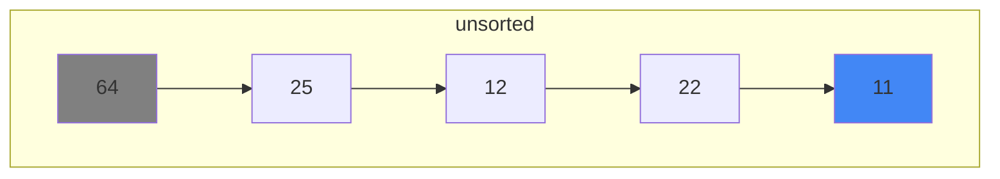

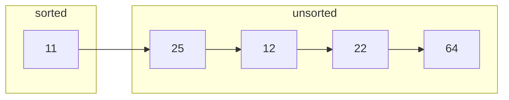

Find the smallest element and swap it with the first element

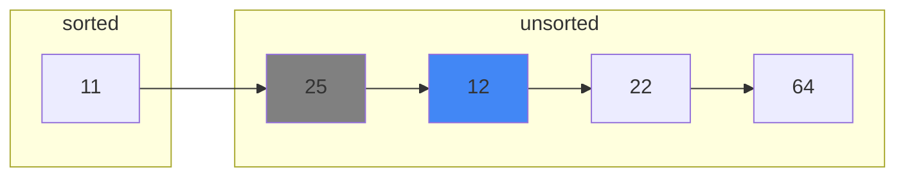
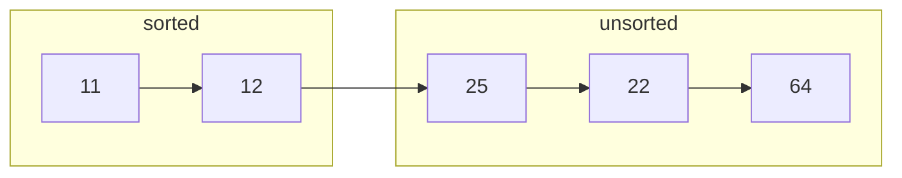

Find the smallest element and swap it with the first element

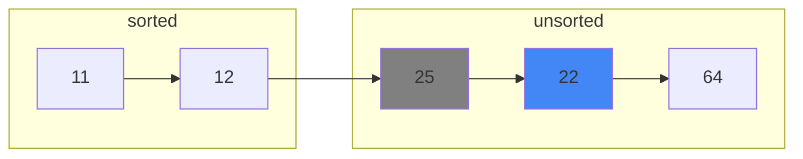
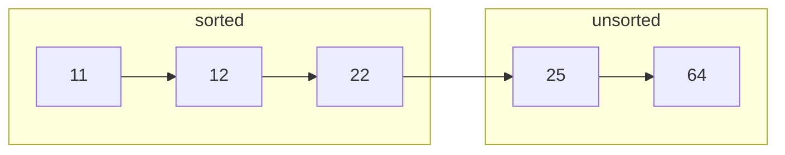
Find the smallest element and swap it with the first element

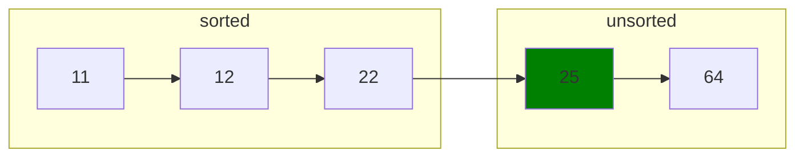
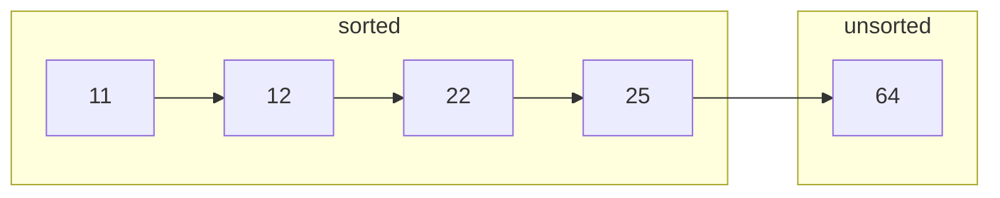

Find the smallest element and swap it with the first element

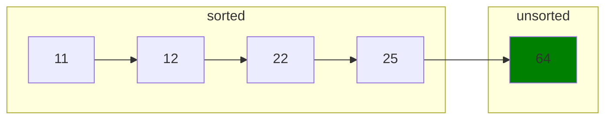
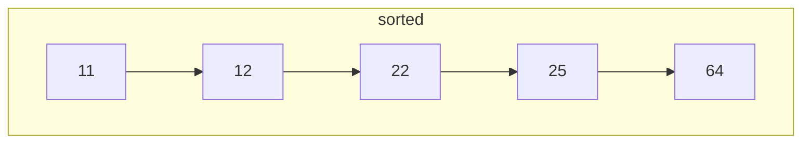

### Implementation


  
  ```java
  public class SelectionSort {
    public static void selectionSort(int[] arr) {
        int n = arr.length;
        for (int i = 0; i < n-1; i++) {
            int minIndex = i;

            // Find the minimum element in the unsorted portion
            for (int j = i+1; j < n; j++) {
                if (arr[j] < arr[minIndex]) {
                    minIndex = j;
                }
            }

            // Swap the found minimum element with the first element
            int temp = arr[minIndex];
            arr[minIndex] = arr[i];
            arr[i] = temp;
        }
    }

    public static void main(String[] args) {
        int[] arr = {64, 25, 12, 22, 11};
        selectionSort(arr);

        System.out.print("Sorted Array: ");
        for (int num : arr) {
            System.out.print(num + " ");
        }
    }
  }
  ```
  
  
  ```python
  def selection_sort(arr):
    n = len(arr)
    for i in range(n-1):
        min_index = i

        # Find the minimum element in the unsorted portion
        for j in range(i+1, n):
            if arr[j] < arr[min_index]:
                min_index = j

        # Swap the found minimum element with the first element
        arr[i], arr[min_index] = arr[min_index], arr[i]

  # Example Usage
  arr = [64, 25, 12, 22, 11]
  selection_sort(arr)
  print(f"Sorted Array: {arr}")
  ```
  
  
  ```go
  package main
  import "fmt"

  func selectionSort(arr []int) {
      n := len(arr)

      for i := 0; i < n-1; i++ {
          minIndex := i

          // Find the minimum element in the unsorted portion
          for j := i + 1; j < n; j++ {
              if arr[j] < arr[minIndex] {
                  minIndex = j
              }
          }

          // Swap the found minimum element with the first element
          arr[i], arr[minIndex] = arr[minIndex], arr[i]
      }
  }

  func main() {
      arr := []int{64, 25, 12, 22, 11}
      selectionSort(arr)

      fmt.Print("Sorted Array: ")
      for _, num := range arr {
          fmt.Printf("%d ", num)
      }
  }
  ```
  
