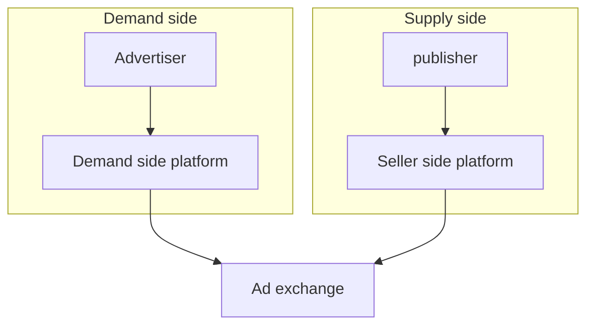
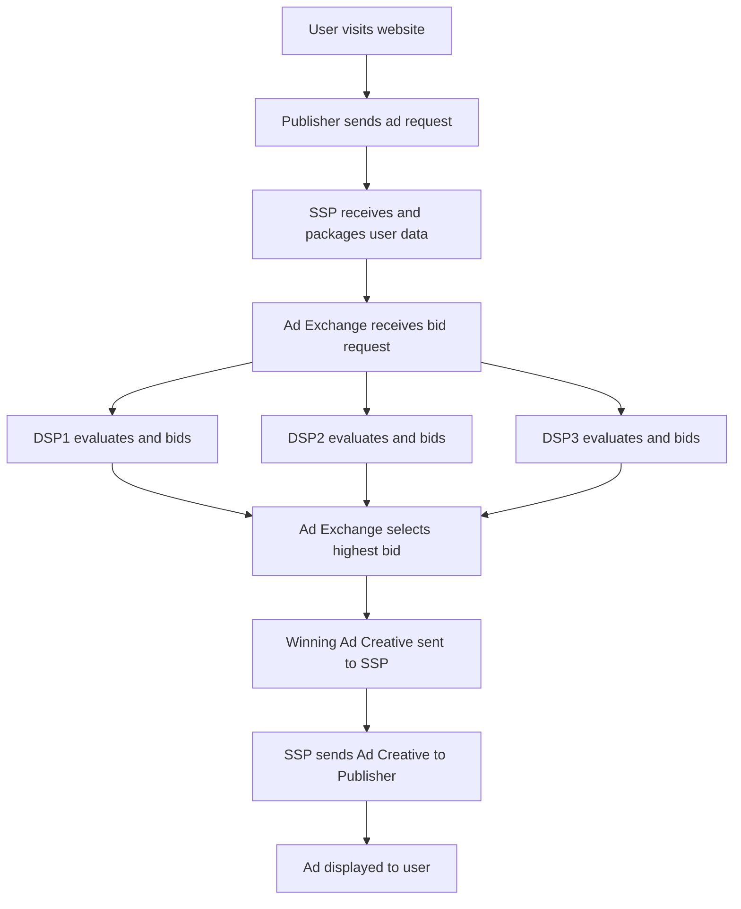

1. **Impression**  
   - One display of an ad to a user. If a banner ad appears while you’re browsing a site, that counts as one impression.

2. **Click-Through Rate (CTR)**  
   - Measures the effectiveness of an ad.  
   - **Formula:** (Number of Clicks ÷ Number of Impressions) × 100  
   - Example: If 1000 people see an ad and 50 click on it, the CTR is 5%.

3. **Conversion & Conversion Rate**  
   - A *conversion* happens when a user takes a desired action after clicking the ad (e.g., buying something, signing up).  
   - **Conversion Rate:** (Number of Conversions ÷ Number of Clicks) × 100  
   - Helps advertisers understand how effective their funnel is.

4. **Real-Time Bidding (RTB)**  
   - This is the algorithmic auctioning of ad spaces in *real time*—usually milliseconds before the page loads.  
   - When you visit a site, a request is sent to an ad exchange with data like your location, interests, etc. Advertisers bid instantly to show you their ad. The highest bidder wins, and their ad appears.

5. **Demand-Side Platform (DSP)**  
   - A system used by advertisers to buy ad inventory in an automated way, often via RTB.

6. **Supply-Side Platform (SSP)**  
   - Used by publishers to sell ad space automatically. It connects to multiple DSPs to get the best price for their ad inventory.

7. **Ad Exchange**  
   - The marketplace connecting SSPs and DSPs. It handles bids and returns the winning ad in real time.

8. **CPM, CPC, CPA** (Pricing Models)  
   - **CPM (Cost per Mille):** Cost per 1000 impressions.  
   - **CPC (Cost per Click):** Advertisers pay when someone clicks.  
   - **CPA (Cost per Acquisition):** Pay only when a conversion happens.

9. **Targeting**  
   - Ads can be shown to users based on demographics, interests, behaviors, location, time of day, device type, etc.

10. **Frequency Capping**  
   - Limits the number of times a user sees the same ad. Prevents fatigue.

## RTB process

### 🌐 **Data Flow: From User Visit to Ad Display**

1. **User visits a website or app** with ad slots.
2. The **Publisher**'s site triggers a request to the **Supply-Side Platform (SSP)**.
3. The SSP packages user data (like location, browser, time, etc.) and sends a **bid request** to an **Ad Exchange**.
4. The Ad Exchange forwards the bid request to multiple **Demand-Side Platforms (DSPs)**.
5. Each DSP runs algorithms to:
   - Evaluate the user data
   - Decide whether to bid
   - Calculate how much to bid
6. Bids are returned to the Ad Exchange.
7. The **highest bid wins**, and the winning DSP sends the **ad creative** (image/text/HTML snippet).
8. The Ad Exchange sends the ad back to the SSP, which returns it to the Publisher.
9. The ad is shown to the user—all in a matter of **milliseconds**.

