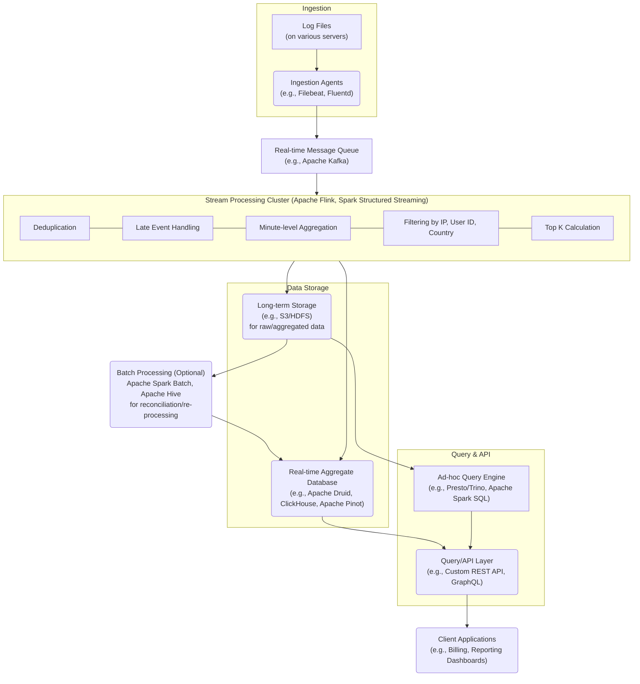

**Functional Requirements:**

  * Aggregate clicks for a specific ad ID in the last `M` minutes (configurable).
  * Return top 100 most clicked ads in the last `M` minutes (configurable).
  * Filter aggregations by `ip`, `user_id`, or `country`.
  * Input data: Log files, new events appended.
  * Data attributes: `click_timestamp`, `user_id`, `ip`, `country`, `ad_id` (implied by queries).

**Non-Functional Requirements:**

  * **Data Volume:** 1 billion clicks/day (approx. 11.5K clicks/sec), 2 million ads total. 30% YoY growth.
  * **Latency:** A few minutes end-to-end. Aggregation every minute.
  * **Correctness:** High importance for billing and reporting.
  * **Resilience:** Handle late events, duplicates, system failures.
  * **Scalability:** Facebook/Google scale.

**Back-of-Envelope Estimation (Refined):**

  * **Clicks per second:** $10^9 \text{ clicks/day}  (24 \text{ hours/day} \times 3600 \text{ seconds/hour}) \approx 11,574 \text{ clicks/second}$.
  * **Data size per event:**
      * `click_timestamp`: 8 bytes (long)
      * `user_id`: 8 bytes (long/UUID)
      * `ip`: 16 bytes (IPv6)
      * `country`: 4 bytes (e.g., "US", "IN")
      * `ad_id`: 8 bytes (long)
      * Total: $\approx 44 \text{ bytes/event}$ (conservative)
  * **Raw data ingress:** $11,574 \text{ events/sec} \times 44 \text{ bytes/event} \approx 509 \text{ KB/sec}$ or $\approx 44 \text{ TB/day}$. This is significant.

###  High-Level Data Flow

The data flow will be a classic stream processing pipeline:

1.  **Log File Ingestion:** Agents on servers tails log files and send new events.
2.  **Event Ingestion & Buffering:** A highly scalable message queue to buffer incoming events.
3.  **Real-time Processing & Aggregation:** Stream processing framework to consume events, deduplicate, handle late arrivals, and perform minute-level aggregations.
4.  **Time-Series Storage:** Store minute-level aggregated data for efficient querying.
5.  **Analytics & Query Layer:** Expose APIs for the required queries.
6.  **Batch Processing (Optional but Recommended):** For correctness reconciliation, historical re-processing, and potentially long-term storage.

# Detailed Component Design & Justifications

Let's break down each component and the rationale behind the choices.

## Log File Ingestion: Distributed Agents

  * **Component:** Lightweight agents like **Filebeat**, **Fluentd**, or **Logstash shippers**.
  * **Functionality:** These agents are installed on each server hosting the log files. They tail the log files, read new lines (click events), and push them to the central message queue.
  * **Justification:**
      * **Decoupling:** Separates log generation from processing, improving resilience.
      * **Reliability:** Most agents support "at-least-once" delivery with local buffering, ensuring events are not lost even if the network or message queue is temporarily unavailable.
      * **Resource Efficiency:** Designed to be lightweight and have minimal impact on the host server's performance.
      * **Scalability:** Easily deployable across thousands of servers.
  * **Trade-offs:** Adds an additional component to manage and monitor. Potential for minor delays due to local buffering.

## Event Ingestion & Buffering: Distributed Message Queue

  * **Component:** **Apache Kafka** is the ideal choice.
  * **Functionality:** Acts as a high-throughput, fault-tolerant, distributed commit log. Log ingestion agents write events to Kafka topics. Stream processing consumers read from these topics.
  * **Justification:**
      * **Durability & Fault Tolerance:** Data is replicated across multiple Kafka brokers, ensuring high availability and preventing data loss. Critical for correctness.
      * **High Throughput:** Kafka can handle millions of messages per second, easily accommodating 1 billion clicks/day with significant headroom for growth.
      * **Scalability:** Horizontally scalable by adding more brokers and partitions.
      * **Decoupling:** Decouples producers (ingestion agents) from consumers (stream processors), allowing them to operate at different paces without impacting each other.
      * **Backpressure Handling:** Acts as a buffer, smoothing out bursts of traffic.
      * **Replayability:** Events can be replayed from Kafka (e.g., for re-processing failed aggregations or backfilling data), crucial for recovery and correctness.
  * **Trade-offs:** Operational complexity of managing a Kafka cluster. Requires significant disk space for retaining data.

## Real-time Processing & Aggregation: Stream Processing Framework

  * **Component:** **Apache Flink** or **Apache Spark Streaming (Structured Streaming)**. Flink is often preferred for its true streaming capabilities, exactly-once semantics, and sophisticated state management.
  * **Functionality:** This is the core of the system. It will consume events from Kafka and perform the following:
      * **Deserialization & Validation:** Parse the raw event data and validate its structure.
      * **Deduplication:** Use a stateful operator (e.g., a RocksDB-backed state in Flink) to store a unique identifier (e.g., a hash of `click_timestamp`, `user_id`, `ad_id`, `ip`) for a defined window (e.g., 5-10 minutes) and discard duplicates.
          * **Justification for Deduplication:** Critical for billing accuracy.
          * **Trade-offs:** Adds latency due to state lookups. Requires managing state size. A simple unique ID per event from the client side is ideal if possible.
      * **Late Event Handling:** Implement a watermarking mechanism. For ad click events, a "tolerable lateness" window (e.g., 5 minutes) can be defined. Events arriving within this window after their watermark can still be processed. Events arriving too late will be dropped or routed to a dead-letter queue for potential batch reprocessing.
          * **Justification for Late Event Handling:** Ensures correctness for events that might experience network delays.
          * **Trade-offs:** Increases window size for aggregations, slightly impacting real-time nature.
      * **Windowed Aggregation:**
          * **Tumbling Windows:** For "every minute" aggregations (top 100, specific ad clicks), use tumbling windows of 1 minute.
          * **Keying:** Events would be keyed by `ad_id` for individual ad click counts.
          * **Filtering:** Before aggregation, apply filters based on `ip`, `user_id`, `country` if specified in the query. This means maintaining state for these filters or dynamically applying them based on the query. For real-time filtering, the raw events or pre-aggregated data needs to contain these attributes.
      * **Top 100 Ads Calculation:**
          * **Approach 1 (Exact):** Within each 1-minute window, maintain a count for each `ad_id`. At the end of the window, sort all ad IDs by count and take the top 100. This requires a large state if there are many active ads in a minute.
          * **Approach 2 (Approximate):** Use **Count-Min Sketch** or **HyperLogLog** for approximate counts of distinct ads, then refine for top K. This is usually for distinct counts, not for top K directly from counts.
          * **Approach 3 (Preferred for Top K):** For exact top K, stream processing frameworks can often leverage internal data structures like **min-heaps** or **treemaps** within the window to keep track of the top N elements efficiently. The framework will group by `ad_id`, sum clicks, and then apply a top-N operator.
          * **Trade-offs:** Exact top K can be resource-intensive if the cardinality of `ad_id` within a window is very high.
  * **Justification (Flink/Spark Streaming):**
      * **Scalability:** Horizontally scalable by adding more worker nodes.
      * **Fault Tolerance:** Checkpointing and state backend (e.g., RocksDB for Flink, HDFS/S3 for Spark) ensure recovery from failures with no data loss.
      * **Exactly-Once Semantics:** Crucial for billing and correctness. Flink is particularly strong here.
      * **State Management:** Essential for deduplication, late event handling, and windowed aggregations.
  * **Trade-offs:** Complex to set up, operate, and tune. Requires deep understanding of distributed stream processing.

#### 3.4. Time-Series Aggregate Storage: Columnar Database

**Purpose:** Low-latency storage for pre-aggregated, real-time ad click metrics. Optimized for analytical queries (e.g., sum, count, top-K) over time ranges.

**Technology Options:** Apache Druid, ClickHouse, Apache Pinot.

**Justification:**
* **Speed:** These are columnar databases, highly optimized for aggregate queries over large datasets, offering sub-second to low-second latency. Perfect for "last M minutes" queries and "Top N" reports.
* **Time-Series Focus:** Excellent at handling time-based data ingestion and queries, including time-based partitioning and rollups.
* **Scalability:** Designed for horizontal scalability to handle massive ingestion rates and query loads.
* **Pre-aggregation:** Efficiently stores the minute-level aggregated click counts from the stream processor, avoiding the need to re-process raw data for common queries.

**Data Model:** Stores granular aggregates (e.g., `(timestamp_minute, ad_id, country_code, total_clicks)`).
* **Example Query Support:** Quickly retrieves total clicks for `ad_id=X` in the last 5 minutes, or top 100 ads by clicks for a given country.
* **High Cardinality Filter Limitation:** **Does NOT store aggregations for individual `user_id` or `ip` (due to extremely high cardinality).** Queries requiring these filters will rely on the Long-Term Storage.

#### 3.5. Query/API Layer

  * **Component:** A custom **REST API** service or a **GraphQL** endpoint.
  * **Functionality:** Exposes the required queries:
      * `GET /ads/{ad_id}/clicks?minutes={M}`: Queries the aggregate DB for `ad_id` over the last `M` minutes.
      * `GET /ads/top100?minutes={M}&filter_country={country}&filter_ip={ip}&filter_user_id={user_id}`: Queries the aggregate DB for top 100 ads, applying filters.
  * **Justification:**
      * **Abstraction:** Provides a clean interface for external systems (e.g., billing, reporting dashboards).
      * **Query Optimization:** Can add caching layers (e.g., Redis for hot results) to reduce load on the aggregate database for frequently accessed data.
      * **Security & Rate Limiting:** Enforce access control and prevent abuse.
  * **Trade-offs:** Requires development and maintenance.

### 4\. Handling Edge Cases

  * **Late Events:** Handled by the stream processing framework (Flink/Spark Streaming) using watermarks and a configurable "tolerable lateness" window. Events arriving too late (beyond the window + tolerable lateness) can be directed to a dead-letter queue or discarded. This is a trade-off between strict correctness and real-time processing. For billing, potentially a daily batch job can reconcile very late events.
  * **Duplicated Events:** Handled by the stream processing framework using a stateful deduplication mechanism (e.g., storing event IDs/hashes in a distributed state store for a certain time window). This is crucial for billing accuracy.
  * **System Recovery:**
      * **Kafka:** Persists messages and allows consumers to restart from their last committed offset, ensuring no data loss during processing failures.
      * **Stream Processing (Flink/Spark):** Uses checkpointing to reliably store the state of the processing job to persistent storage (e.g., HDFS, S3). If a job fails, it can resume from the last successful checkpoint, guaranteeing exactly-once processing (with Flink's transactional sinks) or at-least-once (with Spark Streaming).
      * **Aggregate Database (Druid/ClickHouse/Pinot):** Designed for high availability and fault tolerance with data replication across nodes.
      * **Ingestion Agents:** Local buffering ensures events are not lost before reaching Kafka.

### 5\. Data Flow Details & Scalability Considerations

1.  **Ingestion Agents to Kafka:**
      * Agents are configured to send data to specific Kafka topics.
      * Kafka topics are partitioned (e.g., by `user_id` hash or `ad_id` hash) to enable parallel processing by stream consumers.
      * **Scalability:** Adding more agents on more servers. Adding more Kafka brokers and partitions.
2.  **Kafka to Stream Processor:**
      * Stream processing cluster (Flink/Spark) has multiple workers/tasks consuming from Kafka partitions.
      * Each partition is consumed by one task to maintain order.
      * **Scalability:** Horizontally scale the stream processing cluster by adding more nodes. Ensure the number of Kafka partitions is sufficient to utilize the parallel processing capabilities.
3.  **Stream Processor Internal Processing:**
      * **Keying:** Events are keyed by `ad_id` for aggregation. This ensures all events for a given `ad_id` are processed by the same task, allowing for correct stateful aggregations.
      * **State Management:** State (for deduplication, windowed counts) is distributed across the cluster and managed by the framework's state backend (e.g., RocksDB for Flink, persisted to HDFS/S3 for fault tolerance).
      * **Scalability:** Parallelism is achieved by distributing keyed events across tasks.
4.  **Stream Processor to Aggregate DB:**
      * Aggregated results are written in batches to the real-time aggregate database.
      * Use highly efficient connectors or direct API calls from the stream processor to the database.
      * **Scalability:** The aggregate database is designed for high-volume ingestion and scales horizontally.
5.  **Aggregate DB for Queries:**
      * The columnar nature of Druid/ClickHouse/Pinot allows for very fast time-range queries and aggregations.
      * Indexing on `ad_id` and time dimension is crucial.
      * **Scalability:** Can add more nodes to the aggregate database cluster to handle increased query load or data volume.
      * **Trade-off (for filtering):** As discussed, supporting arbitrary `ip` or `user_id` filtering on aggregates in real-time is challenging due to high cardinality. Pre-aggregating for common countries is feasible. For other filters, it might require a more complex hybrid approach (e.g., query aggregate DB for general trends, then query a separate raw event store for specific detailed filters).

### 6\. Justifications and Trade-offs Summary

| Component               | Key Justification                                                                | Trade-offs                                                                            |
| :---------------------- | :------------------------------------------------------------------------------- | :------------------------------------------------------------------------------------ |
| **Log Agents** | Decoupling, reliability (local buffer), lightweight, scalable.                   | Adds an extra component to manage.                                                    |
| **Kafka** | High throughput, fault-tolerant, durable, scalable, replayability, decoupling.   | Operational complexity, storage requirements.                                         |
| **Stream Processor** | Exactly-once semantics (Flink), stateful processing (dedupe, late events), windowed aggregations, fault tolerance, scalability. | High learning curve, complex to operate and tune, resource intensive for large state. |
| **Aggregate DB** | Real-time analytics, fast time-series queries, columnar storage, scalability.     | Operational complexity, schema design crucial, challenges with high-cardinality filters. |
| **Query/API Layer** | Abstraction, query optimization, security.                                       | Development and maintenance overhead.                                                 |

**Overall Trade-offs:**

  * **Real-time vs. Correctness:** There's a balance. Accepting a few minutes of latency allows for more robust processing (deduplication, late event handling). For absolute, real-time, zero-latency needs, approximations or less robust methods might be used. Given the "few minutes" latency requirement, we can prioritize correctness.
  * **Exact vs. Approximate Queries:** Top 100 ads can be exact. For very high-cardinality distinct counts (e.g., distinct users per ad), approximate algorithms (HyperLogLog) might be used in the stream processor to save space, but the requirement is for *count* of clicks, not distinct users, so exact counts are preferred.
  * **Complexity vs. Performance/Scalability:** Building such a system is inherently complex due to distributed systems, state management, and fault tolerance. However, this complexity is necessary to meet the scale and non-functional requirements.
  * **Storage Costs:** Storing 1 billion events per day, even aggregated, is substantial. Raw event storage for potential re-processing or detailed queries would be even larger, likely requiring cost-effective object storage (S3).
  * **Operational Overhead:** Managing a stack of distributed systems (Kafka, Flink/Spark, Druid/ClickHouse) requires a skilled operations team.

This design provides a robust, scalable, and correct solution for real-time ad click aggregation, addressing all the specified functional and non-functional requirements. The key is leveraging specialized distributed systems for each part of the pipeline to handle the extreme scale and ensure data integrity.