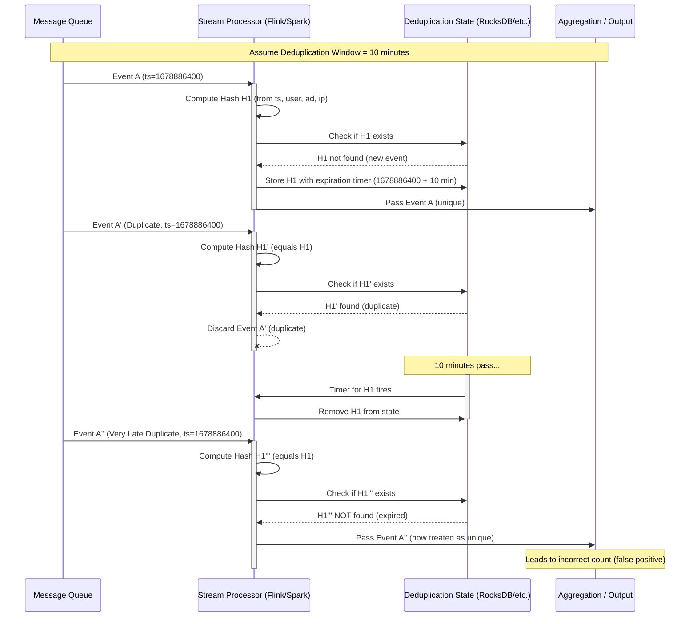
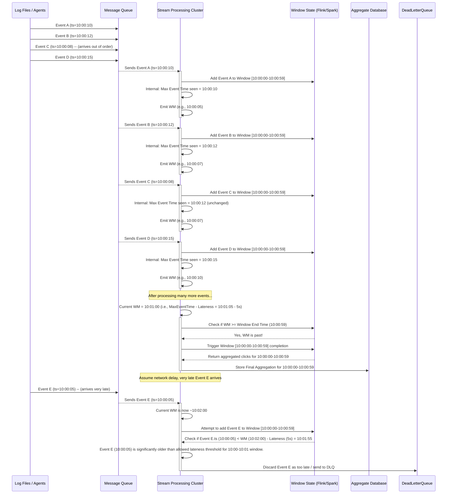
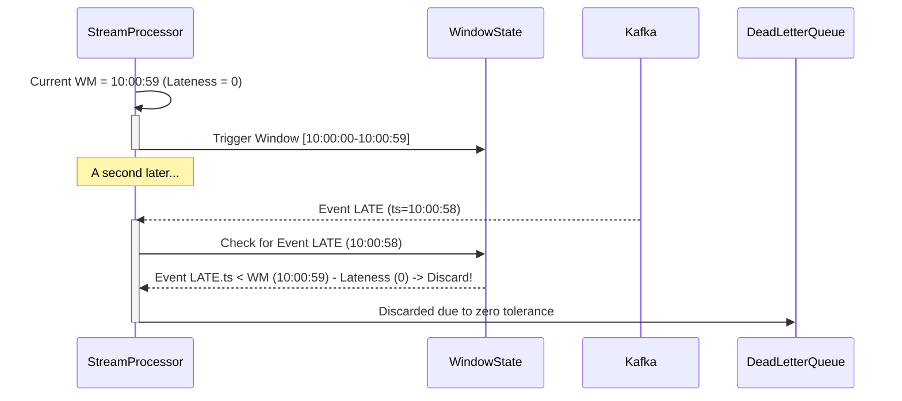
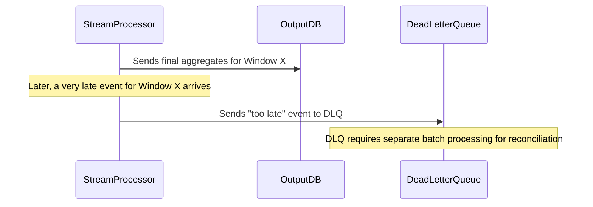
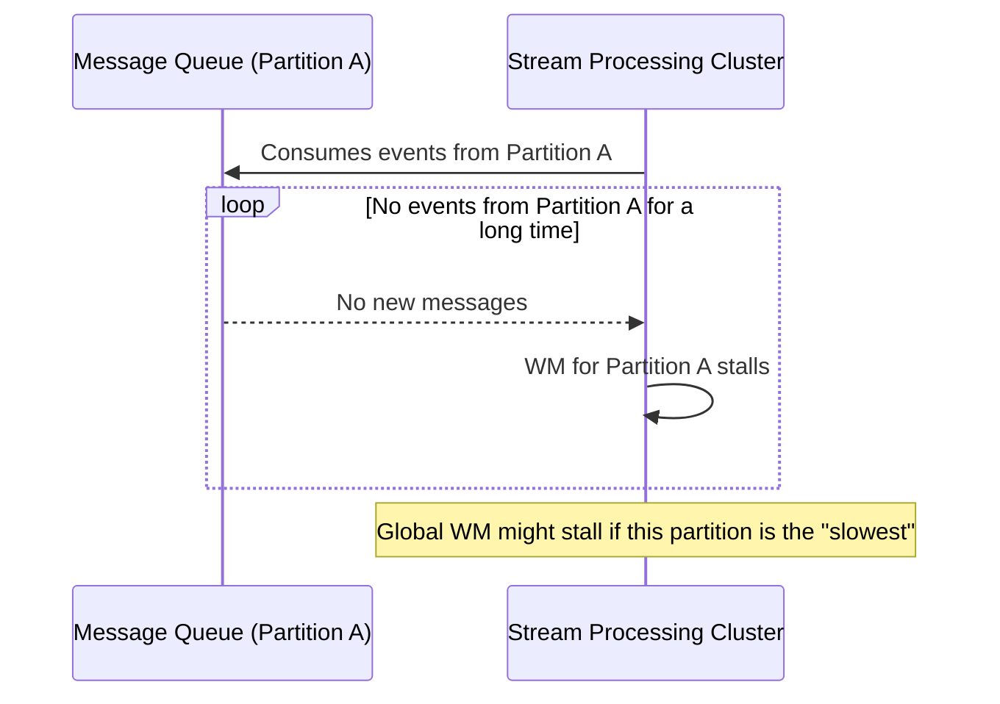
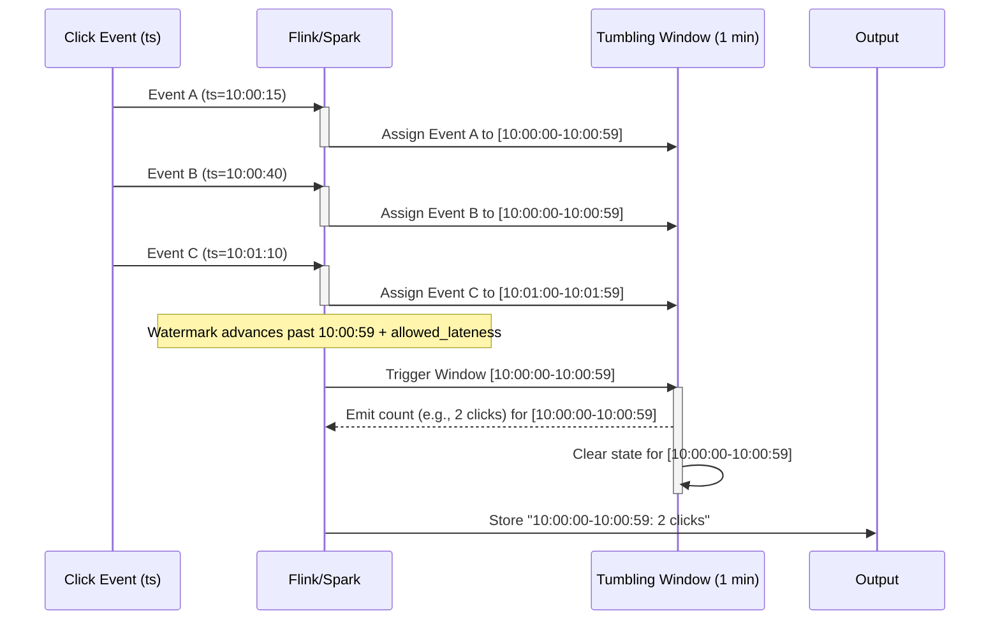
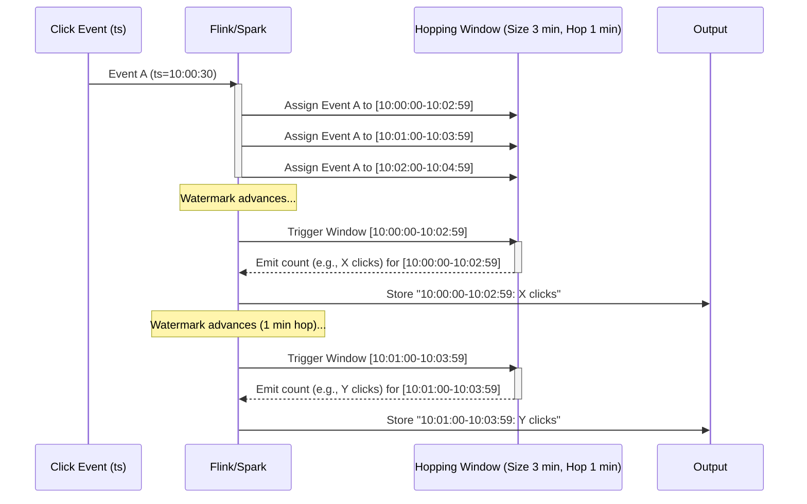
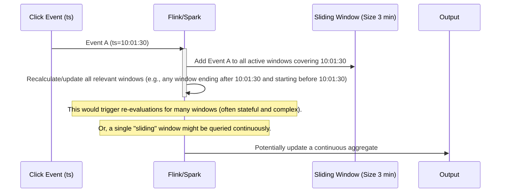
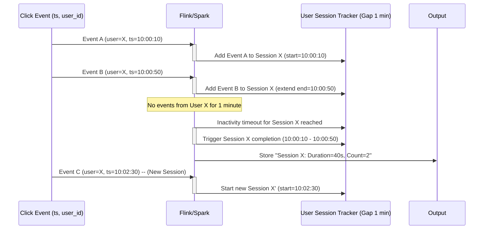

### Deduplication: Hashing Attributes and the 5-10 Minute Window

#### Creating a "Synthetic" Unique ID

Since the log event itself doesn't provide a unique ID, we need to construct one that, with high probability, uniquely identifies a *single click event*. The attributes provided are: `click_timestamp`, `user_id`, `ip`, and `country`.

* **Proposed Unique ID:** A good "synthetic" unique ID would be a hash (e.g., MD5 or SHA256) of the concatenation of **`click_timestamp` + `user_id` + `ad_id` + `ip`**.
    * **Why `click_timestamp`?** To distinguish clicks by the same user/IP on the same ad very close in time.
    * **Why `user_id`, `ad_id`, `ip`?** These are core identifiers of a unique click interaction.
    * **Why not `country`?** `country` is a coarser grain and less likely to contribute to uniqueness than the other attributes. Including it might make the hash less effective if the same combination of `timestamp/user/ad/ip` but different `country` (e.g., due to geo-IP lookup errors) could occur and be considered distinct. It's safer to rely on the most granular identifiers.
    * **Consideration:** It's *possible* for a user to click the same ad, from the same IP, at the exact same millisecond. This is rare but possible, especially with bots or very fast, legitimate clicks. In such edge cases, our synthetic ID might falsely identify two distinct clicks as one. The interviewer did not provide a native unique ID, so this is the best we can do given the constraints. In a real-world system, we'd advocate for the client to generate a UUID for each click event.

#### Deduplication Mechanism in Stream Processor (e.g., Flink)

1.  **Stateful Operator:** The stream processing framework (e.g., Flink's `KeyedProcessFunction` or a similar stateful operator) will handle deduplication.
2.  **State Backend:** This operator needs a *state backend* (e.g., RocksDB, which can spill to disk) to store the unique IDs.
3.  **Processing Logic for Each Incoming Event:**
    * **Generate Hash:** For each incoming click event, compute the hash of `click_timestamp` + `user_id` + `ad_id` + `ip`.
    * **Check State:** Look up this hash in the state.
    * **If Hash Exists:** This event is a duplicate. Discard it.
    * **If Hash Does Not Exist:** This is a new event. Store the hash in the state and allow the event to proceed downstream for aggregation.
    * **Set Timer:** When storing the hash, also set a timer (e.g., 5-10 minutes from the event's `click_timestamp`) to automatically remove this hash from the state when the timer fires.
4. **Determining the Window (5-10 minutes):**
    * This is an **empirically determined value** based on typical network latency, retry policies of upstream systems, and how long duplicates are observed to occur.
    * **Trade-off:**
        * **Too Short:** Might miss legitimate duplicates that arrive very late.
        * **Too Long:** Increases the memory/disk footprint of the state, potentially impacting performance and recovery times.

**Mitigation for Very Late Duplicates (after the window):**
For very high correctness requirements (especially for billing), a periodic **batch job** can be run (e.g., daily) that processes a larger window of raw data from the long-term storage (e.g., S3/HDFS). This batch job can use a more robust deduplication strategy (e.g., sort-unique on the synthetic ID over a 24-hour window) and then reconcile counts with the real-time aggregations. This provides an eventual consistency guarantee for critical metrics.

---

### Watermarking for Late Event Handling

#### Event Time vs. Processing Time

* **Processing Time:** The time a specific event is *processed* by the stream processing system. This is what "X units from current timestamp" refers to. It's unreliable for ordering because network delays or backpressure can cause events to be processed out of order.
* **Event Time:** The time the event *actually occurred* (e.g., `click_timestamp`). This is the preferred notion for accurate aggregations over time windows, as it reflects the true order of events, regardless of when they arrive.

Watermarking is a mechanism used in **event-time processing** to handle out-of-order events and determine when a window can be considered "complete" for aggregation.

#### The Problem: Out-of-Order Events

In distributed systems, events don't always arrive in the order they were generated. A click event from 1:00 PM might arrive *after* a click event from 1:01 PM due to network congestion, server load, or other factors.

#### Watermarks: A "Punctuation Mark" in the Stream

A **watermark** is a special marker that is inserted into the event stream by the stream processing framework (or a custom generator). It signals that **all events with an `event_time` less than or equal to the watermark's value should have arrived by now.**

* **How it Works:**

1.  The stream processor continually observes the `event_time` of incoming events.
2.  Based on these event times and a configured "allowed lateness" (or "lateness tolerance"), it periodically emits a watermark.
3.  A common watermark strategy: `Watermark = Max(EventTime_seen_so_far) - Lateness_Tolerance`.
4.  When a window (e.g., a 1-minute window from 1:00 PM to 1:01 PM) receives a watermark that *exceeds* its end time (e.g., 1:01 PM), the window is considered "closed" and ready for final computation and emission.

**Sequence Diagram: Watermarking in Action**

Let's assume a 1-minute Tumbling Window (e.g., `[10:00:00 - 10:00:59]`) and an `Allowed Lateness = 5 seconds`.

**Edge Cases of the Watermarking Approach (Recap with Sequence Diagram Perspective):**

* **Too Aggressive Lateness Threshold (Too Small):** If the `AllowedLatenessThreshold` is too small (e.g., 0 seconds), `StreamProcessor` might prematurely close windows.

* **Too Conservative Lateness Threshold (Too Large):** `StreamProcessor` holds onto window state for too long, consuming excessive memory and delaying output.
* **Silent Data Loss:** Highlighted by the `DeadLetterQueue` path in the main watermarking diagram. Very late events are dropped from the real-time stream.

* **Event Time Skew/Incorrect Timestamps:** If `click_timestamp`s are unreliable, watermarks become meaningless or jump erratically. No diagram can perfectly show this, but it implies the `EventSource` sending bad data to `Kafka`.
* **Empty/Idle Partitions:** If a `Kafka` partition stops receiving events, the `StreamProcessor` consuming it won't see new `event_time`s, causing the watermark for that partition (and potentially the global watermark) to stall, preventing windows from closing.

---

### Window Functions: Concepts with Sequence Diagrams

These diagrams will illustrate how events are *assigned* to windows and when windows *emit* results.

#### 1\. Tumbling Window (Fixed Window)

  * **Concept:** Divides a data stream into contiguous, non-overlapping, fixed-size time intervals. Each event belongs to exactly one window.
  * **Ad Click Use Case:** Perfect for "clicks in the last 1 minute, updated every minute."

<!-- end list -->

**Explanation:** Each event is assigned to a unique 1-minute bucket. When the watermark signifies that a window is complete, its final count is emitted, and its state is cleared.

#### 2\. Hopping Window

  * **Concept:** Overlapping windows of fixed `size` that "hop" forward by a fixed `interval`. An event can belong to multiple windows.
  * **Ad Click Use Case (Alternative):** If we wanted "sum of clicks in the last 5 minutes, updated *every minute*," this would be the choice (size=5min, hop=1min). Our current requirement is simpler.

<!-- end list -->

**Explanation:** Event A is part of multiple windows because they overlap. Each window (e.g., `[10:00-10:02]`, `[10:01-10:03]`) is completed and emitted as the watermark hops past its end time.

#### 3\. Sliding Window

  * **Concept:** A window of fixed `size` that includes all events within that size relative to the *current processing time* (or *event time* of the latest event processed, though usually not on every event). This often results in a "snapshot" view.
  * **Ad Click Use Case:** Generally *not* suitable. Too much overhead to maintain for 1 billion events/day if a window is re-evaluated for every event. Often, this is approximated with hopping windows or by querying a time-series DB with a `range` filter.

<!-- end list -->

**Explanation:** This diagram is simpler because direct sliding windows are less common for continuous output and more for a "current view." Each event updates *all* relevant active sliding windows it falls into, leading to high state management.

#### 4\. Session Window

  * **Concept:** Groups events based on periods of user activity, with an inactivity `gap timeout`. Window size is variable.
  * **Ad Click Use Case:** **Not applicable** for our requirements. We need fixed-time aggregations for billing, not user session analysis.

<!-- end list -->

**Explanation:** Session windows are event-driven, closing when an inactivity timeout is met.

-----

### Justification for Choosing Tumbling Windows

For our ad click aggregation system, we chose **1-minute Tumbling Windows** for the following strong reasons:

1.  **Direct Mapping to Requirements:** The core requirements explicitly state "return clicks for a particular ad **in the last 1 minute**" and "top 100 ads **in the past 1 minute. Aggregation occurs every minute**." This perfectly matches the non-overlapping, fixed-interval nature of tumbling windows. Each minute's result is distinct and final.

2.  **Billing and Reporting Accuracy:**

      * **No Overlap, No Double Counting:** Because tumbling windows are contiguous and non-overlapping, each click event contributes to *exactly one* 1-minute aggregation result. This is paramount for financial accuracy in ad billing, ensuring every click is counted once and only once for a specific minute.
      * **Simplified Auditing and Reconciliation:** Having clearly defined, fixed-time buckets simplifies auditing, reconciliation, and historical analysis. It's easy to sum up hourly or daily totals by combining 1-minute tumbling window results.

3.  **Predictable Resource Consumption & Performance:**

      * **Efficient State Management:** State for a tumbling window can be fully cleared once its results are emitted. This prevents unbounded state growth in the stream processor, leading to more predictable memory and disk usage.
      * **Consistent Latency:** Results are produced at fixed, predictable intervals (every minute), making it easier to meet the "few minutes end-to-end latency" requirement and manage downstream data ingestion.
      * **Simpler Logic:** Tumbling windows are conceptually simpler to implement and reason about compared to overlapping windows, reducing development and maintenance overhead.

4.  **Meeting "Aggregation Every Minute" Implicitly:** The phrase "Aggregation occurs every minute" is a direct fit for tumbling windows, where a fresh, complete aggregation for the previous minute is finalized and made available precisely at the minute mark.

**In essence, tumbling windows provide the most straightforward, accurate, and resource-efficient way to fulfill the specific, fixed-interval aggregation needs of our ad click system.**

---

## Stream Processing vs. MapReduce for Real-time Ad Click Aggregation

While MapReduce is powerful for batch processing, **stream processing (e.g., Flink/Spark Streaming) is superior for our real-time ad click aggregation system** due to its ability to meet low-latency, continuous update, and precise data handling requirements.

Here's why:

### 1. Latency & Continuous Updates

* **Stream Processing:** Designed for **near real-time (minutes)** latency. Processes events as they arrive, enabling **continuous aggregation and minute-by-minute updates**. This directly meets the "few minutes latency" and "aggregation every minute" requirements.
* **MapReduce (Batch):** Inherently **high-latency**. Achieving minute-level updates would require running a new MapReduce job *every minute*. This is **extremely inefficient** and resource-intensive due to the overhead of starting/stopping jobs and re-reading large datasets repeatedly.

### 2. Deduplication & Late Events

* **Stream Processing:** Built-in features like **watermarking** and **state management** (e.g., RocksDB) handle **event-time processing**. This allows for robust **deduplication** (tracking seen IDs in a window) and gracefully processing **late events** within a defined tolerance. Crucial for billing accuracy.
* **MapReduce (Batch):** Lacks native event-time concepts. Deduplication requires complex batch logic and re-processing. Handling late events often means either **inefficient full re-processing** of historical data or simply **missing them**, which is unacceptable for correctness.

### 3. Query Performance

* **Stream Processing:** Outputs directly into **real-time OLAP databases** (Druid, ClickHouse, Pinot), which are optimized for **fast, aggregate queries** over time-series data. Results are instantly queryable.
* **MapReduce (Batch):** Outputs to batch storage (HDFS/S3). Querying requires an additional layer (Hive, Presto/Trino) which, while powerful, typically has **higher query latency** for the fresh, small-window data our system needs.

### 4. Operational Overhead

* **Stream Processing:** More complex setup initially (state, watermarks) but designed for continuous, resilient operation.
* **MapReduce (Batch):** Running thousands of small, frequent batch jobs daily introduces **significant operational overhead** for scheduling, monitoring, and debugging.

---

**In essence, stream processing is purpose-built for the continuous, low-latency, and high-correctness demands of our ad click aggregation, making it a far better fit than the periodic, batch-oriented nature of MapReduce.**