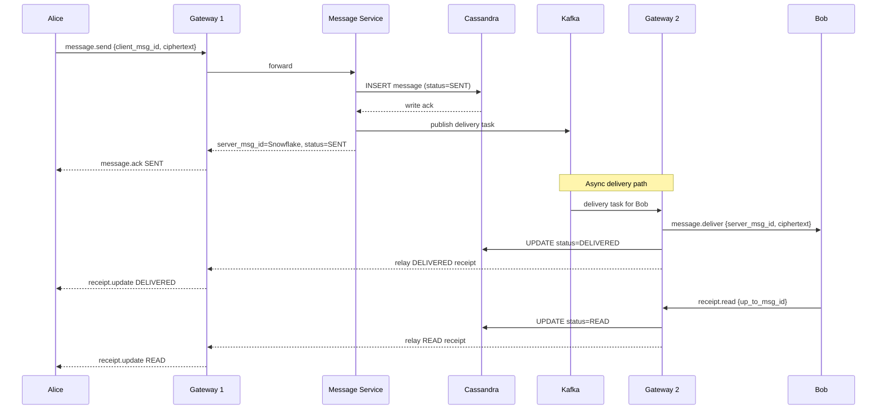
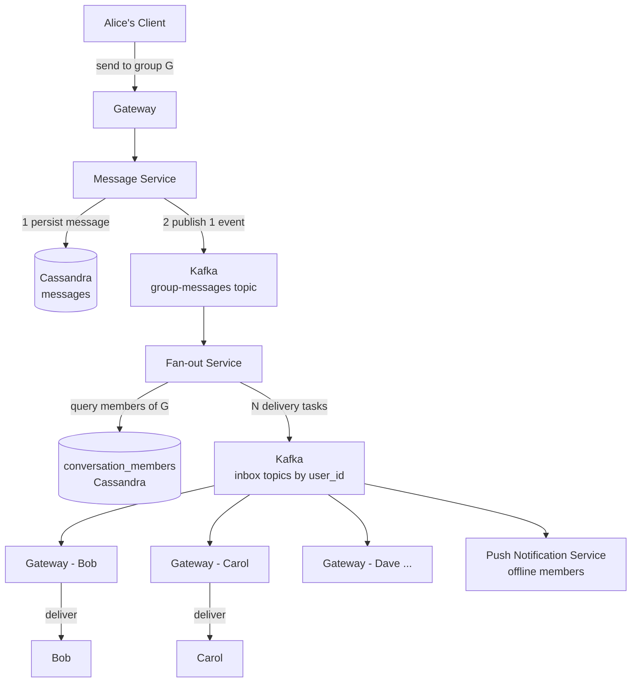
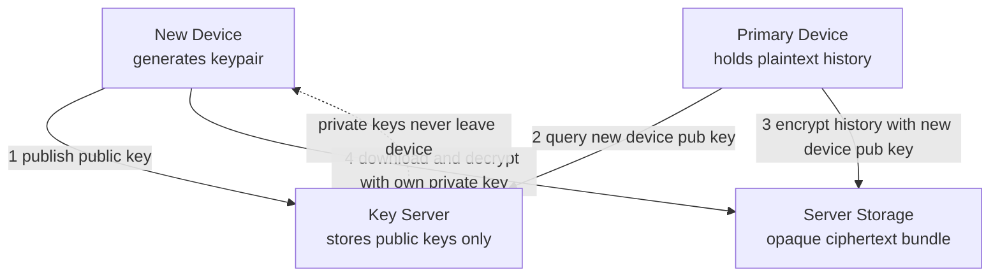
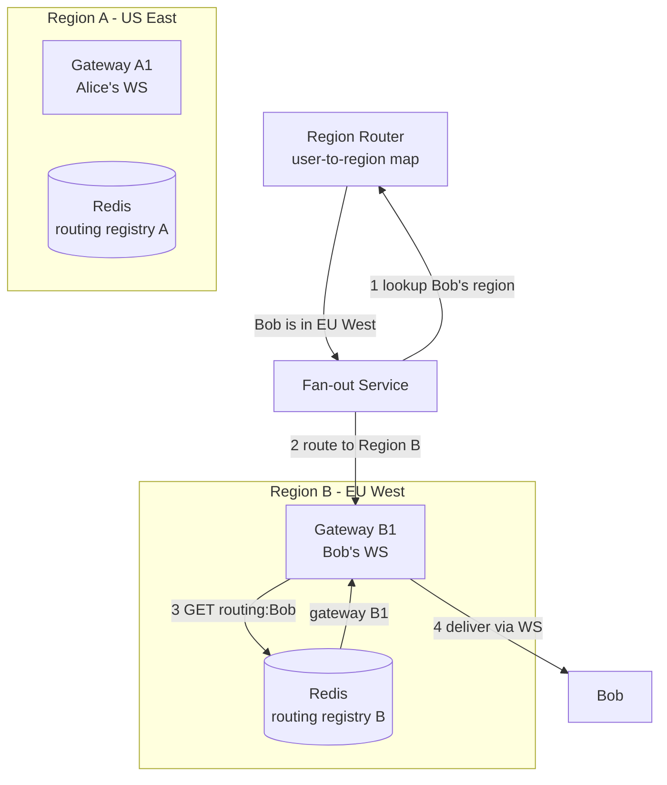
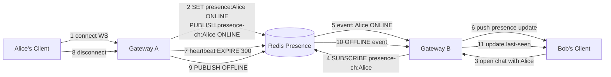
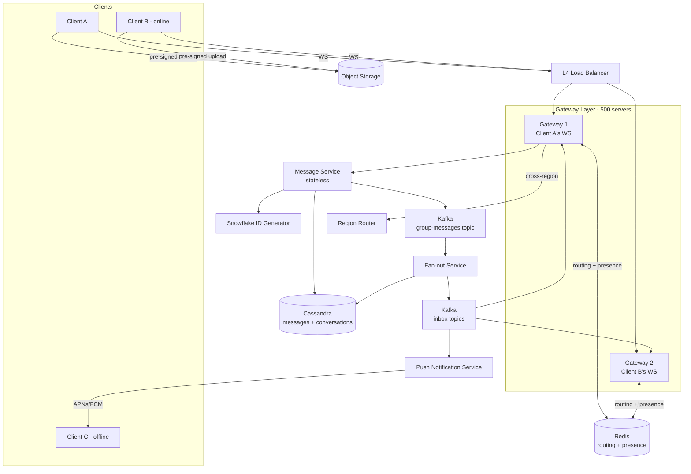

We evolve the v1 architecture by attacking each weakness in turn. Every refinement follows the **Problem → Modification → Justification** structure and carries its own diagram so the evolution is visible.

## Refinement 1 — Message ordering with Snowflake IDs

**Problem.** In v1 there is no guaranteed ordering mechanism. If two senders write to the same group conversation within the same millisecond on two different gateways, the Message Service instances assign IDs concurrently. Cassandra's eventual consistency means two replicas can temporarily disagree on the relative order of the two rows. Clients will display messages in different sequences.

**Modification.** Assign a **Snowflake ID** as the `message_id`. A Snowflake is a 64-bit integer: `[41 bits: epoch ms] [10 bits: generator ID] [12 bits: per-ms sequence]`. The Message Service assigns the Snowflake synchronously before writing to Cassandra. Because the `messages` table is clustered by `message_id ASC`, Cassandra queries of the form `WHERE conversation_id = ? AND message_id > ?` return messages in monotonically increasing time order. Clients display messages in `server_msg_id` order — never client timestamp order — eliminating the clock-skew problem on mobile devices. The complete message-send sequence with receipts:



**Justification & trade-offs.** Snowflakes provide per-generator monotonic IDs with no central coordinator. Two Snowflakes from different generators at the exact same millisecond are sorted by generator ID — an arbitrary but stable tiebreak. In practice, two truly simultaneous messages to the same conversation from different users are rare, and no user can perceive the ordering difference. The generator ID component also makes IDs non-sequential across generators, slightly mitigating enumeration. See {} for the broader distributed-ordering discussion.

## Refinement 2 — Group chat fan-out

**Problem.** When Alice sends a message to a 200-member group, the Message Service must dispatch 199 delivery tasks. If done synchronously in the write path, Alice's send latency includes 199 sequential operations before she gets her SENT receipt. At 50K group messages/s with an average of 50 members, the write path becomes the bottleneck.

**Modification.** **Server-side fan-out via Kafka.** The Message Service writes the message to Cassandra once and publishes exactly one event to a Kafka topic keyed by `conversation_id`. A dedicated **Fan-out Service** (a Kafka consumer group) reads from that topic, queries the group's member list from Cassandra, and writes one delivery task per member into per-user **inbox topics** partitioned by `user_id`. Gateway servers consume from their users' inbox partitions and push via WebSocket. The original sender's write path (Cassandra insert + one Kafka produce) completes in < 50 ms. Fan-out is asynchronous and invisible to the sender's latency.



**Fan-out pseudocode:**

```python
def fanout_group_message(event: GroupMessageEvent):
    members = cassandra.query(
        "SELECT user_id FROM conversation_members "
        "WHERE conversation_id = %s",
        [event.conversation_id]
    )
    tasks = []
    for m in members:
        if m.user_id == event.sender_id:
            continue   # skip sender's own delivery task
        tasks.append(DeliveryTask(
            msg_id=event.msg_id,
            recipient_id=m.user_id,
            # with E2EE each member gets their own per-device ciphertext
            ciphertext=event.ciphertexts[m.user_id],
            conversation_id=event.conversation_id
        ))
    kafka.batch_publish(
        topic_fn=lambda t: f"inbox-{shard(t.recipient_id)}",
        messages=tasks
    )
```

**Justification & trade-offs.** This is **fan-out-on-write** (push model): delivery is fast for recipients because their inbox partition already contains the message. Write amplification: a 1,000-member group produces 999 Kafka writes — at ~100 bytes per task that is ~100 KB per group message, manageable at scale. For groups larger than ~500 members, a **lazy fan-out** (pull model) is preferable: store one copy in the conversation table; each recipient fetches when they open the conversation. WhatsApp uses a hybrid threshold. The critical insight: fan-out is not on the *sender's* critical path. See {}.

## Refinement 3 — Multi-device message history sync

**Problem.** A user adds a second device or replaces their phone. They need their message history, but the server stores only ciphertext — it *cannot* re-encrypt or provide history in plaintext for a new device whose keys it has never seen.

**Modification.** Two complementary mechanisms:

**a) Multi-recipient encryption at send time.** When Alice sends a message, her client encrypts it *separately* for every registered device of every participant — including Alice's own secondary devices. The server stores one ciphertext per device. A new device enrolled *before* a message is sent receives its own ciphertext automatically. This is standard in the Signal protocol via "sealed sender" multi-device support.

**b) Device-to-device history transfer.** For history predating the new device's enrollment, the user authorises the primary device to package the history, encrypt it with the new device's public key, and upload the bundle to the server. The new device downloads and decrypts it using its private key. The server acts as an opaque relay — it never sees the plaintext.



**Justification & trade-offs.** The server remains zero-knowledge throughout: it stores and forwards ciphertext it cannot interpret. History transfer is initiated and authorised by the user's primary device; the server cannot forge it (the bundle is integrity-protected by the sender's key). Trade-off: if a user loses *all* devices without any backup, history is permanently unrecoverable — there is no server-side fallback. WhatsApp addresses this with an optional **encrypted cloud backup** (Google Drive / iCloud) keyed by a user-held PIN or 64-digit key, which is a user-controlled out-of-band key escrow.

## Refinement 4 — Connection routing at scale

**Problem.** With 500 gateway servers, when Gateway 1 receives Alice's message for Bob, it must know which of the 500 gateways currently holds Bob's WebSocket connection. A broadcast ("ask all gateways") is O(N) — prohibitively expensive. A central directory that all 500 gateways query on every delivery becomes a single-point bottleneck.

**Modification.** A **Redis-backed Connection Registry**. When any gateway server accepts a WebSocket connection it writes:

```
SET routing:{user_id}  {gateway_server_id}  EX 120
```

TTL (120 s) is refreshed by the client's 30-second heartbeat, giving three missed-heartbeat tolerance before the entry expires. On each delivery:

1. The fan-out service does `GET routing:{recipient_id}`.
2. If it returns a gateway ID, issue a gRPC call to that gateway: `Deliver(msg_id, ciphertext)`.
3. The target gateway pushes to the recipient via WebSocket.
4. If the registry returns empty (user offline), route to the Push Notification Service.

For **cross-region routing**, a lightweight **Region Router** maintains a coarse `user_id → region` map (updated on login; region changes are rare). Cross-region deliveries traverse the private backbone — never the public internet.



**Justification & trade-offs.** A Redis `GET` is sub-millisecond; the registry lookup adds < 1 ms to delivery latency. TTL-based expiry means no explicit disconnect callback is required — a crashed gateway's entries expire within 2 × TTL = 240 s automatically. gRPC between gateways is low-latency binary RPC with connection pooling. Trade-off: the Redis registry cluster must be highly available; deploy Redis Cluster with sentinel-managed failover and read replicas. A Redis cluster outage degrades routing to push-notification fallback for all deliveries — messages still arrive, just with higher latency. See {} and {}.

## Refinement 5 — Presence at scale

**Problem.** With 100M DAU each going online/offline multiple times per day, presence generates ~10M status-change events per hour. Broadcasting every status change to *all* contacts of a user would be catastrophic: a user with 500 contacts generates 500 pub/sub fan-outs per status change — at 10M changes/hour that is 5B pub/sub events per hour.

**Modification.** **Subscribe-on-demand presence via Redis pub/sub.** The gateway manages the presence key:

- **Going online:** gateway writes `HSET presence:{user_id} status ONLINE last_seen <now>` and publishes to `presence-ch:{user_id}`.
- **Heartbeat (every 30 s):** gateway refreshes `EXPIRE presence:{user_id} 300`.
- **Clean disconnect:** gateway publishes OFFLINE and lets the key expire naturally.
- **Crash / TTL expiry:** key disappears → status implicitly becomes OFFLINE within 5 minutes.

When Client B opens a conversation with Client A, B's gateway **subscribes** to `presence-ch:{A}`. Only clients with an *active open conversation* receive presence events — not all of a user's 500 contacts simultaneously. A gateway debounces rapid status changes (2-second window) before publishing to suppress flapping.



**Justification & trade-offs.** Limiting pub/sub subscriptions to active conversations (rather than all contacts) bounds the fan-out to the open-chat working set — typically 1–5 conversations per mobile client. Redis pub/sub delivers status updates in < 10 ms. The 5-minute TTL makes "last seen" accurate to within ~5 minutes without explicit clock synchronisation. Trade-off: a user who opens many conversations rapidly creates many subscriptions per gateway — cap at ~50 active subscriptions per connection (mobile clients rarely exceed this). See {}.

## Final Architecture



## Drill-Down

### Database schema detail

**TimeWindowCompactionStrategy (TWCS)** on the messages table keeps hot recent data in its own SSTables and lets old data (approaching the 30-day TTL) compact and expire efficiently without touching live rows:

```sql
CREATE TABLE messages (
    conversation_id UUID,
    message_id      BIGINT,
    sender_id       UUID,
    msg_type        TEXT,
    ciphertext      BLOB,
    media_url       TEXT,
    media_checksum  TEXT,
    status          TEXT,
    created_at      TIMESTAMP,
    PRIMARY KEY ((conversation_id), message_id)
) WITH CLUSTERING ORDER BY (message_id ASC)
  AND default_time_to_live = 2592000
  AND compaction = {
        'class': 'TimeWindowCompactionStrategy',
        'compaction_window_unit': 'DAYS',
        'compaction_window_size': 1
      };
```

**Hot partition mitigation:** A very active group conversation writes to a single Cassandra partition key. For groups with extremely high message rates, append a bucket suffix: partition key = `(conversation_id, bucket)` where `bucket = message_id % N` (e.g. N=10). Queries must scatter-gather across all buckets, so use this only for known hot groups.

**Idempotent writes:** The Message Service uses the client-supplied `client_msg_id` (a UUID) as the idempotency key. A short-lived Redis set of recently processed IDs (TTL = 5 minutes) catches duplicate submissions. Duplicate submits return the existing `server_msg_id` without double-writing. See {}.

### Data structures used

| Structure | Where | Why |
|---|---|---|
| **Snowflake ID** | Message ordering | Monotonic, time-encoded, no central coordinator |
| **Wide-column (Cassandra)** | Messages, members, inbox index | Write-optimised LSM; partition-local history scans |
| **Redis HASH + EXPIRE** | Presence, connection registry | Sub-ms lookup; TTL manages staleness automatically |
| **Kafka partitioned topics** | Fan-out bus, inbox queues | Ordered per partition key; replayable; absorbs bursts |
| **Pre-signed URL** | Media upload | Clients upload directly to object storage; gateways never handle binary streams |

### Edge cases & failure handling

- **Recipient offline at delivery time:** Kafka consumer writes the delivery task; Push Notification Service fires APNs/FCM. When the device reconnects, it re-establishes WebSocket, fetches unread messages from its Cassandra inbox via the history API, and the gateway marks them DELIVERED, relaying the receipt to the sender.
- **Gateway crash mid-delivery:** Kafka consumer groups reassign the dead consumer's partitions within the session timeout (~10 s). The delivery task is reprocessed (at-least-once). The recipient deduplicates on `server_msg_id`.
- **Receipt relay failure:** If the original sender's gateway has crashed before the DELIVERED/READ receipt arrives, the receipt is dropped. The sender's app reconciles on next session start by querying message status from Cassandra. Receipts are deliberately best-effort — losing a receipt does not lose the message itself.
- **Media upload partial failure:** Client retries with the same `media_id`. The confirm endpoint is idempotent (`204` on repeat if checksum matches). If the upload URL expires, client requests a new pre-signed URL with the same `media_id` to resume.
- **Group member added during fan-out:** The fan-out service reads the member list after the Kafka event. A member added between the Cassandra message write and the fan-out read may or may not receive the message — this race window is bounded to milliseconds and is acceptable (the new member can scroll history).
