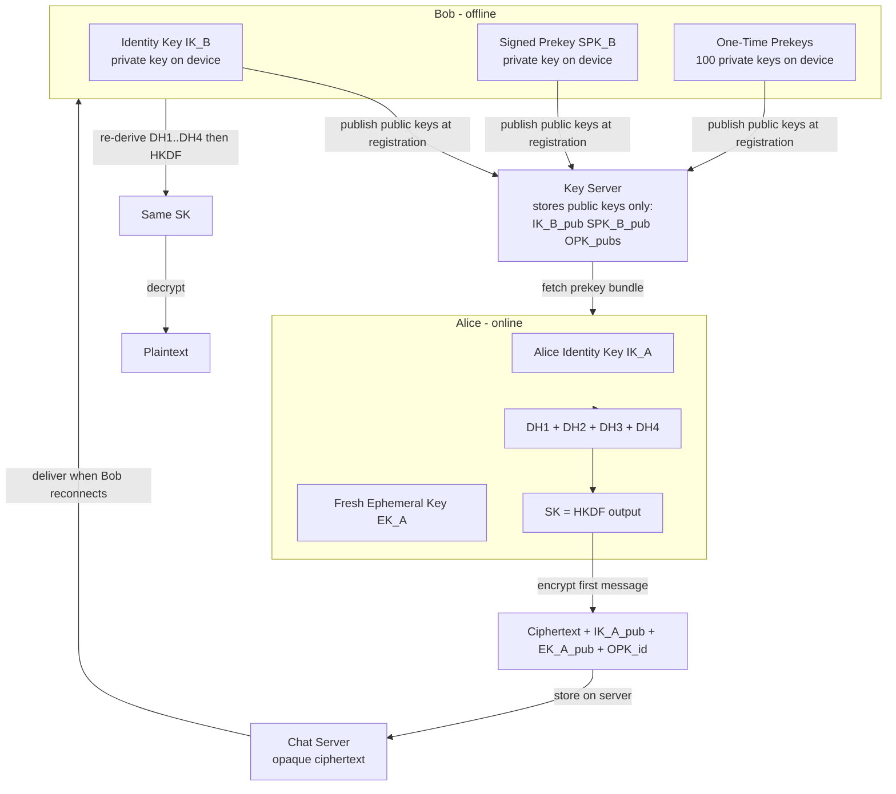
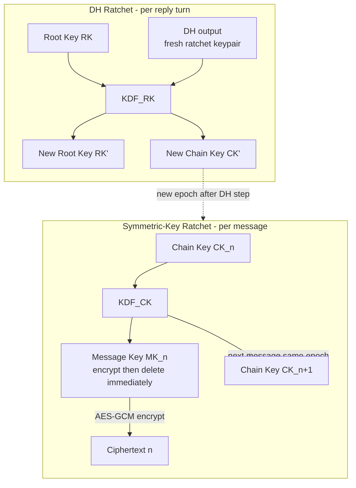
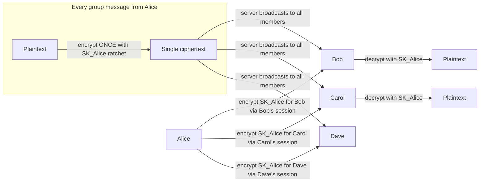

End-to-end encryption (E2EE) is the architectural commitment that *no* entity except the communicating devices can read message content — not the server, not the network operator, not the service provider. The **Signal protocol**, used by WhatsApp, Signal Messenger, and others, achieves this through two building blocks: **X3DH** (the key-agreement handshake that bootstraps a session with an *offline* user) and the **Double Ratchet** (the per-session mechanism that provides forward secrecy and post-compromise security for every subsequent message). Neither has a design-concepts page; this page covers both at interview depth.

## How E2EE Constrains the Architecture

Before explaining the cryptography, state the architectural consequences. E2EE is not a feature bolted on at the end — it changes the shape of the system:

1. **The server stores only ciphertext.** Every `ciphertext` column in Cassandra holds an opaque blob the server cannot interpret.
2. **Keys are device-resident.** Private keys are generated on-device using a secure random source and never transmitted across the network.
3. **Each session is device-pair specific.** Alice's phone and Bob's phone negotiate their own session keys. Alice's phone and Bob's tablet are a *separate* session with separate keys. A message to Bob that Bob reads on both his phone and tablet requires two independently encrypted ciphertexts.
4. **Fan-out multiplies by device count.** A group message to 20 members across 30 devices must be encrypted once per device. The fan-out service must map from recipient *users* to recipient *devices* and store per-device ciphertexts in the delivery queue.

These constraints explain why the data model has a `ciphertext BLOB` column (not a `body TEXT`), why media is stored by URL (the file is client-encrypted before upload), and why multi-device sync cannot be solved by the server re-sending history.

## X3DH — Extended Triple Diffie-Hellman

**The problem X3DH solves.** Standard Diffie-Hellman requires both parties to be online simultaneously to exchange ephemeral public keys and derive a shared secret. In an asynchronous messaging app, Bob might be offline for hours when Alice wants to send her first message. X3DH allows Alice to establish a shared secret using only Bob's *pre-published* public keys, so she can encrypt and deliver the first message before Bob ever comes online.

### Key material Bob publishes to the server

| Key | Type | Description | Lifetime |
|---|---|---|---|
| **Identity key (IK_B)** | Curve25519 long-term | Bob's device identity; fingerprinted for verification | Device lifetime |
| **Signed prekey (SPK_B)** | Curve25519 medium-term | Signed with IK_B; proves authenticity of the prekey | Rotated weekly |
| **One-time prekeys (OPK_B)** | Curve25519 ephemeral | A batch of ~100 keys; each consumed exactly once | Per-session |

Bob publishes a **prekey bundle** to the key server: `{ IK_B_pub, SPK_B_pub, Sig(IK_B_priv, SPK_B_pub), [OPK_B_1_pub … OPK_B_100_pub] }`. The key server stores this bundle and hands out one OPK per requester. **The server never holds any private key.**

### X3DH handshake (Alice initiates)

Alice fetches Bob's prekey bundle, verifies the signature on `SPK_B_pub` using `IK_B_pub` (proving the prekey belongs to the same device as Bob's identity — the server cannot forge this without Bob's private identity key), then performs four Diffie-Hellman operations:

```
EK_A = freshly generated ephemeral key pair by Alice

DH1 = DH(IK_A_priv, SPK_B_pub)    -- Alice identity  × Bob signed prekey
DH2 = DH(EK_A_priv, IK_B_pub)     -- Alice ephemeral × Bob identity
DH3 = DH(EK_A_priv, SPK_B_pub)    -- Alice ephemeral × Bob signed prekey
DH4 = DH(EK_A_priv, OPK_B_pub)    -- Alice ephemeral × Bob one-time prekey

SK = HKDF(DH1 || DH2 || DH3 || DH4)   -- shared secret, 32 bytes
```

Alice encrypts the first message with `SK` and sends to the server:
`{ IK_A_pub, EK_A_pub, OPK_B_id_used, ciphertext }`.

When Bob comes online, he fetches Alice's initial message, re-derives the same four DH values using his own private keys and Alice's public keys from the message header, reconstructs `SK` identically, and decrypts. Bob then **deletes the used OPK private key permanently** — it is never reused.



**Why four DH components?** Each provides a distinct security property:
- **DH1 (IK_A × SPK_B)** and **DH2 (EK_A × IK_B):** mutual authentication — both identity keys participate, so neither side can be impersonated.
- **DH3 (EK_A × SPK_B):** ephemeral contribution from Alice, giving forward secrecy even if SPK_B is later rotated.
- **DH4 (EK_A × OPK_B):** one-time prekey ensures each session produces a unique `SK`, even if Alice initiates two sessions before Bob comes online. Without DH4 (when OPKs run out), the key server falls back to SPK_B only — the session is still authenticated but loses the one-time uniqueness guarantee. Clients are notified to replenish OPKs on reconnection.

## Double Ratchet — Forward Secrecy and Post-Compromise Security

X3DH gives Alice and Bob a shared secret `SK` for the *first* message. The **Double Ratchet** takes over from there, evolving session keys for every subsequent message so that:

- **Forward secrecy (FS):** Compromising the current session state does not reveal past messages — each message key is derived and then immediately deleted.
- **Post-compromise security (PCS, also called "break-in recovery"):** After an adversary captures the session state, the next Diffie-Hellman ratchet step introduces entropy the adversary cannot predict, healing the session from that point forward.

### The two ratchets

**1. Symmetric-key ratchet (chain ratchet) — per message:**

```
(CK_next, MK_n) = KDF_CK(CK_current)

message_n = Encrypt(MK_n, plaintext)
delete MK_n immediately after encrypt/decrypt
```

Each `CK` advance produces a fresh message key `MK_n` for exactly one message and a new chain key for the next. Message keys are single-use and discarded after use. If the current `CK` is captured, an adversary can derive all *future* message keys — but past message keys are already gone.

**2. Diffie-Hellman ratchet — per conversational "turn":**

Each side generates a new ephemeral ratchet key pair and includes the public half in outgoing messages. When the other side receives a new ratchet public key, both derive new root and chain keys:

```
(RK_next, CK_send_next) = KDF_RK(RK_current,
                                  DH(my_ratchet_priv, their_new_ratchet_pub))
```

This step introduces a new DH output as entropy. An adversary who captured the old `RK` and chain state cannot compute `DH(my_ratchet_priv, their_new_ratchet_pub)` without the private key — which is fresh and has never left the device. The session is healed from this point forward.



**Combined effect:** The symmetric ratchet gives a unique message key for every message (FS per message). The DH ratchet fires on each reply turn — Alice sends → Bob replies with his new ratchet public key → both derive a new epoch — giving PCS on every exchange. After a single back-and-forth exchange, a captured key cannot decrypt the subsequent epoch.

**Out-of-order messages:** If message N is lost in transit, messages N+1, N+2 are still independently decryptable (each has its own `MK` derived from the chain). The receiver stores "skipped message keys" for any gaps, bounded by a limit (e.g. 2,000 skips) to prevent unbounded memory usage. Skipped keys are discarded after a timeout.

**Why the server can never read messages:** The server sees:
- Ciphertext (encrypted with `MK`, which is deleted after use).
- The DH ratchet public key included in the message header (public half only; useless without the private key).
- Session metadata: sender device, recipient device, timestamp, message size.

Even with all stored metadata and all of Alice's and Bob's long-term identity keys, a server-side attacker cannot reconstruct past `MK` values — they were derived from ephemeral DH components that were deleted after use.

## Group Encryption — Sender Keys

For 1-on-1 chat, the Double Ratchet is applied per recipient. For a 1,000-member group, performing 999 independent Double Ratchet encryptions per outgoing message would be computationally prohibitive on a mobile device (each requires a Curve25519 DH operation). Signal's solution is the **Sender Key**.

### How sender keys work

When Alice joins a group:

1. Alice generates a **Sender Key (SK_Alice)** — a symmetric key specific to *Alice sending in this group*.
2. Alice distributes `SK_Alice` to each group member by encrypting it using each member's established 1-on-1 Double Ratchet session. This distribution happens *once* at join time, not per message.
3. When Alice sends a group message:
   - Alice encrypts the plaintext **once** with a message key derived from `SK_Alice` (using its own symmetric ratchet).
   - **One ciphertext is broadcast** to all members via the server.
   - Each member decrypts with the copy of `SK_Alice` they received at Alice's join time.



**Advantages:** O(1) encryption per group message regardless of group size. Client CPU cost is the same whether the group has 10 or 1,000 members. Server fan-out delivers one ciphertext per message, with group members decrypting client-side.

**Member removal and key rotation:** When a member is removed, the remaining members generate new sender keys and redistribute them — the removed member has no path to the new keys and cannot decrypt future messages even if they intercept the ciphertext. This is the main cost of membership changes: O(members) key-distribution messages at each membership event.

**New member joins:** The inviting user (or an admin) encrypts all current members' sender keys and sends them to the new member via individual encrypted sessions. The new member can decrypt messages *after* receiving the keys; history before their join is not accessible (no key to decrypt it).

**Forward secrecy in groups:** Each sender key has its own symmetric ratchet, so individual message keys are advanced and deleted after use. However, group sessions lack the DH ratchet of the Double Ratchet — post-compromise security in groups is weaker. If `SK_Alice` is captured, all of Alice's past group messages in this epoch are exposed until Alice rotates by leaving and rejoining the group (or via an explicit key update).

## Key Verification — Preventing MITM by the Server

A sophisticated attack: the server (or a state actor with server access) substitutes its own public keys into Bob's prekey bundle before handing it to Alice. Alice unknowingly establishes a session with the attacker as man-in-the-middle, who re-encrypts messages to the real Bob.

**Countermeasure: Safety numbers / verification codes.** Each client computes a **fingerprint** — a hash of both parties' identity key bytes — and encodes it as a short human-readable string (Signal: 60 digits in 12 groups; WhatsApp: a QR code). Alice and Bob compare fingerprints via an **out-of-band channel** (in person, voice call). If they match, no MITM is present. The app marks the contact as verified.

**Key change notifications:** If Bob's identity key changes (new device, factory reset), the server delivers a system notification to all of Bob's contacts whose apps display: *"Bob's security code changed. Tap to verify."* The server cannot suppress this without clients detecting the absence. Users are expected to re-verify after a key change — especially before sharing sensitive content.

## Security Properties Summary

| Property | Mechanism | Threat mitigated |
|---|---|---|
| **Confidentiality** | AES-256-GCM with per-message key | Passive eavesdropper on the wire or server |
| **Forward secrecy** | Message key deleted after use; chain ratchet | Past messages safe if current state is captured |
| **Post-compromise security** | DH ratchet per reply turn introduces fresh entropy | Future messages safe after a device-capture event heals |
| **Authenticity** | HMAC with message key; SPK signed by identity key | Message forgery; key substitution by server |
| **MITM protection** | Out-of-band fingerprint verification | Malicious key server or state-actor MITM |
| **Group confidentiality** | Sender key per member per epoch; rotation on removal | Non-members and removed members cannot decrypt |
| **Deniability** | Triple-DH produces no unforgeable signature on message content | Neither party can cryptographically prove to a third party what the other said |
