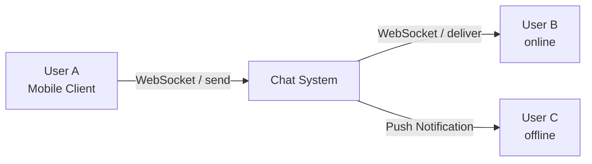
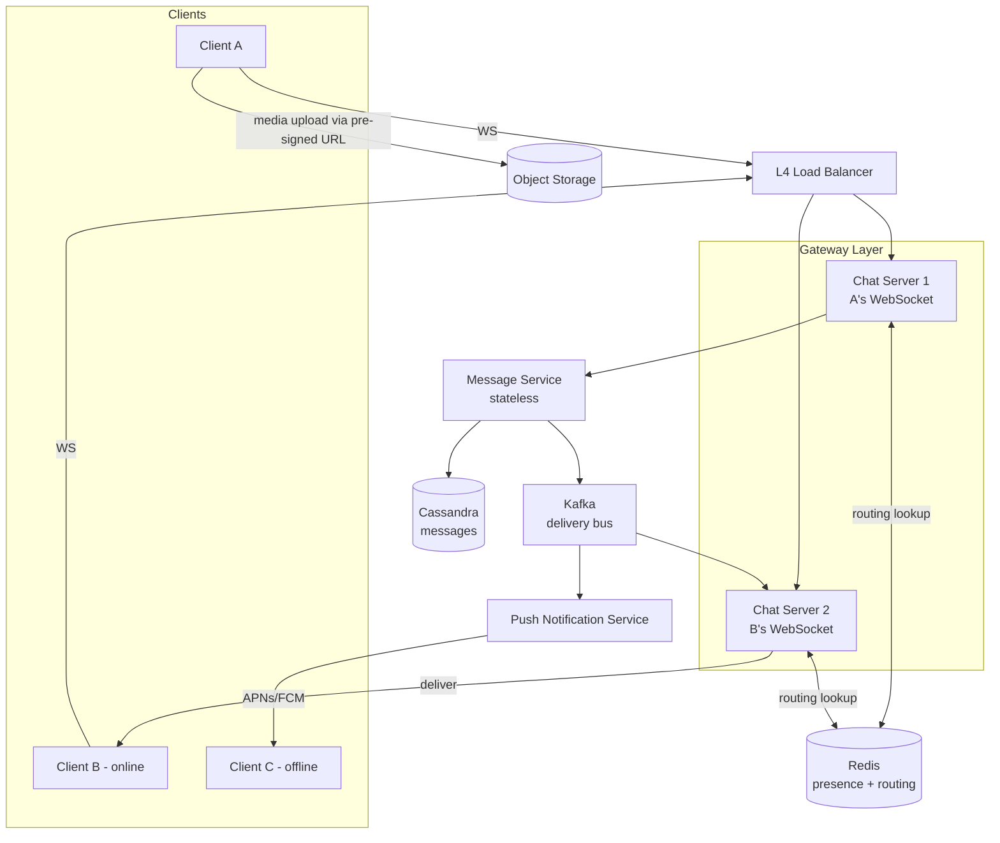

## Capacity Estimation

Derive every number from first principles; show the arithmetic.

### Traffic

| Metric | Calculation | Result |
|---|---|---|
| Messages sent/day | given | 50B |
| Avg write QPS | 50B / 86,400 | ~579,000 /s |
| Peak write QPS (×3 burst) | 579K × 3 | ~1.74M /s |
| Avg delivery fan-out | 70% 1-on-1 (fan-out 2) + 30% group (avg 15 members) | ~5.9 deliveries/msg |
| Delivery writes/s (avg) | 579K × 5.9 | ~3.4M /s |
| History-read QPS | 1 fetch per 10 messages; bursts on app open | ~60K base; 500K burst |
| Concurrent WebSocket connections | 100M DAU × 15% concurrently active | ~15M |
| Gateway servers needed | 15M / 50K connections per server | ~300 (deploy 500 for headroom) |

The system is **write-and-deliver dominated**: for every message sent there are up to 15 delivery writes (group fan-out) plus receipt round-trips. History-read QPS is secondary — but it is the burst workload on app open.

### Storage — Messages

| Metric | Calculation | Result |
|---|---|---|
| Avg message record size (ciphertext + metadata) | 500 B | — |
| Storage per day | 50B × 500 B | 25 TB |
| 30-day retention | 25 TB × 30 | **750 TB** |
| With Cassandra RF=3 | 750 TB × 3 | ~2.25 PB total |

### Storage — Media

| Metric | Calculation | Result |
|---|---|---|
| Media-bearing messages | 15% of 50B | 7.5B/day |
| Avg compressed media size | 200 KB (image/video mix) | — |
| Media ingested/day | 7.5B × 200 KB | **~1.5 PB/day** |

Media is ~60× message text in bytes. Media is uploaded by clients directly to **object storage** via pre-signed URLs; the message record stores only the resulting URL and a SHA-256 checksum. See {}.

### Presence

15M concurrent entries × ~100 B/entry = ~1.5 GB — fits comfortably in a Redis cluster with room to spare.

### Infrastructure Derivation

| Component | Derivation | Count |
|---|---|---|
| Chat/gateway servers | 15M WebSockets / 50K per server | 300–500 |
| Cassandra nodes | 2.25 PB / 10 TB per node (RF=3) | ~75–225 nodes |
| Redis nodes (presence + routing) | ~10 GB data + pub/sub overhead | 5–10 nodes + replicas |
| Kafka brokers | 3.4M writes/s; ~10 MB/s per broker at 1 KB avg | ~50 brokers |
| Object storage | Managed S3-compatible service; CDN-fronted | Managed |

## API Design

The real-time path uses a **persistent WebSocket** (one per device session). REST over HTTP/2 handles stateless operations — media upload, history fetch, group management. Authentication uses short-lived tokens (see {}) sent in the WebSocket upgrade handshake.

### WebSocket events (JSON envelope shown for clarity; production uses binary framing)

```
// Client → Server: send a message
{ "type": "message.send",
  "payload": { "client_msg_id": "<uuid>",
               "conversation_id": "<uuid>",
               "ciphertext": "<base64>",
               "media_url": "<url-or-null>",
               "client_timestamp": "2026-01-15T10:00:00.123Z" } }

// Server → Client: Sent receipt (issued only after Cassandra write completes)
{ "type": "message.ack",
  "payload": { "client_msg_id": "<uuid>",
               "server_msg_id": 1737000000001,
               "status": "SENT" } }

// Server → Recipient: deliver message
{ "type": "message.deliver",
  "payload": { "server_msg_id": 1737000000001,
               "conversation_id": "<uuid>",
               "sender_id": "<uuid>",
               "ciphertext": "<base64>",
               "media_url": "<url-or-null>",
               "server_timestamp": "2026-01-15T10:00:00.250Z" } }

// Recipient Client → Server: read receipt (marks all messages up to this ID as read)
{ "type": "receipt.read",
  "payload": { "conversation_id": "<uuid>",
               "up_to_msg_id": 1737000000001 } }

// Server → Original Sender: delivered / read receipt relay
{ "type": "receipt.update",
  "payload": { "server_msg_id": 1737000000001,
               "status": "DELIVERED" } }
```

### REST endpoints

```
// Request a pre-signed media upload URL (server validates MIME type and size)
POST /api/v1/media/upload-url
  Body: { mime_type, size_bytes, checksum_sha256 }
  201 → { upload_url, media_id, expires_in: 600 }

// Confirm upload complete — server verifies checksum and makes URL permanent
PUT /api/v1/media/{media_id}/confirm
  204

// Fetch conversation history — cursor-based pagination by message_id
GET /api/v1/conversations/{conversation_id}/messages?before={msg_id}&limit=50
  200 → { messages: [...], has_more: bool, next_cursor: "<msg_id>" }

// Fetch group metadata and member list
GET /api/v1/groups/{group_id}
  200 → { id, name, members: [{ user_id, role, joined_at }] }

// Query a user's presence
GET /api/v1/users/{user_id}/presence
  200 → { status: "ONLINE"|"OFFLINE", last_seen: "<iso8601>" }
```

## Data Model

### messages (Cassandra — primary store)

```sql
CREATE TABLE messages (
    conversation_id  UUID,
    message_id       BIGINT,    -- Snowflake: monotonically increasing, encodes server timestamp
    sender_id        UUID,
    msg_type         TEXT,      -- 'text' | 'image' | 'video' | 'audio' | 'doc'
    ciphertext       BLOB,      -- E2EE ciphertext; server never decrypts
    media_url        TEXT,      -- null for text-only messages
    media_checksum   TEXT,
    status           TEXT,      -- 'SENT' | 'DELIVERED' | 'READ'
    created_at       TIMESTAMP,
    PRIMARY KEY ((conversation_id), message_id)
) WITH CLUSTERING ORDER BY (message_id ASC);
```

`conversation_id` as partition key collocates all messages in a conversation on the same Cassandra nodes, enabling efficient range scans for history retrieval. `message_id` (Snowflake) as clustering key provides deterministic time-ordering within a partition. See {}.

### conversations & members (Cassandra)

```sql
CREATE TABLE conversations (
    conversation_id UUID PRIMARY KEY,
    type            TEXT,       -- '1on1' | 'group'
    name            TEXT,
    avatar_url      TEXT,
    created_at      TIMESTAMP
);

CREATE TABLE conversation_members (
    conversation_id  UUID,
    user_id          UUID,
    role             TEXT,      -- 'member' | 'admin'
    joined_at        TIMESTAMP,
    last_read_msg_id BIGINT,
    PRIMARY KEY ((conversation_id), user_id)
);
```

### user_conversations (Cassandra — inbox index)

```sql
CREATE TABLE user_conversations (
    user_id         UUID,
    last_msg_id     BIGINT,
    conversation_id UUID,
    PRIMARY KEY ((user_id), last_msg_id)
) WITH CLUSTERING ORDER BY (last_msg_id DESC);
```

Allows loading a user's inbox sorted by most-recent message. Denormalized write: every message delivery updates this table for the recipient.

### presence (Redis)

```
HSET presence:{user_id}
    status    "ONLINE"
    last_seen 1737000000000      -- epoch ms
    server_id "gw-us-east-14"
EXPIRE presence:{user_id} 300    -- refreshed by 30-s client heartbeat; TTL expiry = offline
```

### users (PostgreSQL — low-write relational data)

```
users: user_id (PK), phone_hash, display_name, avatar_url, settings, created_at
```

Lives in a standard RDBMS with read replicas. Not on the hot messaging path.

## Architecture v1

### Level 0 — Context



### Level 1 — Components



**Component responsibilities:**

- **L4 Load Balancer:** WebSocket connections are long-lived TCP sessions and must not be terminated at the load balancer. L4 (TCP-level) balancing preserves the connection to a chosen gateway server for the session lifetime. L7 HTTP load balancing would terminate TLS and require session-affinity tricks.
- **Chat/Gateway Servers:** Each holds up to 50K open WebSocket connections. On receiving a message, it forwards to the Message Service, receives the SENT ack, looks up in Redis which gateway holds the recipient's WebSocket, and routes directly or falls through to push. See {} and {}.
- **Message Service:** Stateless business logic. Validates the message, assigns a Snowflake ID, writes durably to Cassandra — **the SENT receipt is issued only after this write succeeds** — then publishes a delivery task to Kafka. This ordering is the core durability guarantee.
- **Cassandra:** Write-optimised wide-column store; LSM-tree engine; linear horizontal scale. Chosen because the access pattern is writes plus point/range lookups by `conversation_id` — no joins, no secondary indexes on the hot path. See {}.
- **Kafka:** Internal fan-out and delivery bus. Decouples the write path from the delivery path, absorbs bursts, and enables replay. Producers: Message Service. Consumers: gateway servers (online delivery) and Push Notification Service (offline delivery). See {}.
- **Redis:** Stores the connection registry (`user_id → gateway_id`) enabling O(1) routing, and presence state (`user_id → {ONLINE, last_seen}`). See {}.
- **Push Notification Service:** When a recipient's routing lookup returns empty (offline), fires APNs (iOS) or FCM (Android) to wake the app. See {}.
- **Object Storage:** Media stored in an S3-compatible store; messages carry only URLs. Clients upload directly via pre-signed URLs, keeping large binary streams off the gateway servers. See {}.

The v1 design is correct but has four clear weaknesses: message ordering under concurrent writes to the same conversation is undefined; group fan-out blocks the write path; cross-server connection routing has no explicit protocol; and presence does not scale to 2B users with large contact lists. The [delivery deep dive](delivery-deep-dive) addresses each iteratively.
