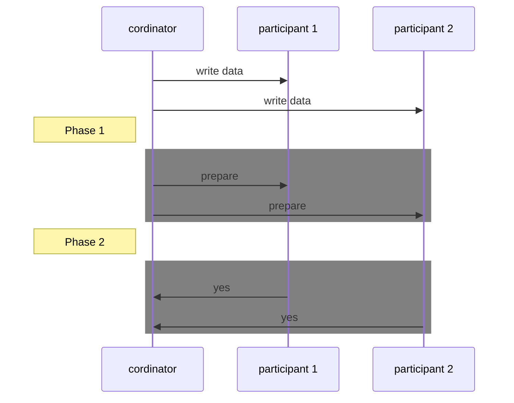

#### Atomic Commit

Transaction outcome is either a successful commit (all writes made durable) or an abort (all writes rolled back). At a single database node, atomicity is commonly implemented by the storage engine.

#### Distributed Atomic Commit
In scenarios like multi-object transactions in a partitioned database with term-partitioned secondary indexes (in which the index entry may be on a different node from the primary data).

Sending a commit request to all nodes and independently committing the transaction on each node is insufficient. Commit success on some nodes and failure on others could violate the atomicity guarantee.

Distributed datastores, especially many "NoSQL" systems, often lack support for such transactions. Some clustered relational systems, however, do support distributed transactions.

#### Irrevocable Commits

Once a transaction is committed on one node, it cannot be revocked even if it's later discovered to be aborted on another node. This rule exists because committed data becomes visible to other transactions, and other clients may start relying on that data.

Although the effects of a committed transaction can be undone by a compensating transaction later on, the database treats this as a separate transaction. Any cross-transaction correctness requirements are considered the responsibility of the application, not the database.

#### Two Phase Commit

2PC (Two Phase Commit) splits the commit/abort process into two phases (hence the name). It introduces a new component known as a coordinator (or transaction manager). The multiple database nodes involved in distributed transaction are referred to as Pariticipants.

**Phase 1 - Prepare:** Coordinator sends a prepare request to each participant, inquiring if they are prepared to commit. Coordinator monitors responses from participants.

**Phase 2 - Commit or Abort:**
- If all participants respond with "yes," indicating readiness to commit, the coordinator proceeds with a commit request, and the actual commit occurs.
- If any participant responds with "no," indicating an inability to commit, the coordinator issues an abort request to all nodes.

 If this request (to commit or to abort) fails or times out (if any participant crashes), the coordinator must retry forever until it succeeds.

**Cordinator Failure**

If the coordinator fails before sending prepare requests, a participant can safely abort the transaction.

However, once a participant has received a prepare request and voted "yes," it loses the ability to unilaterally abort. The participant must wait for communication from the coordinator regarding the final decision—whether the transaction was committed or aborted. In the event of coordinator failure or network issues at this stage, the participant is left in a state of uncertainty, termed "in doubt" or "uncertain."

Participants in this state can do nothing but wait for resolution.