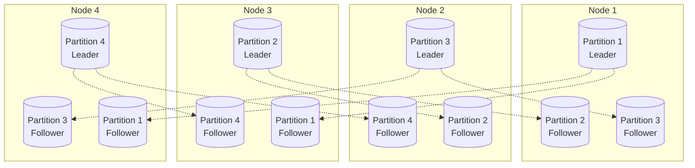
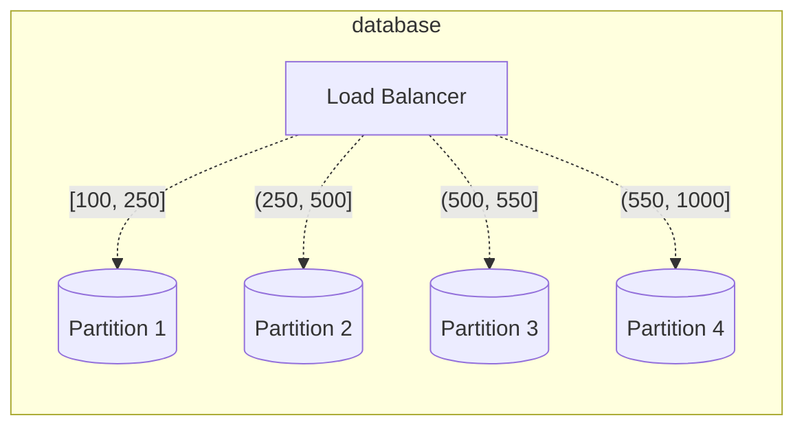

In the realm of replication, where data is duplicated across various nodes, the concept of having multiple copies is effective. However, for extensive datasets or high query throughput, this approach may fall short. To address these challenges, data is often divided into partitions, a strategy known as **sharding**.

The primary motivation behind partitioning data is scalability.

**Partitioning Principle**: Partitions are defined to ensure that each piece of data (record, row, or document) belongs exclusively to one partition.

**Partition as a Mini-Database**: Each partition functions as a small database in its own right, although the database may support operations spanning multiple partitions simultaneously.

### Partitioning and Replication:

Partitioning is often coupled with replication, where copies of each partition are distributed across multiple nodes. While each record exclusively belongs to one partition, it is stored on several replicas for fault tolerance. This combination ensures both efficient data distribution and resilience in the face of node failures.

### Data Distribution with Partitioning:

The objective of partitioning is to distribute both data and query load evenly across nodes. In an ideal scenario, if each node handles a fair share, a system with 10 nodes could theoretically manage 10 times the data and throughput of a single node (excluding replication considerations).

However, if the partitioning is uneven, resulting in some partitions having more data or queries than others, it is termed as **skewed** partitioning. Skewiness significantly reduces the effectiveness of partitioning. In extreme cases, a single partition experiencing disproportionately high load is referred to as a **hot spot**.

A straightforward method to prevent hot spots is random record assignment to nodes. It introduces a challenge, when searching for a specific item, you must query all nodes in parallel, as the location of the item is unknown.

### Range-Based Partitioning:

A common method of partitioning involves assigning a continuous range of keys, spanning from a minimum to a maximum, to each partition. By knowing the boundaries between these ranges, determining which partition contains a specific key becomes straightforward. 

It's important to note that the key ranges may not be evenly spaced, as the data distribution might not be uniform. To achieve even data distribution, the partition boundaries must dynamically adapt to the actual data distribution.

#### Optimizing Range-Based Partitioning:

In each partition, maintaining keys in sorted order facilitates efficient range scans. However, a drawback of key range partitioning is the potential for hot spots due to specific access patterns.

Consider an application recording sensor data with timestamps as keys (year-month-day-hour-minute-second). While range scans are beneficial for fetching data from a specific timeframe, this approach may lead to hot spots. For instance, if the key is a timestamp, all writes concentrate in a single partition (e.g., for today), overloading it with writes while other partitions remain underutilized.

To mitigate this issue, an alternative approach is to use a different element as the first part of the key. For instance, prefixing each timestamp with the sensor name ensures partitioning first by sensor and then by time. This prevents overloading specific partitions, promoting more balanced data distribution.

### Hash-Based Partitioning:

To address skew and hot spot risks, many distributed datastores employ a hash function to determine the partition for a given key. A well-designed hash function uniformly distributes skewed data.

By using the hash of the key for partitioning, each partition is assigned a range of hashes. Hash value of keys falling within a partition’s hash range are stored in that partition, promoting fair key distribution.

However, this approach sacrifices the efficiency of range queries inherent in key-range partitioning. The original sort order of adjacent keys is lost, as the hash scatters them across partitions.

### Optimizing Hash-Based Partitioning:

Hashing keys provides relief from hot spots, although it cannot eliminate them entirely. In extreme cases, where all activity centers around a single key, all requests are directed to the same partition. While such workloads are uncommon, scenarios like a celebrity's actions on a social media site can create intense activity.

Currently, most data systems lack automatic mechanisms to counter highly skewed workloads. It falls upon the application to manage skew reduction. For instance, if a specific key is exceptionally active, a straightforward approach is to append a random number to the key. Even a two-digit decimal random number diversifies writes across 100 keys, distributing them to different partitions.

However, this introduces complexities. Splitting writes across keys introduces additional efforts for reads, and this also requires monitoring and keeping track of keys which undergo splitting.

