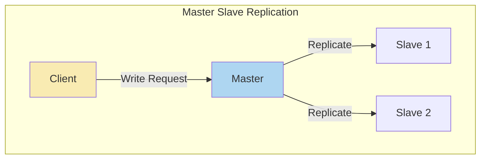

In this setup, there is one primary database (master) that handles write operations. The changes made on the master are then replicated to one or more secondary databases (slaves) for read operations. Slaves are read-only copies.

Each node that stores a copy of the database is called a **replica**. Whenever the leader writes new data to its local storage, it also sends the data change to all of its followers as part of a **replication log** or **change stream**.

### Setting up new followers

From time to time, you need to set up new followers—perhaps to increase the number of replicas, or to replace failed nodes. However, a straightforward copy-paste of data files from one node to another isn't usually enough. Clients are frequently writing to the database, and the data is always changing. Simply moving files around might result in inconsistencies.

Ensuring consistency by locking the database (making it temporarily unavailable for writes) is an option, but it contradicts our aim of maintaining high availability.

1. Capture a consistent snapshot of the leader's database, ideally without locking the entire database—commonly available in databases for backup purposes.

2. Transfer the captured snapshot to the new follower node.

3. The follower connects to the leader, requesting all data changes since the snapshot, referencing a specific position in the leader's replication log (e.g., log sequence number in PostgreSQL or binlog coordinates in MySQL).

4. Once the follower processes the backlog of changes since the snapshot, it is considered caught up and can seamlessly continue processing real-time data changes from the leader.

### Follower Failure

The follower, aware of the last processed transaction before the fault, reconnects to the leader and requests all data changes that took place during its disconnection period.

### Leader Failure

In the event of a leader failure, a follower must be promoted to the new leader. 

Selecting a new leader often involves an election process. The ideal candidate is typically the replica with the most recent data changes from the old leader to minimize potential data loss. Achieving consensus among all nodes on the choice of a new leader constitutes a consensus problem.

- Clients must be reconfigured to direct writes to the new leader and 
- Other followers should start consuming data changes from the new leader.

This process is known as **failover**.

#### Challenges in Failover

**Data Loss**: In asynchronous replication, the new leader might lack all writes from the old leader before its failure. Upon the old leader rejoining after a new leader is chosen, handling conflicting writes becomes a challenge. A common solution is discarding unreplicated writes from the old leader, potentially conflicting with clients' durability expectations.

**Split Brain**: In fault scenarios, specifically in a split brain situation where two nodes believe they are the leader, there's a risk of data loss or corruption if both leaders accept writes without conflict resolution Some systems shuts down one node upon detecting two leaders. However, poorly designed mechanisms may result in both nodes being shut down.