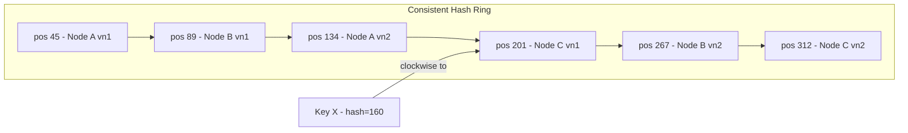
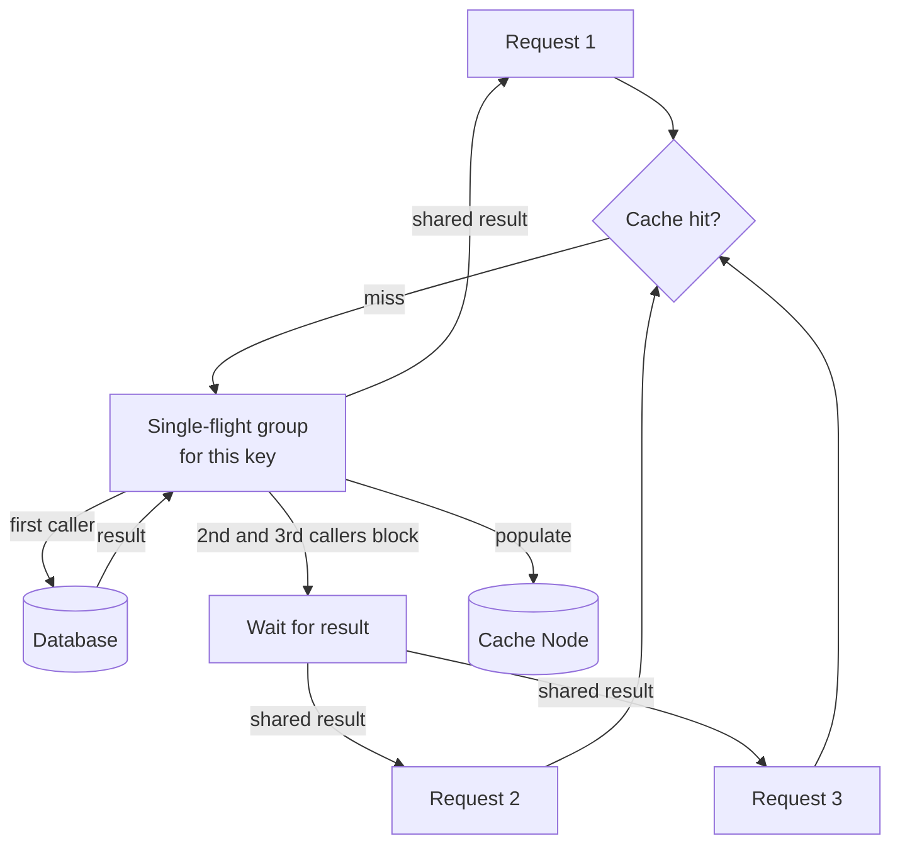
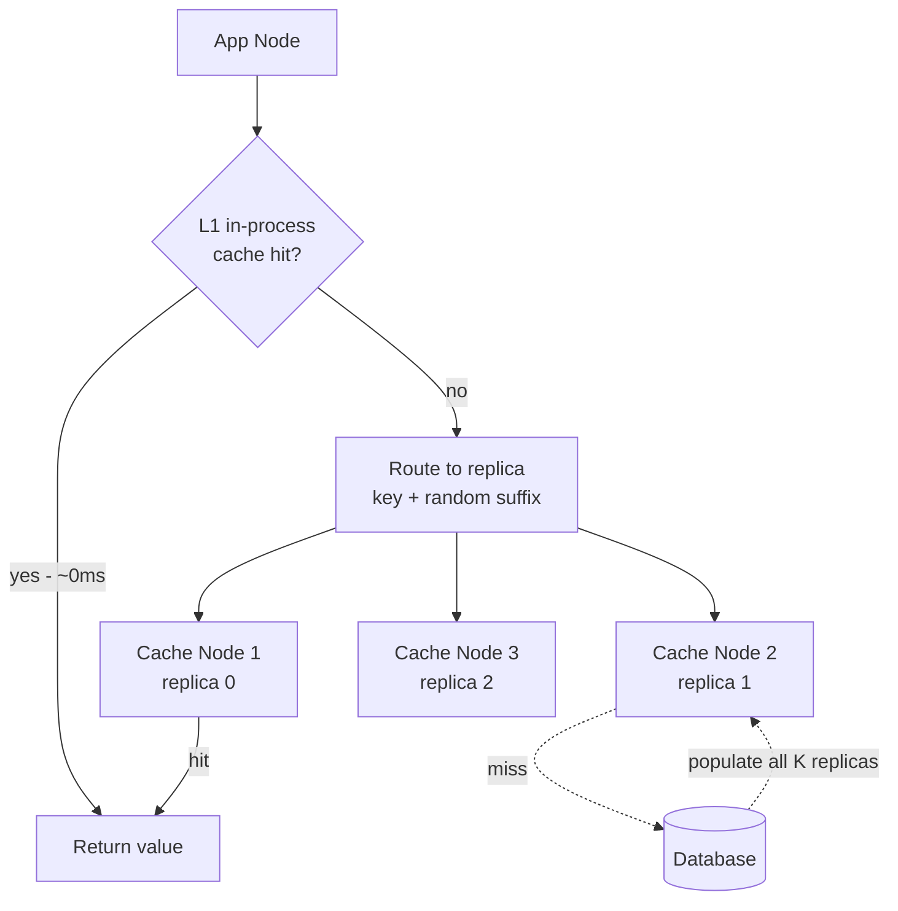
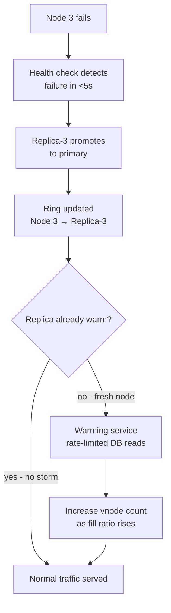
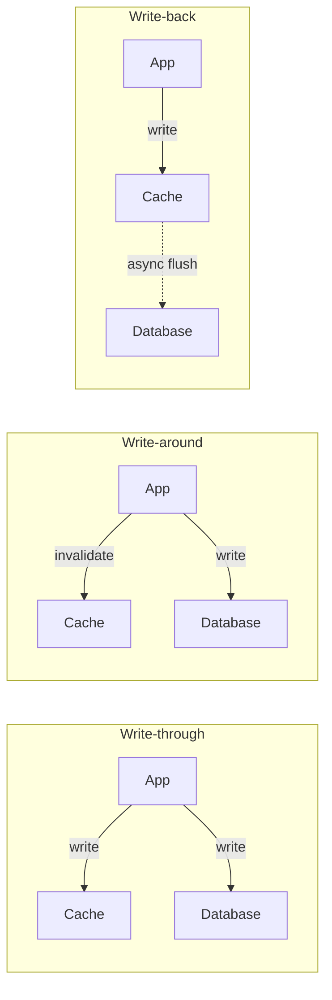
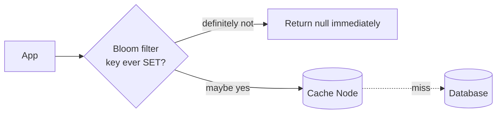
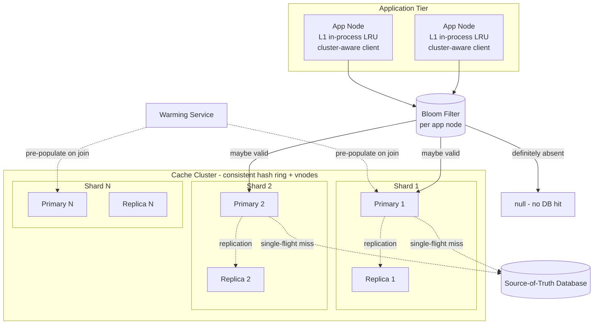

We evolve the v1 design by attacking each weakness in turn: **Problem → Modification → Justification**. Every step carries its own diagram so the architecture's evolution is visible.

## Refinement 1 — Modulo Hashing to Consistent Hashing

**Problem.** In v1, each key is routed to node `hash(key) % N`. When the cluster gains or loses a node, N changes, and nearly every key remaps to a different node: `(N-1)/N ≈ 87.5%` of keys shift on a 1-in-8 node change. The database absorbs a full cluster-wide miss storm while the new topology warms up — a serious availability event at 1M QPS.

**Modification.** Replace modulo sharding with a **consistent hash ring** and **virtual nodes (vnodes)**. See {} for full derivation; the key mechanics:

1. Map each physical node to *V* positions on a hash ring of 2³² values by hashing `"node-id:replica-N"` for `N = 1..V` (V = 150–200 vnodes per node is typical).
2. Route a key to the first vnode clockwise from `hash(key)` on the ring.
3. On node add/remove, only `1/N` of keys move on average; the ring finds their new owner automatically.



**Virtual nodes solve load imbalance.** With plain consistent hashing (one position per node), random placement leaves some arcs much larger than others, causing imbalanced load. With V = 150 vnodes, the coefficient of variation of load across nodes drops below 5% empirically — close to perfectly uniform.

**Justification & trade-offs.**
- **Only `~1/N` keys rehash** on a topology change (vs. `(N-1)/N` with modulo). Adding a 11th node to a 10-node cluster remaps ~10% of keys — a manageable warm-up event rather than a total miss storm.
- **Vnodes allow heterogeneous capacity:** a node with twice the RAM gets twice as many vnodes, naturally owning twice the key share.
- **Trade-off:** the client must maintain a sorted ring data structure in memory and perform a binary search (`O(log V·N)`) per request. At V=150, N=10, that's a ~2–3 µs lookup — negligible vs. the network RTT.
- **Trade-off:** during warm-up after a failure, the newly-responsible node for rehashed keys starts cold. Mitigated in Refinement 4.

## Refinement 2 — Cache Stampede Prevention

**Problem.** A popular key (e.g., a trending product or celebrity post) expires from the cache. Thousands of concurrent requests check the cache simultaneously, all miss, and all fall through to the same database shard in parallel. The database is hit with a spike proportional to the request concurrency for that key — a **thundering herd**. If the DB can't absorb the spike, it latency-spikes or goes down, making the problem self-reinforcing.

**Modification.** Three complementary techniques, applied in layers:

1. **Request coalescing (single-flight).** When multiple goroutines/threads simultaneously miss on the same key, only the *first* goes to the database. The rest block on the first's result and share it. This is the `singleflight` pattern.
2. **Probabilistic early expiration (XFetch).** Instead of letting keys expire at their TTL boundary, recompute the value slightly *before* expiry with a probability that increases as TTL approaches zero. One background worker refreshes the value; all readers still see a valid cached value. No thundering herd because the key never fully expires from concurrent readers' perspective.
3. **Mutex-based locking.** As a fallback when the above two are insufficient (e.g., at cold start), a distributed lock (`SET lock:<key> 1 EX 2 NX`) prevents concurrent DB reads. Only the lock holder fetches; others either wait briefly or return a stale value.



**Justification & trade-offs.**
- Single-flight bounds database QPS for a given key to 1 req per miss window, regardless of application concurrency. At 1M QPS with 100 app servers and a 100ms DB round-trip, up to 100 goroutines could pile on without single-flight — coalescing reduces this to 1.
- Probabilistic early expiration eliminates the thundering herd entirely for hot keys, at the cost of slightly higher average cache memory usage (keys stay warm slightly longer). See the XFetch formula: `expire_early = expire_at - δ · β · ln(U)` where U is uniform random [0,1] and β is a tunable aggressiveness parameter.
- **Trade-off:** both techniques add code complexity to the client library. They are most important for the top-N hot keys; a simple TTL jitter (randomise TTL by ±10%) is a cheap alternative that spreads expiry events but does not eliminate them.

This directly addresses the {} pattern and the {} concern of protecting the database from load spikes.

## Refinement 3 — Hot Key Replication

**Problem.** Single-flight prevents stampedes on expiry, but it does not help with a key that is simply *too popular to be served by one node*. If a celebrity post generates 500K reads/s and all route to the same cache node, that node is overloaded regardless of whether the key is cached — it simply cannot serve 500K ops/s alone (Redis single-threaded ceiling is ~100–200K ops/s).

**Modification.** **Hot-key replication:** for keys identified as hot (either via offline analysis or an adaptive online heuristic), store the value on *K* nodes instead of one. The client appends a random replica suffix to the key before routing:

```
hot_key_replica = key + ":" + random_int(K)
node = ring.lookup(hot_key_replica)
```

On a miss for any replica, the client fetches from the canonical slot. This spreads reads across K nodes. K = 10 turns a 500K QPS hotspot into a 50K QPS load per node.

A second technique is **client-side caching**: the application process caches the top-N hot keys locally in an LRU map (with a short TTL, e.g. 1–5 seconds). These in-process cache hits never leave the application server, consuming zero network and zero cache-node capacity.



**Justification & trade-offs.**
- K-way replication multiplies per-key capacity by K. Combined with client-side caching, even a 1M QPS single key becomes manageable: 100 app nodes × 1M/100 = 10K QPS, most absorbed by L1 in-process cache; the remainder spread across K replicas.
- **Trade-off:** consistency window on writes. When a hot key is updated or invalidated, the write must reach all K replicas and all app processes with in-process caches. Use a fan-out write or accept a short window (bounded by the L1 TTL) where different clients see different values.
- **Trade-off:** identifying hot keys dynamically. A count-min sketch (see {}) can approximate per-key frequency to detect hot keys without per-key counters. Alternatively, the cache node can self-report its top-N accessed keys via a periodic metrics push.

## Refinement 4 — Node Failure and Cache Warming

**Problem.** When a cache node fails, the consistent hash ring redirects its key range to the next node clockwise. That node is cold for the rehashed keys — it's a cache miss storm localised to one node's worth of keys (~10% of the working set on a 10-node cluster). At 1M QPS, 10% rehashed = 100K QPS suddenly hitting the database, which may itself cascade.

**Modification.** Three mitigation layers:

1. **Replication.** Each primary node has a replica (as sized in the capacity estimate). On primary failure, the replica promotes and is already warm — no miss storm. The ring points to the replica instead of a cold node.
2. **Rate-limited cache warming.** If a node is provisioned from scratch (scale-out or replacement), use a **warming service** that reads keys from the database (using a read-through or pre-population script) at a controlled rate before the node enters the ring. The load balancer only starts routing traffic to the new node once its fill ratio reaches a threshold (e.g. 80%).
3. **Staggered ring entry (traffic shadowing).** Add the new node to the ring at a small virtual-node count (e.g. 10 vnodes instead of 150). Gradually increase its vnode count as its memory fills, so traffic is shifted incrementally rather than all at once.



**Justification & trade-offs.** Replica promotion gives sub-10-second recovery with zero miss storm for a pre-provisioned replica. Staggered vnode entry trades a slower scale-out (minutes instead of seconds to full traffic) for a smooth miss curve. The {} page covers the full vnode mechanics; this refinement applies them specifically to the failure path.

## Refinement 5 — Write Policies and Consistency

**Problem.** v1 is silent on write policy. When the application writes a record to the database, the cache may serve a stale version until TTL expires. Depending on the use case, this staleness window is unacceptable (banking balance, inventory count) or fine (profile bio, recommendation feed).

**Modification.** Choose the write policy that matches the consistency requirement:

| Policy | How it works | Consistency | Latency impact |
|---|---|---|---|
| **Write-through** | Write to cache and DB synchronously on every write | Strong (cache always current) | +1 cache write per DB write; write latency increases |
| **Write-around** | Write to DB only; invalidate or skip the cache | Eventual (next read after miss repopulates) | No cache write cost; first read after write is a miss |
| **Write-back (write-behind)** | Write to cache first; async flush to DB | Weak (data loss on cache failure) | Lowest write latency; dangerous without persistence |



**Recommendation.** For most read-heavy caching use cases, **write-around with explicit invalidation** is the right default. The application writes to the database and sends a `DEL <key>` to the cache. The next read misses, populates the cache with the fresh value, and subsequent reads hit the cache. This avoids the dirty-write problem (where a fast-returning write races with an in-flight read to populate a stale value) that plagues write-through in concurrent systems.

The worst consistency failure in distributed caches is the **stale-set race**: a cache miss triggers a DB read, the DB row is updated by another writer during the read, and the application stores the now-stale DB result into the cache. Cache-aside with TTLs and explicit DELs on writes is the standard defence; for stricter needs, use a version/etag field in the cache value and reject stores where the version is lower than what's in the cache.

See {} for the full taxonomy including read-through and refresh-ahead.

## Refinement 6 — Eviction Policies and Negative Caching

**Problem.** As the cache fills, which entries should be evicted? Choosing wrong causes **cache thrashing**: a workload that accesses millions of distinct keys in a round-robin destroys LRU performance, evicting recently-loaded keys just before they are accessed again.

**Eviction policy selection:**

| Policy | Evicts | Best for | Weakness |
|---|---|---|---|
| **LRU** (Least Recently Used) | Key not accessed recently | Recency-skewed workloads: session caches, recent-article feeds | Thrashes on large scans; does not account for frequency |
| **LFU** (Least Frequently Used) | Key accessed least often over time | Frequency-skewed workloads: static assets, popular product pages | Cold-start: new popular keys can be evicted before they accumulate frequency |
| **TTL-only** | Keys by expiry time, no proactive eviction | Short-lived data where staleness matters more than memory pressure | May keep rarely-accessed keys until TTL even when memory is tight |
| **LRU with frequency boost** | LRU base with a frequency multiplier | General purpose | More complex to implement |

Redis uses an **approximated LRU** (sample 5 random keys, evict the least recently used of those) rather than a true LRU linked list, trading a tiny accuracy loss for O(1) eviction with no extra per-key memory. See {} for full trade-off analysis.

**Negative caching.** Requests for keys that were never issued (bots hammering deleted product IDs, stale app client URLs) produce cache misses **and** database misses — the most expensive path. A [Bloom filter]({}) of all known-valid keys (populated at SET time) lets the cache layer return a 404-equivalent in < 1 µs without touching the database. False positives (the filter says "maybe valid" for an invalid key) fall through to the normal miss path; false negatives never occur.



A Bloom filter for 909M entries at 1% false positive rate requires ~1.3 GB — loadable into a single cache node's memory or the client library's process heap.

## Refinement 7 — Client Topology: Cluster-Aware Client vs Proxy

**Problem.** v1 has each application node embed the routing logic. This is clean but requires every language SDK to implement the consistent hash ring, connection pooling, vnode tracking, and failover detection. A large polyglot organisation may find this maintenance burden untenable.

**Modification.** Compare two alternative topologies:

| Approach | How it works | Pros | Cons |
|---|---|---|---|
| **Cluster-aware client** (v1 approach) | Client lib does ring lookup and routes directly to node | Lowest latency (no extra hop); no SPOF | Complex client; must keep ring state fresh |
| **Proxy (e.g. twemproxy / mcrouter)** | Sidecar or dedicated proxy handles routing; clients connect to localhost proxy | Simple client (standard Memcached/Redis protocol); centralised config | Extra network hop (~0.1ms); proxy is a potential SPOF or bottleneck |
| **Redis Cluster protocol** | Cluster nodes gossip topology; MOVED/ASK redirects correct misroutes | Client just follows redirects; topology self-healing via gossip | First request to a wrong node incurs a redirect RTT |

**Recommendation.** For strict sub-millisecond p99, use a **cluster-aware client** — the extra routing hop of a proxy is a measurable fraction of the p99 budget. For polyglot environments or legacy clients, a sidecar proxy per app node preserves protocol simplicity while keeping the extra hop local (same host). The Redis Cluster gossip protocol is a good middle ground: clients cache the slot map locally (after initial discovery) and only pay redirect cost on topology changes. See {} for proxy vs direct-routing trade-offs in a broader context.

## Final Architecture



## Drill-Down

### Consistent-Hashing Ring Lookup (Pseudocode)

```python
import bisect, hashlib

class ConsistentHashRing:
    def __init__(self, nodes, vnodes=150):
        self.ring = {}        # position -> node_id
        self.sorted_keys = [] # sorted list of positions
        for node in nodes:
            self.add_node(node, vnodes)

    def add_node(self, node_id, vnodes=150):
        for i in range(vnodes):
            pos = self._hash(f"{node_id}:{i}")
            self.ring[pos] = node_id
        self.sorted_keys = sorted(self.ring.keys())

    def remove_node(self, node_id, vnodes=150):
        for i in range(vnodes):
            pos = self._hash(f"{node_id}:{i}")
            del self.ring[pos]
        self.sorted_keys = sorted(self.ring.keys())

    def get_node(self, key):
        if not self.ring:
            return None
        pos = self._hash(key)
        # find first vnode position >= hash(key); wrap around at ring end
        idx = bisect.bisect_left(self.sorted_keys, pos)
        if idx == len(self.sorted_keys):
            idx = 0
        return self.ring[self.sorted_keys[idx]]

    def _hash(self, value):
        return int(hashlib.md5(value.encode()).hexdigest(), 16) % (2**32)
```

The `get_node` function is a binary search on a sorted list — O(log V·N). At V=150, N=10, this is O(log 1500) ≈ 11 comparisons, executed in microseconds.

### Cache-Aside Read with Single-Flight (Pseudocode)

```python
# Global single-flight coordinator: key -> in-flight Future
in_flight = {}
lock = threading.Lock()

def cache_get(key: str) -> bytes | None:
    # L1: in-process LRU cache (top-N hot keys per app node)
    if key in l1_cache:
        return l1_cache[key]

    # Bloom filter: skip DB entirely for keys never SET
    if not bloom_filter.might_contain(key):
        return None  # definitive miss

    # L2: distributed cache node (consistent hash ring routing)
    value = cache_node(key).get(key)
    if value is not None:
        l1_cache.set(key, value, ttl=5)
        return value

    # Cache miss: single-flight to prevent thundering herd
    with lock:
        if key in in_flight:
            future = in_flight[key]
        else:
            future = Future()
            in_flight[key] = future
            should_fetch = True

    if should_fetch:
        try:
            value = database.read(key)          # one DB call per miss window
            cache_node(key).set(key, value, ex=300)
            l1_cache.set(key, value, ttl=5)
            future.set_result(value)
        except Exception as e:
            future.set_exception(e)
        finally:
            with lock:
                del in_flight[key]
    else:
        value = future.result(timeout=1.0)      # other callers wait for result

    return value
```

Key properties: (1) only one goroutine calls `database.read` per concurrent miss window; (2) all others share the result; (3) the in-flight map entry is cleaned up even on error (via `finally`); (4) the bloom filter check runs before touching any network, at < 1 µs cost.

### Internal Data Structures

| Structure | Used in | Why |
|---|---|---|
| **Hash table** | Every cache node | O(1) GET and SET; the primary lookup structure |
| **Doubly-linked list + HashMap** | LRU eviction | O(1) move-to-head on access; O(1) evict-from-tail |
| **Frequency buckets + doubly-linked list** | LFU eviction | O(1) increment bucket; min-frequency pointer tracks eviction candidate |
| **Sorted list (array)** | Consistent hash ring | Binary search for clockwise-next vnode; O(log V·N) |
| **Bit array** | Bloom filter | ~1.3 GB for 909M entries at 1% FPR; O(k) hash lookups per check |
| **Count-min sketch** | Hot key detection | Approximate per-key frequency without per-key counters; O(k) space |
| **Timer wheel** | TTL expiry | O(1) insert and expiry detection; avoids full-scan for expired keys |

### Detailed API Examples

**MGET for a web request (10 keys, 3 destination nodes):**
```
Client groups keys by destination node:
  Node 1: user:123, session:abc, flags:global
  Node 2: product:456, inventory:456, price:456
  Node 3: feed:123, ad:region-us, ratelimit:123, feature:dark-mode

Sends 3 parallel MGET commands, one per node.
Reassembles results positionally on return.
Total latency: max(node1_latency, node2_latency, node3_latency) ≈ 1 RTT.
```

**Conditional SET (NX — only if not exists):**
```
SET lock:product:456 worker-1 EX 5 NX
→ OK        if lock not held (acquired)
→ nil       if lock already held (someone else has it)
```
This is the mutex used in stampede prevention — only the winner of the NX race fetches from the DB.

### Edge Cases and Failure Handling

- **Key version race (stale-set).** App reads from DB while a writer updates the same row. App stores the now-stale DB result into the cache. Defence: include a version/timestamp in the cached value; the SET call checks `if cached_version < new_version` before storing. Alternatively, use explicit DEL-on-write and let the next read repopulate fresh.
- **Memory pressure and eviction churn.** If the working set is larger than cluster RAM, eviction and repopulation loops begin, turning the cache into a pass-through. Signal this via eviction rate metrics and either grow the cluster or reduce the working set (higher TTL + LFU to keep frequently-accessed keys).
- **Clock skew across nodes.** TTL expiry based on wall-clock time may behave differently across nodes if clocks drift. Use monotonic clocks or relative-TTL (seconds from SET time) rather than absolute timestamps.
- **Split-brain during partition.** If a network partition isolates a replica, it may continue serving stale reads. Accept this (eventual consistency) or use quorum reads — but quorum reads add latency inconsistent with the p99 < 1ms target. The standard answer is to accept staleness, bounded by TTL.
- **Large values.** Values > a few MB tie up the node's event loop (Redis) or saturate network buffers. Enforce a maximum value size in the client (e.g. 1 MB); for larger payloads, store in object storage and cache only the URL or metadata.
- **Connection pool exhaustion.** At 1M QPS across 100 app nodes and 10 cache nodes, each app node makes 10,000 ops/s per cache node. Connection pooling (2–8 connections per app-node/cache-node pair) with pipelining keeps connection count manageable while maximising throughput.
