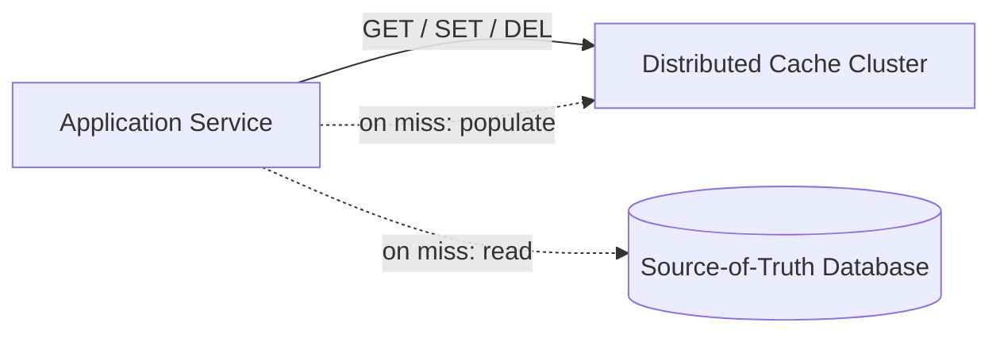
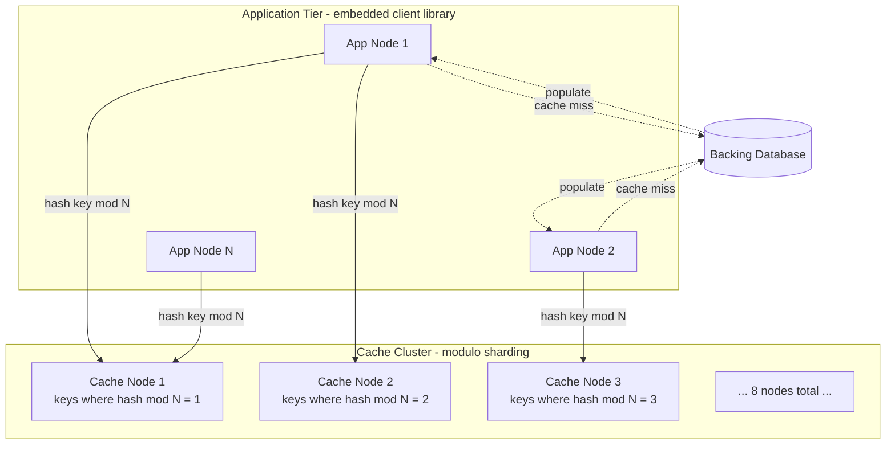

## Capacity Estimation

Start from the requirement numbers and derive everything else, showing the arithmetic at each step.

### Traffic

| Metric | Calculation | Result |
|---|---|---|
| Read QPS (peak) | given | **1,000,000 reads/s** |
| Write QPS (peak) | read QPS ÷ 10 (10:1 ratio) | **100,000 writes/s** |
| Read:write ratio | 1,000,000 / 100,000 | **10:1** |
| Avg entry size | 100 B key + 1 KB value | **~1.1 KB** |
| Read egress (cluster) | 1,000,000 × 1.1 KB | **~1.1 GB/s** |
| Write ingress (cluster) | 100,000 × 1.1 KB | **~110 MB/s** |

This is a **read-dominated** system. Every design decision — replication factor, read routing, in-process caching — targets the read path first.

### Cluster Sizing

| Metric | Calculation | Result |
|---|---|---|
| Hot working set | given | **1 TB** |
| Node RAM (commodity) | standard cache-optimised instance | **192 GB** |
| Usable RAM/node | 192 GB × 80% (OS, buffers, metadata overhead) | **~150 GB** |
| Primary nodes needed | ⌈1 TB ÷ 150 GB⌉ | **7 → round to 8** |
| With 1:1 replica per primary | 8 primary + 8 replica | **16 nodes** |
| Add 25% headroom for burst and rolling restarts | 16 × 1.25 | **20 nodes (10P + 10R)** |

### Bandwidth and Connections

| Metric | Calculation | Result |
|---|---|---|
| Read egress per primary node | 1.1 GB/s ÷ 10 primaries | **~110 MB/s per node** |
| NIC capacity | 10 Gbps = 1,250 MB/s | comfortable headroom |
| Ops/s per primary | 1,000,000 ÷ 10 | **100,000 reads/s** |
| Redis single-threaded throughput | empirical | ~100–200K ops/s |
| Memcached multi-threaded throughput | empirical | ~500K–1M ops/s |

100K reads/s per primary is at the ceiling of single-threaded Redis but well within Memcached. For a Redis cluster, use **pipelining** and **multi-threading** (Redis 6+) or size the cluster to 15–20 primaries. For Memcached, 10 primaries is comfortable.

### Memory Layout

```
Per entry in RAM:
  - Key:              100 B
  - Value:          1,000 B
  - Hash table slot:   24 B  (pointer, hash, flags)
  - LRU/LFU metadata:  16 B
  ─────────────────────────
  Total:           ~1,140 B  → ~1.1 KB
```

1 TB working set ÷ 1.1 KB per entry ≈ **~909 million cached entries** across the cluster.

## API Design

The cache exposes a minimal key-value contract over a binary protocol (Memcached protocol or RESP for Redis). From the client library's perspective:

```
GET  key
  → value (bytes)    if key exists and not expired
  → null             on cache miss or expiry

SET  key value [EX seconds] [NX]
  → OK               on success
  → NOT_STORED       if NX and key already exists
  EX: time-to-live in seconds; omit for no expiry
  NX: only set if not already present (conditional write)

DEL  key [key ...]
  → count            number of keys actually deleted

MGET key [key ...]
  → [value|null, ...]  positional array; null for each miss

MSET key value [key value ...]
  → OK

TTL  key
  → seconds          remaining TTL (-1 = no expiry, -2 = key not found)
```

**MGET is critical for p99.** A web request commonly needs 10–20 independent cache lookups (user, session, permissions, feature flags). Serialising those as 10–20 individual GETs adds up to 10–20× the network RTT. MGET collapses them into a single round-trip per destination node, which typically cuts cache-related request latency by 5–10×.

**NX (not-exists) write** is used by the stampede-locking pattern discussed in the {}: the first thread to recover from a miss acquires a distributed lock by `SET lock-<key> 1 EX 2 NX`, preventing the thundering herd from all hitting the database simultaneously.

## Data Model

The cache stores opaque byte arrays — it has no schema. The application is responsible for serialising and deserialising values.

```
Cache entry (in-memory structure per node):
  key            bytes      — primary identifier, routed via hash ring
  value          bytes      — arbitrary payload; the cache does not inspect it
  expires_at     int64      — Unix timestamp in ms; 0 = no expiry
  last_access    int64      — Unix timestamp in ms; used by LRU eviction
  access_count   int32      — approximate hit count; used by LFU eviction
  value_len      int32      — byte length of value; needed for memory accounting
```

Internally, each cache node maintains:
- A **hash table** (open-addressing or chaining) for O(1) key lookup.
- A **doubly-linked list** (LRU) or a **frequency-bucketed skip list** (LFU) for eviction ordering.
- A **TTL wheel** or **sorted set by expires_at** for lazy and active expiry.

See {} for the eviction policy comparison and {} for the internal storage engine trade-offs.

## Architecture v1

### Level 0 — Context



### Level 1 — First-cut components



**The cache-aside pattern** (see {}) governs every read: the application first queries the cache; on a miss, it reads from the backing database and then writes the result into the cache for future requests. The cache is a pure read-acceleration layer — writes go to the database first (or alongside). The cache does not proxy requests to the database; that responsibility stays in the application.

**Component responsibilities and first-order trade-offs:**

- **Client library.** Routes each key to the correct cache node using a consistent hash ring (v1 shows modulo; this is the first weakness we evolve). Handles connection pooling, retries, and timeouts. The client being embedded in the application — rather than a separate proxy — eliminates a network hop and avoids a single point of failure. See the topology discussion in the {}.
- **Cache nodes.** Each node is a standalone in-memory key-value engine (Redis or Memcached). Nodes do not communicate with each other in the simple topology; they are stateless from each other's perspective. This simplicity is the main advantage of the client-sharding model.
- **Backing database.** The durable source of truth. The cache is entirely optional for correctness — a cache miss degrades latency, not correctness. This decoupling is what makes cache-aside safe: the database is always authoritative.

**Weaknesses of v1 that the deep dive addresses:**

1. **Modulo sharding is catastrophic on membership change.** Adding or removing one node remaps `(N-1)/N` of all keys, causing a cluster-wide miss storm that can saturate the database.
2. **Cache stampede / thundering herd.** When a popular key expires, thousands of concurrent requests miss simultaneously and pile onto the same database shard.
3. **Hot keys.** A single viral key (celebrity post, trending product) concentrates all load on one cache node, making it a bottleneck regardless of the cluster size.
4. **Write-invalidation consistency.** Write-through, write-around, and write-back policies each carry different consistency and performance trade-offs that v1 ignores.
5. **Eviction policy mismatch.** LRU suits recency-biased workloads; LFU suits frequency-biased ones. Choosing wrong causes cache thrashing.
