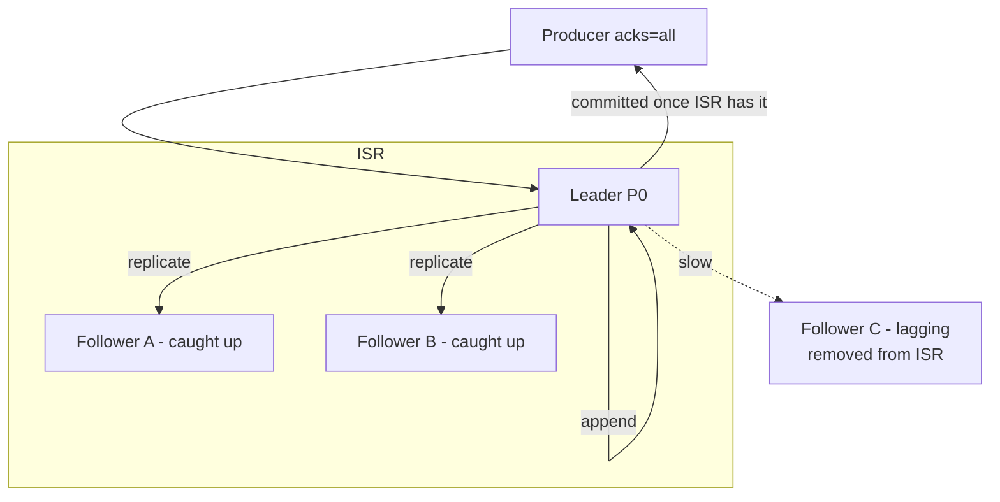
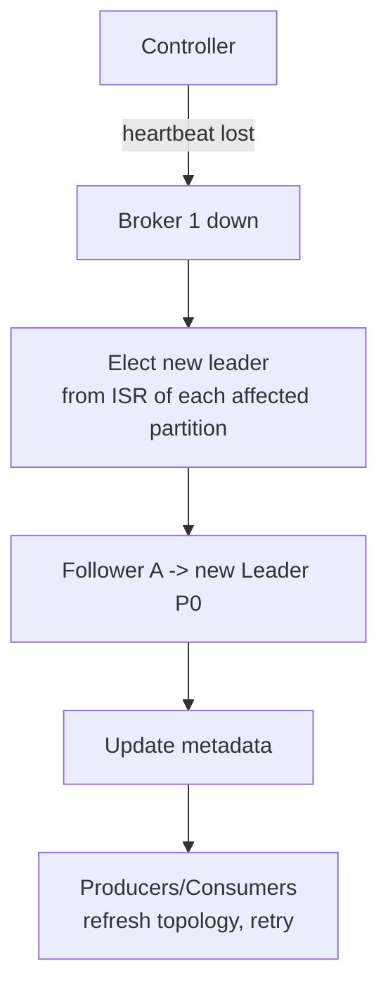
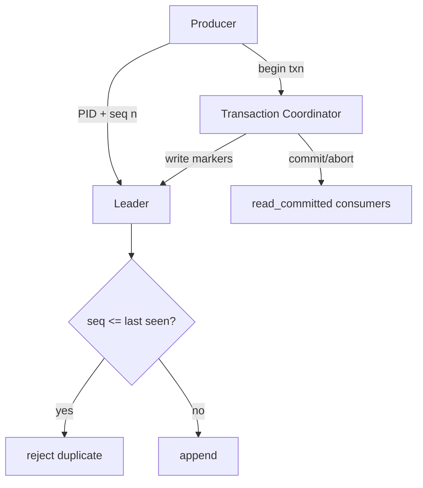
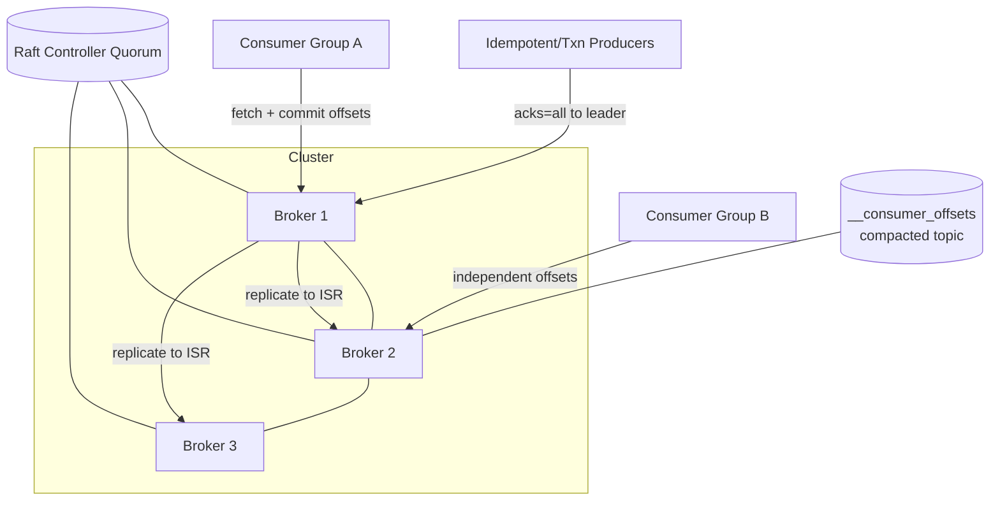

We evolve the design by attacking each guarantee in turn: **Problem → Modification → Justification**, each with its own diagram.

## Refinement 1 — Durability without losing throughput: the ISR

**Problem.** `acks=1` (leader-only) is fast but loses data if the leader dies before followers copy the message. Waiting for **all** replicas is safe but stalls on any single slow/dead follower. We need durability that tolerates a failed follower without blocking.

**Modification.** Maintain an **In-Sync Replica (ISR)** set per partition: the leader plus followers currently caught up within a lag threshold. `acks=all` means "acknowledged once all *ISR* members have the message," not all replicas. A message is **committed** (visible to consumers) only after all ISR members store it. A follower that falls behind is dropped from the ISR; it rejoins after catching up.



**Justification & trade-offs.** The ISR decouples durability from the slowest replica: we tolerate `|ISR| - 1` failures without data loss, and a lagging node doesn't block writes (it just leaves the ISR). `min.insync.replicas` sets the floor (e.g. 2): if the ISR shrinks below it, the partition rejects writes rather than risk a single point of durability — an explicit **CP choice** for that partition (see {}). This is quorum-like durability; see {}.

## Refinement 2 — Leader failure & failover

**Problem.** If a partition leader's broker crashes, that partition is unavailable for reads and writes. Who becomes the new leader, and how do we guarantee the new leader has all committed messages?

**Modification.** The **controller** detects the failure (heartbeat/session loss) and elects a new leader **only from the ISR**, then propagates the new topology to producers/consumers. Because every ISR member has all committed messages by definition, the new leader is guaranteed not to lose committed data.



**Justification & trade-offs.** Electing only from the ISR preserves the no-loss guarantee. The controller itself is made highly available via Raft, so controller failover is a separate, solved consensus problem (see {} and {}). Trade-off: **unclean leader election** (allowing an out-of-sync replica to become leader when no ISR member survives) trades data loss for availability — a knob you disable when durability matters most.

## Refinement 3 — Consumer groups & rebalancing

**Problem.** A consumer group must divide partitions among its members and adapt when members join/leave/crash — without two members reading the same partition (double processing) or a partition going unread.

**Modification.** A **group coordinator** (a broker) assigns partitions to members and triggers a **rebalance** on membership change. Each member owns a disjoint subset of partitions; on rebalance, ownership is reassigned. Offsets are committed to an internal `__consumer_offsets` topic so a new owner resumes exactly where the previous left off.

```mermaid
flowchart TB
  subgraph Group[Consumer Group "billing"]
    C1[Consumer 1<br/>P0, P1]
    C2[Consumer 2<br/>P2, P3]
  end
  COORD[Group Coordinator]
  C1 & C2 -->|heartbeat| COORD
  COORD -->|C2 died -> rebalance| C1
  C1 -->|now owns P0-P3| OFF[(__consumer_offsets)]
```

**Justification & trade-offs.** One-partition-per-consumer keeps per-partition ordering while scaling read throughput up to `#partitions`. Storing offsets in a compacted internal topic reuses the log itself as durable coordinator state. Trade-off: rebalances cause a brief **stop-the-world** pause; incremental/cooperative rebalancing reduces it. Max consumer parallelism is capped at the partition count — a reason to choose partition count carefully up front.

## Refinement 4 — Exactly-once semantics

**Problem.** At-least-once means a producer retry (after an ack timeout) can write a **duplicate**, and a consumer that processes then crashes before committing its offset will **reprocess**. Some pipelines (billing) can't tolerate either.

**Modification.** Two mechanisms:
1. **Idempotent producer:** each producer gets a producer id and per-partition **sequence numbers**; the broker rejects a duplicate sequence, so retries don't create duplicates.
2. **Transactions:** a producer atomically writes messages *and* its consumed-offset commits across partitions; consumers reading with `read_committed` never see aborted or partial data — enabling exactly-once "consume→process→produce" pipelines.



**Justification & trade-offs.** Idempotent + transactional producers give exactly-once *within the platform*. It costs latency (transaction coordination) and only helps when the consumer's side effects also go back through the queue; external side effects still need application-level {}. Use it selectively.

## Final Architecture



## Drill-Down

### Storage: segments, index, and reads

- A partition is a sequence of **segment files**; only the last is open for append. Old segments are deleted (retention) or **compacted** (keep only the latest value per key — the changelog use case).
- A **sparse offset index** maps offset → byte position so a consumer's `seek(offset)` is a binary search + short scan, not a full file read.
- Reads use **zero-copy** (`sendfile`): data goes from page cache straight to the socket, bypassing user space — critical for GB/s fan-out.

### Data structures used

| Structure | Where | Why |
|---|---|---|
| **Append-only log + segments** | partition storage | sequential I/O = high throughput, natural ordering |
| **Sparse index** | offset/time lookup | O(log n) seek without indexing every message |
| **ISR set** | per-partition replication | durability decoupled from slowest replica |
| **Consistent hashing / key hash** | producer partitioning | per-key ordering, even spread ({}) |
| **Raft log** | controller metadata | strongly-consistent cluster state |
| **Compacted topic** | offsets / changelogs | durable key→latest-value state |

### Key algorithm — commit & high-watermark

```
# Leader on produce (acks=all):
append(msg) -> local_offset
wait until every follower in ISR has fetched >= local_offset
high_watermark = min(ISR replica end offsets)
messages with offset <= high_watermark are "committed" (consumer-visible)
ack producer

# Consumer only ever reads up to high_watermark  (never sees uncommitted data)
```

### Edge cases & failure handling

- **Producer retry after timeout:** idempotent sequence numbers dedupe → no duplicate append.
- **Follower slow:** dropped from ISR; writes continue; it rejoins after catch-up.
- **ISR shrinks below `min.insync.replicas`:** partition rejects writes (CP) to protect durability.
- **Consumer crash mid-batch:** uncommitted offset → new owner reprocesses from last commit (at-least-once); use transactions for exactly-once.
- **Rebalance storms:** cooperative/incremental rebalancing and static membership reduce churn.
- **Poison message:** consumer routes to a DLQ topic after N failures (see {}).
