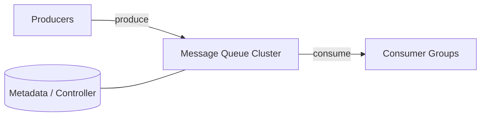
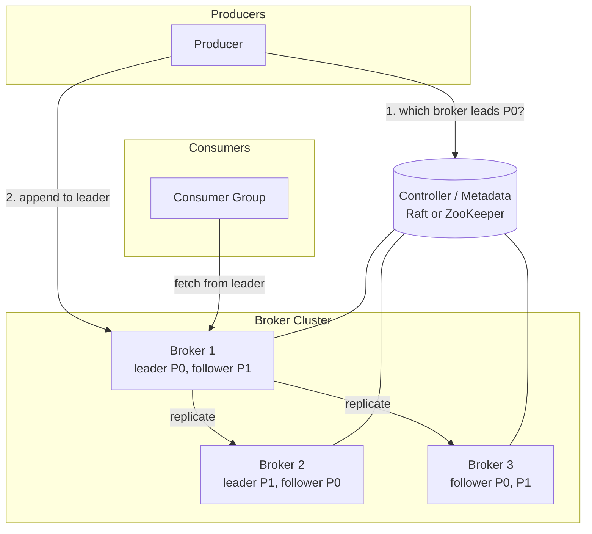

## Capacity Estimation

### Traffic & throughput

| Metric | Calculation | Result |
|---|---|---|
| Write messages/s | requirement | **1,000,000 /s** |
| Avg message size | assume | 1 KB |
| Write bandwidth | 1M × 1 KB | **~1 GB/s** |
| Consumer groups (fan-out) | assume 4 independent readers | ×4 |
| Read bandwidth | 1 GB/s × 4 | **~4 GB/s** |
| Replication traffic (RF=3) | 1 GB/s × 2 followers | **~2 GB/s inter-broker** |

Read is a multiple of write because each consumer group re-reads the whole stream. Replication adds inter-broker traffic. Total network is the sizing driver.

### Storage

| Metric | Calculation | Result |
|---|---|---|
| Raw ingest/day | 1 GB/s × 86400 | **~86 TB/day** |
| With RF=3 | 86 TB × 3 | **~260 TB/day** |
| 7-day retention (replicated) | 260 TB × 7 | **~1.8 PB** |

Retention, not consumption, sets storage. This is why partitions live on disk (sequential I/O), not RAM.

### Partitions & brokers

| Metric | Calculation | Result |
|---|---|---|
| Per-partition write ceiling | ~10 MB/s practical | — |
| Partitions for 1 GB/s | 1000 MB/s ÷ 10 MB/s | **~100+ partitions** (round to 128/256 for headroom) |
| Broker disk throughput | ~1–2 GB/s sequential | — |
| Brokers for 1 GB/s write + 3 GB/s replica/read | network-bound | **~12–20 brokers** |

**Why partitioning is the core scaling lever:** a single log is limited by one disk/NIC. Splitting a topic into P partitions spreads load across P brokers and allows P consumers in a group to read in parallel. Partition count is the unit of parallelism. See {}.

## API Design

```
# Producer
produce(topic, key?, value, acks="all") -> { partition, offset }
   acks=0   fire-and-forget (at-most-once)
   acks=1   leader ack (fast, small loss window)
   acks=all ISR ack (durable, no loss on single failure)

# Consumer
subscribe(topic, group_id)
poll(max_bytes) -> [ {partition, offset, key, value, timestamp} ]
commit(group_id, partition, offset)      # store consumer position
seek(partition, offset)                  # replay from any offset

# Admin
create_topic(name, partitions, replication_factor)
```

Producers may set a **partition key** (e.g. `user_id`); all messages with the same key go to the same partition, preserving per-key order.

## Data Model — the partitioned log

```
Topic "orders"  (partitions = 4, RF = 3)
  Partition 0: [msg@0][msg@1][msg@2]...        (append-only, offset = position)
  Partition 1: [msg@0][msg@1]...
  ...
Each partition on disk = a series of SEGMENT files:
  00000000000000000000.log   (messages)
  00000000000000000000.index (offset -> byte position, sparse)
  00000000000000000000.timeindex
```

A message's identity is `(topic, partition, offset)`. Offsets are monotonic per partition. Consumers store their committed offset per partition; the broker stores no per-consumer state beyond that — a key reason the broker scales to thousands of consumers.

## High-Level Architecture — v1

### Level 0 — Context



### Level 1 — Components



**Component responsibilities & first-order justification:**

- **Brokers** store partitions as append-only segment files. Writes are **sequential disk appends** served from the OS page cache — the reason a single broker sustains ~1 GB/s. Reads are also sequential and use zero-copy (`sendfile`) from page cache to socket.
- **Partition leader & followers.** Each partition has one **leader** (handles all reads/writes) and followers that replicate. This gives strong per-partition ordering and simple consistency. See {}.
- **Controller / metadata store.** Tracks topics, partitions, replica assignment, and leadership. Must be strongly consistent — implemented on **Raft** (or historically ZooKeeper). See {}.
- **Producers** partition by key (hash) and cache the topology, talking directly to partition leaders.
- **Consumer groups** divide partitions among members; each partition → exactly one member, so ordering is preserved while scaling out.

The open problems — how replication guarantees no data loss (ISR), how leadership fails over, how consumer groups rebalance, how offsets are committed, and how exactly-once is achieved — are the subject of the {}.
