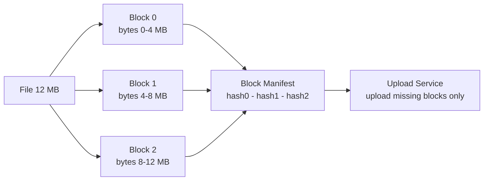
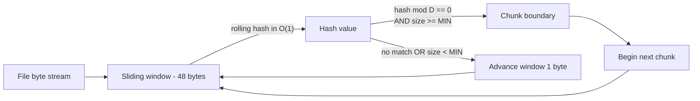
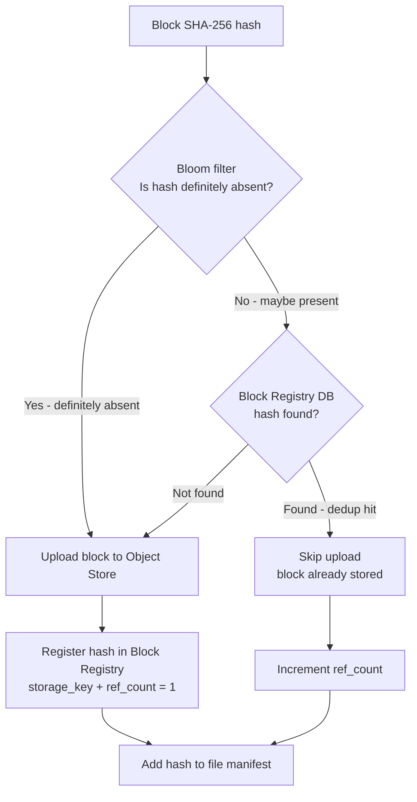
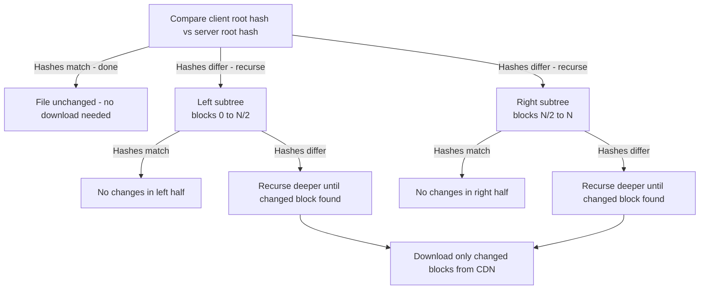
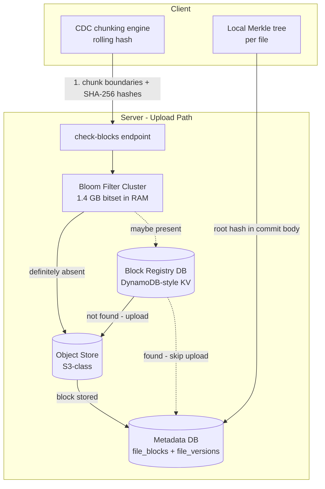

This page evolves the v1 storage layer through four refinements, introducing **content-addressed storage** and **delta sync** — two concepts with no existing concept page, explained fully here. Each refinement follows the Problem → Modification → Justification pattern.

---

## Refinement 1 — Naive file storage → Fixed-size chunking

**Problem.** In v1 the client uploads the entire file on every save. A user who appends a single sentence to a 2 GB document re-uploads 2 GB. At 50 M DAU this is catastrophic: upload bandwidth scales with file size, not change size. Storage also explodes because every version of every file is stored in full.

**Modification.** Split each file into fixed-size blocks of **4 MB** before upload. Compute a SHA-256 hash for each block. Build a **block manifest** — an ordered list of block hashes that defines the file. Upload only the blocks that the server does not already have; commit the manifest.



**Justification & trade-offs.** Uploading only changed blocks reduces bandwidth from O(file size) to O(changed bytes). Storing blocks independently means unchanged blocks are naturally shared across versions — version N and version N+1 share all unchanged blocks, so storage per version is proportional to the diff, not the file. The trade-off is **metadata overhead**: every file version now requires a manifest (a list of N hashes), and the block registry must track reference counts for garbage collection.

**Critical weakness of fixed-size chunking: the boundary-shifting problem.** Consider a 12 MB file split into three 4 MB blocks. A user inserts 1 byte at position 0. Every byte after that insertion shifts by 1. Block 0 now contains bytes 0–4 MB (all different because of the shift), block 1 contains bytes 4–8 MB (all different), block 2 contains bytes 8–12 MB (all different). **All three blocks have new hashes** even though only 1 byte changed. Fixed-size chunking degrades to re-uploading the full file on any insertion or deletion. This is the boundary-shifting problem.

---

## Refinement 2 — Fixed-size chunking → Content-Defined Chunking via Rolling Hash

**Problem.** Boundary shifting means fixed 4 MB chunks fail to identify unchanged regions when content is inserted or deleted anywhere in the file. The dedup hit rate collapses.

**Modification.** Use **Content-Defined Chunking (CDC)**: slide a window over the byte stream and compute a rolling hash; declare a chunk boundary wherever the hash hits a target value (mod a divisor). The chunk boundary is then determined by the **content** of the file, not by byte offsets.

### How a rolling hash works

A **rolling hash** (also called a Rabin fingerprint after Michael Rabin, 1981) evaluates a polynomial over a sliding window of bytes. When the window slides right by one byte, the new hash can be computed from the old hash in O(1) — you subtract the contribution of the byte that fell off the left edge and add the new byte on the right. No re-hashing of the full window.

```python
# Rabin-Karp rolling hash for content-defined chunking
BASE        = 31
MODULUS     = 2**31 - 1   # large Mersenne prime
WINDOW      = 48           # window size in bytes
MIN_CHUNK   = 2 * 1024 * 1024    # 2 MB minimum chunk size
MAX_CHUNK   = 8 * 1024 * 1024    # 8 MB maximum chunk size
TARGET_MASK = (1 << 13) - 1      # cut when low 13 bits == 0  →  avg 8 KB... scaled to 4 MB range

def find_chunk_boundaries(data: bytes) -> list[int]:
    boundaries = [0]
    h = 0
    base_pow = pow(BASE, WINDOW, MODULUS)  # BASE^WINDOW mod MODULUS

    # Initialise hash over first WINDOW bytes
    for b in data[:WINDOW]:
        h = (h * BASE + b) % MODULUS

    chunk_start = 0
    for i in range(WINDOW, len(data)):
        # Slide: remove leftmost byte, add new rightmost byte
        outgoing = data[i - WINDOW]
        h = (h - outgoing * base_pow) % MODULUS
        h = (h * BASE + data[i]) % MODULUS

        chunk_size = i - chunk_start
        if chunk_size >= MIN_CHUNK and (h % (MAX_CHUNK // 4096) == 0
                                        or chunk_size >= MAX_CHUNK):
            boundaries.append(i)
            chunk_start = i

    boundaries.append(len(data))
    return boundaries  # each consecutive pair [boundaries[i], boundaries[i+1]) is one chunk
```



**Why CDC solves boundary shifting.** If you insert 1 byte at position 0, the rolling hash will find a boundary very close to where it found one before — because boundaries are anchored to the **local content pattern**, not to absolute offsets. Only the chunks immediately around the insertion point change; chunks further along the file find the same boundary-triggering byte sequences and produce identical hashes. In practice a single-byte insertion typically affects only 1–3 chunks, not all N.

**Justification & trade-offs.** CDC is the standard approach used by rsync, Btrfs, and Dropbox. The min/max chunk sizes prevent pathological tiny or giant chunks. The target chunk size is controlled by the divisor: average chunk size ≈ `MAX_CHUNK / trigger_probability`. Trade-off: chunk boundaries are variable-length, so the manifest stores `(seq_num, block_hash, size_bytes)` per entry rather than just the hash (the receiver must know each chunk's byte length to reassemble the file in order).

---

## Refinement 3 — Upload-everything → Content-Addressed Deduplication

**Problem.** Even after switching to CDC, the same block content may be uploaded by different users (popular OS binaries, shared company slide decks, widely distributed media). Storing each copy wastes storage.

**Modification.** Make the **SHA-256 hash the storage key**. This is **content-addressed storage**: the address of a block is derived from its content, not from a randomly assigned ID. Every unique block is stored exactly once. Two users uploading identical content produce identical hashes → the block is stored once and both file manifests reference the same block. This achieves **cross-user, cross-file deduplication** automatically.

### Dedup check flow

Before uploading blocks, the client sends the server the full list of hashes it intends to upload. The server checks the **block registry** and tells the client which hashes it already has. A [Bloom filter]({}) sits in front of the registry as a fast, probabilistic first pass.

**Why a Bloom filter?** The block registry holds 1.25 trillion entries. A point lookup in a DynamoDB-style store is fast but not free (network RTT + storage I/O). If a block is new — which is the common case for the first upload — the query is a guaranteed miss. A Bloom filter holds all 1.25 T known block hashes in a compact in-memory bitset (~1.4 GB at 1% false-positive rate). A **definitive negative** ("this hash has never been seen") from the filter avoids the storage lookup entirely. A "maybe present" result falls through to the registry for a definitive answer. False positives are harmless — they merely trigger an unnecessary registry lookup. False negatives cannot occur (Bloom filters have no false negatives by definition).

```python
# Client-side upload with dedup check
def upload_file(local_path: str, session_id: str) -> dict:
    data = open(local_path, 'rb').read()
    boundaries = find_chunk_boundaries(data)   # CDC from Refinement 2

    # Build ordered block list
    blocks = []
    for i in range(len(boundaries) - 1):
        chunk = data[boundaries[i]: boundaries[i + 1]]
        h = sha256(chunk).hexdigest()
        blocks.append((h, chunk))

    hashes = [h for h, _ in blocks]

    # Ask server which blocks are missing (dedup check)
    resp = api.check_blocks(session_id, hashes)  # POST /upload-sessions/{id}/check-blocks
    missing = set(resp["missing_hashes"])

    # Upload only blocks the server does not already have
    for h, chunk in blocks:
        if h in missing:
            api.put_block(h, chunk)              # PUT /api/v1/blocks/{hash}

    # Commit the version with the full ordered manifest
    return api.commit(session_id, hashes)        # POST /upload-sessions/{id}/commit
```



**Justification & trade-offs.** Real-world dedup ratios of 2:1 to 5:1 are common in enterprise file storage (popular OS distributions, Microsoft Office templates, and duplicated email attachments are stored once). The platform-wide 2:1 target in our estimates is conservative. The trade-off is that **content-addressed blocks can never be overwritten** — a block is immutable once stored. This is a feature: it enables safe block sharing across all users and versions. Garbage collection (decrement `ref_count` on version delete; remove block from object store when `ref_count` reaches 0) is a background task, not in the upload hot path.

### Block manifest schema

```sql
-- Each version of a file has one manifest: the ordered list of chunks
CREATE TABLE file_blocks (
    version_id   BIGINT    NOT NULL,   -- FK → file_versions
    seq_num      INT       NOT NULL,   -- 0-indexed chunk order (0, 1, 2, …)
    block_hash   CHAR(64)  NOT NULL,   -- SHA-256 hex → FK → blocks.block_hash
    size_bytes   INT       NOT NULL,   -- chunk size in bytes (variable with CDC)
    PRIMARY KEY (version_id, seq_num)
);

-- Global block registry
CREATE TABLE blocks (
    block_hash   CHAR(64)      PRIMARY KEY,
    size_bytes   INT           NOT NULL,
    storage_key  VARCHAR(512)  NOT NULL,   -- e.g. "blocks/a1/b2/a1b2c3…"
    ref_count    BIGINT        DEFAULT 0,
    created_at   TIMESTAMP     NOT NULL
);
```

The block storage key is a prefix-sharded path (`blocks/<first-2-chars>/<next-2-chars>/<full-hash>`) so that object store listing and prefix scans remain efficient even across 1.25 T objects. See {} for object key design patterns.

---

## Refinement 4 — Full manifest comparison → Merkle-Tree Delta Sync

**Problem.** When a client reconnects after being offline, it needs to know which blocks in its local copy differ from the server's current version. The naïve approach: download the server's full block manifest and compare it locally. For a 50 GB file with ~12,500 × 4 MB blocks, that manifest is 400 KB of SHA-256 hashes — non-trivial if polled frequently across millions of devices.

**Modification.** Build a **Merkle tree** over the block hashes of each file version. A Merkle tree is a binary tree where each leaf is a block hash and each internal node is the hash of its two children. The **root hash** captures the fingerprint of the entire file: if any single block changes, the root hash changes. Two devices can compare an entire file's state with a single root-hash comparison — and when they differ, can efficiently pinpoint *which* blocks changed by recursing only into mismatched subtrees.

### Merkle-diff sync algorithm

```python
def build_merkle(hashes: list[str]) -> dict:
    """Build a binary Merkle tree; returns a node dict with 'hash' and optional children."""
    if len(hashes) == 1:
        return {"hash": hashes[0], "is_leaf": True, "index": None}
    mid = len(hashes) // 2
    left  = build_merkle(hashes[:mid])
    right = build_merkle(hashes[mid:])
    node_hash = sha256((left["hash"] + right["hash"]).encode()).hexdigest()
    return {"hash": node_hash, "left": left, "right": right,
            "left_count": mid}

def changed_block_indices(client_node: dict, server_node: dict,
                          offset: int = 0) -> list[int]:
    """Return the 0-based indices of blocks that differ between client and server."""
    if client_node["hash"] == server_node["hash"]:
        return []          # subtrees are identical — prune the search here

    if client_node.get("is_leaf"):
        return [offset]    # this leaf block changed

    mid = client_node["left_count"]
    left_diffs  = changed_block_indices(client_node["left"],
                                        server_node["left"],
                                        offset)
    right_diffs = changed_block_indices(client_node["right"],
                                        server_node["right"],
                                        offset + mid)
    return left_diffs + right_diffs
```

**Complexity.** If K blocks changed, the algorithm visits O(K log N) nodes instead of O(N). For a 50 GB file (N = 12,500 blocks) with 2 changed blocks, the client inspects ~52 nodes instead of all 12,500. The server sends the Merkle tree incrementally as the client recurses (a tree-walking API), so bandwidth scales with K, not N.



**Justification & trade-offs.** Merkle trees are the canonical structure for efficient set reconciliation in distributed systems (used by Git, Cassandra anti-entropy, and Bitcoin). The trade-off: the server must compute and cache the Merkle root for each file version. This is a small additional write per commit (~one extra DB row with the root hash) and is done asynchronously. The root hash is stored in `file_versions.merkle_root` and returned in the `/sync/changes` event, so the client knows immediately whether a re-sync is needed without any recursive comparison.

### Final architecture — chunking and dedup layer



The Bloom filter lives in a dedicated in-memory cluster (one per region), refreshed via a background job that reads new block hashes from the block registry using {}. This keeps it consistent without coupling it to the upload hot path.
