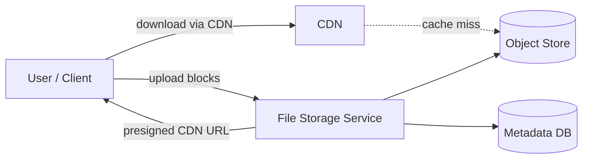
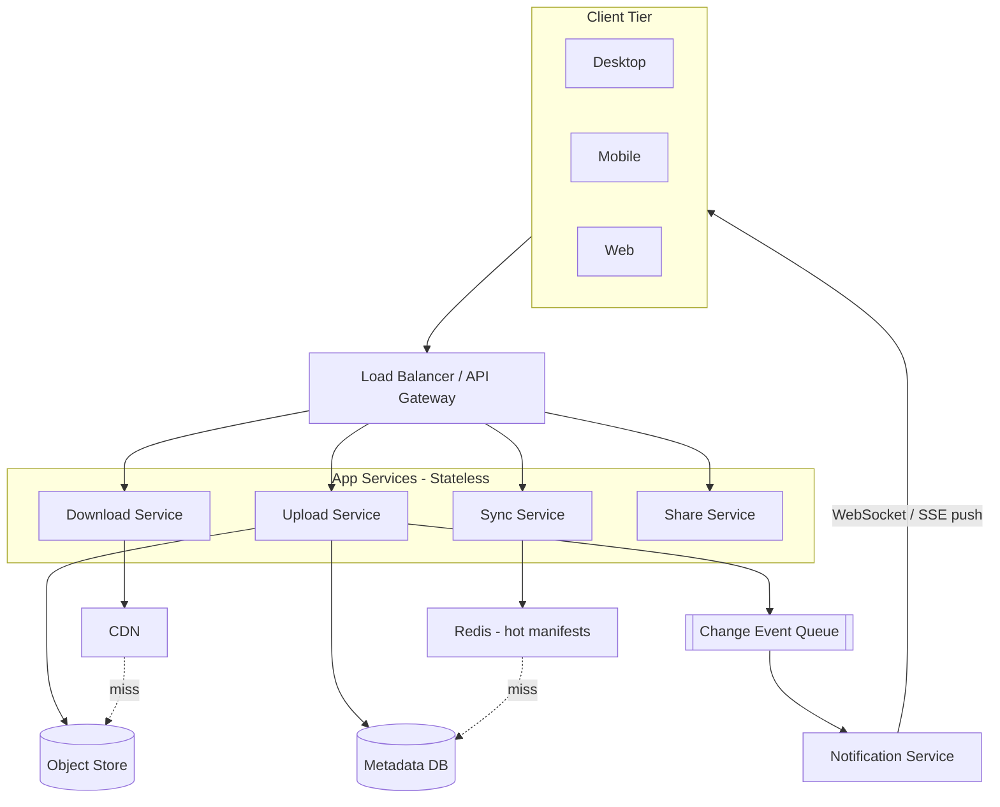

## Capacity Estimation

Show the arithmetic. An interviewer expects reasoning, not memorised answers.

### Traffic

| Metric | Calculation | Result |
|---|---|---|
| File uploads/day | 50 M DAU × 5 uploads/user | 250 M / day |
| Upload initiation QPS avg | 250 M / 86,400 | ~2,900 /s |
| Upload initiation QPS peak | 2,900 × 3 burst | ~8,700 /s |
| Avg file size | given: ~8 MB | — |
| Avg blocks per file | 8 MB / 4 MB chunk | ~2 blocks |
| Block upload QPS avg | 250 M × 2 / 86,400 | ~5,800 /s |
| Block upload QPS peak | 5,800 × 3 | ~17,400 /s |
| Downloads/day | 50 M DAU × 10 downloads/user | 500 M / day |
| Download QPS avg | 500 M / 86,400 | ~5,800 /s |

The system is **upload-write heavy at block granularity** but the dedup check (read-before-write) means net new block storage is far smaller than raw upload QPS suggests.

### Storage

| Metric | Calculation | Result |
|---|---|---|
| Total raw data | 500 M users × 20 GB | **~10 EB** |
| Net stored after 2:1 dedup | 10 EB / 2 | **~5 EB** |
| Chunk size | fixed 4 MB (CDC produces variable chunks targeting 4 MB) | — |
| Unique blocks stored | 5 EB / 4 MB | **~1.25 T blocks** |
| Block metadata per block | SHA-256 hash + storage ref + ref\_count + timestamps | ~100 B |
| Block registry total | 1.25 T × 100 B | **~125 TB** |
| Estimated total files | 500 M users × 500 files | 250 B files |
| File metadata per file | name + owner + folder + timestamps + current version | ~1 KB |
| File + version metadata total | 250 B × ~2 KB avg with versions | **~500 TB** |
| Change log (1 year) | 250 M uploads/day × 365 × ~100 B/event | **~9 TB / yr** |

**125 TB** of block registry metadata drives the choice of a wide-column or key-value store; the **500 TB** of file metadata calls for a sharded relational store. Object storage (5 EB of block content) is off-the-shelf S3-class.

### Bandwidth

| Direction | Calculation | Result |
|---|---|---|
| Upload ingress (raw) | 5,800 block-uploads/s × 4 MB | ~23 GB/s |
| Upload ingress (after ~60% dedup savings) | 23 GB/s × 0.4 | **~9 GB/s** |
| Download egress (via CDN) | 5,800 downloads/s × 8 MB avg | **~46 GB/s** |

A CDN is not optional: 46 GB/s of origin egress would be prohibitive and unnecessary since most popular files will be cached at edge nodes.

### Derived Infrastructure

- **Upload app nodes:** at ~1,000 concurrent block uploads/node, peak 17,400/s → ~18 nodes minimum → **~50 nodes** with headroom across regions.
- **Metadata DB:** 500 TB over time → sharded PostgreSQL (10–20 shards by `file_id` hash).
- **Block registry:** 125 TB, key-value lookups by SHA-256 hash → DynamoDB-style wide-column store; see {}.
- **Object store:** 5 EB → S3-compatible with 3-way replication + erasure coding; see {}.
- **CDN:** 46 GB/s egress handled at edge; see {}.
- **Redis (hot manifests):** top 20% of active files → ~50 GB per region cluster; see {}.

---

## API Design

The upload flow is a three-phase protocol: **check → upload missing blocks → commit**. This enables both deduplication and resumability.

```
# Phase 1 — Create an upload session
POST /api/v1/upload-sessions
  Body:   { "filename": "report.pdf", "parent_folder_id": "fol_…", "total_size_bytes": 157286400 }
  201  →  { "session_id": "sess_abc123", "target_chunk_size": 4194304 }

# Phase 2a — Client computes SHA-256 hashes for all chunks, then asks which are missing
POST /api/v1/upload-sessions/{session_id}/check-blocks
  Body:   { "block_hashes": ["a1b2c3…", "d4e5f6…", "77aa…"] }
  200  →  { "missing_hashes": ["d4e5f6…"] }   ← client only uploads these

# Phase 2b — Upload each missing block (idempotent — safe to retry)
PUT /api/v1/blocks/{block_hash}
  Headers: Content-Length: <block_bytes>
  Body:   <raw binary block>
  201  →  {}  (new block stored)
  200  →  {}  (already existed — deduplicated, no-op)

# Phase 3 — Commit the file version with the full ordered block manifest
POST /api/v1/upload-sessions/{session_id}/commit
  Body:   { "block_hashes": ["a1b2c3…", "d4e5f6…", "77aa…"] }
  201  →  { "file_id": "fil_…", "version_id": 42, "version_num": 3, "committed_at": "…" }

# Get file metadata and current block manifest (for download or sync)
GET /api/v1/files/{file_id}
  200  →  { "file_id": "…", "name": "…", "size_bytes": 157286400,
            "current_version": { "version_id": 42, "block_hashes": ["…"] } }
  403  →  ACL check failed

# Download a block — returns a presigned CDN redirect (does NOT expose raw storage path)
GET /api/v1/blocks/{block_hash}?file_id={file_id}
  302  →  Location: https://cdn.example.com/blocks/{token}?sig=…&exp=…  (15-min TTL)
  403  →  requester has no ACL access to any file containing this block

# Cursor-based change log — drives cross-device sync
GET /api/v1/sync/changes?cursor=12345&limit=100
  200  →  { "changes": [{ "type": "FILE_MODIFIED", "file_id": "…", "version_id": 43, … }],
            "next_cursor": 12401, "has_more": false }

# Share a file or folder
POST /api/v1/files/{file_id}/shares
  Body:   { "grantee_email": "alice@example.com", "permission": "READ" }
  201  →  { "share_id": "shr_…", "granted_at": "…" }
```

Pagination on `/sync/changes` uses a monotone server-side cursor (a sequence number on the change log table), not time-based, so clients never miss events across reconnects. See {}. The `PUT /blocks/{hash}` endpoint is [idempotent]({}): uploading a block a second time is a safe no-op.

---

## Data Model

Five core entities; each lands in the right store for its access pattern.

```sql
-- Content-addressed block registry (global, shared across ALL users)
blocks
  block_hash   CHAR(64)      PRIMARY KEY   -- SHA-256 hex of block content
  size_bytes   INT           NOT NULL
  storage_key  VARCHAR(512)  NOT NULL      -- path in object store
  ref_count    BIGINT        DEFAULT 0     -- #versions referencing this block; GC when 0
  created_at   TIMESTAMP     NOT NULL

-- File and folder metadata
files
  file_id      UUID          PRIMARY KEY
  owner_id     BIGINT        NOT NULL
  parent_id    UUID                        -- parent folder; NULL for root
  name         VARCHAR(1024) NOT NULL
  is_folder    BOOLEAN       DEFAULT FALSE
  current_ver  BIGINT                      -- FK → file_versions.version_id
  created_at   TIMESTAMP     NOT NULL
  updated_at   TIMESTAMP     NOT NULL

-- Immutable version record (one row per commit)
file_versions
  version_id   BIGSERIAL     PRIMARY KEY
  file_id      UUID          NOT NULL
  version_num  INT           NOT NULL
  size_bytes   BIGINT
  block_count  INT
  committed_by BIGINT        NOT NULL      -- user_id
  committed_at TIMESTAMP     NOT NULL
  parent_ver   BIGINT                      -- NULL for first version; used for conflict detection

-- Ordered block manifest: the sequence of blocks that make up a version
file_blocks
  version_id   BIGINT        NOT NULL      -- FK → file_versions
  seq_num      INT           NOT NULL      -- 0-indexed chunk order
  block_hash   CHAR(64)      NOT NULL      -- FK → blocks
  PRIMARY KEY  (version_id, seq_num)

-- Access control
shares
  share_id     UUID          PRIMARY KEY
  file_id      UUID          NOT NULL
  grantee_id   BIGINT        NOT NULL      -- user or group
  permission   VARCHAR(8)    NOT NULL      -- READ | WRITE
  created_at   TIMESTAMP     NOT NULL
  expires_at   TIMESTAMP                   -- NULL = no expiry
```

**Store selection:**
- `blocks` → DynamoDB-style key-value store (point lookups by SHA-256, no joins). The block content lives in object storage; the registry holds only the metadata.
- `files`, `file_versions`, `file_blocks`, `shares` → sharded PostgreSQL, partitioned by `file_id` hash. Relational integrity is valuable here (foreign keys, cascading deletes for version cleanup).
- Hot file manifests (recent `file_versions` + `file_blocks`) → Redis cache to skip DB on every sync poll.

---

## High-Level Architecture — v1

### Level 0 — Context



### Level 1 — First-cut components



**Component responsibilities & first-order trade-offs:**

- **Load Balancer / API Gateway.** Terminates TLS, enforces authentication (JWT / OAuth token), applies rate limiting, and routes to stateless app nodes. Stateless app nodes scale horizontally and can be placed in multiple regions without coordination.
- **Upload Service.** Orchestrates the three-phase upload: creates the session, runs the block-existence check (dedup), accepts block PUTs, and commits the version to the metadata DB. On commit it emits a change event so other devices are notified.
- **Download Service.** Validates the ACL, looks up the current block manifest from cache/DB, and issues presigned CDN redirects for each block. The service itself never streams bulk data — that would bottleneck on app-tier bandwidth.
- **Sync Service.** Serves the cursor-based change log (`GET /sync/changes`). Thin read path: mostly hitting Redis-cached manifests. The heavy lifting (detecting which blocks changed) happens on the client using a local Merkle tree.
- **Share Service.** Manages ACL records. Permission checks are done at the Upload/Download services by joining against the `shares` table (cached).
- **Object Store.** Durable, S3-compatible store for raw block content. All blocks are written exactly once (content-addressed); the object store never needs to delete or overwrite a block unless its `ref_count` drops to zero.
- **Change Event Queue → Notification Service.** Decouples the upload commit path from device fan-out. An upload commit pushes one event; the notification service fans it out to every open WebSocket/SSE connection for that user. See {} for at-least-once delivery handling.

**Obvious v1 weaknesses** — exactly what the deep dives address:

1. Fixed-size chunking causes boundary shifts on insertions, inflating the "changed blocks" count.
2. No deduplication: identical files from different users are stored N times.
3. Clients poll for changes rather than receiving server-push notifications.
4. No conflict detection when two devices edit the same file offline.
5. Large uploads re-start from scratch on interruption.
