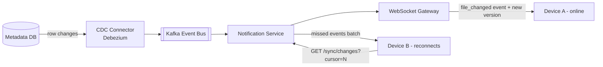
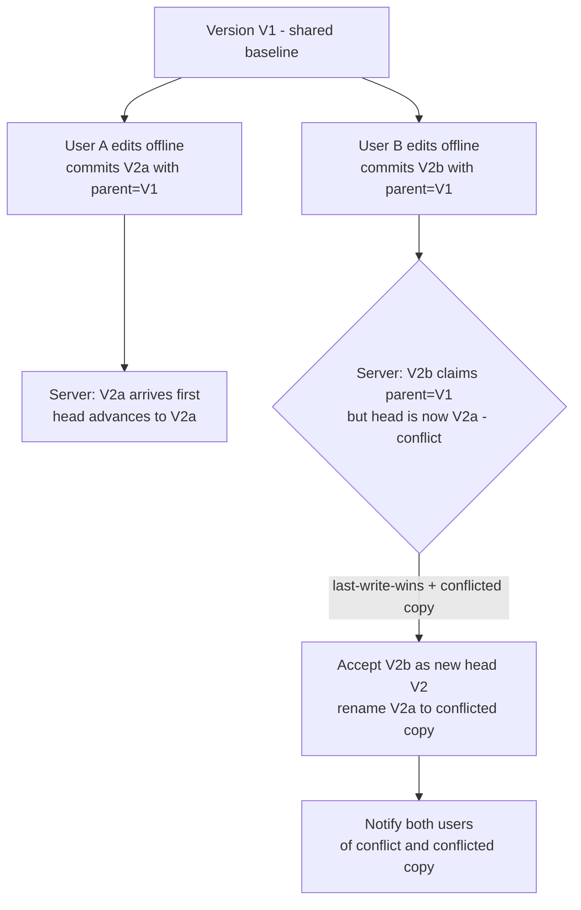
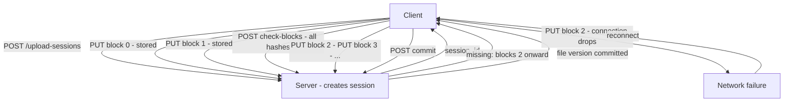
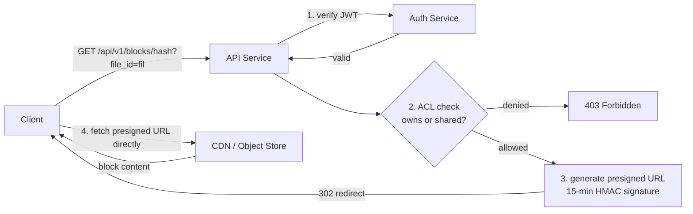
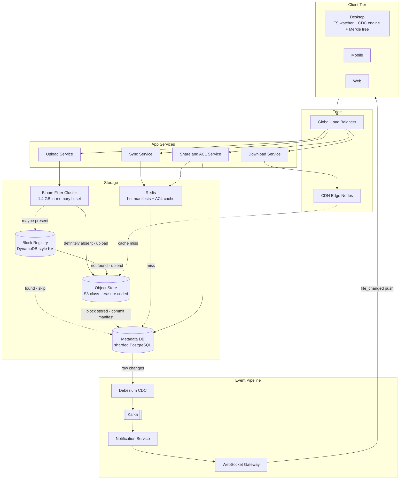

This page evolves the sync, conflict-handling, resumability, and sharing layers. Every weakness of v1 is addressed in turn with its own diagram.

---

## Refinement 1 — Polling sync → Server-push via CDC and WebSockets

**Problem.** In v1 every client polls `GET /sync/changes` every 30 seconds to detect remote changes. At 50 M DAU this generates ~1.7 M requests/s of pure overhead regardless of whether anything changed. More importantly, it imposes a maximum sync latency of 30 s — unacceptably slow for collaborative work.

**Modification.** Replace polling with a server-push architecture built on two components:

1. **Change Data Capture on the metadata DB.** Every successful file commit writes a row to `file_versions`. A CDC connector (e.g. Debezium on PostgreSQL) streams these row changes into a Kafka event bus in real time. See {}.
2. **WebSocket / SSE notification service.** A long-lived connection is maintained between each active client and a notification service node. When the Kafka consumer sees a `FILE_MODIFIED` event for user U, it pushes a compact notification to all active WebSocket connections for U. The notification contains `{ file_id, new_version_id, merkle_root }` — just enough for the client to decide whether it needs to sync, using the Merkle comparison from {}.

Clients that are offline at notification time simply call `GET /sync/changes?cursor=N` on reconnect and replay all missed events. The cursor is a monotone sequence number on the change log — never a wall-clock time — so no events are skipped even across long offline periods.

**Justification & trade-offs.** Server-push eliminates the constant polling load and brings sync latency from up to 30 s down to the Kafka consumer-to-WebSocket path latency — typically under 500 ms. The trade-off: WebSocket connections are stateful; a notification service node crash loses all active connections for those users. Clients handle this by detecting a WebSocket disconnect and immediately polling `/sync/changes` before re-establishing the WebSocket, so no events are missed. See {} — a single celebrity shared folder can generate massive fan-out; the notification service partitions Kafka by `owner_id` to ensure ordering and limit hot partitions.

---

## Refinement 2 — Overwrite races → Conflict detection and resolution

**Problem.** User A and User B both open the same shared file while offline, edit it, and later reconnect. Both commit a new version with `parent_ver = V1`. The server receives two commits that both claim the same parent. Without conflict detection, whichever arrives second silently overwrites the first — data loss.

**Modification.** Track `parent_ver` (the version ID the client based its edit on) in every commit. On receiving a commit, the server checks: **does the claimed `parent_ver` equal the current head of this file?** If yes, accept the commit and advance the head to the new version. If no — the head has already moved — this is a **conflict**.

**Conflict resolution strategies:**

| Strategy | Mechanism | Trade-off |
|---|---|---|
| **Last-write-wins** | Accept the commit with the later `committed_at` timestamp; save the loser as a "conflicted copy" file alongside the original | Simple; no data loss (conflicted copy preserved); user sees both versions | 
| **Versioned conflicted copy** | Both commits are accepted as different named versions; user resolves manually | Maximum safety; requires UI for conflict resolution |
| **CRDT / OT merge** | Apply operational transforms or CRDTs to auto-merge changes | No manual resolution needed; only feasible for structured data types (text, lists); not for binary files |

For a general-purpose file store (binary blobs, PDFs, images), **last-write-wins + conflicted copy** is the right default: it is always correct (no data is lost), is simple to implement, and is what Dropbox uses.

**Version vectors for multi-device.** When more than two devices can edit concurrently, a single `parent_ver` integer is insufficient — you need a **version vector** (one counter per device). The server maintains a version vector per file and detects concurrent writes as those where neither vector dominates the other. This is the same mechanism used by Amazon Dynamo and Riak. For most file storage products, per-file sequence numbers and conflicted copies are sufficient without full version vectors.

**Justification & trade-offs.** OT and CRDT are mentioned here because interviewers often ask. However, for binary files they are not applicable — you cannot meaningfully merge two independent binary edits. CRDTs are the right answer for collaborative text documents (like Google Docs), which is explicitly out of scope. For our design, the conflicted-copy approach is correct, simple, and used in production by Dropbox.

---

## Refinement 3 — Failed uploads restart from scratch → Resumable large-file uploads

**Problem.** A user uploads a 50 GB video. At 80% progress the connection drops. In v1, the client restarts the upload from block 0, re-uploading 40 GB of data that the server already received. This wastes bandwidth and degrades UX.

**Modification.** Exploit the block-level upload architecture — it already makes each block independently idempotent. Add **upload session state** on the server side: a record of which blocks have been durably received for a given session. On reconnect, the client calls `GET /api/v1/upload-sessions/{session_id}` to retrieve the list of already-received block hashes and resumes from the first missing block.

This is achieved without any additional upload protocol: the same `PUT /api/v1/blocks/{hash}` endpoint is idempotent (SHA-256 ensures the stored block is byte-identical to what would have been uploaded), and the dedup check (`check-blocks`) already returns missing vs. present hashes. "Resume" is simply running `check-blocks` again — blocks already uploaded will be in the block registry and returned as "present."

**Justification & trade-offs.** Resumability falls out of content-addressed block storage at almost zero implementation cost. The server does not need to track a "progress pointer" — the block registry is the ground truth for what has been received. The only state the server maintains is the upload session record (session\_id → file\_id + filename + folder\_id), which is tiny. Sessions expire after 24 hours if not committed, with a background cleanup job reclaiming orphaned blocks whose `ref_count` is still 0 (they were uploaded but the session was never committed). The block upload `PUT` endpoint uses [idempotency]({}) to handle at-least-once delivery on retried requests.

---

## Refinement 4 — Open block access → ACL-enforced presigned URL downloads

**Problem.** Blocks are content-addressed by SHA-256. If a client discovers a block hash (e.g. from a leaked manifest), can it download the block directly from the object store? And how do we efficiently revoke access when a share is removed?

**Modification.** The object store is **never exposed directly** to clients. Every block download goes through the API service, which:

1. Authenticates the requester (JWT / OAuth token).
2. Checks the ACL: does the requester own or have a valid share grant for a file whose current version includes this block?
3. If authorised, generates a **presigned URL** — a time-limited, cryptographically signed URL (HMAC-SHA256) for the object store path — with a short TTL (15 minutes). The client is redirected (HTTP 302) to this URL and fetches the block directly from the CDN/object store within the window.

ACL checks are kept fast via a Redis-cached read of the `shares` table. On share revocation, the Redis entry is invalidated immediately; all presigned URLs already issued expire naturally within the TTL window. For immediate revocation (e.g. terminated employee), the TTL can be shortened to 1 minute at the cost of more API traffic.

**Folder-level permission inheritance.** The `shares` table stores permissions at the `file_id` level. Folders are also `file_id` entries (with `is_folder = TRUE`). Permission checks walk up the folder hierarchy: if the requester has no direct share on the file, check the parent folder, then the grandparent, up to the root. This walk is bounded (typical depth < 10) and the results are cached by `(user_id, file_id)` in Redis with a short TTL. See {}.

---

## Final Architecture

---

## Drill-Down

### Database schema and sharding

`files` and `file_versions` are **sharded by `file_id`** (consistent hashing, see {}). All queries are by `file_id`; joins between `files` and `file_versions` always land on the same shard. `file_blocks` is sharded by `version_id` (co-located with `file_versions` since `version_id` contains a shard hint derived from `file_id`).

`blocks` (the global block registry) is sharded by the first 4 hex chars of `block_hash`, giving 65,536 natural partitions — enough for horizontal scale without a routing table. With 1.25 T blocks at 100 B each = 125 TB total, spread across 64 shards this is ~2 TB per shard, well within DynamoDB partition limits.

Indexes:
- `file_versions(file_id, version_num DESC)` — for listing versions and finding the current head.
- `shares(grantee_id, file_id)` — for listing files shared with a user and ACL checks.
- `shares(file_id)` — for listing who has access to a file.

### Data structures summary

| Structure | Where | Why |
|---|---|---|
| **Rolling hash / Rabin fingerprint** | Client CDC engine | O(1) per-byte hash update; content-defined chunk boundaries |
| **SHA-256** | Block identity | Collision-resistant fingerprint; becomes the storage address |
| **Bloom filter** | Block registry fast-path | O(k) lookup for 1.25 T keys in 1.4 GB RAM; eliminates DB hit on new blocks |
| **Merkle tree** | Delta sync | O(K log N) block diff vs O(N) full manifest comparison |
| **Monotone sequence cursor** | Change log | Stateless reconnection; clients replay from any past cursor |
| **Version vector / parent\_ver** | Conflict detection | Detects concurrent edits without locking |
| **Presigned URL + HMAC** | Block download auth | ACL enforced at API; CDN handles bulk transfer without API bottleneck |
| **LRU Redis** | Hot manifest cache | Absorbs repeated sync polls for popular shared files |

### Edge cases and failure handling

- **Block registry inconsistency.** If the object store `PUT` succeeds but the block registry write fails, the block is stored but unreferenced. A background reconciliation job (compare object store listing vs. block registry, using {}) detects orphaned objects and either registers them or deletes them. Block upload is designed to be retried: the `PUT /blocks/{hash}` endpoint is fully idempotent.
- **Bloom filter stale entries.** The filter is eventually consistent with the block registry (refreshed via CDC). In the window between a block being added to the registry and the filter being updated, the filter may return "definitely absent" for a block that actually exists — triggering a redundant upload. This is safe: the block is written idempotently, and the registry write is a no-op update. False positives (filter says "maybe present" for a truly absent block) trigger an unnecessary registry lookup but never cause data loss.
- **Commit without all blocks uploaded.** The commit endpoint validates that every hash in the manifest is present in the block registry before writing the `file_version` row. If any hash is missing, the commit returns `409 Conflict` with the list of missing hashes, and the client resumes uploading.
- **Hotspot files.** A large shared folder with thousands of editors can generate massive notification fan-out. The Kafka event bus partitions by `file_id` for ordering; the notification service applies a debounce (collapse multiple events for the same file within 2 seconds into one) to avoid notification storms. See {}.
- **Object store unavailability.** Blocks are written to object storage synchronously during upload. If the object store is unavailable, the upload fails at the client with a 503 and must be retried. There is no intermediate buffer (writing to a queue then asynchronously flushing to the object store would introduce complex partial-write scenarios). The upload service uses exponential backoff to retry the object store write before returning an error to the client.
