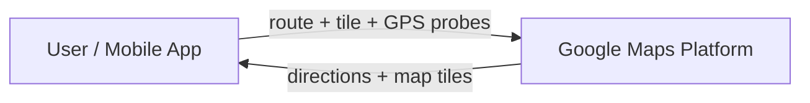
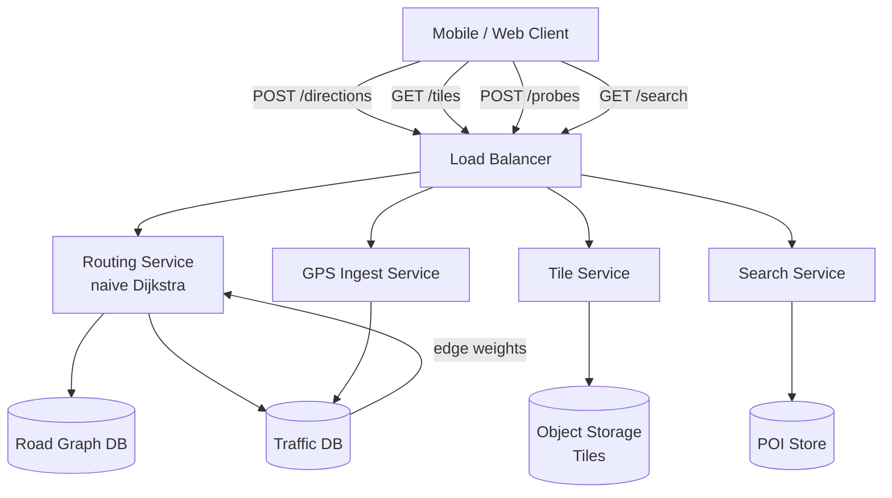

## Capacity Estimation

### Traffic

| Metric | Calculation | Result |
|---|---|---|
| Route compute (avg) | 20 M requests/day ÷ 86 400 s | **~230 /s** |
| Route compute (peak ×3) | 230 × 3 | **~700 /s** |
| Tile requests (avg) | 50 B/day ÷ 86 400 s | **~580 000 /s** |
| Tile requests reaching origin (5% CDN miss) | 580 000 × 0.05 | **~29 000 /s** |
| GPS probe events | 20 M navigating sessions × 1 probe/10 s | **~2 000 000 /s** |

Tile serving dominates at 580 K req/s; GPS ingestion is a heavy write stream at 2 M/s; route computation is moderate at 700 /s.

### Road Graph Storage

| Component | Calculation | Result |
|---|---|---|
| Nodes — global (intersections) | 500 M nodes × 24 B/node | ~12 GB |
| Edges — global (road segments) | 1.5 B edges × 40 B/edge | ~60 GB |
| Adjacency list index overhead (~15 %) | | ~11 GB |
| **Total in-memory graph per server** | | **~83 GB** |

A single 128 GB RAM server holds the full continental adjacency list. Multiple routing servers each load the full graph — routing is stateless and horizontally scalable.

### Map Tile Storage

Tiles form a **quadtree pyramid**: zoom level z has up to 4^z tiles. Land covers ~30 % of Earth's surface; detailed tiles are only generated for populated areas.

| Zoom range | Tiles (est.) | Avg size | Subtotal |
|---|---|---|---|
| 0–10 (world overview) | ~350 000 | 200 KB | ~70 GB |
| 11–14 (city level) | ~50 M | 80 KB | ~4 TB |
| 15–18 (street level) | ~1.5 B | 30 KB | ~45 TB |
| 19–20 (building detail, selective) | ~200 M | 20 KB | ~4 TB |
| **Total pre-rendered** | | | **~53 TB** |

Stored in [object storage]({}). Zoom levels 0–15 (~5 TB) are hot and cached at CDN edges globally. Zoom 19–20 tiles are generated on-demand for high-demand cities only.

### Bandwidth

| Direction | Calculation | Result |
|---|---|---|
| Tile CDN egress | 580 000 /s × 30 KB avg | **~17 GB/s** |
| GPS probe ingress | 2 M/s × 200 B/event | **~400 MB/s** |
| Route response egress | 700 /s × 50 KB avg | **~35 MB/s** |

CDN egress is the dominant bandwidth cost — the primary justification for aggressive edge caching.

### Infrastructure Derived

- **Routing servers:** 700 req/s at ~200 req/s/server → ~4 servers + redundancy → **8 servers per region** (graph in RAM, stateless).
- **Tile origin servers:** 29 K CDN-miss req/s at ~3 K req/s/server → **10 origin servers** per region.
- **Kafka GPS ingestion:** 2 M events/s × 1 KB/event = ~2 GB/s → **40 partitions** at 50 MB/s each.
- **Stream processor nodes:** 40 Kafka partitions → 40 consumer tasks (Flink or Spark Streaming).
- **CDN:** hundreds of edge PoPs globally (standard CDN deployment; see [CDN]({})).

## API Design

```
POST /v1/directions
  Body: {
    "origin":       { "lat": 37.77, "lng": -122.41 },
    "destination":  { "lat": 37.33, "lng": -121.88 },
    "mode":         "DRIVE",     // DRIVE | WALK | BIKE
    "alternatives": true
  }
  200 → {
    "routes": [{
      "distance_m":  72400,
      "duration_s":  3120,
      "eta":         "2026-07-24T09:45:00Z",
      "steps": [
        { "instruction": "Head north on Market St", "distance_m": 820, "duration_s": 95 },
        ...
      ]
    }, ...]
  }
  400 → invalid coordinates or unsupported mode

GET /v1/tiles/{zoom}/{x}/{y}?format=mvt
  200 → binary tile (Mapbox Vector Tile protobuf or PNG)
  304 → Not Modified  (CDN respects ETag / If-None-Match)
  404 → tile coordinates out of valid range

POST /v1/probes  (batched; called by client SDK every 10 s)
  Body: {
    "session_token": "<anon-uuid>",
    "probes": [
      { "lat": 37.771, "lng": -122.413, "speed_ms": 12.3, "heading": 45, "ts": "..." },
      ...
    ]
  }
  202 → Accepted (fire-and-forget; client never waits for result)

GET /v1/eta?olat=37.77&olng=-122.41&dlat=37.33&dlng=-121.88
  200 → { "eta_s": 3120, "confidence": 0.91, "traffic_condition": "MODERATE" }

GET /v1/search?q=coffee&lat=37.77&lng=-122.41&radius_m=500&page_token=<opaque>
  200 → {
    "results": [{ "poi_id", "name", "distance_m", "lat", "lng", "category" }],
    "next_page_token": "<opaque>"
  }
```

**Idempotency:** `/v1/probes` is fire-and-forget; duplicates are harmless (probes are aggregated). `/v1/directions` is read-only and inherently idempotent. POI search uses opaque cursor tokens for stable pagination across pages.

## Data Model

### Road Graph

```sql
nodes
  node_id     BIGINT      PRIMARY KEY
  lat         FLOAT       NOT NULL
  lng         FLOAT       NOT NULL

edges
  edge_id       BIGINT      PRIMARY KEY
  from_node     BIGINT      NOT NULL  -- FK → nodes
  to_node       BIGINT      NOT NULL  -- FK → nodes
  dist_m        INT         NOT NULL  -- physical distance in metres
  speed_limit   SMALLINT    NOT NULL  -- km/h; static road attribute
  road_type     TINYINT     NOT NULL  -- 1=motorway, 2=trunk, 3=primary, 5=local
  base_weight   FLOAT       NOT NULL  -- dist_m / (speed_limit_ms) — free-flow seconds
```

The **logical** schema above is persisted as Parquet in [object storage]({}). At runtime the routing servers load this into a custom in-memory **adjacency list** (array of edge-lists indexed by `from_node`). Live edge weights are layered in from Redis at query time.

### Map Tiles

No relational table — tiles are pure object-storage objects, addressed by `{zoom}/{x}/{y}` path:

```
s3://maps-tiles/{zoom}/{x}/{y}.mvt      (vector tiles, primary)
s3://maps-tiles/{zoom}/{x}/{y}.png      (raster fallback)
```

ETags are content hashes; the CDN uses them for cache validation. Tile metadata (bounding box, updated_at) is kept in a lightweight index table for the tile-generation pipeline.

### Traffic / Edge Weights

```sql
edge_speeds  (time-series — append-only)
  edge_id     BIGINT
  ts          TIMESTAMP
  speed_ms    FLOAT       -- metres per second
  sample_n    INT         -- number of GPS probes contributing
  PRIMARY KEY (edge_id, ts)
```

**Current weights** live in Redis as `"ew:{edge_id}"` → float (seconds). TTL = 60 s; refreshed by the stream processor. If Redis misses, the router falls back to `base_weight`.

### Points of Interest

```sql
pois
  poi_id     BIGINT      PRIMARY KEY
  name       TEXT
  category   VARCHAR(64)
  lat        FLOAT
  lng        FLOAT
  geohash    VARCHAR(12) -- indexed prefix for spatial filtering
  metadata   JSONB
```

Spatially queried via [geohash]({}) prefix match and a [QuadTree]({}) in-memory index (detailed in the [tiles & traffic deep dive]({})).

## Architecture v1

The naive v1 design connects clients to a single set of services backed by a graph database, flat file store, and traffic database. We start here deliberately to expose the bottlenecks that the deep dives resolve.

### Level 0 — Context



### Level 1 — First-cut components



**Component responsibilities and first-order trade-offs:**

- **Routing Service.** Loads the road graph from GraphDB and runs Dijkstra to find shortest paths. Correct, but Dijkstra explores every reachable node up to the destination — dangerously slow at continental scale (see [routing deep dive]({})).
- **Tile Service.** Looks up pre-rendered tiles by `{zoom}/{x}/{y}` key from object storage. No CDN yet, so every one of the 580 K tile/s hits origin — immediately untenable.
- **GPS Ingest Service.** Writes raw probe events synchronously to the Traffic DB. At 2 M events/s this overwhelms any relational store.
- **Search Service.** Queries the POI store with a bounding-box filter; no spatial index yet, so large radii degrade to full scans.

Four major bottlenecks drive the deep-dive refinements: **routing algorithm speed**, **tile serving at scale**, **GPS ingestion throughput**, and **real-time traffic propagation to the router**.
