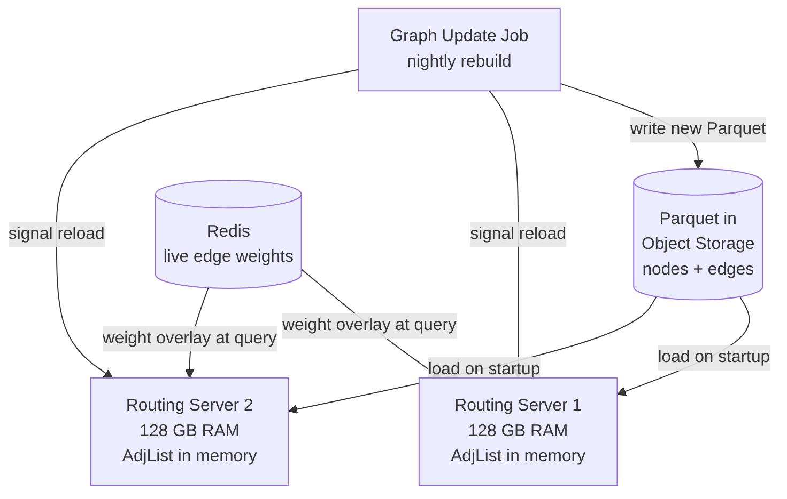
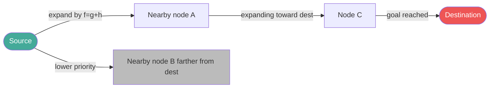
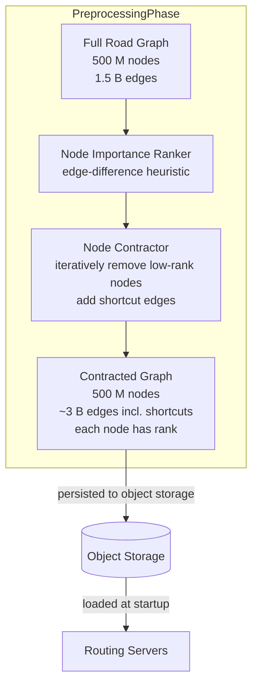
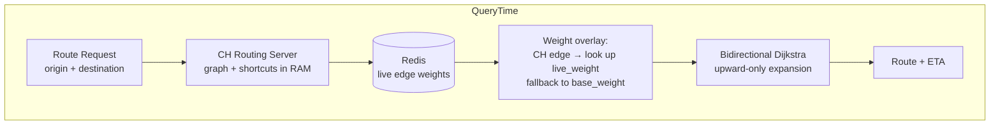
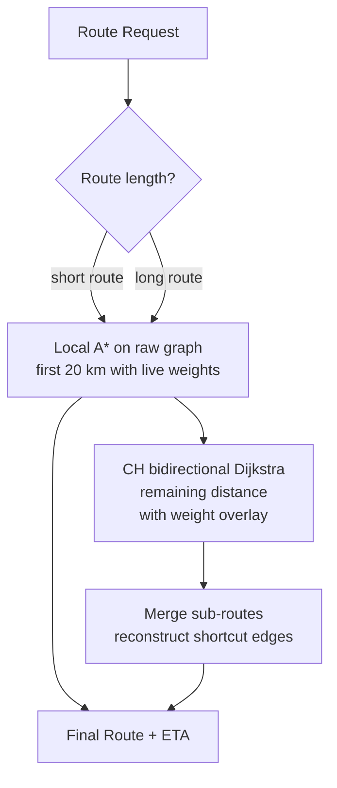
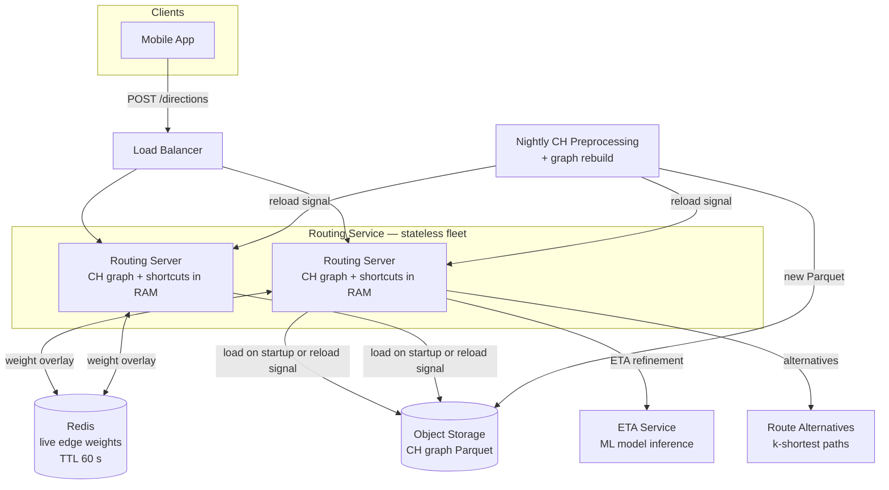

We evolve the v1 routing design through four refinements: in-memory graph representation, progressively faster path-finding algorithms, contraction hierarchies for continental scale, and live-traffic overlay. Each refinement follows **Problem → Modification → Justification & trade-offs**.

## Refinement 1 — Road graph storage: database to in-memory adjacency list

**Problem.** v1 stores the road graph in a relational database. Every routing query must issue dozens to thousands of `SELECT * FROM edges WHERE from_node = ?` queries across a network round-trip per hop — completely unusable for a depth-first or priority-queue traversal of millions of edges.

**Modification.** At startup, each routing server loads the full continental graph into an **in-memory adjacency list**: a flat array of 500 M node records, each pointing to a compact list of outgoing edges.

```
AdjList[node_id] → [ (to_node, dist_m, road_type, base_weight), ... ]
```

The source of truth remains Parquet files in object storage; the in-memory structure is a read-only derivative reloaded on server restart or triggered by a graph-update event. Live edge weights for the current session are stored separately in Redis (`"ew:{edge_id}"`) and blended in at query time.



**Justification & trade-offs.** Edge traversal becomes a pointer dereference in local RAM — nanoseconds instead of network round-trips. The 83 GB working set fits on a single commodity server. Multiple identical servers provide redundancy and horizontal read scaling without any shared state. The trade-off is memory cost and a cold-start reload time of ~2–3 minutes; mitigated by keeping at least one server warm during rolling restarts.

## Refinement 2 — Path-finding: Dijkstra → A* with haversine heuristic

**Problem.** With the graph in memory, Dijkstra is the natural first algorithm. But Dijkstra explores **all nodes** within increasing cost from the source, in every direction. For a city-to-city route across a continent, it may visit hundreds of millions of nodes before reaching the destination — taking seconds, not milliseconds.

### Dijkstra (brief recap)

Dijkstra maintains a priority queue ordered by cost-from-source `g(n)`. At each step it dequeues the cheapest unvisited node `u`, then for each neighbour `v` relaxes: if `g[u] + w(u,v) < g[v]`, update `g[v]` and re-enqueue `v`. It terminates when the destination is dequeued. Time complexity: **O((V + E) log V)** with a binary heap. With V = 500 M nodes, even a fast constant factor means seconds per query.

### A* Search

A* adds a **heuristic function h(n)** to guide the search toward the destination. The priority queue now sorts by:

```
f(n) = g(n) + h(n)
```

where `g(n)` is the true cost from source to `n`, and `h(n)` is an estimate of the remaining cost from `n` to the destination.

**The heuristic for road networks is straight-line (haversine) distance divided by the maximum possible travel speed on the network:**

```
h(n) = haversine(n, destination) / V_max
```

`haversine` returns the great-circle distance between two lat/lng coordinates in metres; dividing by `V_max` (e.g. 140 km/h = 38.9 m/s for motorway networks) gives a lower-bound travel time — because the actual road distance is never shorter than the straight-line distance, and the actual speed is never faster than `V_max`.

**Admissibility:** An admissible heuristic never overestimates the true remaining cost. Because road distance ≥ straight-line distance and speed ≤ V_max, `h(n) ≤ actual_cost(n, destination)` always. This guarantees A* finds the optimal path.

**Consistency (monotonicity):** `h(u) ≤ w(u,v) + h(v)` for every edge `u→v`. The haversine heuristic satisfies the triangle inequality, so it is also consistent. Consistency means A* never re-opens a closed node — the closed set check is safe.

**Why A* explores far fewer nodes:** Because the priority queue orders by `f = g + h`, nodes that are far from the destination or expensive to reach are deprioritised. The search expands in an ellipse toward the destination rather than a growing circle in all directions. For city-level routes, A* may explore 10–100× fewer nodes than Dijkstra, achieving sub-100 ms queries.



**A* pseudocode with haversine heuristic:**

```python
from heapq import heappush, heappop
from math import radians, sin, cos, sqrt, atan2

R_EARTH_M = 6_371_000
V_MAX_MS  = 38.9          # 140 km/h in m/s

def haversine(a, b):
    lat1, lon1 = radians(a.lat), radians(a.lng)
    lat2, lon2 = radians(b.lat), radians(b.lng)
    dlat = lat2 - lat1; dlon = lon2 - lon1
    x = sin(dlat/2)**2 + cos(lat1)*cos(lat2)*sin(dlon/2)**2
    return 2 * R_EARTH_M * atan2(sqrt(x), sqrt(1-x))

def h(node, target):
    return haversine(node, target) / V_MAX_MS   # admissible lower bound in seconds

def a_star(adj, nodes, source_id, target_id):
    INF = float('inf')
    g   = {source_id: 0}
    pq  = [(h(nodes[source_id], nodes[target_id]), source_id)]
    prev = {}

    while pq:
        f, u = heappop(pq)
        if u == target_id:
            return reconstruct(prev, source_id, target_id)
        if f > g.get(u, INF) + h(nodes[u], nodes[target_id]):
            continue                             # stale entry
        for v, weight in adj[u]:                 # weight = live_weight seconds
            ng = g[u] + weight
            if ng < g.get(v, INF):
                g[v] = ng
                prev[v] = u
                heappush(pq, (ng + h(nodes[v], nodes[target_id]), v))
    return None  # no path

def reconstruct(prev, src, tgt):
    path = []
    n = tgt
    while n != src:
        path.append(n); n = prev[n]
    return list(reversed(path))
```

**Justification & trade-offs.** A* is optimal with an admissible heuristic and consistent with a monotone heuristic. It vastly reduces node exploration for routing within a metropolitan area. The haversine heuristic is cheap to compute (a handful of trig operations). Trade-off: for very long routes across a continent where roads follow curved, indirect paths, A* still explores millions of nodes — too slow for the 500 ms SLO.

## Refinement 3 — Continental routing: A* → Contraction Hierarchies

**Problem.** A* with haversine is fast for city routes but can still take seconds on trans-continental queries. A Paris-to-Moscow route on a 500 M node European graph may explore 50 M+ nodes even with a good heuristic — far exceeding the 500 ms budget.

**Insight: not all nodes are equally important.** A rural intersection between two local lanes is rarely on any long-distance path. A major motorway interchange is on millions. **Contraction Hierarchies (CH)** exploit this by precomputing shortcuts that skip low-importance nodes, then running a bidirectional Dijkstra on the compressed graph.

### Preprocessing phase (offline, ~hours for a continental graph)

1. **Rank nodes by importance.** A common measure is *edge difference*: the number of shortcut edges added when node v is contracted minus the number of edges incident to v that are removed. Nodes with low edge difference (few shortcuts needed) are contracted first.

2. **Contract nodes in importance order.** When contracting node v, for each pair of neighbours (u, w) where the only shortest path from u to w goes through v, insert a **shortcut edge** u→w with cost `cost(u,v) + cost(v,w)`. This preserves all shortest-path distances without routing through v.

3. **Build the hierarchy.** After contraction, each node has a rank. Higher-rank nodes represent motorways, expressways, and major junctions; lower-rank nodes represent local streets. The resulting graph has ~2–3× more edges (shortcuts), but each query touches only a tiny fraction.



### Query phase (online, < 1 ms typical)

Run **bidirectional Dijkstra** on the CH graph, but with a crucial restriction:

- The **forward search** from the source only relaxes edges going to **higher-rank** neighbours.
- The **backward search** from the destination only relaxes edges going to **higher-rank** neighbours (i.e., follows incoming shortcut edges in reverse).

Both searches "climb" the hierarchy. They meet at one or more high-rank nodes (major motorway junctions). The shortest path is the minimum over all meeting-point tentative distances.

```python
def ch_query(ch_graph, source, target):
    INF = float('inf')
    d_fwd = {source: 0};  d_bwd = {target: 0}
    pq_fwd = [(0, source)];  pq_bwd = [(0, target)]
    best = INF;  meeting_node = None

    while pq_fwd or pq_bwd:
        # forward step — upward edges only
        if pq_fwd:
            d, u = heappop(pq_fwd)
            if d > d_fwd.get(u, INF): continue
            if u in d_bwd:
                candidate = d_fwd[u] + d_bwd[u]
                if candidate < best:
                    best, meeting_node = candidate, u
            for v, w in ch_graph.upward_edges(u):   # v.rank > u.rank
                nd = d_fwd[u] + w
                if nd < d_fwd.get(v, INF):
                    d_fwd[v] = nd
                    heappush(pq_fwd, (nd, v))

        # backward step — symmetric; upward edges in the reverse graph
        if pq_bwd:
            d, u = heappop(pq_bwd)
            if d > d_bwd.get(u, INF): continue
            if u in d_fwd:
                candidate = d_fwd[u] + d_bwd[u]
                if candidate < best:
                    best, meeting_node = candidate, u
            for v, w in ch_graph.upward_edges_reverse(u):
                nd = d_bwd[u] + w
                if nd < d_bwd.get(v, INF):
                    d_bwd[v] = nd
                    heappush(pq_bwd, (nd, v))

    return best, meeting_node   # unpack shortcuts to get turn-by-turn
```

**Why this is fast:** Both searches only climb to higher-rank nodes, so they each explore only a thin "upward sleeve" of the hierarchy — typically thousands of nodes, not millions. Real-world CH implementations achieve **< 1 ms** query times on graphs with 500 M nodes, compared to seconds for plain A*.

**Preprocessing vs query trade-off:**

| Property | Plain A* | Contraction Hierarchies |
|---|---|---|
| Preprocessing time | None | Hours (continental graph) |
| Preprocessing trigger | Never | Road network structural changes |
| Query time (city) | < 50 ms | < 0.1 ms |
| Query time (continent) | Seconds | < 1 ms |
| Live traffic support | Native (update weights) | Weight overlay at query time |
| Implementation complexity | Low | High |

**When to re-preprocess:** CH shortcuts depend only on the *topology* of the road network (which roads exist and connect), not on traffic conditions. Structural changes (new highways, road closures affecting topology) require a new preprocessing run — scheduled nightly or triggered by map data updates. Live traffic is applied as a **weight overlay** at query time, not baked into shortcuts.



**Justification & trade-offs.** CH is the industry standard for large-scale routing (used by OSRM, Valhalla, and the major commercial mapping providers). The preprocessing investment (hours) is amortised across billions of queries. The key trade-off is that shortcuts are valid only for static weights; incorporating live traffic at full fidelity (making traffic a first-class cost) would require re-preprocessing — impractical every minute. The weight-overlay approach (described next) is the practical compromise.

## Refinement 4 — Live traffic overlay on CH

**Problem.** CH shortcuts bake in free-flow travel times. When a motorway ahead has heavy congestion (live weight 5× higher), the shortcut's stored cost is wildly optimistic. The router may suggest a route that is actually slower than an alternative.

**Modification.** Apply live weights as a **query-time overlay**: before running the CH bidirectional Dijkstra, replace each edge's `base_weight` with `live_weight` from Redis if present (and not stale). For edges without a live measurement, fall back to a **time-of-day historical multiplier** from a pre-built lookup table (e.g. Monday 08:30 on this road type → 1.7× free-flow time).

For short-to-medium range routes (< 200 km), supplement CH with a **locally corrected A*** pass over the uncontracted graph segment near the origin (where congestion matters most), then handoff to CH for the remaining long-haul segment.



**Justification & trade-offs.** Near the driver, real-time traffic has the most impact on the immediate route decisions (the next few junctions). CH is most valuable for the long, highway-dominated segment where shortcuts are highly accurate even under moderate traffic variation. The hybrid approach gives the best of both: fresh local accuracy + millisecond continental speed. Trade-off: slightly more complex query logic and a brief performance hit for the local A* segment (still << 100 ms for 20 km at city density).

## Final Routing Architecture



## Drill-Down

### Road Graph Schema (in-memory adjacency list)

Each routing server materialises the graph as two arrays loaded at startup:

```
nodes[node_id]  = (lat: f32, lng: f32)          # 8 bytes/node × 500 M = 4 GB
adj[node_id]    = [ (to_node: u32,               # 4 bytes
                     dist_m:  u24,               # 3 bytes
                     road_type: u8,              # 1 byte
                     base_weight: f32,           # 4 bytes
                     edge_id: u32) ]             # 4 bytes → 16 bytes/edge × 1.5 B = 24 GB
ch_rank[node_id] = u32                           # 4 bytes × 500 M = 2 GB
shortcuts[]     = same structure as adj          # ~1.5 B shortcuts ≈ 24 GB
```

Total in-memory: ~12 GB (nodes) + ~24 GB (edges) + ~24 GB (shortcuts) + ~24 GB CH rank + overhead ≈ **83 GB** (matches the estimation).

### ETA Estimation

Raw CH query duration is free-flow time. ETA estimation layers three signals:

1. **Historical speed profiles:** per edge, per 15-minute bucket, per day-of-week. Stored in a columnar table; lookup is O(1) by `(edge_id, dow, bucket)`.
2. **Real-time traffic weight:** live edge speeds from the GPS probe stream (described in the [tiles & traffic deep dive]({})); applied as multiplicative weight overlay.
3. **ML correction:** a gradient-boosted model (or deep sequence model) trained on millions of historical journeys learns patterns that static speed profiles miss — e.g. school pickup surge on a Tuesday, post-match traffic from a stadium. Model features: route distance, road-type breakdown, time of day, weather proxy, special events. Served via the [ML platform]({}).

```
eta_s = sum over route edges of:
    edge_base_time(e) × historical_multiplier(e, dow, bucket) × ml_correction_factor
```

Confidence interval is estimated from variance in the historical multiplier for the given time window.

### Route Alternatives

Two approaches used in combination:

1. **Plateau heuristic (Yen's k-shortest paths variant):** run the primary CH query, then penalise edges on the optimal route and re-query. Repeat k–1 times. Fast, but alternatives tend to share long road segments with the primary route.
2. **Via-node alternatives:** identify a set of geographically diverse "gateway" nodes (highway interchanges, city entry points) between origin and destination, and compute best-route via each gateway. Routes that differ by more than 20% in total path share qualify as distinct alternatives.

Alternatives are filtered: only routes within 1.2× the optimal ETA are surfaced; geographically near-identical routes are de-duplicated.

### Edge Cases & Failure Handling

- **Graph reload during live traffic:** rolling restart — new server loads new graph while old server still serves; LB drains old instance gracefully.
- **Redis unavailable (live weights):** fall back to historical multiplier × base_weight. ETA accuracy degrades slightly but routing remains correct.
- **No path exists** (e.g. island with no ferry): CH bidirectional search returns INF — API returns 422 with a descriptive error.
- **Turn restrictions:** modelled as forbidden turn edges (u→v→w is disallowed) by splitting junction nodes; stored as penalty edges in the adjacency list.
- **One-way streets:** directed edges in the adjacency list; backward search in CH uses a separate reverse adjacency list.
