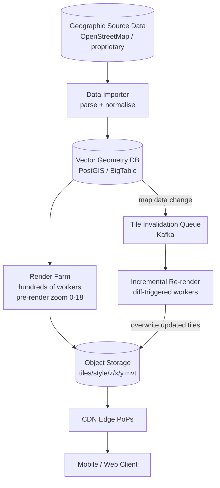
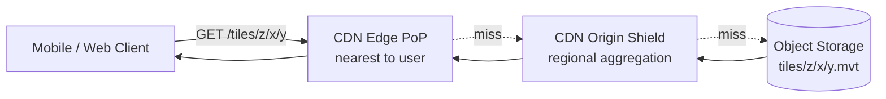
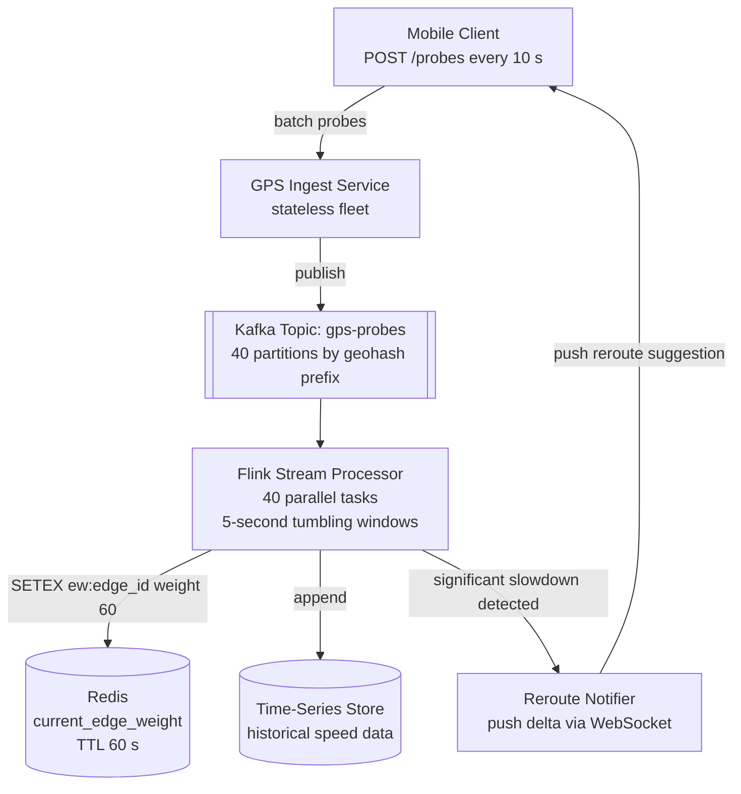
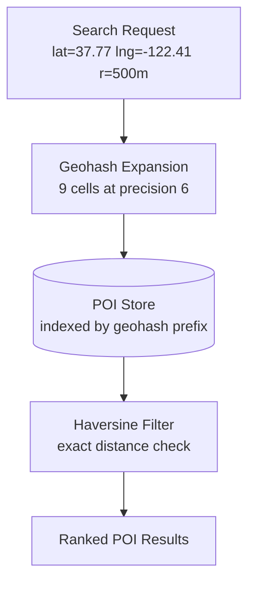
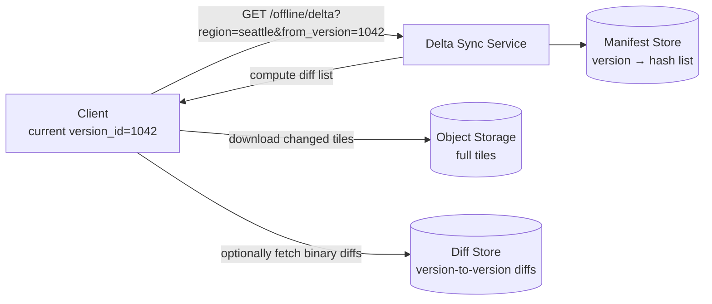
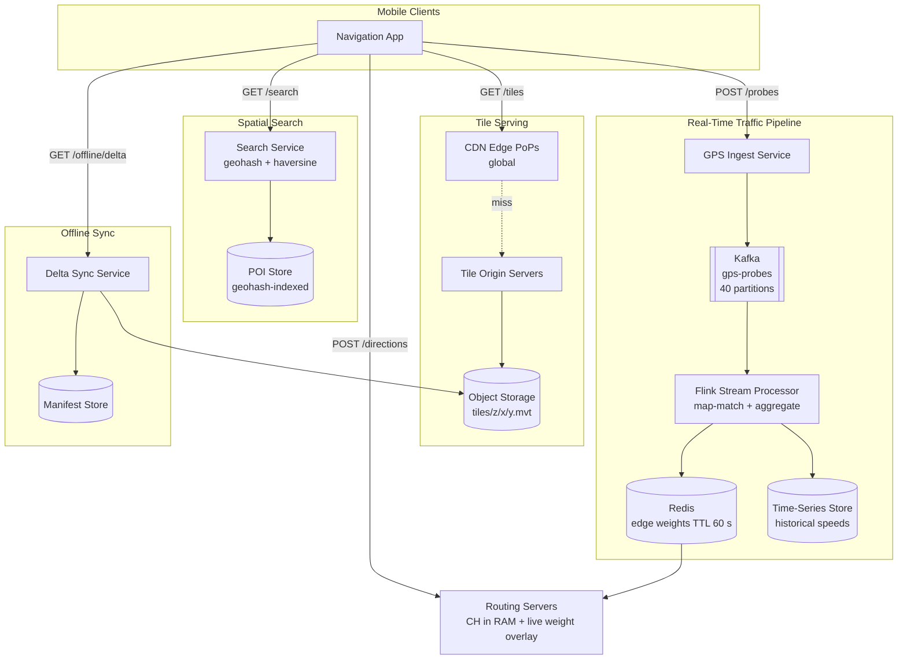

This deep dive covers the map tile pipeline, real-time traffic ingestion and propagation, spatial indexing, and offline maps. Each section follows **Problem → Modification → Justification & trade-offs**.

## Refinement 1 — Tile generation: on-demand rendering to pre-built pyramid

**Problem.** v1 renders tiles on the fly when a user requests them. Rendering a single tile involves rasterising road geometry, land-use polygons, and label placements from source geographic data — 50–200 ms of CPU per tile. At 580 K tile requests/s, on-demand rendering would require tens of thousands of render cores and still couldn't meet the 50 ms latency SLO.

**Modification.** Pre-render the full tile pyramid in batch, store tiles in [object storage]({}), and serve them as static assets. Only zoom levels 19–20 (building-level detail) for sparse regions are rendered on-demand with a short cache.

**Tile key scheme:** every tile on Earth can be addressed by three integers `(zoom, x, y)` following the Web Mercator XYZ convention:

- At zoom level `z`, the world is divided into a grid of `2^z × 2^z` tiles.
- `x` = column (0 → left/west, 2^z–1 → right/east).
- `y` = row (0 → top/north, 2^z–1 → bottom/south).
- A tile at `(z, x, y)` covers exactly the area of four tiles at `(z+1, 2x, 2y)`, `(z+1, 2x+1, 2y)`, `(z+1, 2x, 2y+1)`, `(z+1, 2x+1, 2y+1)` — the quadtree parent–child relationship.

Object storage key: `tiles/{style}/{zoom}/{x}/{y}.mvt` (Mapbox Vector Tile) or `.png` for raster.

**Tile generation pipeline:**



**Justification & trade-offs.** Pre-rendering turns tile serving into pure object-storage reads — microseconds of I/O. The trade-off is storage (~53 TB pre-rendered, see [HLD]({})) and re-render latency when map data changes. Map data for a city changes incrementally; incremental re-render processes only the affected tiles (typically a few thousand per edit). Zoom 0–10 tiles change rarely and are cheap; zoom 15–18 tiles for a city block may need re-render within minutes of a map edit.

## Refinement 2 — Tile serving: origin-direct to CDN

**Problem.** Even with pre-rendered tiles, serving 580 K/s from a few origin servers is impractical — the bandwidth alone is 17 GB/s. Most of this traffic is spatially redundant: the same zoom-13 tile for central Paris is served to millions of Parisian users every day.

**Modification.** Place a global [CDN]({}) in front of object storage. Tile keys (`{zoom}/{x}/{y}`) are permanent and deterministic, making them ideal CDN cache keys. Popular tiles (zoom 0–15) have effectively infinite TTLs; they are only invalidated when the underlying map data changes, which triggers a CDN purge for the affected tile keys.



**Cache hit math:** Zoom levels 0–13 have ≤ 67 M total tiles worldwide; the populated subset is ≤ 5 M tiles × 80 KB = 400 GB — trivially warm at every major CDN PoP. For zoom 14–17, regional CDN nodes cache the tiles for their local geography. Expected CDN hit ratio: **> 95 %**, matching the 29 K/s origin load in the capacity estimate.

**ETag-based cache validation:** each tile has an ETag equal to the SHA-256 of its content. Clients send `If-None-Match: <etag>` on repeat requests; unchanged tiles return HTTP 304 with zero body transfer. This halves bandwidth for clients that are panning over previously viewed areas.

**Justification & trade-offs.** CDN shifts ~95 % of tile bandwidth to edge PoPs, reducing origin load from 580 K/s to 29 K/s and improving latency for global users. Trade-off: tile invalidation on map changes requires cache purge coordination; purging millions of tiles after a large map edit takes minutes. For low-zoom tiles that change rarely, this is acceptable. For high-zoom tiles that reflect construction, the system prioritises freshness by setting shorter CDN TTLs (e.g. 1 hour for zoom 17+). See [caching patterns]({}).

## Refinement 3 — GPS probe ingestion: synchronous writes to Kafka stream

**Problem.** v1 writes GPS probes synchronously to a relational Traffic DB. At 2 M events/s, this overwhelms any single database — saturating connections, write IOPS, and lock contention simultaneously.

**Modification.** Insert [Kafka]({}) as an ingest buffer between probe endpoints and downstream processing. Each probe batch is published to a Kafka topic partitioned by `geohash_prefix` (so probes from the same geographic area land on the same partition and are processed in geographic locality). Downstream stream processors consume from Kafka, aggregate probes to per-edge speed estimates, and write current weights to Redis.



**Stream processing logic** (Flink tumbling-window, 5-second windows):

```python
# Pseudocode: Flink map-match-and-aggregate job
for window in tumbling_windows(5_seconds):
    probe_batch = window.get_events()          # ~10 M probes per window
    matched = map_match(probe_batch)           # snap GPS coords to nearest edge
    for edge_id, probes in group_by_edge(matched):
        speeds = [p.speed_ms for p in probes]
        median_speed = median(speeds)
        weight_s = edge.dist_m / max(median_speed, 0.1)   # seconds to traverse
        redis.setex(f"ew:{edge_id}", 60, weight_s)
        tsstore.append(edge_id, window.end_ts, median_speed, len(speeds))
        if weight_s > edge.base_weight * 2.0:             # significant congestion
            reroute_notifier.publish(edge_id, weight_s)
```

**Map matching** snaps a raw GPS coordinate to the nearest road edge using a combination of haversine proximity and heading alignment — a Hidden Markov Model over recent GPS samples is the standard approach. See [location indexing]({}).

**Justification & trade-offs.** Kafka absorbs the 2 M event/s burst (with 40 × 50 MB/s partitions), decoupling ingest from processing. The stream processor writes only aggregated edge weights to Redis — reducing the write rate from 2 M/s (raw probes) to ~100 K edge updates/s (one update per active edge per window). See [stream processing engines]({}). Trade-off: 5-second windowing introduces up to 5 s of lag between a congestion event and weight propagation, plus ~15 s Redis TTL uncertainty — within the 30 s consistency budget. Kafka retention of raw probes is 24 h, enabling replay for debugging and reprocessing.

## Refinement 4 — Spatial indexing: QuadTree for tiles and POIs

**Problem.** The tile service and search service need efficient spatial lookups: "which tiles cover this bounding box?" and "which POIs are within 500 m of this point?" Without a spatial index, these queries are full table scans.

**QuadTree structure for tiles:**

A QuadTree recursively subdivides the 2D map plane into four quadrants. At each level, a node represents a tile `(zoom, x, y)` and has up to four children representing the four tiles at the next zoom level that fall within it. This maps exactly onto the Web Mercator tile pyramid — the QuadTree *is* the tile hierarchy.

Tile lookup: "give me all tiles visible in this viewport" → traverse the QuadTree to find nodes that intersect the viewport bounding box at the requested zoom level. Traversal is O(k) where k = number of tiles in the result set (typically 9–25 tiles for a mobile viewport). See [QuadTree]({}).

```
QuadTree node:
  zoom:   int
  x, y:   int          ← tile coordinates
  bounds: BBox         ← (min_lat, min_lng, max_lat, max_lng)
  children: [NW, NE, SW, SE] | null   ← null at zoom=20 (leaf)
  tile_url: string     ← object storage key if this node is a leaf
```

**Geohash for POI indexing:**

POIs are indexed by [geohash]({}) prefix: a geohash at precision 6 covers a ~1.2 km × 0.6 km cell. A query for "coffee shops within 500 m" expands to 9 geohash cells (the target cell + 8 neighbours at precision 6), then filters by exact haversine distance. This reduces the search space from the full POI table to a few thousand rows per query. See also [location indexing]({}).



**Justification & trade-offs.** QuadTree traversal for tile lookup is O(log(zoom_levels) + result_count) — trivially fast. Geohash prefix filtering reduces POI scan to a bounded geographic area; the 9-cell expansion handles boundary effects (a POI just across a cell boundary is still found). Trade-off: geohash cells are rectangular, not circular, so the haversine post-filter is needed to enforce circular radius. For [hotspot cells]({}) (e.g. Times Square POI density), shard the geohash prefix table by the last character to distribute load.

## Refinement 5 — Offline maps: delta sync

**Problem.** Offline map downloads require the client to download gigabytes of tile and graph data. Re-downloading the full region on every map update is prohibitively expensive for users on metered connections.

**Modification.** Implement a **delta sync** protocol:

1. **Region snapshot versioning.** Each downloadable region (e.g. "Seattle Metro") is associated with a `version_id` (a monotonic integer or content hash) and a manifest: the list of tile keys and graph segment identifiers included in the region, with their content hashes.

2. **Delta manifest.** When the client reconnects, it sends its current `version_id`. The server returns a delta manifest: only the tiles and graph segments whose content hashes have changed since `version_id`. The client downloads only the diff.

3. **Binary delta compression.** For tile updates (e.g. a road name change at zoom 16), the server can optionally provide binary diffs (bsdiff / zstd-dict) against the client's cached tile rather than a full tile retransmission.



**Justification & trade-offs.** Typical weekly delta for a metro region is 0.1–1 % of the full download — users keep offline maps fresh with a few MB of data per week. Trade-off: the server must maintain manifests and diffs for the retention window (e.g. 6 months of versions). Storage cost: 180 daily manifests × 50 MB/manifest × 200 regions = ~1.8 TB of manifests — manageable in object storage with lifecycle rules. Graph delta sync uses the same mechanism on the adjacency list Parquet files (columnar format enables column-level diffs).

## Final Tiles & Traffic Architecture



## Drill-Down

### Tile Key Scheme and Conversion

Converting lat/lng to tile coordinates at zoom level `z`:

```python
import math

def lat_lng_to_tile(lat, lng, zoom):
    n = 2 ** zoom
    x = int((lng + 180.0) / 360.0 * n)
    lat_rad = math.radians(lat)
    y = int((1.0 - math.log(math.tan(lat_rad) + 1.0/math.cos(lat_rad)) / math.pi) / 2.0 * n)
    return zoom, x, y

def tile_to_bbox(zoom, x, y):
    n = 2 ** zoom
    lng_w = x / n * 360.0 - 180.0
    lng_e = (x+1) / n * 360.0 - 180.0
    lat_n = math.degrees(math.atan(math.sinh(math.pi * (1 - 2*y/n))))
    lat_s = math.degrees(math.atan(math.sinh(math.pi * (1 - 2*(y+1)/n))))
    return lat_s, lng_w, lat_n, lng_e
```

The client SDK computes the set of tile keys visible in the current viewport and issues parallel `GET /tiles/{z}/{x}/{y}` requests, typically fetching 9–25 tiles per screen render.

### Rerouting Flow

When the Flink stream processor detects that an edge's live weight has exceeded 2× its base weight (significant congestion):

1. The **Reroute Notifier** publishes an `edge_slow` event to a second Kafka topic.
2. A lightweight **Reroute Consumer** checks which active navigation sessions include that edge in their current route (stored as a session-to-route-edges index in Redis).
3. For affected sessions, the consumer triggers a re-route computation (CH query with updated weights) and pushes the new route to the client via a persistent connection ([WebSocket at scale]({})) or server-sent events.

This avoids re-routing every user on every weight update — only sessions whose active route contains the congested edge are re-evaluated.

### ETA Pipeline with ML Correction

```
ETA_final = ETA_base × f_historical(edge, dow, bucket) × f_ml(features)

Features for ML model (gradient boosted tree or LSTM):
  - Time of day, day of week, is_holiday
  - Route composition: % motorway, % urban, total distance
  - Live traffic condition on departure segments (0–20 km)
  - Weather proxy (temperature, precipitation flag from weather API)
  - Special event flag (stadium, concert — from event calendar)
  - Historical ETA accuracy for this route segment

Trained on: millions of completed journeys (actual arrival vs. predicted ETA)
Served via: [ML platform]({}) (low-latency feature lookup + model inference < 10 ms)
Retrained: weekly on a rolling 6-month journey window
```

### Historical Traffic Time-Series Schema

```sql
edge_speeds_hourly  (pre-aggregated from raw 5-s windows)
  edge_id     BIGINT
  dow         TINYINT      -- 0=Mon, 6=Sun
  hour_bucket TINYINT      -- 0-23
  speed_p50   FLOAT        -- metres per second
  speed_p10   FLOAT        -- slow day estimate
  speed_p90   FLOAT        -- fast day estimate
  sample_n    INT
  PRIMARY KEY (edge_id, dow, hour_bucket)
```

Partitioned by `edge_id` range; accessed by routing servers at query time for historical multiplier lookup. Stored in a wide-column store (Cassandra-style) for point-read performance by primary key.

### Offline Map Region Manifest

```json
{
  "region_id": "seattle-metro",
  "version_id": 1043,
  "created_at": "2026-07-24T02:00:00Z",
  "tiles": [
    { "key": "15/5242/11751", "hash": "a3f2...", "size_bytes": 28416 },
    ...
  ],
  "graph_segments": [
    { "segment_id": "wa-north-01", "parquet_key": "graph/wa-north-01-v1043.parquet", "hash": "b91c..." },
    ...
  ]
}
```

Diff from version 1042 → 1043: only tiles and segments whose `hash` changed are listed.

### Edge Cases & Failure Handling

- **CDN purge on map update:** tile invalidation uses CDN purge API for changed tile keys. For large edits (new highway), purge is batched; a temporary `Cache-Control: max-age=300` is set during the purge window to avoid serving stale tiles indefinitely.
- **Flink lag during traffic spike:** if the stream processor falls behind, Redis TTLs expire and routing falls back to historical multipliers. The system degrades gracefully — routing is slightly less accurate but still functional.
- **Kafka partition imbalance:** GPS probes from a traffic jam are concentrated in a small geohash. A hot partition is rebalanced by sub-partitioning by device-ID hash for that cell. See [hotspot problems]({}).
- **Offline map stale after extended disconnect:** client checks manifest version on reconnect; if delta chain exceeds 6 months, it falls back to a full region download. Progress download (resumable HTTP range requests) handles interruptions.
- **GPS probe privacy:** probes are stripped of device ID at the ingest service before Kafka publication. Session tokens are rotating anonymised identifiers — no persistent user linkage.
