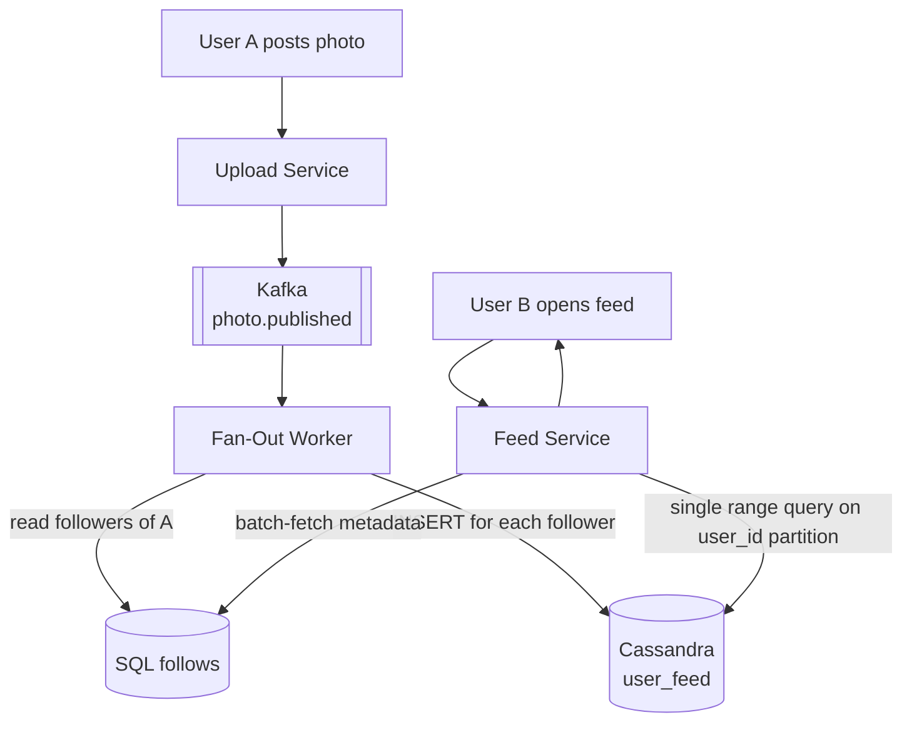
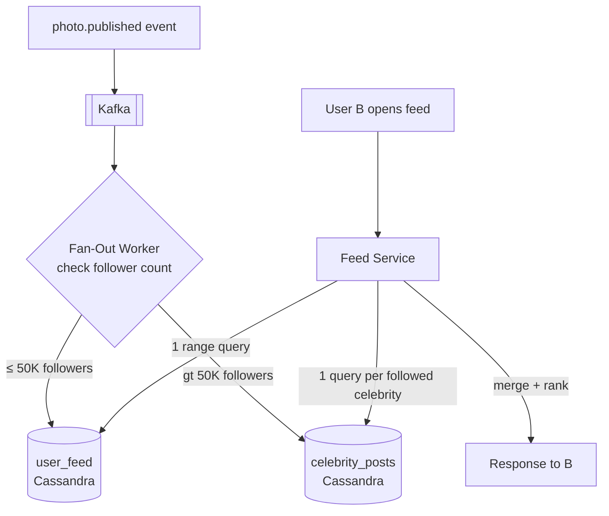
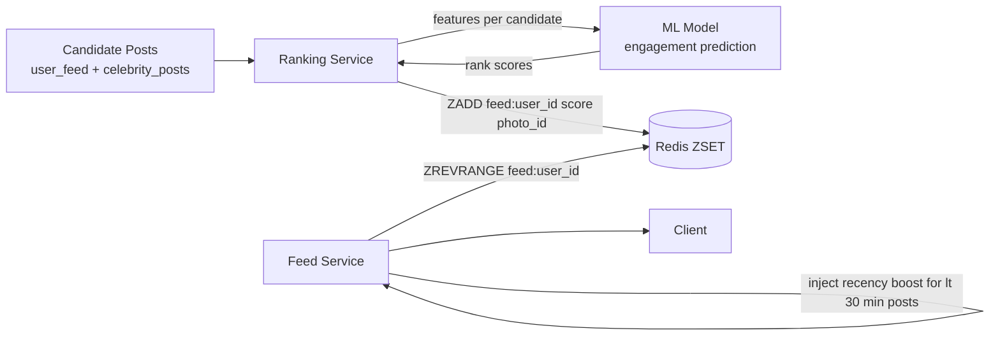
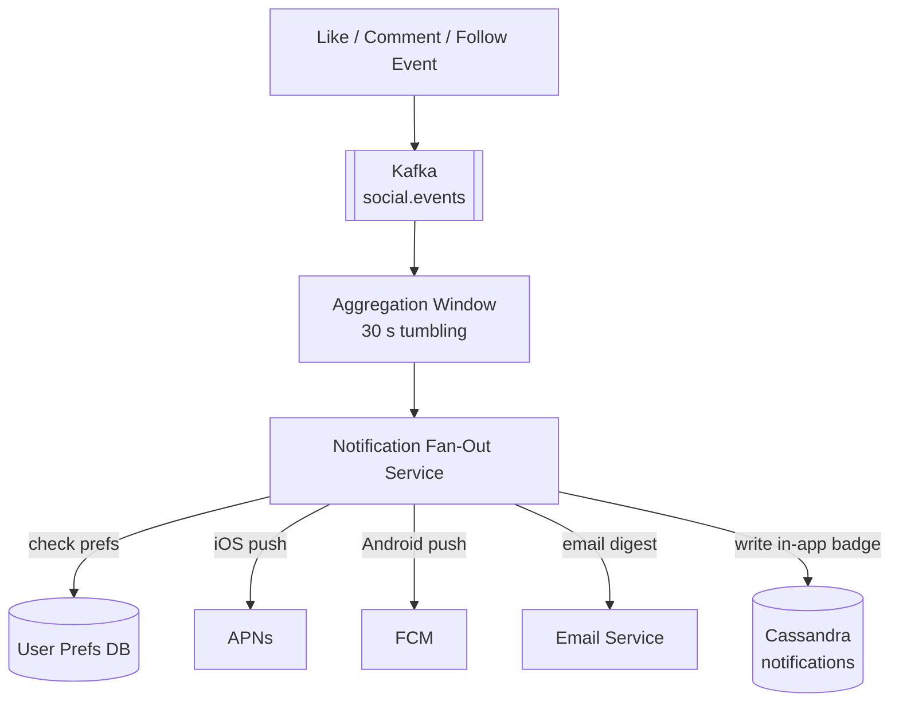
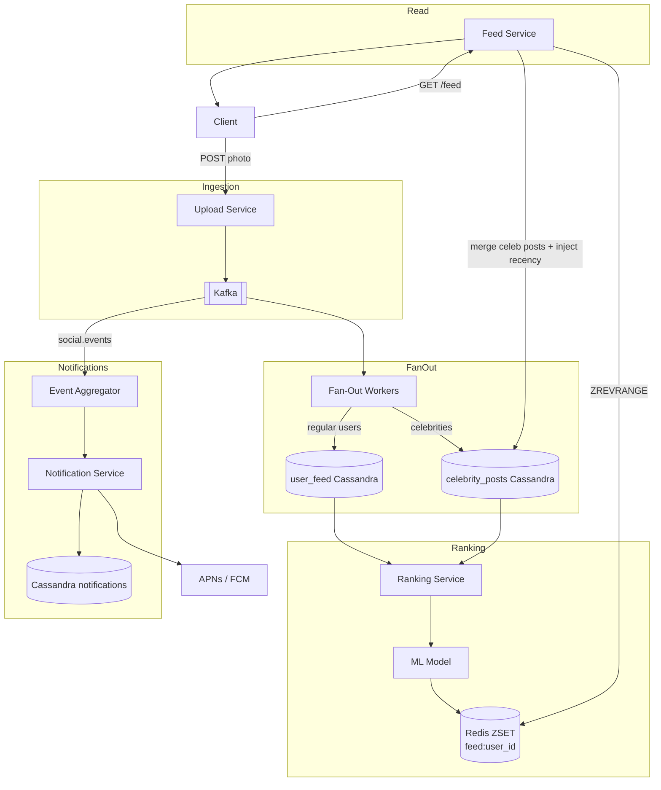

This page evolves the feed architecture from a naive pull-on-read through hybrid fan-out to a fully ML-ranked feed with notifications. Each refinement follows **Problem → Modification → Justification**.

## Refinement 1 — Pull-on-Read (Naïve Feed)

**Problem.** The simplest feed implementation: when User B opens their feed, the Feed Service queries the `follows` table for the list of users B follows, then issues one SQL query per followee to fetch their recent posts, merges and time-sorts the results, and returns a page. For a user following 1,000 accounts this means **1,000 sequential or parallel queries** at every single feed load — making p99 latency multiple seconds and SQLDB load proportional to every feed open. At 86,700 feed reads/s this is instantly fatal.

**Modification.** Invert the model: **fan-out on write**. When User A publishes a photo, a Kafka consumer reads A's follower list and inserts a row `(follower_id, photo_id, timestamp)` into a pre-computed Cassandra `user_feed` table for every follower. Reading the feed becomes a **single range query** on the current user's own partition.



**Justification & trade-offs.**

- **Reads are O(1):** one Cassandra partition scan regardless of how many accounts B follows. Perfect for 86,700/s peak.
- **Write amplification:** if A has 100,000 followers, one post generates 100,000 Cassandra writes. For a user with the median ~300 followers this is fine. For a celebrity with 50M followers it is catastrophic — the fan-out takes tens of minutes and saturates workers.

---

## Refinement 2 — Hybrid Fan-Out for Celebrities

**Problem.** Fan-out on write for a celebrity (50M followers) generates 50M Cassandra writes per post. This saturates the fan-out worker pool for minutes, violates the 30-second feed-freshness SLA for millions of users, and creates a write-amplification bomb every time a popular account posts.

**Modification.** **Hybrid fan-out**: classify users by follower count against a threshold (e.g. 50,000).

- **Regular users (≤ 50K followers):** fan-out on write as before — pre-compute rows into `user_feed`.
- **Celebrities (> 50K followers):** write the post only once to a `celebrity_posts` table (one row, not 50M). At read time the Feed Service fetches posts from every celebrity the viewer follows and **merges** those results with the viewer's pre-computed `user_feed`.

This is the same hybrid approach used by Twitter and WeChat. The key Instagram difference is that we fan-out **photo IDs** only — the actual photo bytes are always CDN-served, so read-time merging is cheap.



**Justification & trade-offs.**

- Eliminates the 50M-write bottleneck for celebrity posts entirely.
- Feed Service merges at most a small number of celebrity streams (a typical user follows ≤ 10 celebrities) — bounded, cheap overhead versus 50M writes.
- **Threshold management:** a user crossing 50K followers is re-classified. A background migration job converts their existing pre-computed fan-out entries to the celebrity model. This is an operational edge case but worth naming in an interview.
- **Read amplification for celebrities:** if a user follows 10 celebrities, the Feed Service makes 10 Cassandra queries at read time. These are parallelised and bounded, and result in a small read fan-out that is far cheaper than the alternative write fan-out.

See {} for the general fan-out trade-off analysis.

---

## Refinement 3 — ML-Ranked Feed

**Problem.** A chronological feed (score = timestamp) means a user misses posts from accounts they deeply care about when they follow many people, and surfaces content from infrequently-liked accounts at the top. Chronological is simple but drives lower engagement and session time.

**Modification.** Replace the `created_at` Cassandra clustering key score with an **ML ranking score** computed per `(user, candidate_post)` pair. The ML system uses signals including:

| Signal | Description |
|---|---|
| Recency | Post age in hours (decays exponentially) |
| Engagement rate | Likes + comments ÷ impressions in the first hour |
| Relationship strength | How often the viewer has engaged with this poster in 30 days |
| Content affinity | Cosine similarity of post embedding to user's liked-post embedding centroid |

The ranking service runs as two complementary jobs:

1. **Batch pre-ranking (every 5 min):** Scores the top 200 candidate posts per user (from `user_feed` + celebrity lookups), writes the scored list into Redis as a ZSET keyed by `feed:{user_id}`.
2. **Online ranking (at feed-open time):** If the cached ranked list is stale (> 5 min old), the Feed Service triggers an inline ranking call, merges very-recent posts at the top (bypass ranking for posts < 30 min old), and writes back to Redis.

See {} for retrieval and ranking architecture.



**Justification & trade-offs.**

- A ranked feed increases time-in-app, which is Instagram's core engagement metric.
- **Cold-start:** new users have no interaction history. Fall back to a popularity-based ranking (global engagement rate) or chronological until sufficient history accumulates (typically ~20 sessions).
- **Staleness window:** the 5-minute batch means a just-posted photo may not appear ranked for up to 5 minutes. The online path and recency boost mitigate this for the viewing user.
- **A/B experimentation:** ranked vs. chronological is a feature-flag decision; the underlying Cassandra `user_feed` supports both without schema changes.
- The **Explore page** uses a separate two-stage retrieval + ranking pipeline with no follow-graph constraint; see the {} for details.

---

## Refinement 4 — Notification Pipeline

**Problem.** A viral post receiving 100,000 likes in an hour generates like events at ~28 likes/s for that post. If every like triggers a push notification, the photo owner is spammed, notification gateways are hammered, and users disable notifications entirely — making them worthless.

**Modification.** Route all social events (like, comment, follow, mention) through **Kafka** and process them in a dedicated **Notification Fan-Out Service** that:

1. **Aggregates** bursty events within a 30-second tumbling window: "Alice and 42 others liked your photo."
2. **Decides delivery channel** based on user preferences (push, in-app badge, email digest).
3. **Calls platform gateways** (APNs for iOS, FCM for Android) or the email service.
4. **Writes to the in-app inbox** (Cassandra `notifications` table) so the badge count is correct even if push delivery fails.



**Justification & trade-offs.**

- Kafka absorbs like-storm spikes; the aggregation window prevents notification spam without losing any events (Kafka retains them).
- The Cassandra `notifications` inbox means badge counts are correct even when a user's device is offline — push notifications are best-effort, in-app inbox is durable.
- **Deduplication:** at-least-once Kafka delivery means a like event may be processed twice. Deduplicate using a short-TTL Redis set keyed by `(event_type, actor_id, subject_id)`.

See {}.

---

## Final Feed Architecture



---

## Drill-Down

### Feed Read Pseudocode

```python
def get_feed(user_id, cursor=None, limit=20):
    # 1. Pull pre-ranked post IDs from Redis ZSET
    max_score = decode_cursor(cursor)["score"] if cursor else "+inf"
    ranked_ids = redis.zrevrangebyscore(
        f"feed:{user_id}",
        max=max_score, min="-inf",
        start=0, count=limit * 2        # over-fetch; some may be deleted
    )

    # 2. Merge celebrity posts (fan-out on read; typically ≤ 10 celebs)
    celeb_ids = get_celebrity_followees(user_id)   # cached in Redis
    celeb_posts = []
    for celeb_id in celeb_ids:
        posts = cassandra.query(
            "SELECT photo_id, created_at FROM celebrity_posts "
            "WHERE poster_id = ? AND created_at < ? LIMIT ?",
            celeb_id, cursor_time or now(), limit
        )
        celeb_posts.extend(posts)

    # 3. Inject very-recent posts (< 30 min) at the top regardless of ML score
    recent = get_recent_followee_posts(user_id, since=now() - 30*60)
    merged = inject_recent_and_rank(ranked_ids, celeb_posts, recent, limit)

    # 4. Batch-hydrate metadata (single SQL round-trip with IN clause)
    photos = sql.batch_get(
        "SELECT * FROM photos WHERE photo_id IN (%s) AND status='published'",
        [p.photo_id for p in merged]
    )
    return photos, encode_cursor(merged[-1])
```

### Cursor Encoding

The cursor encodes both the ML rank score and photo ID so pagination is stable even as scores are refreshed between pages:

```
cursor = base64(json({"score": 0.8421, "photo_id": 7819283812, "ts": 1720000000}))
```

See {}.

### Hot Photo in Feed — Caching

A viral photo ID appears in millions of `user_feed` rows. When the Feed Service batch-fetches photo metadata, all those requests converge on the same SQL row. Protect this with **cache-aside**: photo metadata is stored in Redis with a 60-second TTL. A viral photo triggers one DB read within any 60-second window regardless of how many feeds it appears in. See {} and {}.

### Feed Freshness vs. ML Accuracy Trade-off

| Approach | Feed freshness | ML accuracy | Complexity |
|---|---|---|---|
| Fully real-time ranking (on every open) | Instant | Highest | High (latency risk) |
| 5-min batch + recency boost (chosen) | ~5 min lag | High | Medium |
| Hourly batch only | ~60 min lag | Acceptable | Low |

The 5-minute batch with a recency override is the industry sweet spot: batch ranking is cheap and parallelisable; the recency override ensures users see very-fresh posts even before the batch runs.
