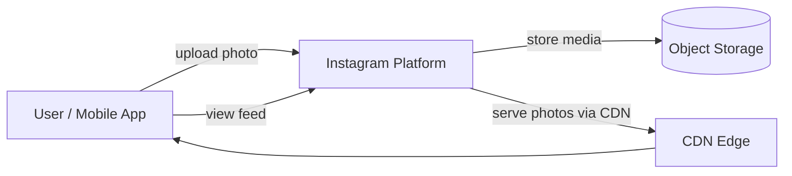
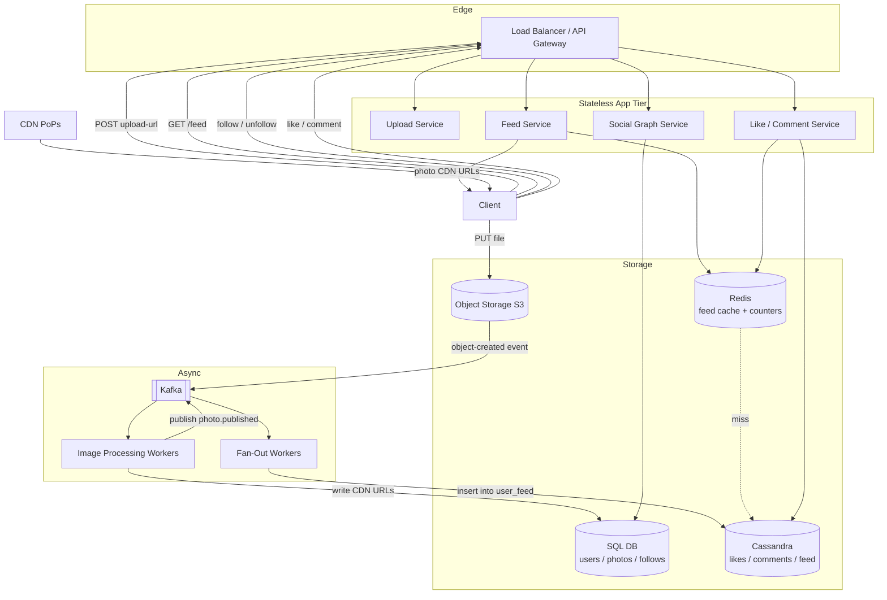

## Capacity Estimation

Show the arithmetic first — interviewers want to see the reasoning, not memorised numbers.

### Traffic

| Metric | Calculation | Result |
|---|---|---|
| Photo uploads (write QPS) | 100M / 86,400 s | **~1,160/s** |
| Peak upload QPS (3× burst) | 1,160 × 3 | **~3,480/s** |
| Feed opens (read QPS) | 500M DAU × 5 refreshes/day ÷ 86,400 | **~28,900/s** |
| Peak feed read QPS (3× burst) | 28,900 × 3 | **~86,700/s** |
| Read:write ratio (feed vs upload) | 28,900 / 1,160 | **~25:1** |

Feed reads dominate, but unlike a URL shortener the payload is **large media files** — so CDN egress bandwidth, not query count, is the real system bottleneck.

### Photo Storage

Each uploaded photo is processed into four stored variants:

| Variant | Typical dimensions | Compressed size |
|---|---|---|
| Original (archival) | User's native resolution | ~2 MB |
| High-res display | 1,080 px wide (WebP) | ~800 KB |
| Medium display | 720 px wide (WebP) | ~250 KB |
| Thumbnail | 150 px wide (WebP) | ~50 KB |
| **Total stored per photo** | | **~3.1 MB** |

| Metric | Calculation | Result |
|---|---|---|
| Raw storage per day | 100M photos × 3.1 MB | **~310 TB/day** |
| Raw storage per year | 310 TB × 365 | **~113 PB/year** |
| With 3× replication | 113 PB × 3 | **~340 PB/year** |

This scale **requires object storage** (S3, GCS) — not a relational or key-value database for binary blobs.

### CDN Bandwidth (Egress) — The Dominant Cost

| Traffic type | Calculation | Result |
|---|---|---|
| Thumbnail views (feed) | 2.5B opens × 12 thumbnails/page × 50 KB | **~1,500 TB/day** |
| Full-size photo views | 2.5B opens × 12 photos × 30% tapped × 800 KB | **~7,200 TB/day** |
| **Total CDN egress** | | **~8,700 TB/day ≈ 800 Gbps** |

The 800 Gbps egress figure makes CDN non-optional — serving from S3 origin would be ~10× more expensive and far slower globally.

### Metadata Storage

| Entity | Record size | Daily volume | Storage/day |
|---|---|---|---|
| Photo metadata | ~500 B | 100M | ~50 GB |
| Likes | ~50 B | ~4B (estimate) | ~200 GB |
| Comments | ~200 B | ~500M (estimate) | ~100 GB |
| Feed fan-out rows | ~20 B | ~50B (at avg 500 followers/user) | ~1 TB |

### Derived Infrastructure

- **Upload/Write nodes:** ~350 stateless nodes for 3,480/s peak (handing off processing to workers after receiving the upload).
- **Feed read nodes:** ~870 stateless nodes for 86,700/s peak.
- **Feed cache (Redis):** 500M users × top 50 post IDs × 8 B ≈ **200 GB**; a Redis cluster of ~30 nodes with replicas.
- **Cassandra cluster:** Absorbs ~1 TB/day of fan-out writes + likes + comments; sized at 100+ nodes across regions.

---

## API Design

All endpoints require an `Authorization: Bearer <token>` header (OAuth 2.0). See {}.

```
POST /api/v1/photos/upload-url
  Body: { "filename": "sunset.jpg", "size_bytes": 4200000 }
  200 → { "upload_url": "https://storage.example.com/presigned?...",
           "photo_id": "p7xKq3",
           "status_url": "/api/v1/photos/p7xKq3/status" }
  -- Client PUTs the file directly to upload_url, bypassing app servers

GET /api/v1/photos/{photoId}/status
  200 → { "status": "processing" | "published" | "failed" }

GET /api/v1/photos/{photoId}
  200 → { "photo_id", "user_id", "caption", "created_at",
           "urls": { "thumbnail": "https://cdn...", "display": "...", "high_res": "..." },
           "like_count", "comment_count" }
  404 → not found or deleted

GET /api/v1/users/{userId}/feed
  Query: ?cursor=<opaque_cursor>&limit=20
  200 → { "posts": [...], "next_cursor": "eyJzY29yZSI6..." }
  (cursor-based pagination — stable through feed updates)

POST /api/v1/photos/{photoId}/likes
  201 → { "like_count": 10423 }
  409 → already liked

DELETE /api/v1/photos/{photoId}/likes
  204

POST /api/v1/photos/{photoId}/comments
  Body: { "text": "Amazing shot!" }
  201 → { "comment_id": "c9xZ", "created_at": "..." }

GET /api/v1/photos/{photoId}/comments
  Query: ?cursor=<cursor>&limit=20
  200 → { "comments": [...], "next_cursor": "..." }

POST /api/v1/users/{userId}/follow
  201 → { "follower_count": 4821 }

DELETE /api/v1/users/{userId}/follow
  204
```

**Pagination:** Feed and comments use **cursor-based** (not offset) pagination — offset skips or duplicates entries when new posts insert while the user is scrolling. The cursor encodes `(rank_score, photo_id)` for stable traversal of a re-ranked feed. See {}.

**Resumable upload flow:** The client first calls `POST /upload-url` to obtain a pre-signed object-storage URL, then `PUT`s the file bytes directly to storage. This bypasses the app tier entirely and enables the client to resume large uploads after a network drop.

---

## Data Model

### Relational (PostgreSQL / Aurora) — Social Graph and Photo Metadata

```sql
-- Users
users (
  user_id          BIGINT       PRIMARY KEY,  -- Snowflake ID
  username         VARCHAR(30)  UNIQUE NOT NULL,
  display_name     VARCHAR(100),
  bio              TEXT,
  avatar_url       VARCHAR(512),
  follower_count   INT          DEFAULT 0,
  following_count  INT          DEFAULT 0,
  created_at       TIMESTAMP
)

-- Photos (metadata only — media bytes live in object storage)
photos (
  photo_id         BIGINT       PRIMARY KEY,  -- Snowflake ID
  user_id          BIGINT       REFERENCES users,
  caption          TEXT,
  location         VARCHAR(200),
  thumbnail_url    VARCHAR(512),
  display_url      VARCHAR(512),
  high_res_url     VARCHAR(512),
  original_key     VARCHAR(512),              -- object storage key for archival
  status           ENUM('processing','published','failed'),
  created_at       TIMESTAMP,
  INDEX (user_id, created_at DESC)            -- profile-page queries
)

-- Follows (social graph)
follows (
  follower_id      BIGINT,
  followee_id      BIGINT,
  created_at       TIMESTAMP,
  PRIMARY KEY (follower_id, followee_id),
  INDEX (followee_id)                         -- "who follows X?" fan-out lookups
)
```

### Wide-Column (Cassandra) — Likes, Comments, and Pre-Computed Feed

Wide-column stores handle write-heavy fan-out workloads where the access pattern is always by a known partition key. See {}.

```
-- Likes: "did user X like photo Y?" and "who liked photo Y?"
TABLE likes (
  photo_id    BIGINT,
  user_id     BIGINT,
  liked_at    TIMESTAMP,
  PRIMARY KEY (photo_id, user_id)   -- partition=photo, cluster=user
)

-- Comments: time-ordered per photo
TABLE comments (
  photo_id    BIGINT,
  comment_id  TIMEUUID,             -- time-ordered UUID; no extra sort column needed
  user_id     BIGINT,
  body        TEXT,
  PRIMARY KEY (photo_id, comment_id)
  WITH CLUSTERING ORDER BY (comment_id DESC)
)

-- Pre-computed feed (fan-out on write, for regular users)
TABLE user_feed (
  user_id     BIGINT,
  score       FLOAT,               -- ML rank score or timestamp (desc)
  photo_id    BIGINT,
  poster_id   BIGINT,
  PRIMARY KEY (user_id, score, photo_id)
  WITH CLUSTERING ORDER BY (score DESC, photo_id DESC)
)

-- Celebrity posts (fan-out on read, for accounts > 50K followers)
TABLE celebrity_posts (
  poster_id   BIGINT,
  created_at  TIMESTAMP,
  photo_id    BIGINT,
  PRIMARY KEY (poster_id, created_at, photo_id)
  WITH CLUSTERING ORDER BY (created_at DESC)
)
```

### Key-Value (Redis) — Feed Cache and Real-Time Counters

```
feed:{user_id}          ZSET    score=rank_score, member=photo_id  (top 200 posts)
like_count:{photo_id}   STRING  atomic INCR / DECR
comment_count:{photo_id} STRING atomic INCR
```

See {}.

---

## Architecture v1

### Level 0 — Context



### Level 1 — First-Cut Components



**Component responsibilities:**

- **Upload Service.** Issues pre-signed object-storage URLs; after the client uploads directly, an S3 event triggers the processing pipeline. Responds immediately with 202 and a status URL.
- **Image Processing Workers.** Kafka consumers that fetch originals from object storage, generate WebP variants at three sizes, write them back, and update SQL with CDN URLs. See {}.
- **Fan-Out Workers.** Consume `photo.published` events from Kafka; walk the poster's follower list and insert rows into Cassandra `user_feed` for every follower.
- **Feed Service.** Reads a pre-hydrated Redis sorted set of photo IDs, fetches photo metadata in batch from SQL, returns CDN URLs to the client (photo bytes come from CDN directly).
- **Like / Comment Service.** Writes to Cassandra for durable storage and atomically increments Redis counters for low-latency count display.
- **Social Graph Service.** Manages the `follows` table; read-your-writes consistency via sticky routing or SQL primary reads for the acting user.
- **CDN.** Caches processed photo variants at edge nodes globally. See {}.
- **Kafka.** Decouples upload acknowledgement from processing and fan-out; absorbs burst spikes in upload volume. See {}.

**v1 weaknesses addressed in the deep dives:**

1. Fan-out on write breaks for celebrities (50M followers → 50M Cassandra writes per post).
2. Chronological feed ignores engagement; a ranked feed is better but more complex.
3. Synchronous-style processing blocks large uploads on mobile.
4. Like storms on viral posts create Cassandra hot partitions.
5. No notification mechanism for likes, comments, or follows.
