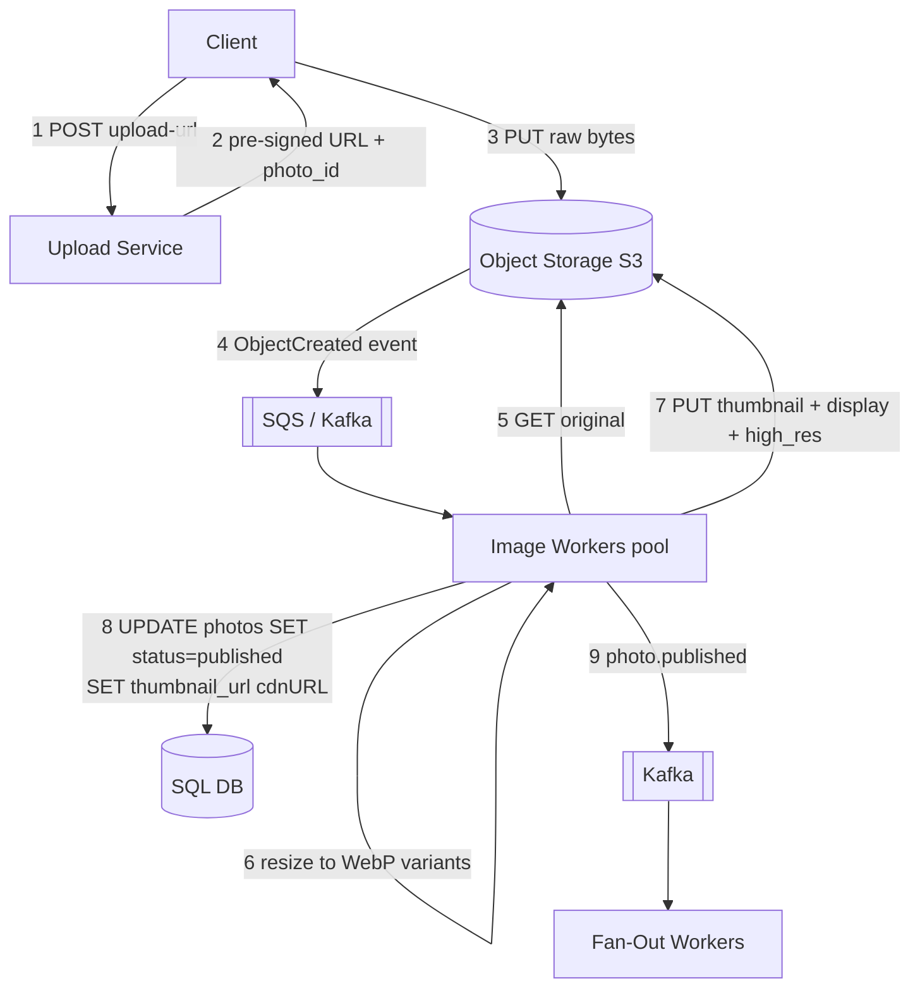
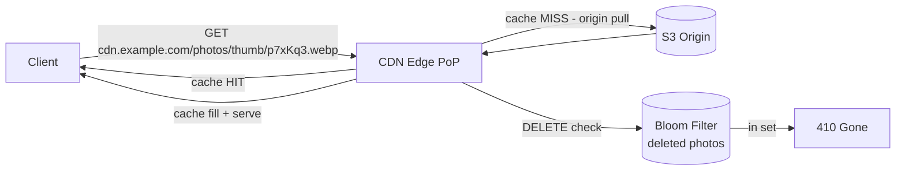
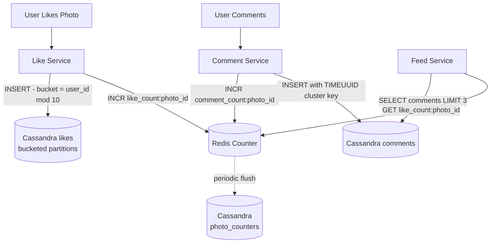
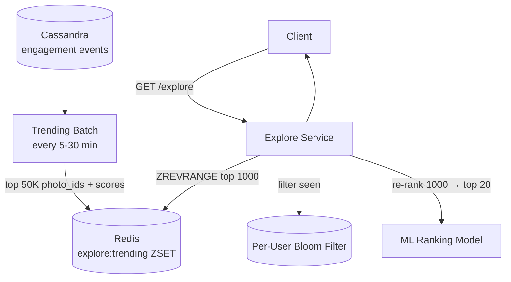
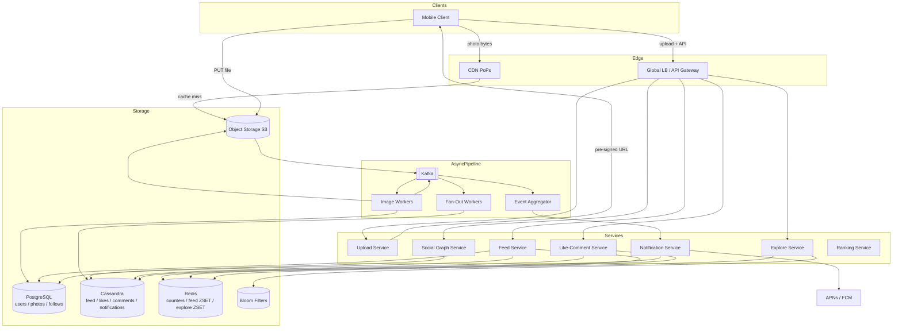

This page evolves the photo upload and serving pipeline from a synchronous bottleneck through a fully async CDN-backed system, then addresses likes/comments at scale and the Explore page.

## Refinement 1 — Async Photo Processing Pipeline

**Problem.** A naïve implementation processes photos synchronously: the Upload Service resizes the image, uploads all variants to S3, and only then responds to the mobile client. A 10 MB HEIC photo on a cellular connection can take 10–20 seconds to process, and any worker crash means a lost upload. The app tier becomes the upload bandwidth bottleneck — routing all photo bytes through it doubles egress cost (user → app server → S3).

**Modification.** Fully decouple upload from processing with a **pre-signed URL + async pipeline**:

1. Client calls `POST /upload-url` → Upload Service returns a **pre-signed S3 PUT URL** and a `photo_id`.
2. Client **PUTs the raw file directly to S3** — the app tier never touches the bytes.
3. S3 fires an `s3:ObjectCreated` event to an SQS queue → Kafka.
4. **Image Processing Workers** (a Kafka consumer pool) pick up the event, fetch the original from S3, run resize + format conversion (WebP), and write all variants back to S3.
5. Workers write CDN URLs to the `photos` SQL row and flip `status = 'published'`.
6. Workers publish a `photo.published` event to trigger fan-out (see Feed Deep Dive).
7. Client polls `/api/v1/photos/{photoId}/status` or receives a WebSocket push when status changes.



**Justification & trade-offs.**

- **Upload bandwidth bypasses the app tier:** 100M photos/day × 2 MB ≈ 2,312 TB/day goes directly from mobile clients to S3 — not through our servers.
- **Resumable uploads:** the client can use S3 Multipart Upload (parts up to 5 GB, resume after network drop) or the open TUS protocol for very large files. The `photo_id` is issued before upload starts, so the partial-upload state is recoverable.
- **Horizontal scaling:** image workers are Kafka consumers. A 3× upload spike adds worker containers without affecting the Upload Service.
- **Idempotent reprocessing:** if a worker crashes mid-way, the Kafka offset is not committed; another worker picks up the event. S3 `PUT` with the same key is idempotent (same key overwrites cleanly). The result is identical every time.
- **Failure path:** after N retries, failed events go to a Dead Letter Queue for manual review. See {}.

---

## Refinement 2 — Image CDN and Serving

**Problem.** Serving photos directly from S3 origin has three problems: (a) S3 egress pricing (~$0.09/GB) versus CDN pricing (~$0.01/GB) — a 9× cost penalty; (b) S3 is regionalised — a user in Singapore fetching from a US-East bucket adds 200 ms of latency; (c) every viewer pays the origin round-trip, even for the same photo viewed by millions simultaneously.

**Modification.** Put a **CDN layer** as the exclusive photo serving path:

1. All processed variants are written to S3 with the naming convention `photos/{size}/{photo_id}.webp`.
2. CDN origin is pointed to the S3 bucket. All photo URLs in API responses use `https://cdn.instagram.example.com/photos/{size}/{photo_id}.webp`.
3. S3 objects are stored with `Cache-Control: public, max-age=31536000, immutable` — photos are content-addressed and never change once processed.
4. CDN PoPs cache the variant on first request and serve all subsequent requests from edge memory/disk.
5. Deleted photos are handled by a **CDN edge function** that checks a Redis `deleted_photos` Bloom filter; if the photo ID is in the filter, the edge returns 410 without hitting origin. See {}.



**Bandwidth math revisited at the edge:**

| Scenario | Without CDN | With CDN (90% hit ratio) |
|---|---|---|
| Thumbnail views | 1,500 TB/day from S3 | 150 TB/day from S3 + 1,350 TB/day from edge |
| Full-size views | 7,200 TB/day from S3 | 720 TB/day from S3 + 6,480 TB/day from edge |
| **S3 egress cost** | **~$783K/day** | **~$78K/day** |

The CDN pays for itself immediately at this scale.

**Justification & trade-offs.**

- **Immutability makes CDN caching trivial** — no cache invalidation needed for photo content changes (there are none). A `max-age=31536000` header means each PoP caches a photo for up to 1 year.
- **WebP format** saves ~30% bandwidth vs JPEG at equivalent perceptual quality, further reducing egress cost.
- **CDN as DDoS shield:** the CDN absorbs volumetric attacks against the photo serving path. The origin (S3) is never exposed publicly.
- **Progressive loading:** the client loads the thumbnail (50 KB, fast) first, then swaps in the display variant (250 KB) when tapped — this is a client-side UX concern but depends on the CDN having both sizes cached.

See {} and {}.

---

## Refinement 3 — Likes and Comments at Scale

**Problem.** A viral photo can receive 100,000 likes in a minute — about 1,667 writes/s against a single `photo_id` partition in Cassandra. Cassandra handles high write throughput well **per partition**, but this hot partition can saturate the coordinator node for that token range. Additionally, displaying a like count via `SELECT COUNT(*) FROM likes WHERE photo_id = ?` is a full partition scan over potentially millions of rows — unacceptably slow for a field that appears on every feed card.

**Modification — Like count display:**

Maintain a **Redis string counter** per photo (`like_count:{photo_id}`). Each like/unlike calls Redis `INCR`/`DECR` atomically — Redis handles 100K+ ops/s per node at sub-millisecond latency. The Feed Service reads the counter directly from Redis; no Cassandra scan required.

**Counter durability:** periodically (every 60 seconds) flush Redis counters to a Cassandra `photo_counters` table using Cassandra **counter columns** (`UPDATE photo_counters SET like_count = like_count + 1 WHERE photo_id = ?`). If Redis is lost, reload the counter from Cassandra on next access.

**Modification — Hot partition for likes:**

Write-time **partition bucketing**: instead of `PRIMARY KEY (photo_id, user_id)`, use `PRIMARY KEY ((photo_id, bucket), user_id)` where `bucket = user_id % N` (e.g. N=10). Writes for the same photo now spread across N partitions. Reads scatter-gather: to check all likes for a photo, query all N buckets and union the results.



**Justification & trade-offs.**

- Redis `INCR` is O(1), runs in memory, and avoids any Cassandra row read for the count display path.
- Bucketing spreads write load across 10× more Cassandra coordinators — a 10× reduction in per-partition write pressure for viral posts.
- **Read complexity:** "who liked this photo?" now requires querying all N buckets and unioning. This is an acceptable trade-off since count reads (99% of cases) are far cheaper, while the full liker-list (the remaining 1%) can tolerate scatter-gather.
- **Cassandra counter columns** are idempotent on replay only if writes are single-increment; for durability backup, a full-count snapshot (not delta) is safer against double-counting on worker retry.

See {} and {}.

---

## Refinement 4 — Explore / Trending Page

**Problem.** The Explore page must surface globally trending or user-personalised content with **no follow-graph constraint**. This is a cold discovery surface — every eligible photo in the system is a candidate, not just posts from followed accounts. Running the ML ranking model over 100M daily photos in real time is infeasible.

**Modification.** Two-stage retrieval + ranking:

**Stage 1 — Candidate generation (offline, every 5–30 min):**
Compute a trending score for each photo using a sliding-window engagement metric:

```
trending_score = (likes_last_1h × 1.0) + (comments_last_1h × 1.5) + (saves_last_1h × 2.0)
               × recency_decay(age_hours)
```

A batch job (or Kafka Streams aggregation for near-real-time) computes this over the last hour's events, selects the top 50,000 candidates, and writes them to a Redis sorted set `explore:trending`.

**Stage 2 — Personalised re-ranking (online, at request time):**
When User B opens Explore, the Explore Service:
1. Fetches the top 1,000 globally trending candidates from Redis.
2. Filters already-seen candidates using a per-user **Bloom filter** (stored in Redis per user, approximates "seen in last 30 days").
3. Re-ranks remaining candidates using the ML model with user-specific features (interest embeddings, category affinity).
4. Returns the top 20.



**Justification & trade-offs.**

- Limiting online ranking to 1,000 candidates (not 100M) makes ML inference take milliseconds instead of hours.
- **Bloom filter** prevents showing already-seen content with O(1) lookup, no join against a "seen" table. False positives (occasionally hiding an unseen post) are acceptable on the Explore page. See {}.
- **Freshness:** the 5-minute batch means a just-viral post may not appear on Explore for up to 5 minutes. For a truly real-time trending feed, replace the batch with a **Kafka Streams** aggregation job — see {}.
- **Category filtering** (e.g. "Show me more nature photos") adds a pre-filter step before ML re-ranking.

---

## Final Complete Architecture



---

## Drill-Down

### Image Processing Worker — Pseudocode

```python
def process_photo(event):
    photo_id   = event["photo_id"]
    s3_key     = event["original_key"]  # e.g. "originals/p7xKq3"
    poster_id  = event["user_id"]

    raw = s3.get_object(Bucket=BUCKET, Key=s3_key)["Body"].read()
    img = Image.open(io.BytesIO(raw)).convert("RGB")

    variants = {
        "high_res": (resize(img, 1080), "photos/high_res"),
        "display":  (resize(img, 720),  "photos/display"),
        "thumb":    (resize(img, 150),  "photos/thumb"),
    }

    cdn_urls = {}
    for name, (data, prefix) in variants.items():
        key = f"{prefix}/{photo_id}.webp"
        s3.put_object(
            Bucket=CDN_BUCKET, Key=key, Body=data,
            ContentType="image/webp",
            CacheControl="public, max-age=31536000, immutable"
        )
        cdn_urls[name] = f"https://cdn.example.com/{key}"

    sql.execute(
        "UPDATE photos SET status='published', thumbnail_url=%s, "
        "display_url=%s, high_res_url=%s WHERE photo_id=%s",
        cdn_urls["thumb"], cdn_urls["display"], cdn_urls["high_res"], photo_id
    )

    kafka.publish("photo.published", {"photo_id": photo_id, "poster_id": poster_id})
```

### Database Schema Summary

| Entity | Store | Partition / Primary Key | Clustering | Notes |
|---|---|---|---|---|
| users | PostgreSQL | user_id | — | Strong consistency; low write rate |
| photos | PostgreSQL | photo_id | user_id + created_at | Profile-page index on (user_id, created_at DESC) |
| follows | PostgreSQL | (follower_id, followee_id) | — | Index on followee_id for fan-out queries |
| likes | Cassandra | (photo_id, bucket) | user_id | bucket = user_id % 10 for hot-partition spread |
| photo_counters | Cassandra | photo_id | — | Cassandra counter columns for durable counts |
| comments | Cassandra | photo_id | comment_id TIMEUUID DESC | Time-ordered pagination by insertion order |
| user_feed | Cassandra | user_id | (score DESC, photo_id) | Pre-computed ranked feed rows |
| celebrity_posts | Cassandra | poster_id | created_at DESC | Fan-out on read for accounts > 50K followers |
| notifications | Cassandra | user_id | notif_id TIMEUUID DESC | In-app notification inbox |

### Sharding Strategy

- **PostgreSQL (users, photos, follows):** Shard by `user_id` using consistent hashing — a user's photos and follows live on the same shard for co-located profile queries. See {}.
- **Cassandra:** Native token ring distributes partitions automatically across nodes. Use replication factor 3 with `LOCAL_QUORUM` for writes (tolerates one node failure per data centre). Reads at `LOCAL_ONE` for maximum throughput on feed reads.
- **Object Storage (S3):** Internally partitioned by AWS; no sharding needed. Use **Transfer Acceleration** for globally distributed uploads.

### Edge Cases and Failure Handling

| Scenario | Handling |
|---|---|
| Image worker crashes mid-process | Kafka offset not committed → event requeued. S3 PUT is idempotent (same key overwrites safely). SQL UPDATE is idempotent by photo_id. |
| Fan-out worker lags for large account | Kafka consumer group scales horizontally. Lag is monitored; alerting fires if fan-out lag > 30 s. |
| Redis down (feed cache / counters) | Feed Service falls back to Cassandra `user_feed` scan — slower but correct. Like counts fall back to Cassandra counter column read. See {}. |
| Viral post — like counter Redis key evicted | Reload from Cassandra `photo_counters` on next INCR miss; write-through re-populates Redis. |
| User deletes photo | Set `status='deleted'` in SQL; publish `photo.deleted` event; Fan-Out Workers remove from Cassandra `user_feed`; add `photo_id` to CDN edge Bloom filter → subsequent CDN requests return 410 without origin hit. |
| Duplicate like event (retry storm) | Cassandra INSERT with `IF NOT EXISTS` on `(photo_id, bucket, user_id)` is idempotent. Redis INCR is guarded: check Cassandra for existing row before incrementing on retry path. |
| S3 region outage | Cross-region replication (S3 CRR) keeps originals in a second region. Image workers can be rerouted to the replica bucket. CDN continues serving cached variants unaffected. |
