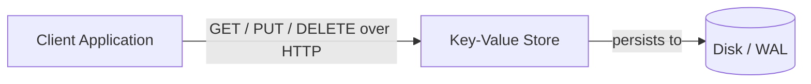
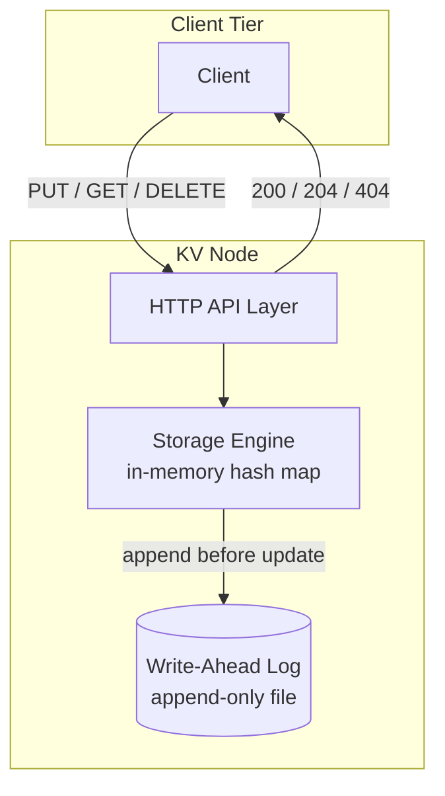

## Capacity Estimation

We model a system serving a mid-to-large internet platform — think user-session stores, feature-flag services, or product-catalogue metadata.

### Traffic

| Metric | Calculation | Result |
|---|---|---|
| Write QPS | 1 B writes/day ÷ 86,400 s | **~11,600 writes/s** |
| Read QPS | 10 B reads/day ÷ 86,400 s | **~115,700 reads/s** |
| Read:write ratio | 115,700 ÷ 11,600 | **~10:1** |
| Peak writes (×3 burst) | 11,600 × 3 | **~35,000 writes/s** |
| Peak reads (×3 burst) | 115,700 × 3 | **~350,000 reads/s** |

Read volume dominates, but write throughput (35k/s peak) is still non-trivial — ruling out storage engines optimised purely for reads.

### Storage

| Field | Size |
|---|---|
| Key (average) | 64 B |
| Value (average) | 1 KB |
| Metadata — version, TTL, tombstone flag | ~64 B |
| **Per entry (with overhead)** | **~1.2 KB** |

| Metric | Calculation | Result |
|---|---|---|
| Entries at steady state | 1 B writes/day × 30-day retention | **30 B entries** |
| Raw storage | 30 B × 1.2 KB | **~36 TB** |
| With replication factor 3 | 36 TB × 3 | **~108 TB total** |
| Daily write volume | 11,600/s × 1.2 KB × 86,400 | **~1.2 TB/day** |

### Memory and cluster sizing

Hot data follows a Zipfian distribution: the top 10% of keys absorb ~90% of reads.

| Metric | Calculation | Result |
|---|---|---|
| Hot keys | 30 B × 10% | 3 B entries |
| RAM for hot set | 3 B × 1.2 KB | **~3.6 TB** |
| Storage nodes at 8 TB SSD each | 108 TB ÷ 8 TB | **~14 storage nodes** (raw) |
| With replication accounted | above already includes RF=3 | **14 nodes minimum for storage** |
| Cache RAM nodes at 256 GB RAM | 3.6 TB ÷ 256 GB | **~15 nodes** |

In practice, a cluster of **50–100 heterogeneous nodes** (mixed RAM + SSD) handles both hot reads and durable storage. A separate tier of lightweight coordinator/proxy nodes (stateless, ~10 nodes) routes requests without storing data.

### Bandwidth

| Direction | Calculation | Result |
|---|---|---|
| Read egress | 115,700/s × 1.2 KB | **~139 MB/s** |
| Write ingress | 11,600/s × 1.2 KB | **~14 MB/s** |
| Replication traffic | 14 MB/s × (RF − 1) = × 2 | **~28 MB/s internal** |

Bandwidth is manageable — the engineering challenge is latency and consistency, not throughput.

## API Design

The external API is minimal by design. Clients speak HTTP/1.1 or HTTP/2; internal node-to-node replication uses a compact binary protocol (e.g. Protocol Buffers over TCP) for efficiency.

```
PUT /v1/kv/{key}
  Headers: X-TTL-Seconds: 3600     (optional)
           X-Consistency: quorum   (optional: "one" | "quorum" | "all")
  Body:    <raw bytes — up to 10 MB>
  204 → written (W replicas acknowledged)
  413 → value exceeds size limit
  503 → quorum not met (too many replicas down)

GET /v1/kv/{key}
  Headers: X-Consistency: one      (optional, default "quorum")
  200 → body: <raw bytes>
        X-Version: 12
        X-Expires-At: 2025-08-01T12:00:00Z
  404 → key does not exist or has expired

DELETE /v1/kv/{key}
  204 → deleted (idempotent — succeeds even if key was absent)

GET /v1/kv/{key}/metadata          (admin / debug)
  200 → { "key": "...", "size_bytes": 1024, "version": 12,
          "replicas": ["n1","n2","n3"], "ttl_remaining_s": 287 }
```

**Consistency header:** Clients that need read-your-writes pass `X-Consistency: quorum`; latency-tolerant clients can use `X-Consistency: one` for fastest reads from the nearest replica. This maps directly to the N/R/W quorum configuration explored in the {}.

## Data Model

The single logical entity is a **KV entry**:

```
kv_entry
  key            BYTES (max 1 KB)   -- primary partition key, opaque
  value          BYTES (max 10 MB)  -- arbitrary payload
  version        UINT64             -- monotonically increasing; used for LWW conflict resolution
  vector_clock   MAP<node_id, u64>  -- tracks causality across replicas (advanced mode)
  expires_at     TIMESTAMP NULL     -- null = never expires
  is_tombstone   BOOL DEFAULT false -- logical delete; physically removed during compaction
  written_at     TIMESTAMP          -- wall-clock write time
```

**Why tombstones?** The LSM-tree storage engine is append-only. A DELETE doesn't erase the existing SSTable entry; it appends a tombstone marker. All reads treat a tombstone as "not found," and compaction eventually discards both the original entry and its tombstone. This is explained in detail in the {}.

The store uses a flat, unstructured namespace — keys are opaque bytes. Applications impose their own key schema (e.g. `user:123:session`, `product:sku:4821:price`). No secondary indexes are maintained by the store itself; lookups are always by primary key.

## Architecture — v1

### Level 0 — Context



### Level 1 — First-cut single-node components



**Component responsibilities and first-order justification:**

- **HTTP API layer.** Parses requests, enforces key/value size limits, routes to the storage engine, and returns appropriate status codes. Stateless — a single process with an event loop can handle thousands of concurrent in-flight requests.
- **In-memory hash map.** `HashMap<key, entry>` gives O(1) average-case reads and writes. All data lives in RAM — this is how Redis operates. Fast, but volatile (data is lost on restart) and limited to available RAM.
- **Write-Ahead Log (WAL).** Every PUT and DELETE is appended to a sequential file on disk *before* the in-memory map is updated. Sequential I/O is 10–100× faster than random writes. On process restart, replaying the WAL recovers the in-memory state. Provides crash durability at minimal latency cost.

**V1 weaknesses to fix (tackled in the deep dives):**

| Weakness | Consequence |
|---|---|
| Entire dataset must fit in RAM | Hard ceiling at available memory (~GBs) |
| Full WAL replay on restart | Recovery time grows with write history |
| Single node | One crash = all data unavailable; can't serve 350k reads/s |
| No replication | Node failure = permanent data loss |
| No conflict resolution | Concurrent writes to the same key with no ordering guarantee |

See [Key-Value Stores]({}) for the broader context of where this design fits among existing systems.
