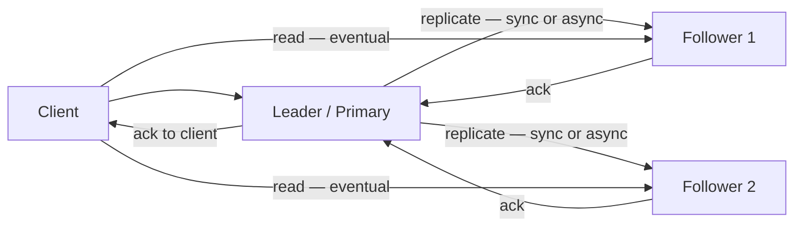
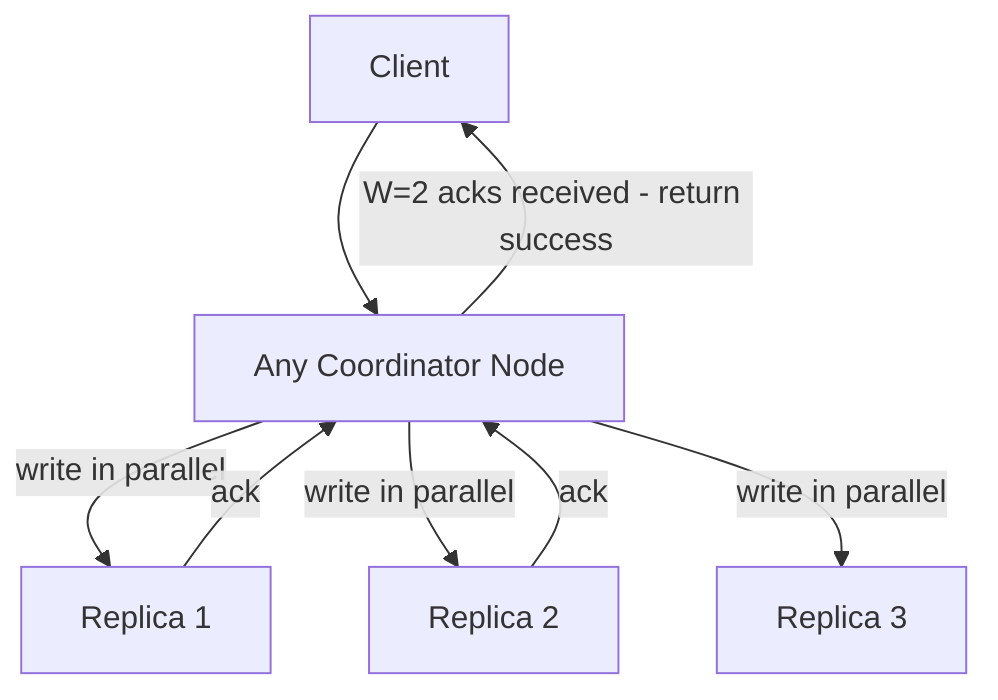
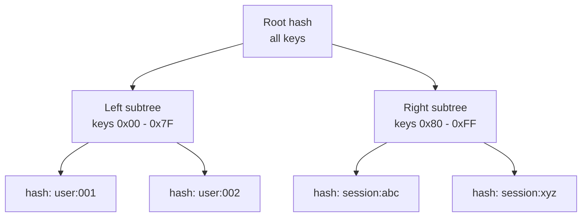
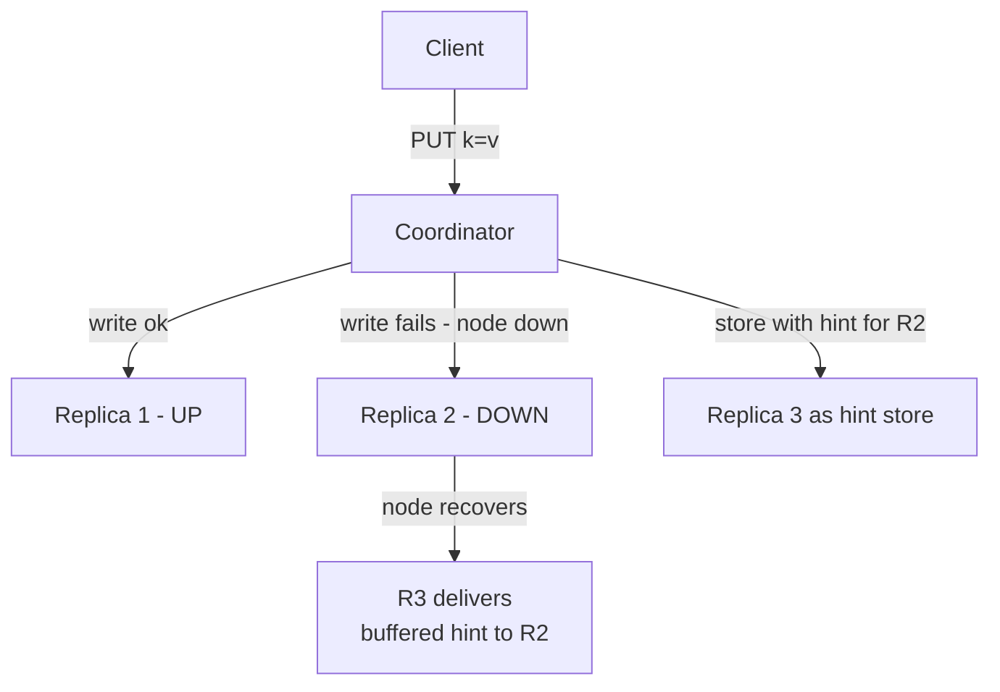
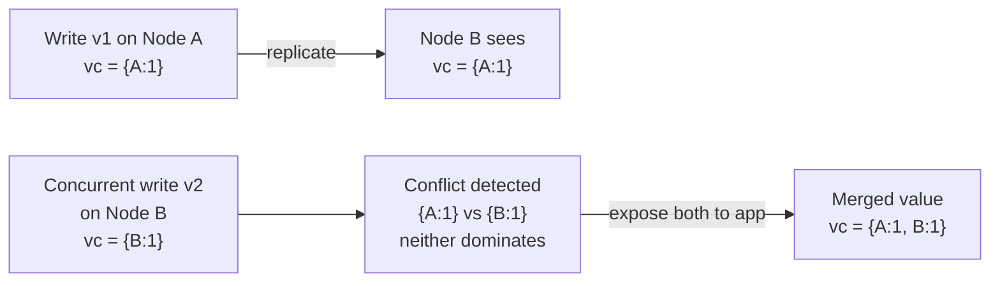

With consistent hashing distributing keys across nodes, we now tackle the three remaining weaknesses: each key exists on only one node (no fault tolerance), replicas can drift apart (no anti-entropy), and concurrent writes produce unresolvable conflicts. We also place the design on the CAP and PACELC frameworks.

## Refinement 4 — Replication: leader-follower vs leaderless quorum

**Problem.** Each key lives on exactly one physical node. Any node failure makes all keys it owns unreachable — a direct violation of the 99.99% availability target. Even with N=3 nodes in the cluster, without replication a single crash takes 1/3 of all keys offline.

**Modification.** Replicate each key to *N* nodes — the full **preference list** from the consistent hash ring — and require that writes and reads acknowledge *W* and *R* replicas respectively. Two replication strategies are available:

### Strategy A — Leader-follower replication

The first node on the preference list is the **leader** for that key range. All writes go to the leader; the leader replicates to followers, which ack when the replication is durable. Reads can be served by any replica. See [Leader-Based Replication]({}) and [Replication Implementations]({}).



- **Leader failure** requires [leader election]({}) via consensus — typically [Raft]({}). Election takes hundreds of milliseconds to a few seconds, causing a write outage for that key range.
- **Strong consistency:** if the leader waits for all followers to ack before returning, every subsequent read (from any replica) is guaranteed to see the write.
- **Trade-off:** the leader is a bottleneck and its failure requires coordination. Well-suited for workloads that need total ordering of writes (e.g. counters, leaderboards).

### Strategy B — Leaderless replication with quorums (Dynamo-style)

**Any node** in the preference list can coordinate a read or write. The coordinator sends the operation to all *N* replicas in parallel and waits for *W* or *R* acknowledgements. No single leader; no election required. See [Quorum]({}).



**Pseudocode — leaderless quorum write:**

```python
def put(key, value, N=3, W=2):
    nodes = get_preference_list(key, N)
    version = lamport_clock.next()         # monotonically increasing version
    acks = parallel_write_all(nodes, key, value, version)
    if len(acks) >= W:
        return SUCCESS                     # quorum met — durable enough
    raise QuorumNotMet                     # client retries or escalates
```

**Pseudocode — leaderless quorum read:**

```python
def get(key, N=3, R=2):
    nodes = get_preference_list(key, N)
    responses = parallel_read_all(nodes, key)   # collect up to N responses
    if len(responses) < R:
        raise QuorumNotMet
    latest = max(responses, key=lambda r: r.version)  # highest version wins (LWW)
    stale = [r for r in responses if r.version < latest.version]
    async: read_repair(stale, key, latest.value, latest.version)  # fix stale replicas
    return latest.value
```

### Tunable N/R/W configuration

| Config | N | W | R | Guarantee | Latency |
|---|---|---|---|---|---|
| Strong consistency | 3 | 2 | 2 | W+R > N → reads always see latest write | Higher |
| Write-optimised | 3 | 1 | 3 | Reads check all replicas | Write fast, read slow |
| Read-optimised | 3 | 3 | 1 | Writes touch all replicas | Write slow, read fast |
| Best-effort / eventual | 3 | 1 | 1 | Maximum availability; stale reads possible | Lowest |

**When W + R > N:** the read quorum is guaranteed to overlap the write quorum — at least one node in the R-node read set saw the last write. This is the core [Quorum]({}) invariant.

## Refinement 5 — Anti-entropy: Merkle trees, read repair, and hinted handoff

**Problem.** Even with quorums, replicas can silently drift apart: a node that is temporarily unreachable misses writes; a hinted handoff that fails before delivery leaves a gap; clock skew produces ambiguous ordering. How do we efficiently detect and repair divergence without exchanging every key-value pair?

**Modification.** Three complementary anti-entropy mechanisms, working at different time scales:

### Merkle trees for background reconciliation

A **Merkle tree** is a binary tree where each leaf is the hash of one KV entry, and each internal node is the hash of its children. Two replicas can compare their root hashes — equal roots mean identical data; a mismatch triggers a binary descent to find exactly which subtree (key range) diverges. Only the differing subset is exchanged, not the full dataset. See [Replication Implementations]({}).



The **anti-entropy service** on each node periodically picks a random peer from its preference list and compares Merkle root hashes. Mismatches trigger a tree walk to isolate the divergent range; only those KV pairs are streamed to the peer.

### Read repair (online, on the hot path)

During a `GET` with R=2, the coordinator collects R responses. If their versions differ, it:
1. Returns the most recent value to the client immediately.
2. Sends a **background write** of the latest value back to the stale replica(s).

Read repair is zero-latency-cost for the read path and fixes divergence on frequently accessed keys automatically. Cold (rarely read) keys must rely on the Merkle sweep.

### Hinted handoff (short-term failure tolerance)

When a write's target node is temporarily unreachable, the coordinator stores the write on a **different node** with a **hint** that names the intended target. When the target recovers, the hinting node delivers the buffered writes and clears the hint.



**Justification & trade-offs.**
- Hinted handoff extends the effective durability window during transient failures without forcing W to be higher than necessary. A write succeeds (W=2 acks from R1 + R3) even while R2 is down.
- **Trade-off:** if the hinting node (R3) itself fails before delivering the hint, the hint is permanently lost. This is why W ≥ 2 is still recommended — the hint provides *extra* safety, not a substitute for quorum durability.
- Merkle trees are O(divergent keys) in repair data transferred, vs O(all keys) for a naive full comparison.

## Refinement 6 — Conflict resolution: LWW vs vector clocks

**Problem.** Two concurrent writes to the same key on different replicas — both arriving before replication completes — produce two versions with no causal ordering. Which version should survive? A wrong choice means silent data loss.

**Modification.** Offer two strategies, selectable at cluster configuration time:

### Last-Write-Wins (LWW)

Each write carries a **wall-clock timestamp**. On conflict, the highest timestamp wins. The losing version is silently discarded.

- **Simplicity:** one field per entry; zero coordination overhead.
- **Used by:** Cassandra (default), Redis.
- **Fatal trade-off:** if two nodes' clocks differ by even a few milliseconds, a *newer* write can be overwritten by an *older* write whose timestamp is higher due to clock skew. LWW causes **silent data loss** in concurrent write scenarios. NTP keeps clocks within ~1–10 ms; this is usually acceptable for session stores but not for financial data.

### Vector clocks

Each version carries a **vector clock** — a map from `node_id → logical counter`. See [Logical Clocks]({}).



**Vector clock rules:**

```python
def on_local_write(node_id, entry):
    entry.vector_clock[node_id] += 1        # increment own counter

def on_receive_replicated_write(remote_entry, local_entry):
    # Merge: element-wise max
    merged_vc = {n: max(remote_entry.vc.get(n,0), local_entry.vc.get(n,0))
                 for n in set(remote_entry.vc) | set(local_entry.vc)}
    # Determine ordering
    if dominates(remote_entry.vc, local_entry.vc):
        return remote_entry              # remote is strictly newer
    elif dominates(local_entry.vc, remote_entry.vc):
        return local_entry               # local is strictly newer
    else:
        return CONFLICT(remote_entry, local_entry)  # concurrent — app must resolve

def dominates(vc_a, vc_b):
    # vc_a >= vc_b element-wise AND at least one strictly greater
    return all(vc_a.get(n,0) >= vc_b.get(n,0) for n in vc_b) \
           and any(vc_a.get(n,0) > vc_b.get(n,0) for n in vc_b)
```

**Vector clock trade-offs:**
- No silent data loss — concurrent writes surface a conflict that the application can resolve with custom logic (e.g. union of shopping-cart items, as Dynamo uses).
- **Growth problem:** the clock map grows one entry per writing node. For a 100-node cluster with many distinct writers, clocks become large. Dynamo capped clock size and pruned entries older than a threshold — accepting a small risk of missed causality detection.
- **Application burden:** conflicts are exposed to callers. The client must implement a merge function.

### CAP and PACELC placement

| Mode | W + R condition | Partition response | Normal-case trade-off |
|---|---|---|---|
| **CP — strong consistency** | W+R > N | Refuse new writes until quorum returns | Higher latency for every operation |
| **AP — high availability** | W=1, R=1 | Accept writes on all surviving partitions | Lowest latency; stale reads possible |
| **Tunable** | Per-request header | Configurable | Client chooses per call |

See [CAP Theorem]({}) for the fundamental three-way constraint. Under [PACELC]({}): even without a partition, choosing W=2 over W=1 adds the latency of waiting for a second replica. There is no free consistency — every extra quorum node costs milliseconds.

## Final Architecture

```mermaid
flowchart TB
    subgraph External
      CLI[Client Applications]
      LB[Load Balancer<br/>ring-aware proxy]
    end
    subgraph KV Cluster — N nodes
      N1[Node 1<br/>LSM Engine + WAL<br/>vnodes: 15 22 67...]
      N2[Node 2<br/>LSM Engine + WAL<br/>vnodes: 33 55 89...]
      N3[Node 3<br/>LSM Engine + WAL<br/>vnodes: 11 44 78...]
    end
    subgraph Background Services
      GS[Gossip Service<br/>ring and membership]
      AE[Anti-Entropy<br/>Merkle sweep]
      COMP[Compaction<br/>background threads]
      HH[Hinted Handoff<br/>queue per node]
    end

    CLI --> LB
    LB -->|route by consistent hash| N1
    N1 -->|quorum write / read| N2
    N1 -->|quorum write / read| N3
    N1 <-->|gossip| N2
    N2 <-->|gossip| N3
    N3 <-->|gossip| N1
    AE -->|Merkle comparison| N1
    AE -->|Merkle comparison| N2
    AE -->|Merkle comparison| N3
    COMP -.->|background SSTable merge| N1
    COMP -.->|background SSTable merge| N2
    COMP -.->|background SSTable merge| N3
    HH -.->|deliver buffered hints on recovery| N1
    HH -.->|deliver buffered hints on recovery| N2
    HH -.->|deliver buffered hints on recovery| N3
```

## Drill-Down

### Detailed API with concrete examples

**Write with explicit consistency level:**

```
PUT /v1/kv/user:123:prefs
Headers: X-Consistency: quorum
         X-TTL-Seconds: 86400
Body:    {"theme":"dark","locale":"en-US"}
→ 204 No Content
  X-Version: 14
  X-Vector-Clock: {"n1":9,"n2":5}
```

**Read with version for conditional update:**

```
GET /v1/kv/user:123:prefs
Headers: X-Consistency: one
→ 200 OK
  X-Version: 14
  X-Vector-Clock: {"n1":9,"n2":5}
  Body: {"theme":"dark","locale":"en-US"}
```

**Conditional write (optimistic concurrency — single-key CAS):**

```
PUT /v1/kv/user:123:prefs
Headers: X-If-Version: 14        (reject if version has advanced)
Body:    {"theme":"light","locale":"en-US"}
→ 204 → written (version 15)
   409 → version conflict — re-read and retry
```

### Database schema and sharding strategy

The schema maps directly to the `kv_entry` entity from the data model:

```
kv_entry (on-disk SSTable schema)
  key          BYTES  PRIMARY KEY     -- partition key for consistent-hash routing
  value        BYTES
  version      UINT64                 -- Lamport clock or wall-clock timestamp (LWW mode)
  vector_clock BYTES                  -- serialised MAP<node_id, u64> (optional mode)
  expires_at   INT64  NULL            -- Unix epoch nanoseconds; null = never
  is_tombstone BOOL                   -- logical delete marker
  written_at   INT64                  -- Unix epoch nanoseconds
```

- **Partition strategy:** consistent hash ring with V=150 vnodes per physical node; keys distributed uniformly across the ring.
- **Replication:** RF=3 default — each key is stored on 3 consecutive distinct physical nodes in clockwise ring order.
- **Compaction:** leveled compaction (RocksDB-style) for a 10:1 read:write ratio; size-tiered if write load spikes and compaction can't keep up.
- **Eviction for TTL:** a background sweeper scans expired entries at low priority; no entry is deleted inline on read. See [Cache Eviction]({}) policies for in-memory hot-set management.

### Data structures used

| Structure | Where | Why |
|---|---|---|
| **Skip list** | Memtable | O(log n) sorted inserts and reads; concurrent-friendly; used by RocksDB |
| **Bloom filter** | Per SSTable | O(1) probabilistic negative lookup; avoids disk reads for absent keys |
| **Sorted array + binary search** | Consistent hash ring (vnode positions) | O(log V) key routing where V = total vnodes |
| **Merkle tree** | Anti-entropy service | O(log n) divergence detection without full data exchange |
| **Vector clock map** | Conflict resolution | Tracks causal ordering across writing nodes without a central sequencer |
| **Append-only WAL** | Write durability | Sequential I/O is 10–100× faster than random writes |
| **Hinted handoff queue** | Short-term failure | Persists buffered writes for temporarily unavailable nodes |

### Edge cases and failure handling

| Failure scenario | Handling |
|---|---|
| **Node crashes mid-write** | WAL replay on recovery; surviving quorum nodes hold the durable copy; coordinator retries to meet W |
| **Network partition — AP mode** | Surviving partitions accept reads and writes independently; Merkle sweep reconciles after partition heals |
| **Network partition — CP mode** | Writes are rejected until W replicas are reachable; cluster refuses to diverge |
| **Hinting node fails before delivery** | Merkle anti-entropy detects the gap on the next scheduled sweep and synchronises the recovered node |
| **Clock skew in LWW mode** | NTP bounds drift to ~1–10 ms; for sub-millisecond correctness, switch to vector clocks |
| **Compaction stall under heavy write load** | Leveled compaction throttles new flushes when L0 SSTable count exceeds a threshold; write path receives backpressure to protect read latency. See [Back-Pressure]({}) |
| **Hot key — single key at extremely high QPS** | Client-side caching layer in front of the KV cluster; alternatively, key-level read replicas; see [Hotspot Problems]({}) |
| **TTL expiration cleanup lag** | Tombstones and expired entries removed lazily during compaction; worst-case, they remain visible as "absent" but consume disk until compaction runs |
