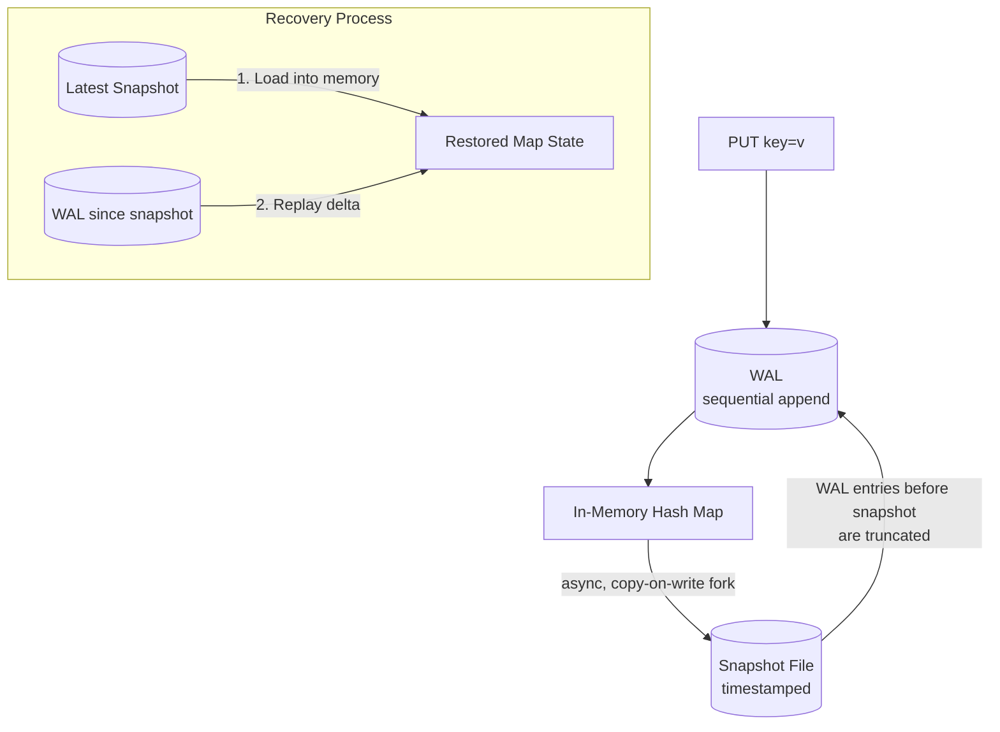
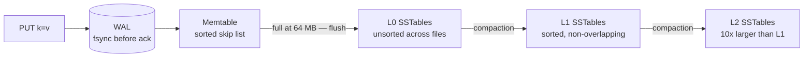
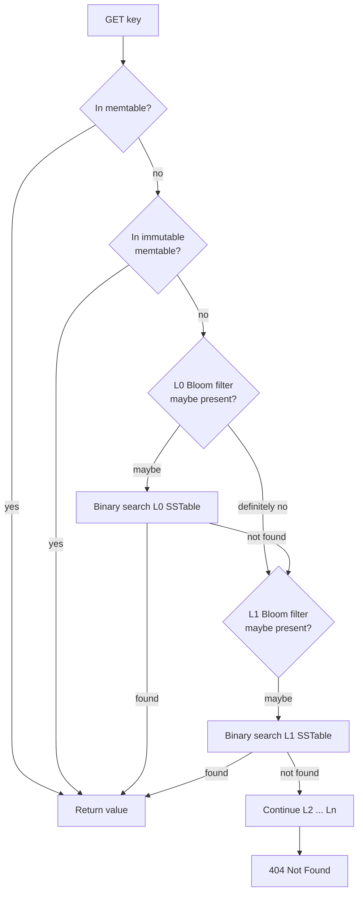
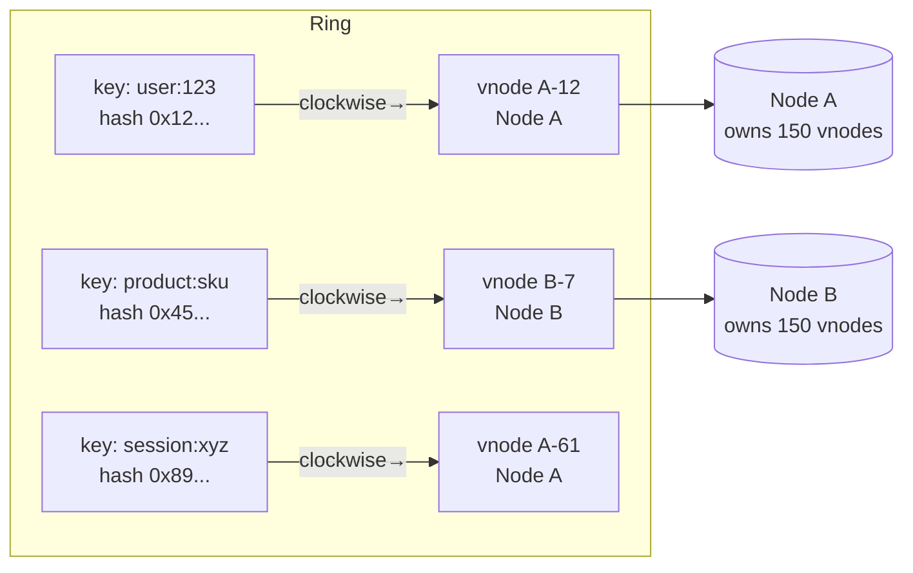
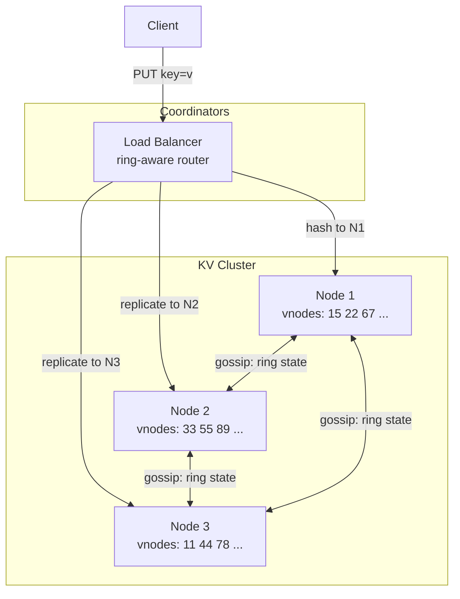

We evolve the v1 single-node design through three refinements: fixing the RAM ceiling with WAL + snapshots, replacing the in-memory hash map with a disk-backed LSM-tree engine, and distributing keys across a cluster with consistent hashing and virtual nodes. Every step follows the **Problem → Modification → Justification** structure.

## Refinement 1 — WAL + snapshots for bounded crash recovery

**Problem.** V1 replays the entire WAL from the beginning on every restart. A system that has been running for weeks accumulates a WAL of billions of entries — recovery takes minutes to hours, violating availability requirements. The WAL also grows unboundedly on disk.

**Modification.** Introduce **periodic snapshots**: every *T* minutes (configurable, e.g. 10 min), a background process serialises the entire in-memory map to a compact binary snapshot file on disk. After the snapshot is durably written, all WAL entries prior to that checkpoint are discarded. Recovery now loads the latest snapshot and replays only the WAL entries written since the snapshot — typically seconds of data, not weeks.



**Justification & trade-offs.**
- **Recovery time** drops from O(all ops ever) to O(ops in the last T minutes) — typically seconds.
- **Snapshot isolation:** the snapshot process uses a **copy-on-write fork** (Redis RDB / BGSAVE model) — the parent process keeps serving live writes while the child process sees a frozen point-in-time view of memory. No lock contention.
- **Trade-off:** forking to snapshot a large in-memory map briefly doubles memory usage (copy-on-write pages). On a 64 GB node with a 40 GB working set, this leaves only 24 GB of headroom during the snapshot window.
- **Hard ceiling:** if the dataset grows beyond available RAM, this approach fails entirely. That is the motivation for Refinement 2.

## Refinement 2 — LSM-tree storage engine for disk-backed datasets

**Problem.** Our capacity estimate shows a 36 TB raw dataset — far more than any single server's RAM. We need a disk-based engine with high write throughput. Naïve random writes to disk (as a traditional B+ tree requires) are too slow: SSDs sustain ~500k random 4KB IOPS but sequential throughput is 3–5 GB/s. We want an engine that converts random writes into sequential I/O.

**Modification.** Replace the in-memory hash map with an **LSM-tree (Log-Structured Merge Tree)** — the engine used by LevelDB, RocksDB, Cassandra, and HBase. See [LSM Trees]({}).

### LSM write path

Writes never touch existing on-disk data. Instead, they are **appended** to in-memory and sequential disk structures, then merged offline:



**Pseudocode — write path:**

```python
def put(key, value):
    wal.append(PUT, key, value)       # 1. Sequential disk write — durable before returning
    memtable.set(key, value)          # 2. Insert into sorted in-memory skip list O(log n)
    if memtable.size_bytes() >= MEMTABLE_LIMIT:  # e.g. 64 MB
        rotate_to_immutable(memtable)            # swap active memtable for a new one
        schedule_async_flush()                   # background: write immutable to L0 SSTable

def delete(key):
    wal.append(DELETE, key)           # tombstone in WAL
    memtable.set(key, TOMBSTONE)      # tombstone in memtable; compaction cleans it later
```

### LSM read path

Reads must check the most recent data source first, working backwards from in-memory to older disk levels:



**Pseudocode — read path:**

```python
def get(key):
    # 1. Most recent writes are in active or immutable memtable
    for table in [active_memtable, immutable_memtable]:
        if table.contains(key):
            entry = table.get(key)
            return NOT_FOUND if entry.is_tombstone else entry.value

    # 2. Walk levels from newest (L0) to oldest (Lmax)
    for level in [L0, L1, L2, ...]:
        for sstable in level.sstables_that_may_overlap(key):
            if not sstable.bloom_filter.may_contain(key):
                continue                   # O(1) skip — key definitely absent
            entry = sstable.binary_search(key)
            if entry is not None:
                return NOT_FOUND if entry.is_tombstone else entry.value

    return NOT_FOUND
```

### SSTable structure

Each SSTable is an **immutable, sorted, on-disk file** with four sections:

| Section | Contents |
|---|---|
| Data blocks | Key-value pairs, sorted lexicographically, compressed |
| Index block | One entry per data block — maps last key in block to its byte offset |
| Bloom filter block | Compact bit array for O(1) negative lookups; see [Bloom Filters]({}) |
| Footer | Byte offsets of index block and Bloom filter block |

A Bloom filter for 1 B keys at 1% false-positive rate requires ~1.4 GB — negligible compared to the data it gates. False positives incur one extra binary search (expensive); false negatives are impossible by design (the filter never misidentifies a present key as absent).

### Compaction strategies

Left unchecked, L0 accumulates many overlapping SSTables and read amplification grows. Compaction merges, sorts, and deduplicates SSTables:

| Strategy | Mechanism | Read amplification | Write amplification | Best for |
|---|---|---|---|---|
| **Size-tiered** | Merge SSTables of similar size | Higher — files can overlap | Lower | Write-heavy; Cassandra default |
| **Leveled** | Each level is 10× larger; only overlapping SSTables within a level are merged | Lower — at most one SSTable per level per key | Higher | Read-heavy; RocksDB/LevelDB default |

### LSM vs B+ tree comparison

| Metric | LSM-tree | B+ Tree |
|---|---|---|
| Write path | Sequential append → batch flush | In-place random writes |
| Read path | Multi-level probe + Bloom filter | O(log n) single tree traversal |
| Write amplification | Low | High |
| Read amplification | Medium (grows with levels) | Low |
| Space amplification | Medium (dead entries until compaction) | Low |
| Best fit | Write-heavy KV stores | Read-heavy, range-query databases |

See [Hash Index]({}) and [B+ Tree]({}) for the contrasting data structures.

## Refinement 3 — Consistent hashing with virtual nodes

**Problem.** A single storage node cannot hold 108 TB or serve 350k reads/s. We need to distribute keys across a cluster. Naïve modulo hashing (`shard = hash(key) % N`) causes a **full reshuffle** of every key when N changes — adding or removing one node remaps every key, generating enormous rebalancing I/O that can overwhelm the cluster.

**Modification.** Use a **consistent hash ring** with **virtual nodes (vnodes)**. See [Consistent Hashing]({}).

### How the ring works

The hash space (e.g. SHA-256 mod 2³²) is arranged as a circle from 0 to 2³²−1. Each physical node owns **V virtual nodes** (e.g. V = 150), each placed at a different position on the ring. A key is routed to the first vnode found when walking clockwise from `hash(key)`.



**Pseudocode — key routing:**

```python
def get_preference_list(key, N):
    position = hash(key) % RING_SIZE
    nodes = []
    for vnode in ring.clockwise_from(position):      # sorted array, binary search
        physical = vnode.physical_node
        if physical not in nodes:
            nodes.append(physical)
        if len(nodes) == N:
            break
    return nodes    # nodes[0] is default coordinator; all N replicate this key
```

### Virtual nodes and load balancing

| Scenario | Without vnodes | With vnodes (V=150) |
|---|---|---|
| Adding a node | Only adjacent keys move | ~1/cluster_size fraction of all keys move |
| Heterogeneous hardware | All nodes receive equal keys | Higher-capacity nodes get more vnodes |
| Hotspot from random key distribution | Likely — depends on hash clustering | Unlikely — 150 positions distribute load |

**Justification & trade-offs.**
- Minimal data movement on topology change — adding one node causes ~1/cluster_size of keys to remigrate.
- Heterogeneous nodes: a node with 2× the RAM gets 2V vnodes and attracts proportionally more keys.
- **Trade-off:** the ring metadata (vnode → physical node mapping) must be propagated to every node in the cluster. This is handled by the [Gossip Protocol]({}) — each node periodically exchanges its known ring state with a random peer. Convergence across N nodes takes O(log N) gossip rounds, typically < 1 second.



At this point, each key is stored on exactly one node — which is still a single point of failure per key. Replication across multiple nodes and the protocols that govern consistency are the focus of the {}.
