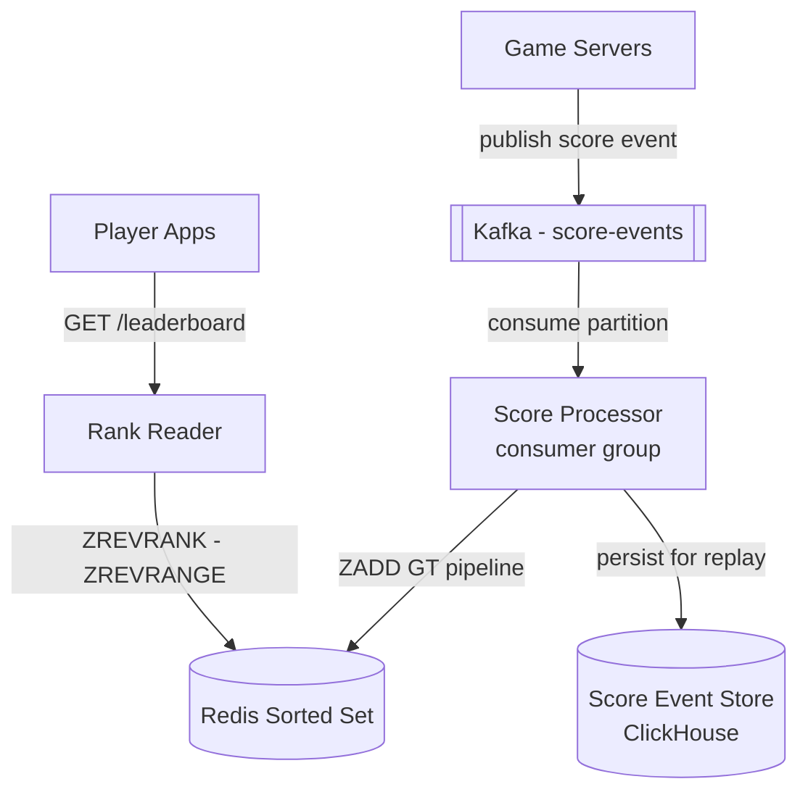
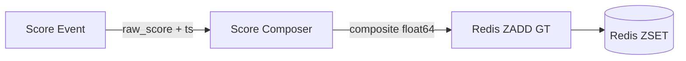
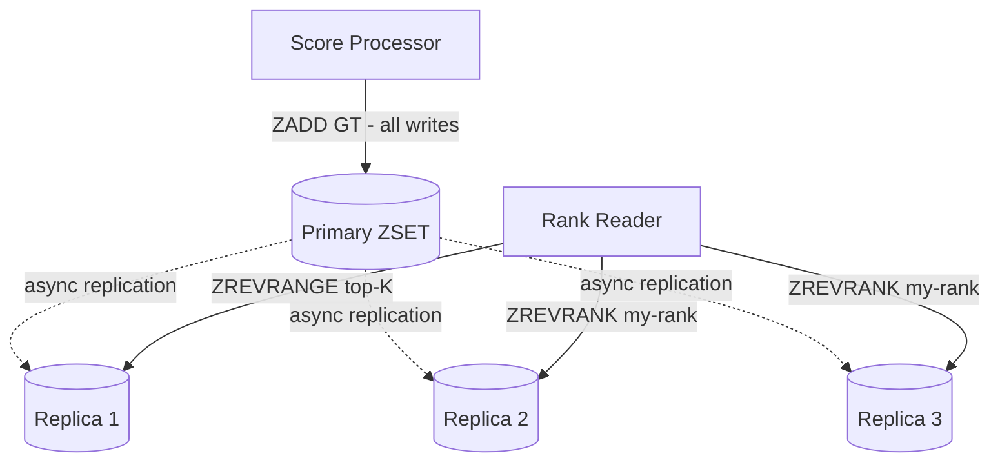
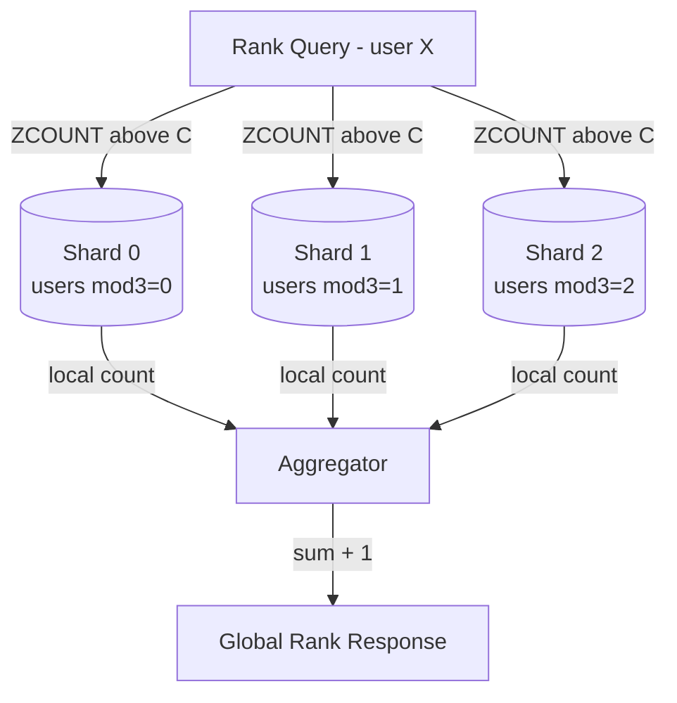
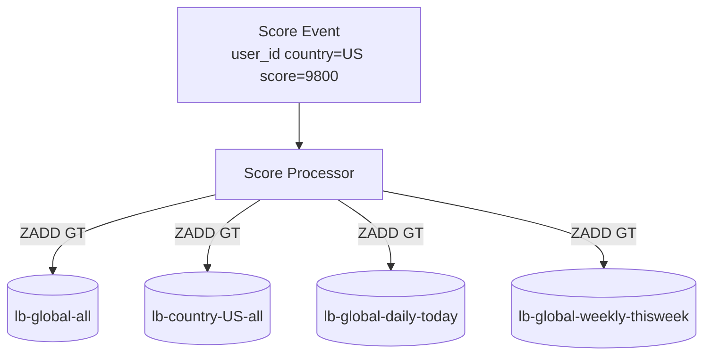
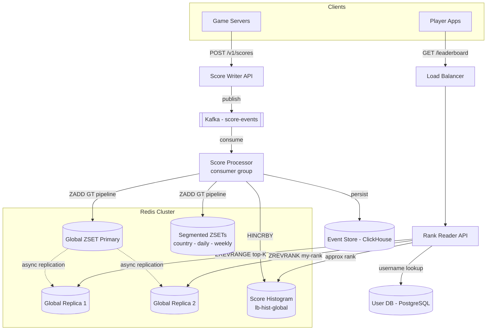

We evolve the v1 design by attacking each weakness in turn: **Problem → Modification → Justification & trade-offs**. Every refinement carries its own diagram.

## Why Redis Sorted Sets? The Data Structure Fit

Before refining the architecture, it is worth understanding *why* the naive SQL approach fails and *why* Redis sorted sets fit so precisely — this is the conceptual core of the interview.

### The SQL rank query breaks at scale

```sql
SELECT COUNT(*) + 1 AS rank
FROM scores
WHERE score > (SELECT score FROM scores WHERE user_id = ?)
```

With a B-tree index on `score`, the inner lookup is O(log n) and the `COUNT` can be answered from the index. But in practice:

- **Write contention:** at 25,000 updates/s, every write updates the B-tree index while concurrent range scans hold read locks — lock contention spikes and p99 latency climbs.
- **Minimum round-trip:** a query to a PostgreSQL node is 1–5 ms over a LAN. Redis is sub-millisecond.
- **Top-K under load:** `SELECT … ORDER BY score DESC LIMIT 100` on 50 M rows with concurrent updates degrades unpredictably.

### Redis ZSET internals: skip list + hash map

A Redis sorted set maintains **two** complementary data structures simultaneously:

**1. Skip list** — a probabilistic multi-level linked list ordered by score. Each node carries a `span` field: the number of nodes it jumps over at each level. `ZREVRANK` uses these span counters to count how many members have a higher score in O(log n) — no full traversal. Insertion and deletion are also O(log n) on average.

**2. Hash map** — maps `member → score` in O(1). This is what makes `ZSCORE` constant-time and allows `ZADD` to find and remove the old skip-list node before reinserting at the new position.

| Operation | Redis command | Complexity | Why |
|---|---|---|---|
| Update score | `ZADD board_key GT composite user_id` | O(log n) | Skip-list reposition + hash map update |
| Global top-K | `ZREVRANGE board_key 0 K-1 WITHSCORES` | O(log n + k) | Tail traversal of skip list |
| My rank | `ZREVRANK board_key user_id` | O(log n) | Walk skip-list levels using span counters |
| Nearby players | `ZREVRANGE board_key rank-r rank+r` | O(log n + 2r) | Two ZREVRANK + one ZREVRANGE |
| Score lookup | `ZSCORE board_key user_id` | O(1) | Hash map direct lookup |

All operations complete in **< 1 ms** on a local Redis node for n = 50 M. This sub-millisecond property is what makes a 10 ms p99 target achievable even after accounting for network and application overhead. This is why sorted sets — not SQL, not Elasticsearch, not a self-built heap — are the correct choice.

> **Note on small ZSETs:** for sets with fewer than 128 members and member values shorter than 64 bytes, Redis uses a `listpack` (formerly ziplist) encoding — more memory-efficient but O(n) for most operations. For the 50 M-member boards in this design, we are firmly in skip-list territory.

---

## Refinement 1 — Write coupling: game servers stall when Redis lags

**Problem.** In v1, game servers call the Score Writer synchronously. If Redis experiences elevated latency (a GC pause, replication lag, a key-slot hotspot), the `ZADD` call blocks and the write API returns slowly — directly stalling game servers that are waiting for confirmation before continuing match flow. Furthermore, if the Score Writer crashes after the game server receives `202 OK` but before `ZADD` completes, the score event is silently lost. There is no durable record of the update.

**Modification.** Decouple via [Kafka]({}). Game servers publish score events to a `score-events` Kafka topic and receive `202 Accepted` immediately on successful publish. A **Score Processor** consumer group reads the topic, applies business logic (max-score deduplication, segment routing), and issues `ZADD GT` commands pipelined in batches of 100 for Redis throughput.



**Justification & trade-offs.** This is the real-time vs. near-real-time trade-off: a synchronous path gives rank updates within milliseconds but couples game servers to Redis health; the Kafka path adds ~100–500 ms of processing lag in exchange for durability, decoupling, and replay capability. Kafka's durable log means every event can be **replayed** to rebuild a board from scratch after a Redis failure — Redis becomes a recomputable derived cache, not a source of truth. This exemplifies the [batch-vs-streaming]({}) spectrum: during quiet periods the consumer applies events individually in near-real-time; during peak (25,000/s), it batches 100 events per pipeline flush, reducing Redis roundtrips by 100×. The trade-off is the added infrastructure complexity of a Kafka cluster and consumer group.

---

## Refinement 2 — Tie-breaking: shared integer scores produce unstable rankings

**Problem.** In many games, thousands of players can finish with identical scores (e.g. every player who clears a stage on the first attempt gets exactly 10,000 points). Redis `ZREVRANK` returns an arbitrary, non-deterministic order among members with equal scores — making rankings feel unfair and unstable as they shift between reads.

**Modification.** Encode a tie-breaking signal into the **fractional part** of the IEEE 754 double used as the Redis score. The rule: among equal-score players, the player who achieved the score **earliest** ranks higher (first-to-achieve wins). The composite score is:

```
composite = raw_score + (1.0 - timestamp_ms / MAX_EPOCH_MS)
```

Where `MAX_EPOCH_MS = 4_102_444_800_000` (year 2100 in milliseconds). This yields:

- **Distinct composite scores** for every (raw_score, timestamp) pair — no more ties.
- **Correct ordering**: a player scoring 10,000 at t=1,000 ms gets `composite ≈ 10000.99999975…`; a player scoring 10,000 at t=2,000 ms gets `composite ≈ 10000.99999951…` — the earlier player's composite is infinitesimally higher, so `ZREVRANK` places them above.
- **Transparent to users**: `int(composite)` recovers the raw score for display; the fractional part is invisible.



**Precision analysis.** IEEE 754 doubles have 53 bits of mantissa. At `raw_score = 10,000,000` (≈ 24 bits of integer part), we have 29 bits available for the fractional timestamp — enough to encode ~537 million distinct values, covering ~6.2 days of milliseconds. For most game score ranges this is sufficient. For games with scores exceeding ~500 M, use a **composite integer scheme** instead: `composite_int = raw_score * SCALE + (MAX_TS - timestamp_ms)` where SCALE is chosen so the tie-break bits do not overflow the integer part.

**Justification & trade-offs.** The float encoding is free — no extra fields, no schema changes, and `ZADD GT` remains idempotent (a replay of the same event produces the same composite score). The sole trade-off is the integer precision limit. For games that do not require tie-breaking (e.g. cumulative score accumulation where every event produces a unique total), omit the fractional encoding entirely and use `ZADD GT` with the raw score.

---

## Refinement 3 — Memory and write hotspot: 50 M members on a single Redis node

**Problem.** The global ZSET is one logical key. In Redis Cluster, a single key maps to one hash slot and one primary node. All 25,000 writes/s flow to that node's single-threaded event loop, which approaches its throughput ceiling (~100,000 `ZADD` ops/s when pipelined, but with overhead from the skip-list reposition that cost varies by list depth). It is also a single point of failure: if the primary dies, the global board is unavailable until a replica is promoted.

**Modification — Solution A: single authoritative ZSET with read replicas.** Keep one primary ZSET; add 2–4 read replicas per board. The Score Processor writes only to the primary; the Rank Reader fans read traffic across replicas based on query type.



This solution is correct and sufficient for most leaderboards up to ~100 M members. Replication is asynchronous — replicas may lag by a few milliseconds, which is acceptable under our near-real-time consistency model. See [hotspot-problems]({}) and [caching-patterns]({}) for the general patterns at play.

**When Solution A is not enough.** If the global ZSET exceeds a single node's RAM (16–64 GB depending on hardware) or if 25,000 pipelined `ZADD` ops/s saturates the primary's CPU, we must shard the ZSET — which introduces the hardest problem in this design.

---

## Refinement 4 — The hard problem: global rank across sharded ZSETs

**Problem.** If we shard users across N Redis nodes by `user_id % N`, each node holds a ZSET with `50M / N` members. `ZREVRANK` on node_i gives the *local* rank within that shard — not the global rank. There is no Redis command to compute a rank spanning multiple ZSETs. This is the fundamental tension of [sharding]({}) applied to a ranked dataset: sharding improves write throughput and RAM per node, but destroys the global ordering.

**Solution B — Scatter-gather ZCOUNT (exact global rank).**

To find the global rank of user X with composite score `C`:

1. Look up `C` from X's home shard: `ZSCORE shard_key user_id` — O(1).
2. Scatter a `ZCOUNT shard_key (C) +inf` to **all N shards in parallel** — "how many members on this shard have composite score strictly greater than C?"
3. Sum the counts across all shards + 1 = global rank.



`ZCOUNT` on a sorted set is O(log n). With N=8 shards and n=6.25 M members each, that is 8 parallel O(log 6.25M ≈ 23) operations = ~184 skip-list steps total, all issued in parallel → well under 10 ms end-to-end including network. This gives **exact global rank** without centralisation. Use [consistent-hashing]({}) to assign user IDs to shards so adding a new node remaps only a fraction of users.

**Solution C — Bucketed approximate rank (histogram, no cross-shard scatter).**

Maintain a global score-distribution histogram as a Redis Hash: 1,000 buckets, each covering a score range of `SCORE_MAX / 1000` points. Updated atomically on each `ZADD`. To estimate global rank: sum the member counts of all buckets above the user's bucket. No ZSET access, no scatter-gather, O(1) per request.

On score update (inside a Lua script for atomicity):

```python
BUCKET_COUNT = 1000
SCORE_MAX    = 10_000_000
BUCKET_SIZE  = SCORE_MAX // BUCKET_COUNT   # 10,000 points per bucket

def update_score(board_key, hist_key, user_id, new_score, ts_ms):
    MAX_EPOCH_MS = 4_102_444_800_000
    tie_frac     = 1.0 - ts_ms / MAX_EPOCH_MS
    composite    = new_score + tie_frac

    old_score_f  = redis.zscore(board_key, user_id)        # O(1)
    if old_score_f is None or new_score > int(old_score_f):
        new_bucket = new_score // BUCKET_SIZE
        if old_score_f is not None:
            old_bucket = int(old_score_f) // BUCKET_SIZE
            if old_bucket != new_bucket:
                redis.hincrby(hist_key, old_bucket, -1)
        redis.hincrby(hist_key, new_bucket, 1)
        redis.zadd(board_key, {user_id: composite}, gt=True)
```

Approximate rank query — single Redis round-trip:

```python
def approx_rank(hist_key, user_score):
    user_bucket  = user_score // BUCKET_SIZE
    higher_keys  = [str(b) for b in range(user_bucket + 1, BUCKET_COUNT)]
    counts       = redis.hmget(hist_key, *higher_keys)     # single round-trip
    rank         = 1 + sum(int(c or 0) for c in counts)
    # Error bound: ±(members in same bucket / 2) ≈ ±50K for uniform distribution
    return rank
```

The error bound is at most `BUCKET_SIZE / 2 = 5,000` score points in the same bucket. For a uniform distribution of 50 M players across 1,000 buckets, the rank estimate is accurate to ±50,000 positions — perfectly acceptable when displayed as "Rank ~1,234" or as a percentile. Refining to 10,000 buckets shrinks the error by 10× at the cost of 10× more histogram memory (~80 KB — negligible).

**Which solution to use:**

| Scenario | Solution |
|---|---|
| Single primary + replicas fits in RAM | Solution A — no sharding needed |
| Sharded, exact rank required | Solution B — scatter-gather ZCOUNT across N shards |
| Sharded, approximate rank acceptable | Solution C — histogram HMGET, zero cross-shard cost |
| Display rank for top-10,000 exactly | Hybrid — exact ZREVRANK within each shard for top players; histogram for the rest |

---

## Refinement 5 — Segmented and time-windowed leaderboards

**Problem.** A single global ZSET cannot answer "what is my rank in France?" or "what is my rank this week?" The v1 design has no per-segment isolation, no time-window logic, and no board-reset mechanism for daily and weekly competitions.

**Modification — Multiple ZSETs, one Kafka consumer fan-out.** The Score Processor determines which boards to update from event metadata and issues pipelined `ZADD GT` calls to all applicable ZSETs per event:



**Per-country boards:** key = `lb:country:{CC}:all-time`. Country code is read from the user profile cache (Redis Hash, 1-hour TTL). At most 4–5 `ZADD` calls per event, all pipelined in one batch.

**Friend-group board:** queried on demand via `ZUNIONSTORE dst K key1 key2 … keyK` where each `keyN` is a single-member set `lb:user:{friendId}` holding only that friend's score. `ZUNIONSTORE` produces an ephemeral sorted set of the friend group in O(K log K). Cache the result for 30 s. For friend lists exceeding 500, maintain a per-user friend ZSET updated incrementally by the Score Processor — trade write amplification for read simplicity.

**Time-windowed boards (daily/weekly):** key = `lb:global:daily:{YYYY-MM-DD}`. The Score Processor writes the **session score delta** (points earned in this session, not all-time cumulative) to the daily and weekly keys. Set Redis `EXPIRE` on each windowed key when creating it (8 days for daily, 35 days for weekly). A cron job at midnight UTC rotates the active key by starting writes to the new date key; the old key expires automatically.

**Justification & trade-offs.** Multiple ZSETs multiply memory usage, but the sizing shows the numbers are manageable (~50 GB total for all boards before replication). The write fanout is bounded and pipelined — at most 5 `ZADD` calls per event, far below the 100-calls-per-pipeline-batch limit. The [batch-vs-streaming]({}) nature of the Kafka consumer means all ZADD calls for a single event are batched in one pipeline flush. Trade-off: adding a new segment type (e.g. per-guild boards) requires updating the Score Processor's fan-out logic and provisioning additional ZSET memory — a planned operational concern, not a fundamental design change.

---

## Final Architecture



---

## Drill-Down

### Redis Key Schema

```
# Global and segmented boards
ZSET  lb:global:all-time
ZSET  lb:country:{CC}:all-time           (e.g. lb:country:US:all-time)
ZSET  lb:global:daily:{YYYY-MM-DD}       (EXPIRE = 8 days)
ZSET  lb:global:weekly:{YYYY-Www}        (EXPIRE = 35 days)

# Score-distribution histogram (approximate rank)
HASH  lb:hist:global:all-time
  field  = bucket_index as string (0–999)
  value  = member count in bucket

# User profile cache (enrichment for top-K responses)
HASH  user:profile:{user_id}
  field  = username, country
  TTL    = 3600 s
```

### Key Algorithms

**Score update (Score Processor):**

```python
def update_score(board_key, hist_key, user_id, new_score, ts_ms):
    MAX_EPOCH_MS = 4_102_444_800_000          # epoch ms at year 2100
    tie_frac     = 1.0 - ts_ms / MAX_EPOCH_MS # earlier ts → larger frac → higher rank
    composite    = new_score + tie_frac

    # ZADD GT: only updates if composite > current score (max-score semantics)
    # Atomically update histogram + ZSET via Lua script in production
    redis.zadd(board_key, {user_id: composite}, gt=True)
    # histogram update omitted here; see Refinement 4 for full Lua version
```

**Top-K (Rank Reader):**

```python
def top_k(board_key, k, user_db):
    entries  = redis.zrevrange(board_key, 0, k - 1, withscores=True)
    user_ids = [uid for uid, _ in entries]
    names    = user_db.batch_get(user_ids)         # one DB batch for k names
    return [
        {"rank": i + 1, "user_id": uid,
         "username": names[uid], "score": int(score)}
        for i, (uid, score) in enumerate(entries)
    ]
```

**My rank (Rank Reader — Solution A, single ZSET):**

```python
def my_rank(board_key, user_id):
    rank0   = redis.zrevrank(board_key, user_id)   # 0 = top player; None if absent
    if rank0 is None:
        return None                                 # user not on this board
    score_f = redis.zscore(board_key, user_id)
    return {
        "rank":  rank0 + 1,                        # 1-indexed for display
        "score": int(score_f),                     # strip tie-break fraction
    }
```

**Bucketed approximate rank (Solution C — cross-shard path):**

```python
BUCKET_COUNT = 1000
SCORE_MAX    = 10_000_000
BUCKET_SIZE  = SCORE_MAX // BUCKET_COUNT           # 10,000 pts per bucket

def approx_rank(hist_key, user_score):
    user_bucket  = user_score // BUCKET_SIZE
    higher_keys  = [str(b) for b in range(user_bucket + 1, BUCKET_COUNT)]
    if not higher_keys:
        return 1                                   # user is in the top bucket
    counts = redis.hmget(hist_key, *higher_keys)   # single Redis round-trip
    rank   = 1 + sum(int(c or 0) for c in counts)
    # Error ≤ BUCKET_SIZE / 2 = 5,000 pts; display as "Rank ~{rank}"
    return rank
```

### Edge Cases & Failure Handling

- **Score Processor crash mid-batch.** Kafka offsets are not committed until the full pipeline flush succeeds and the histogram is updated. On restart, the consumer re-reads from the last committed offset; `ZADD GT` idempotency ensures replayed events with the same score are no-ops.
- **Redis primary failure.** Redis Sentinel promotes a replica in < 30 s. During promotion, rank reads degrade to stale data from a surviving replica (acceptable) or return 503. Writes queue in Kafka — no events are lost.
- **Board rebuild after data loss.** Replay the `score-events` Kafka topic (or scan ClickHouse) through the Score Processor. With 432 M events/day and 50,000 `ZADD` ops/s Redis throughput, a full 30-day replay takes ~3 hours — an acceptable RTO for catastrophic Redis data loss.
- **Histogram drift.** If the Score Processor crashes between `HINCRBY` and `ZADD`, the histogram and ZSET diverge. Mitigation: wrap both operations in a Lua script (atomic on a single Redis node). Run a periodic reconciliation job on a replica that recomputes bucket counts from `ZRANGEBYSCORE` scans and corrects any drift.
- **Daily board rollover.** At midnight UTC, the Score Processor starts writing to the new day's key (e.g. `lb:global:daily:2024-01-16`). The key starts empty; players accumulate from their first session. The previous day's key expires automatically after 8 days.
- **Friend-group `ZUNIONSTORE` on large lists.** For friend lists > 500, cap the union at the top 500 friends by score to keep the command latency bounded. Alternatively, pre-compute and cache the friend board in a dedicated ZSET updated incrementally by the Score Processor.
- **Tie between players with identical composite scores.** Practically impossible if timestamps are in milliseconds — two events with the same `(user_id, raw_score, ts_ms)` are the same event (idempotency). Two different users with identical raw score AND identical millisecond timestamp would have the same composite; Redis arbitrarily orders by member string comparison. Acceptable.
