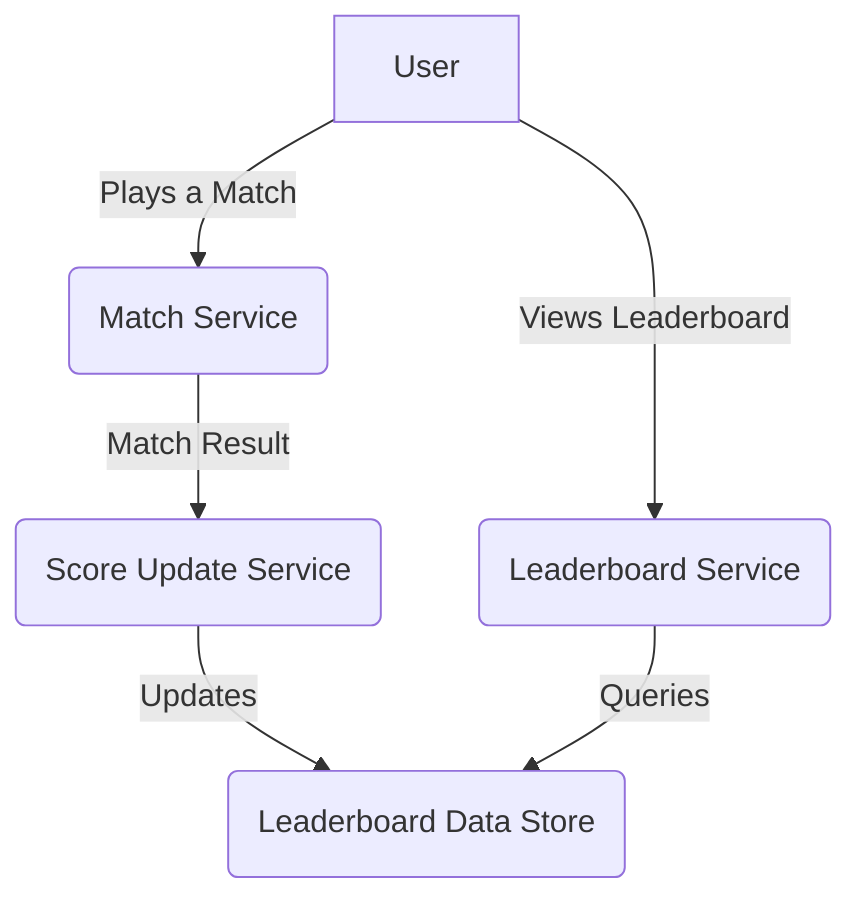
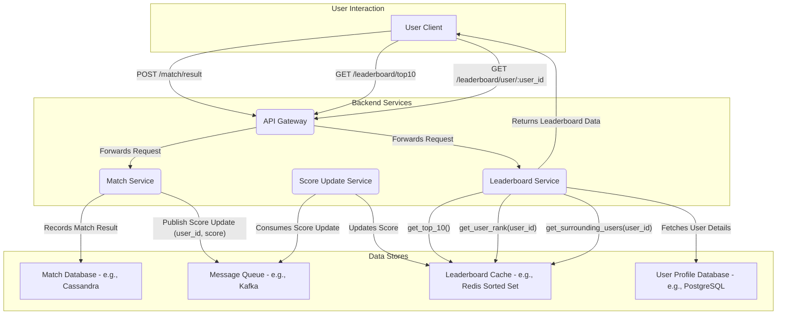

#### **Functional Requirements:**

  * Display the top 10 players on the leaderboard.
  * Show a user's specific rank.
  * Display players who are four places above and below a specific user.
  * A new leaderboard is started each month for a new tournament.
  * Scores are incremented by one for each match win.
  * All players in a tournament are included in the leaderboard.

#### **Non-Functional Requirements:**

  * **Scalability:** The system must handle 5 million daily active users (DAU) and 25 million monthly active users (MAU), with each player playing an average of 10 matches per day.
  * **Real-Time Updates:** The leaderboard should reflect the latest scores with minimal delay.
  * **High Availability:** The system should be resilient to failures.
  * **Low Latency:** Queries for the top 10, user rank, and surrounding players should be fast.

#### **High-Level Architecture**

##### **Level 0: Context Diagram**

##### **Level 1: Data Flow Diagram**

#### **API Gateway**

  * **Description:** The API Gateway is the single entry point for all client requests. It routes requests to the appropriate backend services (Match Service, Leaderboard Service). It can also handle concerns like authentication, rate limiting, and SSL termination.
  * **Justification:**
      * **Decoupling:** Clients are decoupled from the internal service architecture.
      * **Security:** Centralizes security enforcement.
      * **Simplicity:** Simplifies client-side logic as it only needs to know about a single endpoint.
  * **Trade-offs:** Can become a single point of failure if not made highly available. Introduces a small amount of latency.

#### **Match Service**

  * **Description:** This service is responsible for handling the business logic of a match. When a match concludes, it determines the winner and is responsible for initiating the score update process.
  * **Justification:**
      * **Separation of Concerns:** The logic of managing a match is separate from the leaderboard logic.
      * **Scalability:** The Match Service can be scaled independently based on the number of concurrent matches.
  * **Data Storage (Match Database - e.g., Apache Cassandra):**
      * **Choice:** Cassandra is a NoSQL, distributed database known for its high write throughput and scalability.
      * **Justification:** Given the high volume of matches (5M users \* 10 matches/day = 50M matches/day), a database that can handle high write loads is crucial. Cassandra's distributed nature also provides high availability.
      * **Schema:** A simple table to store match results might look like: `(match_id, player1_id, player2_id, winner_id, timestamp)`.

#### **Message Queue (e.g., Apache Kafka)**

  * **Description:** The Match Service publishes a message containing the `user_id` of the winner to a Kafka topic. The Score Update Service consumes these messages.
  * **Justification:**
      * **Asynchronous Processing & Decoupling:** The Match Service doesn't have to wait for the leaderboard to be updated. This makes the system more resilient; if the Score Update Service is temporarily down, messages will be queued and processed later.
      * **Scalability:** Kafka is horizontally scalable and can handle a massive number of messages, which is essential given the volume of match wins.
      * **Durability:** Messages are persisted in Kafka, preventing data loss in case of consumer failure.
  * **Trade-offs:** Introduces operational complexity to manage a Kafka cluster. There's a slight delay between a win and the leaderboard update due to the asynchronous nature.

#### **Score Update Service**

  * **Description:** This is a consumer service that listens for messages on the Kafka topic. For each message, it updates the winner's score in the leaderboard data store.
  * **Justification:**
      * **Focused Responsibility:** This service has a single, well-defined task: updating scores. This makes it simple to develop, test, and maintain.
      * **Independent Scalability:** If the rate of score updates increases, we can scale out the number of instances of the Score Update Service to process messages in parallel (by having multiple consumers in the same consumer group on different partitions of the Kafka topic).

#### **Leaderboard Cache (e.g., Redis with Sorted Sets)**

  * **Description:** This is the core of the leaderboard system. Redis's Sorted Set data structure is perfectly suited for maintaining leaderboards. Each monthly leaderboard will be a separate Sorted Set.
      * The `member` of the sorted set will be the `user_id`.
      * The `score` will be the user's total points for the month.
  * **Justification:**
      * **Performance:** Redis is an in-memory data store, which provides extremely low latency for read and write operations.
      * **Sorted Sets:** This data structure automatically keeps elements sorted by their score. Operations to get top N elements (`ZREVRANGE`), get the rank of a member (`ZREVRANK`), and get a range of members around a specific member are highly efficient, typically O(log N).
      * **Monthly Leaderboards:** We can use a naming convention for the keys to manage monthly leaderboards, for example, `leaderboard:2025-07`. When a new month starts, a new Sorted Set is created.
  * **Trade-offs:**
      * **Data Persistence:** While Redis can be configured for persistence, it's primarily an in-memory store. A catastrophic failure could lead to data loss if not properly configured with replicas and persistence strategies (like AOF or RDB).
      * **Cost:** In-memory storage is generally more expensive than disk storage.

#### **Leaderboard Service**

  * **Description:** This service exposes endpoints for clients to query the leaderboard. It fetches the required data from the Redis cache and formats the response.
  * **Justification:**
      * **Abstraction:** It abstracts the underlying data store from the client. The client doesn't need to know that the leaderboard is stored in Redis.
      * **Business Logic:** It can contain logic for handling requests, such as fetching user details from the User Profile Database to enrich the leaderboard data with usernames and avatars.

#### **User Profile Database (e.g., PostgreSQL)**

  * **Description:** This is a relational database that stores user profile information like `user_id`, `username`, `avatar_url`, etc.
  * **Justification:**
      * **Relational Data:** User profile data is inherently relational. A relational database like PostgreSQL provides strong consistency and is well-suited for this type of data.
      * **Data Integrity:** Enforces data integrity through schemas and constraints.

### **4. Addressing Functional Requirements**

  * **Display Top 10 Players:**

      * The Leaderboard Service will issue a `ZREVRANGE leaderboard:YYYY-MM 0 9 WITHSCORES` command to Redis. This command is highly efficient and returns the top 10 users and their scores.

  * **Show a User's Specific Rank:**

      * The Leaderboard Service will use the `ZREVRANK leaderboard:YYYY-MM <user_id>` command in Redis. This returns the zero-based rank of the user. We add 1 to it to display a one-based rank.

  * **Display Players 4 Places Above and Below a User:**

    1.  First, get the user's rank using `ZREVRANK leaderboard:YYYY-MM <user_id>`. Let's say the rank is `R`.
    2.  Calculate the start and end ranks for the surrounding players: `start = max(0, R - 4)` and `end = R + 4`.
    3.  Use the `ZREVRANGE leaderboard:YYYY-MM <start> <end> WITHSCORES` command to fetch the user IDs and scores of the surrounding players.
    4.  The Leaderboard Service will then fetch the user details (username, etc.) for these user IDs from the User Profile Database to provide a richer response.

### **5. Addressing Non-Functional Requirements**

  * **Scalability:**

      * **Horizontal Scaling:** Each component of this architecture (API Gateway, Match Service, Score Update Service, Leaderboard Service) is stateless and can be horizontally scaled by adding more instances behind a load balancer.
      * **Database Scalability:** Kafka and Cassandra are designed for horizontal scalability. Redis can be scaled using sharding and replication.
      * **Asynchronous Processing:** The use of Kafka prevents the write-intensive score update process from blocking the user-facing services.

  * **Real-Time Updates:**

      * The asynchronous nature of Kafka introduces a minimal delay, but for most "real-time" applications, this sub-second latency is acceptable. The system avoids slow batch processing and provides a near real-time experience.

  * **High Availability:**

      * **Redundancy:** Each service can have multiple instances running.
      * **Data Replication:** Kafka topics can be replicated across multiple brokers. Cassandra provides built-in replication. Redis can be set up in a primary-replica configuration for high availability.

  * **Low Latency:**

      * **In-Memory Operations:** The primary read operations for the leaderboard are served directly from Redis, which is extremely fast.
      * **Efficient Data Structures:** Redis's Sorted Sets provide logarithmic time complexity for most leaderboard operations.

### **6. Tie-Breaking (Bonus)**

If two players have the same score, their rank will be the same using `ZREVRANK`. To break ties, we can incorporate a secondary sorting criterion. A common approach is to use the timestamp of when the score was last updated. The user who reached the score first gets the higher rank.

This can be implemented by storing a composite score in Redis. The score can be a 64-bit number where the higher bits represent the points and the lower bits represent the inverted timestamp (to ensure earlier timestamps result in a higher value).

  * `score = (points << 32) + (MAX_TIMESTAMP - last_update_timestamp)`

This way, when Redis sorts by this composite score, it will automatically handle tie-breaking. The Score Update Service would be responsible for creating this composite score.

This design provides a robust, scalable, and real-time leaderboard system capable of handling a large user base and high-frequency updates, while also offering flexibility for future enhancements like tie-breaking.