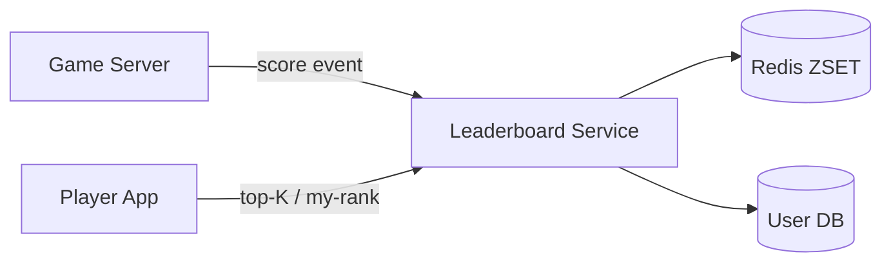
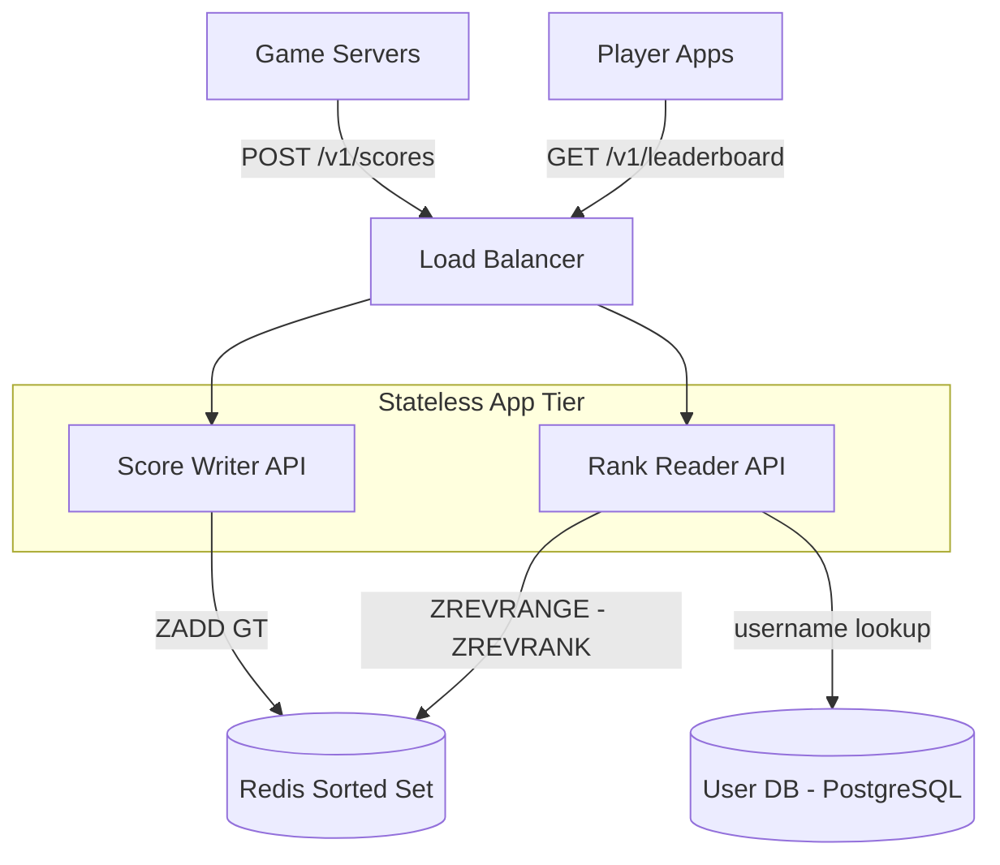

## Capacity Estimation

Start from the requirement numbers and derive everything else. The goal is to show the reasoning, not memorise a result.

### Traffic

| Metric | Calculation | Result |
|---|---|---|
| Score writes (sustained) | given | **5,000 /s** |
| Rank reads (sustained) | given | **50,000 /s** |
| Read:write ratio | 50,000 / 5,000 | **10:1** |
| Peak writes (×5 burst) | 5,000 × 5 | **25,000 /s** |
| Peak reads (×5 burst) | 50,000 × 5 | **250,000 /s** |

Unlike the URL shortener (3,000:1), this board is moderately write-heavy at 10:1. The real constraint is **ranking latency**: every read must answer "where do I stand among 50 million players" in under 10 ms. That rules out any full-table scan and points directly to a purpose-built sorted data structure.

### Memory — Redis ZSET sizing

A Redis sorted set maintains two data structures per member simultaneously (detailed in the {}). The combined memory cost per member breaks down as:

| Component | Size |
|---|---|
| Skip-list node — score + backward ptr + forward ptrs (avg 1.33 levels at p=0.25) | ~32 B |
| Hash map entry — key ptr + value ptr + next ptr | ~24 B |
| Redis string object header (`robj`) | ~16 B |
| Member string (user ID, e.g. 10-digit string) | ~20 B |
| Allocator overhead and alignment | ~28 B |
| **Total per member** | **~120 B theoretical; ~150–200 B empirical** |

| Leaderboard board | Members | Memory at 200 B/member |
|---|---|---|
| Global all-time | 50 M | ~10 GB |
| Per-country (200 countries × avg 250 K players) | 50 M total | ~10 GB |
| Daily board | 50 M (active today) | ~10 GB |
| Weekly board | 50 M | ~10 GB |
| Friend-group boards (amortised, lazily computed) | variable | ~5 GB est. |
| Replica factor (3× per board) | — | ×3 |
| **Total Redis RAM** | | **~135 GB across cluster** |

A 10-node Redis cluster (16 GB each, one replica per primary) provides ~80 GB of usable primary RAM. Combining global + windowed boards on the same nodes and keeping friend boards lazily computed keeps the cluster within budget.

### Storage — Durable score event log

| Metric | Calculation | Result |
|---|---|---|
| Events/day | 5,000/s × 86,400 s | **432 M events/day** |
| Bytes/event | user_id 8 B + score 8 B + ts 8 B + game_id 8 B | **32 B** |
| Storage/day | 432 M × 32 B | **~14 GB/day** |
| 30-day retention | 14 GB × 30 | **~420 GB** |

The event log is used to replay and rebuild boards after failures and to compute time-windowed boards. A Kafka topic or columnar store (ClickHouse) handles this volume comfortably.

### Bandwidth and derived infrastructure

- **Bandwidth:** 250,000 reads/s × ~500 B response = **~125 MB/s egress** at peak; manageable on standard NICs.
- **App servers:** at ~20,000 req/s per node, peak 250,000 reads/s → ~13 nodes; round up to **20 stateless nodes** with headroom.
- **Redis cluster:** ~135 GB total → **8–12 nodes** (primary + replica pairs).
- **Kafka:** 25,000 events/s × 32 B = ~800 KB/s — well within a single Kafka broker; **8–16 partitions** for Score Processor consumer parallelism.

## API Design

```
POST /v1/scores
  Body:    { "user_id": "42", "score": 9800, "game_id": "g:7",
             "idempotency_key": "<uuid>" }
  202 →    { "queued": true }          (async Kafka path — acknowledged on publish)

GET /v1/leaderboard/top
  Query:   ?k=100&segment=global&window=all-time
  200 →    { "entries": [
               { "rank": 1, "user_id": "1", "username": "apex", "score": 99500 },
               ...
             ], "total": 50000000 }

GET /v1/leaderboard/rank/{userId}
  Query:   ?segment=global&window=all-time
  200 →    { "rank": 1234, "score": 9800, "percentile": 99.99 }
  404 →    user has no entry on this board / segment

GET /v1/leaderboard/around/{userId}
  Query:   ?radius=5&segment=global&window=all-time
  200 →    { "entries": [ ...2×radius+1 players centred on userId... ] }
```

**Idempotency:** the `idempotency_key` on score writes ensures a retried POST (e.g. after a network timeout) does not double-count the same game event. The Score Processor deduplicates on `(user_id, idempotency_key)` before issuing `ZADD`.

**`segment` and `window` parameters** route the Rank Reader to the correct Redis key — e.g. `lb:global:all-time`, `lb:country:US:all-time`, `lb:global:daily:2024-01-15`.

## Data Model

```
-- Redis (primary leaderboard store)
ZSET  lb:{segment}:{window}
  member  = user_id (string)
  score   = float64 composite score
            (raw score + tie-break fraction; see Deep Dive)

-- Redis (score-distribution histogram for approximate rank)
HASH  lb:hist:{segment}:{window}
  field   = bucket_index (0–999)
  value   = member count in that score bucket (integer)

-- Redis (user profile cache)
HASH  user:profile:{user_id}
  field   = username, country
  TTL     = 3600 s (refreshed from PostgreSQL on miss)

-- PostgreSQL (user profiles — small, rarely written)
users
  user_id    BIGINT       PRIMARY KEY
  username   VARCHAR(32)  NOT NULL
  country    CHAR(2)      NOT NULL
  avatar_url VARCHAR(128)
  created_at TIMESTAMP

-- Kafka topic (durable event log / source of truth)
score-events
  user_id    INT64
  score      INT64
  game_id    INT64
  ts_millis  INT64
  segment    STRING   -- routing hint: "global", "country:US", etc.
  idempotency_key  STRING

-- ClickHouse (time-windowed analytics + board rebuilds)
score_events PARTITION BY toDate(ts)
  user_id    UInt64
  score      UInt64
  game_id    UInt64
  ts         DateTime
```

The critical insight: **Redis is not the source of truth**. Kafka and ClickHouse are. Redis is a derived, recomputable read cache of the current sorted rankings. This lets us rebuild any board from the event log after a failure and keeps the schema simple — there are no complex update-in-place transactions in Redis, only `ZADD GT` idempotent upserts.

## High-Level Architecture — v1

The v1 design is deliberately simple: game servers call the Score Writer directly; the Rank Reader queries Redis.

### Level 0 — Context



### Level 1 — Components



**Component responsibilities:**

- **Score Writer API.** Receives score events, applies "max score wins" logic via `ZADD … GT` (only updates if new score exceeds the current one — atomic since Redis 6.2), and writes to each applicable ZSET (global + country + today's daily board). Thin by design: no business logic beyond routing.
- **Rank Reader API.** Translates API queries to Redis commands: `ZREVRANGE` for top-K, `ZREVRANK` for my-rank, and two `ZREVRANGE` calls around the user's rank for nearby. Enriches results with usernames from the User DB (cached in Redis). Fully stateless — any node can serve any request.
- **Redis Sorted Set.** The primary read store and the heart of the design. See [key-value-stores]({}) for the underlying skip-list and hash map implementation that makes all three operations — `ZADD`, `ZREVRANK`, `ZREVRANGE` — O(log n) and sub-millisecond.
- **User DB (PostgreSQL).** Small, rarely-written table for profile enrichment (username, country). One batch query per top-K response; cached in Redis for 1 hour.

The v1 weaknesses — write coupling, tie-breaking, memory and write hotspots on a single node, cross-shard rank, and segmented boards — are each addressed in the {}.
