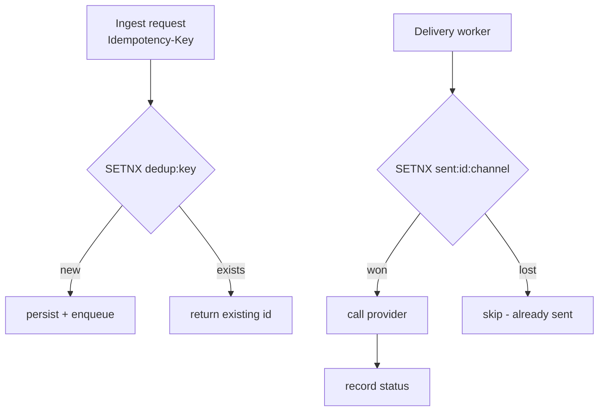
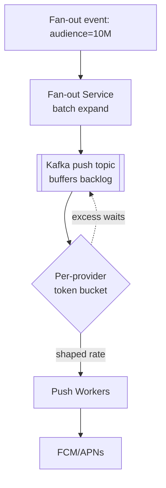
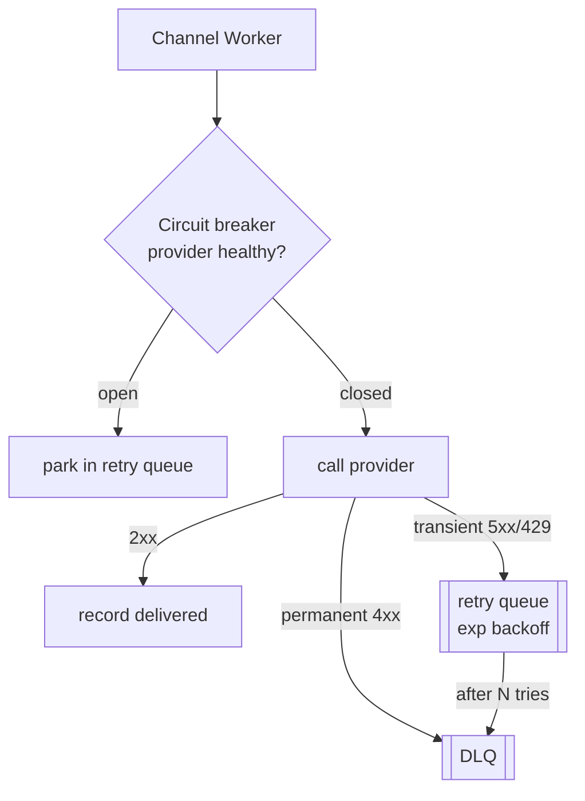
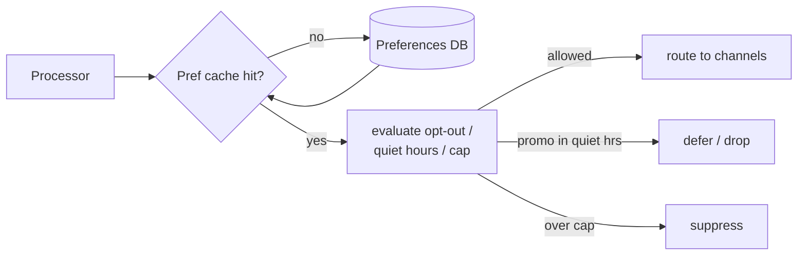
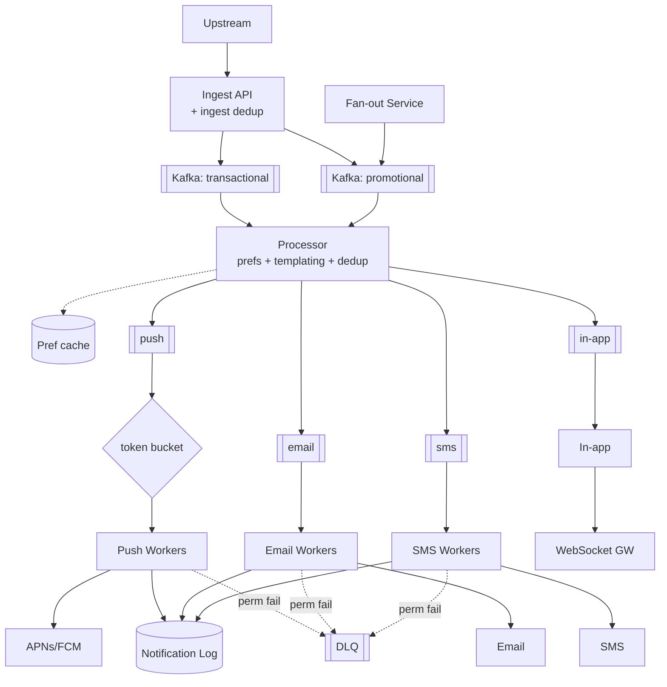

We evolve v1 by attacking each weakness: **Problem → Modification → Justification**, each with its own diagram.

## Refinement 1 — Deduplication (effectively-once delivery)

**Problem.** Kafka is at-least-once, upstream services retry on timeouts, and workers can crash after sending but before recording status. All three cause the *same* logical notification to be delivered twice — a user gets paged repeatedly, or receives two identical OTP texts.

**Modification.** A two-level dedup guard keyed on the upstream `Idempotency-Key`:

1. **Ingest dedup:** on accept, `SETNX dedup:{key}` in Redis with a 24 h TTL. If it already exists, return the *existing* `notification_id` (200) instead of enqueuing again.
2. **Delivery dedup:** before a worker calls a provider, `SETNX sent:{notification_id}:{channel}`. Only the winner sends; a retried duplicate sees the key and skips.



**Justification & trade-offs.** `SETNX` is an atomic compare-and-set — the classic idempotency primitive (see {}). Dedup is **best-effort within the TTL window** (24 h), which covers all realistic retry horizons; keeping keys forever would be prohibitively large (25 GB/day). Trade-off: if the Redis dedup store is wiped, we degrade to at-least-once — acceptable, and far better than dropping notifications.

## Refinement 2 — Absorbing fan-out storms without melting providers

**Problem.** An event like "your team scored" fans out to 10M users in minutes. If the processor pushes all 10M into the push queue instantly, workers slam APNs/FCM past their per-app rate limits, triggering throttling (429) and mass retries — a self-inflicted DDoS.

**Modification.** Introduce a **fan-out service** that expands audience→recipients in batches onto Kafka, and a **token-bucket rate limiter per provider** in front of each worker pool so outbound throughput is shaped to each provider's contractual limit. Excess simply waits in Kafka (which is built to hold it).



**Justification & trade-offs.** Kafka's retained log means a 10M burst becomes a *backlog that drains at a safe rate*, not a spike that breaks providers. The token bucket (see {}) matches our send rate to what FCM/APNs actually accept. Trade-off: promotional fan-outs take minutes to fully deliver — fine for non-transactional traffic. Transactional notifications use a **separate high-priority topic/queue** so they never queue behind a promotional storm (priority isolation).

## Refinement 3 — Provider failure isolation & retries

**Problem.** One provider (say SMS/Twilio) starts timing out. Shared worker threads block on it, retries pile up, and the latency leaks into unrelated channels. A permanently-invalid device token retries forever, wasting capacity.

**Modification.** Per-channel **bulkheads** (already separate queues/pools) plus a **circuit breaker** per provider and a **bounded exponential-backoff retry** that dead-letters after N attempts. Classify failures: *transient* (timeout, 429, 5xx) → retry with backoff; *permanent* (invalid token, hard bounce, unsubscribed) → DLQ immediately, no retry.



**Justification & trade-offs.** The circuit breaker ({}) stops hammering a dead provider and lets it recover; bulkheads ({}) keep SMS trouble from starving push. Exponential backoff with jitter avoids synchronized retry storms. Trade-off: classification requires per-provider error mapping — worth it, since blind retries of permanent failures are pure waste.

## Refinement 4 — Preferences, quiet hours, and rate caps

**Problem.** Users must be able to opt out of categories, mute quiet hours, and not be spammed. Checking this per notification against a relational store at 20k/s adds latency and load.

**Modification.** Cache the compact per-user preference blob in Redis (read-through), evaluated in the processor before routing. Quiet-hours-suppressed *transactional* messages are still sent (security overrides preference); *promotional* ones are dropped or deferred to after the quiet window. A per-user daily counter enforces rate caps.



**Justification & trade-offs.** Preference blobs are tiny and change rarely, so a read-through cache gives ~100% hit rate and O(1) checks. Distinguishing transactional vs promotional at this gate is the key policy: never suppress an OTP. Trade-off: cached prefs can be seconds stale after a change — acceptable for notifications.

## Final Architecture



## Drill-Down

### Detailed APIs

Status response aggregates per-channel outcomes:
```
GET /api/v1/notifications/n_abc
200: {
  "notification_id": "n_abc", "user_id": "u_123", "category": "payment_failed",
  "channels": {
    "push":  { "status": "delivered", "provider_id": "fcm-…", "ts": "…" },
    "email": { "status": "bounced",   "reason": "mailbox_full", "ts": "…" }
  }
}
```

### Database schema & partitioning

- **notification** (Cassandra): partition by `user_id`, cluster by `created_at DESC` → "list my recent notifications" is a single-partition scan. A secondary table keyed by `notification_id` supports point status lookups. See {}.
- **user_preferences**: low-write, read-heavy → RDBMS or KV with a Redis read-through cache.
- **dedup / sent keys**: Redis with TTL; never the source of truth, only a guard.

### Data structures used

| Structure | Where | Why |
|---|---|---|
| **Kafka partitioned log** | ingest + fan-out buffer | absorb bursts, per-user ordering, replay |
| **Redis SETNX + TTL** | dedup guard | atomic effectively-once |
| **Token bucket** | per-provider rate shaping | respect provider limits |
| **Circuit breaker** | per provider | stop hammering dead deps |
| **Wide-column rows** | notification log | high write, single-partition reads |

### Key algorithm — process one notification

```
def process(msg):
    if not redis.setnx("dedup:"+msg.idem_key, ttl=24h):   # ingest-level dup
        return
    prefs = pref_cache.get(msg.user_id)
    channels = resolve_channels(msg, prefs)               # opt-outs, overrides
    if msg.priority == "promotional":
        if in_quiet_hours(prefs) or over_rate_cap(msg.user_id):
            return defer_or_drop(msg)
    body = render(msg.template_id, msg.data, prefs.locale)
    for ch in channels:
        enqueue(ch, {notification_id: msg.id, body, user: msg.user_id})
```

### Edge cases & failure handling

- **Worker crash after provider send, before status write:** delivery dedup key (`sent:id:channel`) prevents a re-send; status is reconciled from the provider's async delivery receipt/webhook.
- **Duplicate upstream event:** ingest dedup returns the existing id — no second notification.
- **Provider webhook says "delivered" late:** log is updated idempotently by `provider_id`.
- **Quiet-hours edge (timezone/DST):** evaluate against the user's stored tz, not server tz.
- **Poison message:** after N retries → DLQ with full context for replay after a fix.
