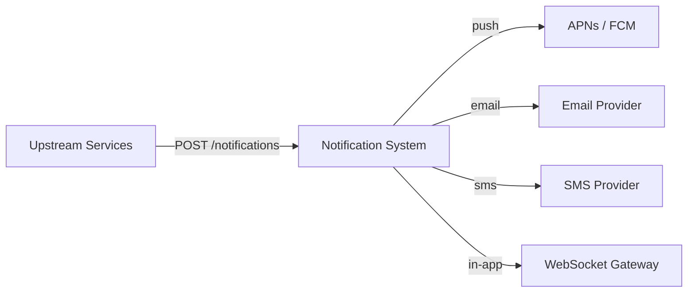
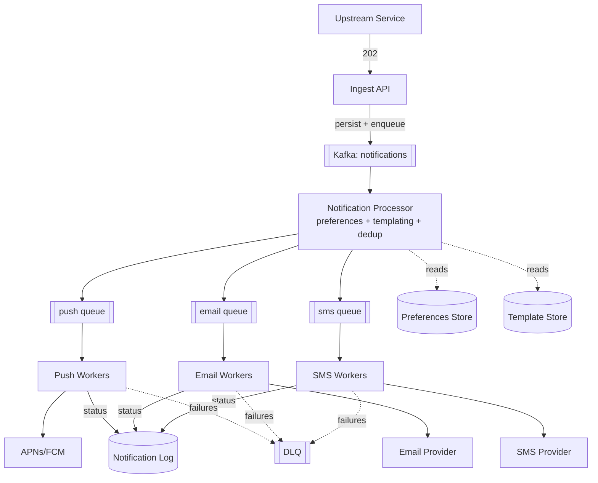

## Capacity Estimation

### Traffic

| Metric | Calculation | Result |
|---|---|---|
| Average send rate | 500M / 86400 s | **~5,800 /s** |
| Peak send rate (×3.5) | 5,800 × 3.5 | **~20,000 /s** |
| Channel mix (assumed) | push 70% / email 20% / SMS 5% / in-app 5% | — |
| Peak push | 20,000 × 0.70 | ~14,000 /s |
| Fan-out burst (event → N users) | e.g. 10M pushes over 5 min | ~33,000 /s sustained burst |

The steady state is modest; **bursts** dominate the design. A single upstream event ("your team scored") can fan out to millions, so the ingestion path must **absorb and buffer** spikes rather than pass them straight to providers (which have their own rate limits).

### Storage

| Data | Bytes/record | Volume | Total |
|---|---|---|---|
| Notification log (id, user, channel, template, status, ts) | ~400 B | 500M/day | ~200 GB/day |
| Retention (90 days, then archive) | ~400 B × 500M × 90 | — | **~18 TB** |
| Dedup keys (Redis, 24 h TTL) | ~50 B | 500M | ~25 GB |
| User preferences | ~500 B | 500M users | ~250 GB |

The notification log is high-volume, append-mostly, queried by `(user_id, time)` or `notification_id` — a natural fit for a **wide-column store** (Cassandra). See {}.

### Throughput to providers & derived infra

| Metric | Calculation | Result |
|---|---|---|
| Delivery workers (push) | 14,000/s ÷ ~200 sends/s/worker | ~70 workers |
| Kafka partitions (ingest topic) | headroom for 33k/s bursts | ~64–128 partitions |
| Dedup store | 25 GB in Redis | 3–6 node cluster |

## API Design

Two surfaces: an **ingest API** for upstream services, and a **preferences API** for users/apps.

```
POST /api/v1/notifications                 (called by upstream services)
  Headers: Authorization, Idempotency-Key: <event-uuid>
  Body: {
    "user_id": "u_123",
    "category": "payment_failed",          // used for preference + priority routing
    "template_id": "payment_failed_v2",
    "data": { "amount": "42.00", "currency": "USD" },
    "channels": ["push","email"],          // optional override; else use preferences
    "priority": "transactional"            // transactional | promotional
  }
  202 → { "notification_id": "n_abc", "status": "accepted" }
  400 → invalid template/data

GET  /api/v1/notifications/{id}            → status + per-channel delivery result
GET  /api/v1/users/{id}/preferences       → channel + category prefs, quiet hours
PUT  /api/v1/users/{id}/preferences       → update opt-outs / quiet hours
```

The ingest endpoint returns **202 Accepted** immediately after durably enqueuing — delivery happens asynchronously. The `Idempotency-Key` (the upstream event id) is the anchor for deduplication.

## Data Model

```
notification (Cassandra)
  PARTITION KEY user_id
  CLUSTERING KEY created_at DESC, notification_id
  category, template_id, priority, channels[], status_by_channel<map>, dedup_key

user_preferences (KV / RDBMS)
  user_id PK, channel_optout<set>, category_optout<set>,
  quiet_hours{start,end,tz}, rate_cap_per_day, device_tokens[]

template (config store)
  template_id PK, channel, locale, subject, body_template, version
```

## High-Level Architecture — v1

### Level 0 — Context



### Level 1 — Components



**Component responsibilities & first-order justification:**

- **Ingest API.** Validates, persists the notification, and publishes to Kafka, then returns 202. Durable-before-ack guarantees we never lose an accepted notification. Uses {} as the buffering backbone so ingestion bursts don't overwhelm providers.
- **Kafka topic.** The shock absorber. Partitioned by `user_id` for per-user ordering and parallelism; retains messages so a downstream outage doesn't drop work.
- **Notification Processor.** Applies preferences (opt-outs, quiet hours, rate caps), renders the template, runs dedup, and routes to per-channel queues. Kept separate from delivery so channel-specific slowness doesn't block routing.
- **Per-channel queues + workers.** Each channel has its own queue and worker pool because providers differ wildly in latency, rate limits, and failure modes. Isolating them is a {}.
- **DLQ.** Permanent failures (invalid device token, hard bounce) go to a dead-letter queue for inspection and cleanup. See {}.
- **Notification Log.** Append-only status store for tracking and support queries.

The weaknesses this v1 leaves open — duplicate deliveries on retries, fan-out storms, provider rate-limiting and failure isolation, and preference/quiet-hours correctness — are addressed in the {}.
