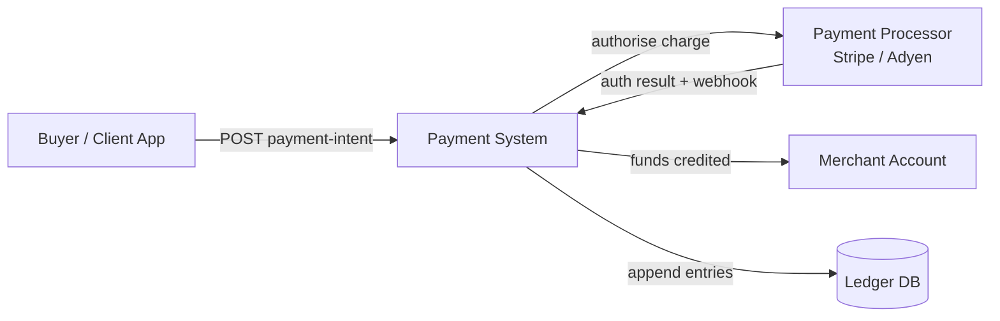
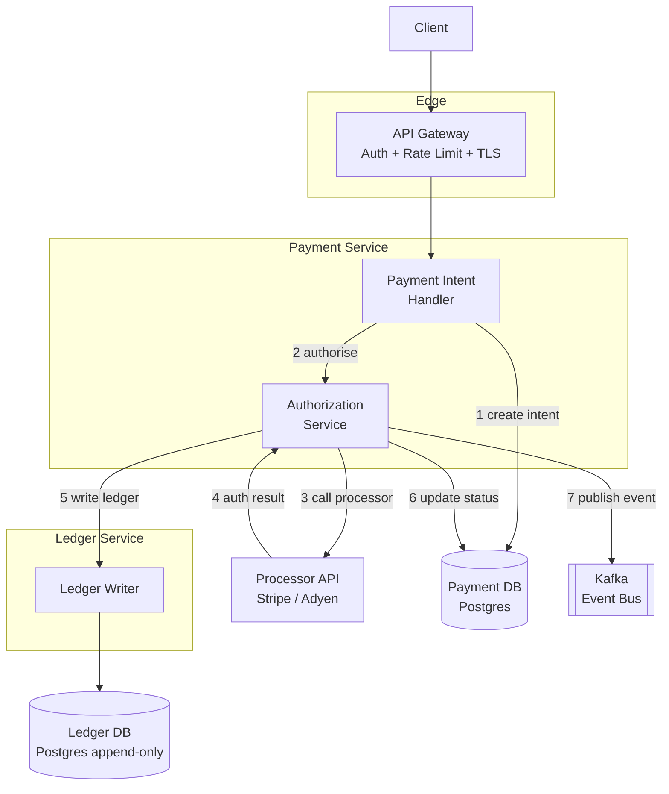

## Capacity Estimation

### Traffic

| Metric | Calculation | Result |
|---|---|---|
| Payment writes (peak) | given | **10,000 /s** |
| Payment writes (avg, 24 h) | ~500 M / 86,400 s | **~5,800 /s** |
| Peak writes (×2 burst) | 10,000 × 2 | **20,000 /s** |
| Ledger writes | 10,000 × 4 entries/payment | **40,000 entries/s** |
| Payment reads (status + queries) | 10× write ratio | **~100,000 reads/s** |
| Processor webhook callbacks | 1 per payment | **~10,000 /s** |

Unlike a URL shortener, this is a **write-heavy** system: every payment requires multiple durable writes across several tables before a response can be returned. Reads are still significant (merchant portals, status polling), but writes drive the hardware design.

### Storage

| Field | Bytes |
|---|---|
| Payment intent record | ~500 B |
| Ledger entry | ~200 B |
| Outbox row (transient, recycled) | ~300 B |
| Saga state row | ~400 B |

| Metric | Calculation | Result |
|---|---|---|
| Payments per day | 500 M | — |
| Payment storage per day | 500 M × 500 B | **250 GB/day** |
| Ledger entries per day | 500 M × 4 × 200 B | **400 GB/day** |
| Combined write volume per day | 250 + 400 GB | **~650 GB/day** |
| 7-year retention (uncompressed) | 650 GB × 365 × 7 | **~1.66 PB total** |

**Tiered storage strategy:** a flat 1.66 PB in hot RDBMS would be prohibitively expensive. Instead:

| Tier | Data age | Store | Approx size | Latency |
|---|---|---|---|---|
| Hot | 0 – 90 days | Sharded Postgres | ~58 TB | < 10 ms |
| Warm | 90 days – 2 years | Columnar store (Redshift / BigQuery) | ~390 TB | seconds |
| Cold | 2 – 7 years | Object storage (S3 / GCS) | ~1.2 PB | minutes |

Background tiering jobs move data to cheaper tiers; only the hot tier must handle sub-second queries.

### Memory and Derived Infrastructure

| Component | Sizing |
|---|---|
| Payment API nodes | 120K req/s at ~10K req/s/node → **~12 nodes** + headroom |
| Payment DB (sharded Postgres) | 40K writes/s → **~8 shards**, 3× synchronous replicas each |
| Ledger DB | Separate shard group, same sizing, append-only workload |
| Idempotency cache (Redis) | 500 M active intents × 500 B → **~25 GB** Redis, 2–3 nodes |
| Kafka cluster | 40K events/s, 1 KB avg → ~40 MB/s → **3–6 broker nodes** |

## API Design

All endpoints require authentication (API key or OAuth bearer token at the gateway). Mutation endpoints require an `Idempotency-Key` header; the server rejects a second request with the same key but different parameters with `422`.

```
POST /v1/payment-intents
  Headers: Authorization: Bearer <token>
           Idempotency-Key: <client-uuid>
  Body:    { "amount": 10000, "currency": "USD",
             "buyer_id": "usr_123", "merchant_id": "mer_456",
             "payment_method_id": "pm_card_visaXXXX" }
  201 →   { "payment_intent_id": "pi_abc123",
             "status": "created", "created_at": "2024-03-15T14:00:00Z" }
  409 →   idempotency key already used with different parameters

POST /v1/payment-intents/{id}/confirm
  Idempotent: retrying a confirmed intent returns the current status, never re-charges.
  200 →   { "payment_intent_id": "pi_abc123",
             "status": "succeeded",
             "processor_reference": "ch_xyz789",
             "ledger_entry_ids": ["le_001", "le_002", "le_003", "le_004"] }
  402 →   processor declined (status: "failed", declined_reason: "insufficient_funds")

GET /v1/payment-intents/{id}
  200 →   { full intent details, current status, timeline of state transitions }
  404 →   not found

GET /v1/payment-intents/{id}/ledger-entries
  200 →   { "entries": [ { "id", "type", "account_id",
                           "entry_type", "amount", "currency",
                           "balance_after", "timestamp" } ] }

GET /v1/accounts/{account_id}/balance
  Query:  ?as_of=2024-03-15T14:00:00Z   (optional — point-in-time query)
  200 →   { "account_id": "acc_789", "currency": "USD",
             "balance": 97000, "as_of_sequence": 40120 }
```

**Why a two-step flow (create then confirm)?** Creating the intent first lets the client collect and vault the payment method client-side (e.g., via Stripe.js or a PCI vault SDK) before the server-side confirm. Raw card numbers never traverse our servers, minimising PCI scope. The confirm step then executes the actual charge using the vault's opaque token.

**Why not a single POST /payments?** An atomic one-shot endpoint is simpler but forces the full authorisation latency (including the external processor round-trip) into a single synchronous response. The two-step model lets callers set up intents in advance, reduces timeout pressure, and enables 3DS (3D Secure) authentication between create and confirm without keeping a connection open.

## Data Model

```sql
-- Payment intent lifecycle
CREATE TABLE payment_intents (
    id                 VARCHAR(32)   PRIMARY KEY,          -- "pi_abc123"
    idempotency_key    VARCHAR(128)  UNIQUE NOT NULL,
    status             VARCHAR(16)   NOT NULL,             -- created|authorizing|authorized
                                                           -- |succeeded|failed|cancelled
    amount             BIGINT        NOT NULL,             -- smallest currency unit (cents)
    currency           CHAR(3)       NOT NULL,
    buyer_id           VARCHAR(32)   NOT NULL,
    merchant_id        VARCHAR(32)   NOT NULL,
    payment_method_id  VARCHAR(32)   NOT NULL,
    fee_amount         BIGINT        NOT NULL DEFAULT 0,
    processor_ref      VARCHAR(128),                       -- external processor charge ID
    fraud_score        SMALLINT,                           -- 0-100 from fraud service
    failed_reason      TEXT,
    created_at         TIMESTAMPTZ   NOT NULL DEFAULT NOW(),
    updated_at         TIMESTAMPTZ   NOT NULL DEFAULT NOW()
);

-- Double-entry ledger — append-only, never updated or deleted
CREATE TABLE ledger_entries (
    id                 BIGSERIAL     PRIMARY KEY,
    payment_intent_id  VARCHAR(32)   NOT NULL,
    transaction_id     UUID          NOT NULL,             -- groups paired debit+credit
    sequence           BIGINT        NOT NULL,             -- monotonic per account
    account_id         VARCHAR(32)   NOT NULL,
    entry_type         VARCHAR(6)    NOT NULL CHECK (entry_type IN ('debit','credit')),
    amount             BIGINT        NOT NULL CHECK (amount > 0),
    currency           CHAR(3)       NOT NULL,
    balance_after      BIGINT        NOT NULL,             -- running balance snapshot
    memo               TEXT,
    created_at         TIMESTAMPTZ   NOT NULL DEFAULT NOW(),
    UNIQUE (account_id, sequence)
);
CREATE INDEX idx_ledger_account_seq ON ledger_entries (account_id, sequence);

-- Snapshot of derived account balance (CQRS read model over ledger_entries)
CREATE TABLE account_snapshots (
    account_id         VARCHAR(32)   PRIMARY KEY,
    currency           CHAR(3)       NOT NULL,
    balance            BIGINT        NOT NULL,
    as_of_sequence     BIGINT        NOT NULL,
    updated_at         TIMESTAMPTZ   NOT NULL
);

-- Transactional outbox — same DB as payment_intents; written atomically
CREATE TABLE outbox (
    id                 BIGSERIAL     PRIMARY KEY,
    payment_intent_id  VARCHAR(32)   NOT NULL,
    event_type         VARCHAR(64)   NOT NULL,             -- "payment.succeeded"
    payload            JSONB         NOT NULL,
    published_at       TIMESTAMPTZ,                        -- NULL = not yet published
    created_at         TIMESTAMPTZ   NOT NULL DEFAULT NOW()
);
CREATE INDEX idx_outbox_unpublished ON outbox (created_at) WHERE published_at IS NULL;
```

The ledger has **no UPDATE or DELETE**. Corrections are made via reversal entries — a new credit that offsets a prior debit. This is the accounting standard, not a limitation: regulators require it.

## Architecture — v1

### Level 0 — Context



### Level 1 — First-Cut Components



**Component responsibilities and first-order justification:**

- **API Gateway.** Handles TLS termination, authentication, rate limiting, and idempotency-key forwarding. No money movement logic lives here.
- **Payment Intent Handler.** Creates and tracks payment intent lifecycle. Owns the `payment_intents` table. Delegates authorisation to the Authorization Service on confirm.
- **Authorization Service.** Contacts the external processor synchronously. Drives the saga steps (authorise → write ledger → update status). Handles processor timeouts and ambiguous responses.
- **Ledger Service.** The single writer to `ledger_entries`. Enforces double-entry invariants (every write must be a balanced debit/credit pair). Exposes balance queries. Never makes external calls.
- **Kafka event bus.** Decouples the payment flow from downstream consumers. Payment events are published after the ledger write commits, so consumers always see a consistent state.

**First-order weaknesses this v1 does not address:**

1. Steps 1–7 span two DB writes and a Kafka publish — a crash between any two leaves the system partially executed.
2. The external processor may time out — retrying blindly risks double-charging the buyer.
3. The ledger balance query (`SUM` over all entries per account) is O(n) and grows forever.
4. No fraud check before charging.
5. No reconciliation between the internal ledger and processor settlement records.

These are tackled in the {} and {}.
