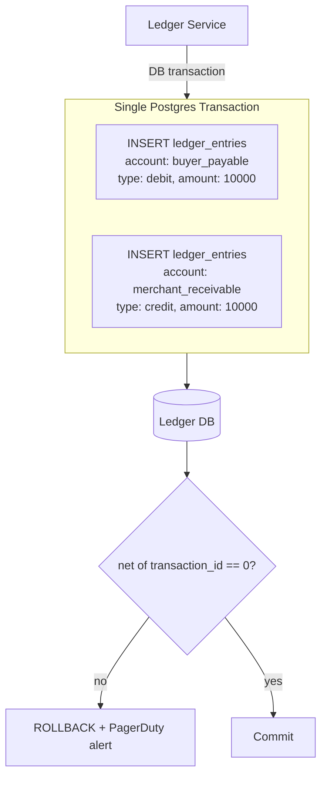
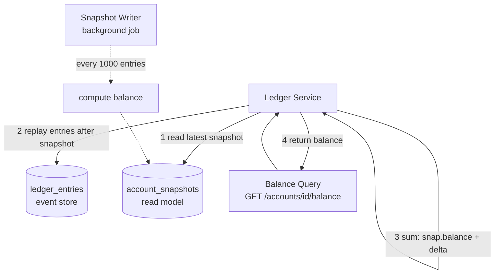
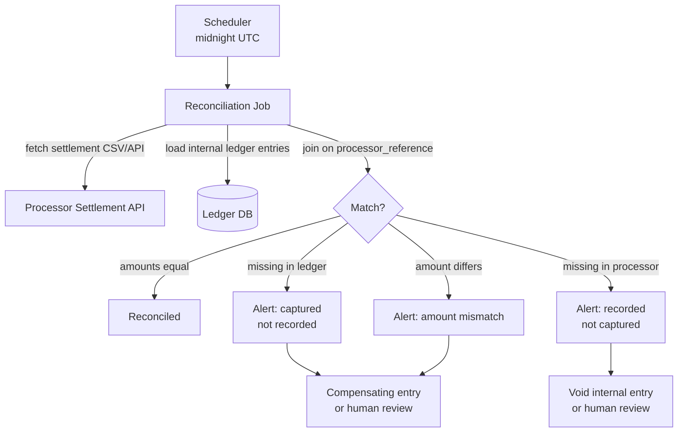

This page focuses on the **ledger** — the financial heart of the payment system. We evolve from a naive append-only table to a fully event-sourced ledger with double-entry invariants, snapshot-based balance queries, and automated nightly reconciliation against the processor.

## Refinement 1 — Enforcing Double-Entry Invariants

**Problem.** In v1, the ledger is append-only but nothing structurally enforces the double-entry rule: for every debit there must be an equal credit, and the net of all entries must always be zero. A single application bug could silently create or destroy money with no alarm.

**Modification.** The Ledger Service writes **entry pairs** atomically in a single DB transaction. Every call must specify a debit account, a credit account, and a positive amount. The service validates `debit_amount == credit_amount` before committing. Errors rollback the entire transaction and trigger an alert.



**Example: a $100.00 payment with a $3.00 platform fee**

| transaction_id | account | entry_type | amount (cents) |
|---|---|---|---|
| txn-001 | buyer_payable | debit | 10 000 |
| txn-001 | merchant_receivable | credit | 10 000 |
| txn-002 | merchant_receivable | debit | 300 |
| txn-002 | platform_revenue | credit | 300 |

Net per account: buyer **−$100**, merchant **+$97** (received $100, paid $3 fee), platform **+$3**. Grand total: **$0**.

The `transaction_id` UUID groups the paired rows. A post-commit check query (`SELECT SUM(CASE WHEN entry_type='debit' THEN -amount ELSE amount END) FROM ledger_entries WHERE transaction_id = ?`) should return zero; any non-zero result triggers an alert for human review.

**Justification & trade-offs.** The double-entry constraint makes financial bugs visible immediately rather than silently. It also simplifies reconciliation: every `transaction_id` group nets to zero by construction, so a broken batch is easy to identify. The trade-off is that the Ledger Service must be the sole writer to `ledger_entries` — any other service writing directly could produce unbalanced entries. This is enforced at the service boundary, not the DB schema (DB constraints for multi-row invariants require triggers, which add write latency and complexity).

## Refinement 2 — Event Sourcing with Snapshots

**Problem.** Computing an account's current balance by summing all ledger entries (`SELECT SUM(...) WHERE account_id = ?`) is O(n) in the number of entries and grows unboundedly as the ledger ages. A high-volume merchant account accumulates millions of entries per day.

**Modification — Event Sourcing with periodic snapshots.** The ledger is the **event store**: each `ledger_entries` row is an immutable event. The account balance at any point in time is derived by replaying events from the most recent snapshot.

> **Event sourcing — explained inline** (no dedicated design-concepts page exists):
>
> In event sourcing the system stores the **sequence of events** that produced the current state, not the state itself. Current state is a **projection** derived by replaying the event log.
>
> Applied to the ledger:
> - **Events** = ledger entries (debit or credit, amount, timestamp, sequence number).
> - **State** = the account's current balance.
> - **Replay** = `balance = snapshot.balance + Σ(entries since snapshot)`.
> - **Snapshots** = periodically persisted projections (e.g., every 1,000 entries per account) that bound replay cost to a fixed window.
> - **Auditability** = the full event log is the audit trail. Any account's balance at any historical timestamp can be reconstructed exactly.
> - **Immutability** = events are never modified. A correction is a new compensating event (a reversal debit/credit pair), never an update.
> - **Point-in-time query** = pass `as_of` to `get_balance`; replay stops at the nearest entry before that timestamp. Invaluable for dispute resolution and regulatory audits.



**Balance replay pseudocode:**

```python
def get_balance(account_id: str, as_of: datetime = None) -> int:
    # Step 1: load most recent snapshot (before as_of, if given)
    snap = db.query_one(
        """SELECT balance, as_of_sequence
           FROM account_snapshots
           WHERE account_id = %s
           ORDER BY as_of_sequence DESC LIMIT 1""",
        account_id
    )
    base_balance = snap.balance if snap else 0
    base_seq     = snap.as_of_sequence if snap else 0

    # Step 2: replay events since the snapshot
    query = """
        SELECT entry_type, amount
        FROM ledger_entries
        WHERE account_id = %s AND sequence > %s
    """
    params = [account_id, base_seq]
    if as_of:
        query += " AND created_at <= %s"
        params.append(as_of)
    query += " ORDER BY sequence ASC"

    entries = db.query(query, *params)

    # Step 3: accumulate
    balance = base_balance
    for entry in entries:
        if entry.entry_type == 'credit':
            balance += entry.amount
        else:
            balance -= entry.amount

    return balance

def take_snapshot(account_id: str):
    """Run periodically in background; caps replay cost."""
    balance = get_balance(account_id)
    last_seq = db.query_one(
        "SELECT MAX(sequence) FROM ledger_entries WHERE account_id = %s",
        account_id
    ).max
    db.upsert(
        "INSERT INTO account_snapshots (account_id, balance, as_of_sequence, updated_at) "
        "VALUES (%s, %s, %s, NOW()) "
        "ON CONFLICT (account_id) DO UPDATE "
        "SET balance=EXCLUDED.balance, as_of_sequence=EXCLUDED.as_of_sequence, "
        "    updated_at=EXCLUDED.updated_at",
        account_id, balance, last_seq
    )
```

With snapshots every 1,000 entries, replay reads at most 1,000 rows regardless of total ledger age — effectively O(1) for balance queries.

**Justification & trade-offs.** The `account_snapshots` table is a CQRS read model derived from the write-side event store; see {}. The event log is the single source of truth — the snapshot can always be recomputed by full replay if it becomes corrupted. Immutability is legally required: financial regulators mandate that accounting records not be altered; event sourcing provides this as a structural property.

Trade-off: if the snapshot writer falls behind (a background job crashes), balance queries become slower as replay windows grow. The Ledger Service must monitor `MAX(created_at) - latest_snapshot_updated_at` per account and alert when stale.

## Refinement 3 — Nightly Reconciliation

**Problem.** The internal ledger and the external processor's records can diverge silently: a network timeout may mean a processor debit succeeded but our ledger missed it, or vice versa. Left unchecked, these discrepancies compound and cause real financial loss — a class of bug that is invisible until the books are compared.

**Modification.** A nightly reconciliation batch job runs after the processor publishes its daily settlement report (typically T+1 or T+2 business days after the transaction).



**Reconciliation algorithm:**

```python
def reconcile(date: date):
    # Load processor settlement report
    proc_rows = fetch_processor_settlement(date)   # list of {processor_ref, amount}
    proc_map  = {r.processor_ref: r for r in proc_rows}

    # Load internal ledger debits grouped by payment intent
    internal_rows = db.query(
        """SELECT pi.processor_ref, SUM(le.amount) AS amount
           FROM payment_intents pi
           JOIN ledger_entries le ON le.payment_intent_id = pi.id
           WHERE pi.created_at::date = %s
             AND le.entry_type = 'debit'
             AND le.account_id = 'buyer_payable'
           GROUP BY pi.processor_ref""",
        date
    )
    internal_map = {r.processor_ref: r for r in internal_rows}

    discrepancies = []

    # Check every internal entry against processor
    for ref, row in internal_map.items():
        proc = proc_map.get(ref)
        if not proc:
            discrepancies.append({"type": "phantom",       "ref": ref})
        elif proc.amount != row.amount:
            discrepancies.append({"type": "amount_mismatch", "ref": ref,
                                  "internal": row.amount, "external": proc.amount})

    # Check every processor entry against internal
    for ref in proc_map:
        if ref not in internal_map:
            discrepancies.append({"type": "missing_in_ledger", "ref": ref})

    publish_report(date, discrepancies)
    if discrepancies:
        alert_on_call(discrepancies)

    return discrepancies
```

**Auto-remediation policy:** discrepancies below a configurable threshold (e.g., < $0.01 rounding differences from FX) are auto-closed with a compensating adjustment entry. Discrepancies above the threshold, or of type `missing_in_ledger` (processor charged the buyer but we have no record), always page a human. This aligns with {} — reconciliation is how financial systems achieve eventual correctness across a trust boundary with an external party.

**Settlement lag:** processors settle T+1 or T+2 days. The reconciliation job must match its window to the processor's actual settlement date, not the transaction date — otherwise today's unmatched entries are false positives that have not yet appeared in the settlement report.

**Justification & trade-offs.** Reconciliation is the **safety net** for every reliability mechanism in the system: even if idempotency, the saga, or the outbox fails silently, the nightly comparison catches the discrepancy. The matching key is `processor_reference` (the processor's own charge ID), which survives internal system restarts and ID changes. Trade-off: a 24-hour reconciliation window means discrepancies are detected late. For high-value transactions, intraday reconciliation (every 4–6 hours) is worth the added complexity.
