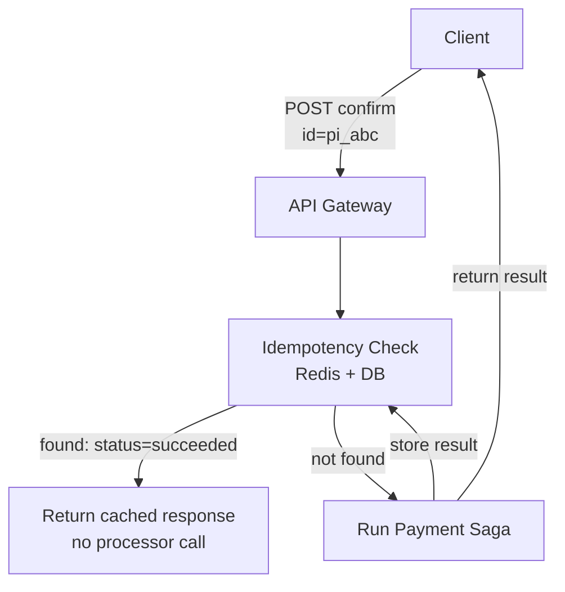
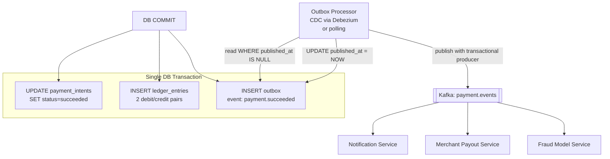
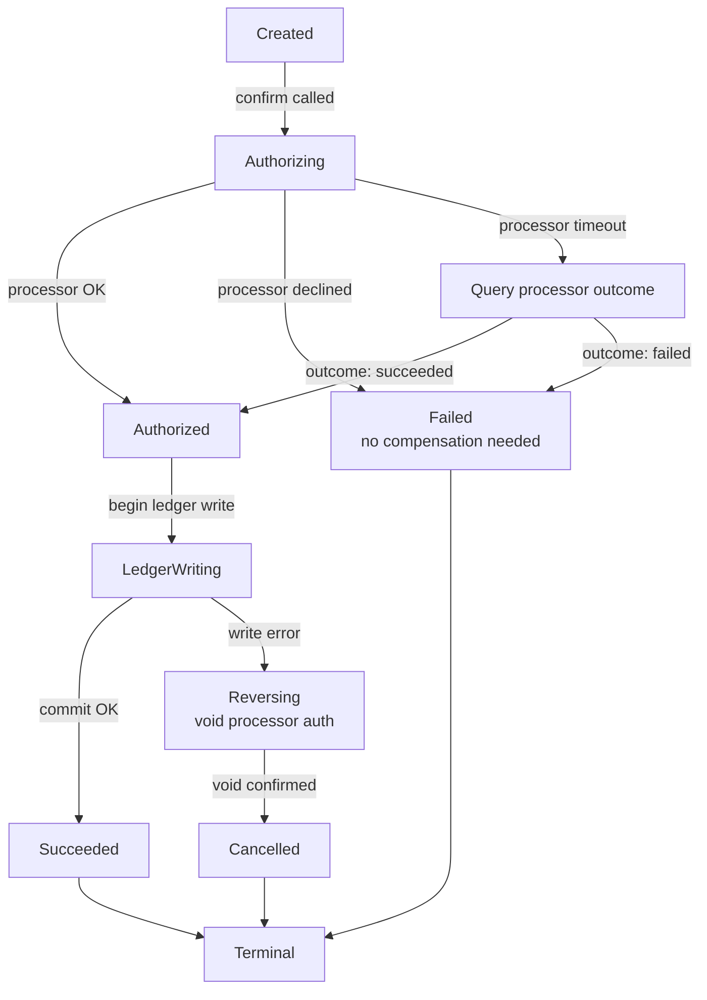
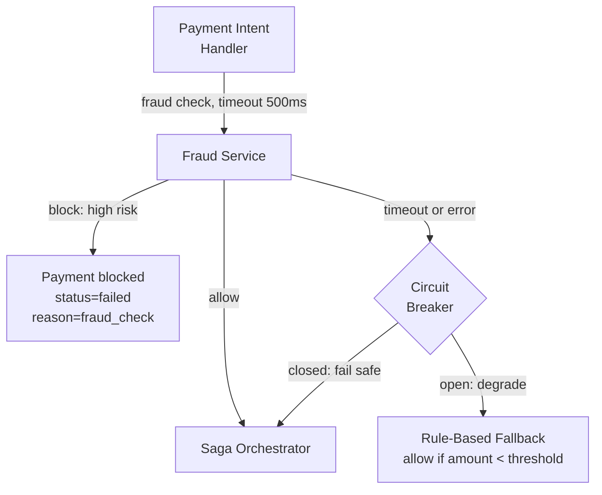
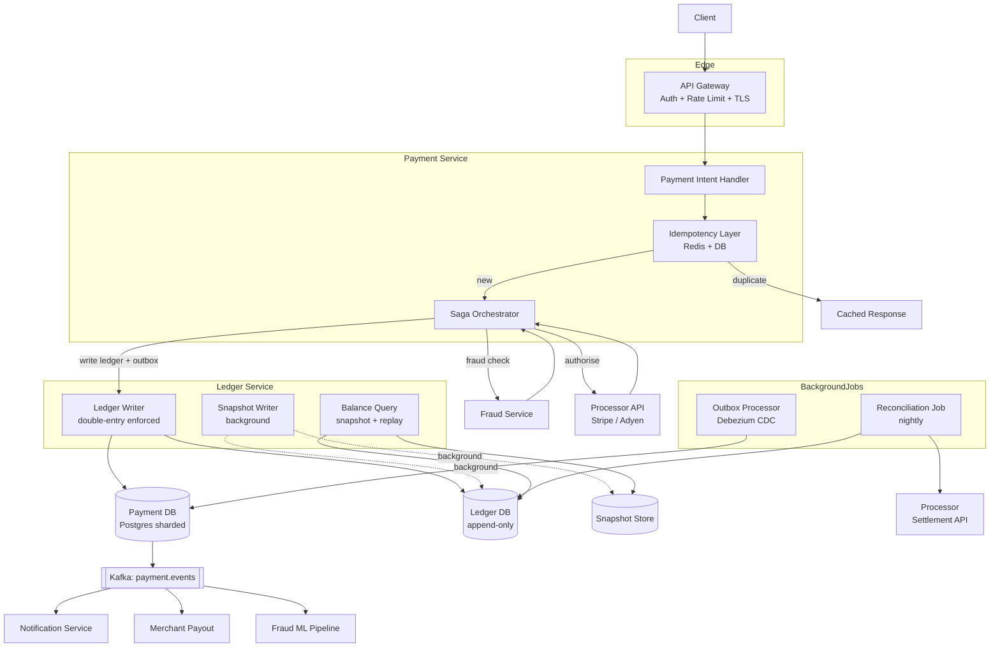

This page tackles the reliability challenges of money movement: exactly-once semantics under retries, atomically publishing events after DB commits, orchestrating a multi-step distributed transaction without global locks, and integrating fraud detection without adding critical-path latency. Each refinement evolves the architecture from the v1 baseline.

## Refinement 4 — Idempotency: Never Double-Charge

**Problem.** Networks are unreliable. A client sends `POST /payment-intents/{id}/confirm`, the server processes the request and charges the buyer, but the TCP connection drops before the response arrives. The client retries. Without idempotency, the server executes a second charge — the buyer is debited twice.

**Modification.** The idempotency layer intercepts every mutation using the `payment_intent_id` as the key. On the first request it stores the result; on any retry it returns the stored result immediately without re-executing any logic.



**Idempotency key flow — step by step:**

```
1. Client generates payment_intent_id (UUID v4) once, before any retry loop.

2. POST /v1/payment-intents
   Server: INSERT INTO payment_intents (id='pi_abc', status='created', idempotency_key=...)
           ON CONFLICT (id) DO NOTHING
   → always returns the same intent record on retry.

3. POST /v1/payment-intents/pi_abc/confirm  ← first attempt
   Server:
     a. SET NX pi_abc:lock EXPIRE 30s  (Redis distributed lock)
     b. Check Redis: GET pi_abc:result → nil
     c. Transition: UPDATE payment_intents SET status='authorizing' WHERE id='pi_abc'
     d. Call processor with idempotency key=pi_abc (processor deduplicates on their side)
     e. Write ledger + outbox in one DB transaction
     f. UPDATE payment_intents SET status='succeeded'
     g. SET pi_abc:result {status:succeeded,...} EX 86400  (24-hour TTL in Redis)
     h. DEL pi_abc:lock

4. POST /v1/payment-intents/pi_abc/confirm  ← retry (timeout scenario)
   Server:
     a. SET NX pi_abc:lock → wait (previous attempt may still be in-flight)
     b. Check Redis: GET pi_abc:result → {status:succeeded,...}
     c. Return cached response immediately. No processor call.
```

**Two-layer idempotency:** Redis for speed (most retries hit this, sub-millisecond), the DB `status` column for durability (Redis can evict; the DB is the ground truth for requests older than the 24-hour TTL). The distributed lock (`SET NX`) serialises concurrent retries for the same intent so only one attempt executes the saga.

See {} and {} for the general pattern. The key design insight is that idempotency is a **collaboration**: the client must generate and resend the same key, and the server must detect and short-circuit duplicates. Both halves are required.

**Trade-off:** the idempotency lock serialises concurrent requests for the same intent — intentional, since running two saga executions in parallel for the same payment would be dangerous. The 24-hour TTL means very delayed retries (uncommon) fall through to the DB status check rather than the Redis cache.

## Refinement 5 — Outbox Pattern: Atomic DB Write + Event Publish

**Problem.** After a successful payment, the service must publish a `payment.succeeded` event to Kafka so downstream services (notification, merchant payout, fraud model retraining) are notified. But writing to the DB and publishing to Kafka are two separate operations. A process crash between them produces one of two failures:

- DB committed, Kafka publish failed → downstream services never notified, merchants not paid out.
- Kafka published, DB write failed → phantom events for a transaction that does not exist.

**Modification.** Use the [Outbox pattern]({}): write the event to an `outbox` table **in the same DB transaction** as the payment intent update and ledger entries. A separate Outbox Processor (using CDC or polling) reads unpublished outbox rows and publishes them to Kafka, marking each row as published only after Kafka acknowledges.



**Exactly-once guarantee end-to-end:**

| Layer | Guarantee mechanism |
|---|---|
| DB write + outbox | Single atomic transaction — either both commit or neither does |
| Outbox → Kafka | Transactional Kafka producer (`enable.idempotence=true`, `transactional.id`) |
| Kafka → consumer | `enable.auto.commit=false`; consumers commit offset only after idempotent processing |
| Consumer processing | Consumer uses `payment_intent_id` as idempotency key for its own writes |

This chain gives **effectively exactly-once** semantics end-to-end. See {} for Kafka transactional producer semantics and {} for the broader pattern.

**CDC vs polling:** Debezium reading the Postgres WAL introduces ~10–100 ms latency between DB commit and Kafka publish with no DB polling overhead. Simple polling (`SELECT … WHERE published_at IS NULL ORDER BY created_at LIMIT 500`) works for lower-throughput systems but adds load to the DB and introduces up to the polling interval of latency (typically 1–5 s). At 40K events/s, CDC is preferred.

**Trade-off:** the outbox adds a hop between DB commit and Kafka publish. Downstream services see payment events with a small delay (~100 ms with CDC). This is acceptable because all downstream consumers are asynchronous by design. If the outbox processor falls behind, the lag metric (`MAX(created_at) WHERE published_at IS NULL`) becomes a critical alert.

## Refinement 6 — Saga Pattern: Multi-Step Money Movement

**Problem.** A complete payment involves four ordered steps across multiple services:

1. Create payment intent (Payment DB)
2. Authorise with external processor
3. Write ledger entries (Ledger DB)
4. Update payment status + publish event via outbox (Payment DB)

A crash between any two steps leaves the system partially executed. How does the system recover without double-charging or leaving money in limbo?

**2PC vs Saga — why Saga is preferred for cross-service money movement:**

| Property | 2PC | Saga |
|---|---|---|
| Works across external services? | No — the processor has no 2PC API | Yes — no cross-system protocol required |
| Availability during coordinator failure | Blocks until coordinator recovers | Compensating transactions proceed independently |
| Latency | High — two round-trips with locks held across the network | Low — no global lock held |
| Failure isolation | Single coordinator failure can block all participants | Each step fails and compensates independently |
| Atomicity | Strong — all-or-nothing across all participants | Eventual — best-effort compensation |

See {} and {}. **2PC cannot span an external processor** that provides no rollback API. Even within our own services, holding DB locks across network calls at 10,000 TPS would serialise the entire payment fleet. Saga with compensating transactions is the industry standard for cross-service money movement.

**Modification.** Model payment confirmation as a **choreography-free orchestrated Saga** — a single Saga Orchestrator service drives all steps and records its progress in the `payment_intents.status` column (which acts as the saga state).

**Saga state machine:**



**Saga orchestration pseudocode:**

```python
def confirm_payment_saga(payment_intent_id: str):
    pi = db.get_payment_intent(payment_intent_id)

    # Step 1: Authorise with processor
    # Idempotency key sent to processor = payment_intent_id
    # so retrying never double-charges at the processor level.
    db.set_status(payment_intent_id, 'authorizing')
    try:
        auth = processor.authorize(
            idempotency_key=payment_intent_id,
            amount=pi.amount,
            payment_method=pi.payment_method_id
        )
        db.set_processor_ref(payment_intent_id, auth.processor_ref)
        db.set_status(payment_intent_id, 'authorized')

    except ProcessorDeclined as e:
        db.set_status(payment_intent_id, 'failed', reason=str(e))
        return  # No money moved; no compensation required.

    except ProcessorTimeout:
        # NEVER blindly retry — query the processor first.
        auth = processor.query_by_idempotency_key(payment_intent_id)
        if auth and auth.status == 'succeeded':
            db.set_processor_ref(payment_intent_id, auth.processor_ref)
            db.set_status(payment_intent_id, 'authorized')
        else:
            db.set_status(payment_intent_id, 'failed', reason='processor_timeout')
            return

    # Step 2: Write ledger + update status + publish outbox event
    # ALL in one DB transaction — atomic with outbox.
    try:
        with db.transaction():
            # Debit buyer, credit merchant (net payment)
            ledger.write_pair(
                payment_intent_id=payment_intent_id,
                debit_account='buyer_payable',
                credit_account='merchant_receivable',
                amount=pi.amount
            )
            # Debit merchant, credit platform (fee)
            ledger.write_pair(
                payment_intent_id=payment_intent_id,
                debit_account='merchant_receivable',
                credit_account='platform_revenue',
                amount=pi.fee_amount
            )
            outbox.insert(
                payment_intent_id=payment_intent_id,
                event_type='payment.succeeded',
                payload=pi.to_dict()
            )
            db.set_status(payment_intent_id, 'succeeded')  # inside same tx

    except LedgerWriteError:
        # Compensate: void the processor authorisation.
        # The buyer's card hold is released; no money moves.
        processor.void(auth.processor_ref)
        db.set_status(payment_intent_id, 'cancelled', reason='ledger_error')
```

**The processor timeout is the most dangerous edge case.** Blindly retrying risks double-charging; blindly failing risks a charged-but-unrecorded transaction. The fix is to query the processor using the `payment_intent_id` as the idempotency key before deciding. This is why passing our own idempotency key to the processor is non-negotiable.

**Justification & trade-offs.** Each saga step is independently atomic. Failures trigger compensating transactions that undo prior steps. The system converges to a consistent terminal state (succeeded or cancelled) without blocking other payments. Trade-off: there is a window between a step completing and its compensation being triggered where the system is in an intermediate state — visible to the buyer as "processing." This is acceptable; users understand payments take seconds to finalise. See {} for the consistency/availability trade-off this implies.

## Refinement 7 — Fraud Check Integration

**Problem.** Every payment should pass through a fraud check before authorisation. The fraud service has variable latency (10–500 ms) and can block a payment. We must not let the fraud service become a hard dependency that stalls the payment flow during outages.

**Modification.** Insert the fraud check as a **synchronous gate** before processor authorisation, with a strict timeout and circuit breaker. On fraud-service unavailability, fall back to a rule-based heuristic (e.g., allow low-risk amounts, hold high-value payments for async review).



The fraud service receives a payload including buyer transaction history, device fingerprint, IP address, and merchant category code. It returns a risk score (0–100) stored on the `payment_intents` row. Scores above the configured threshold block the payment; borderline scores may flag for async manual review without blocking.

See {} for circuit breaker mechanics and {} for overload handling when the fraud service is slow.

**Fraud data feedback loop:** the stored risk score feeds the nightly reconciliation — chargebacks on payments with low scores trigger model retraining. Chargebacks on payments with high scores that were allowed (degraded mode) are tracked separately for fallback policy tuning.

## Final Architecture


