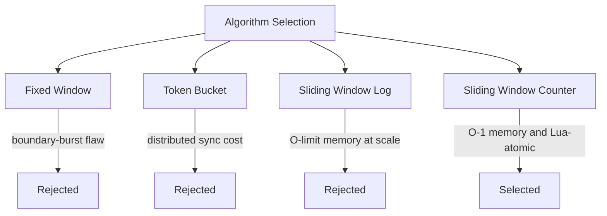
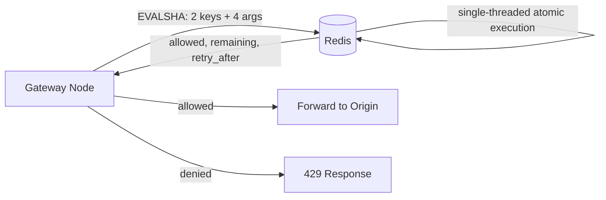
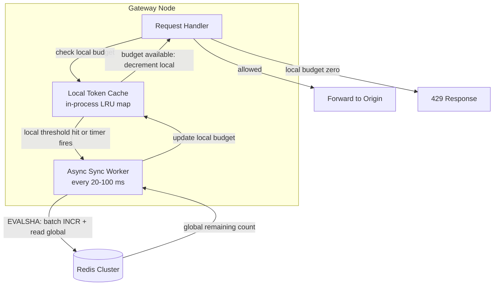
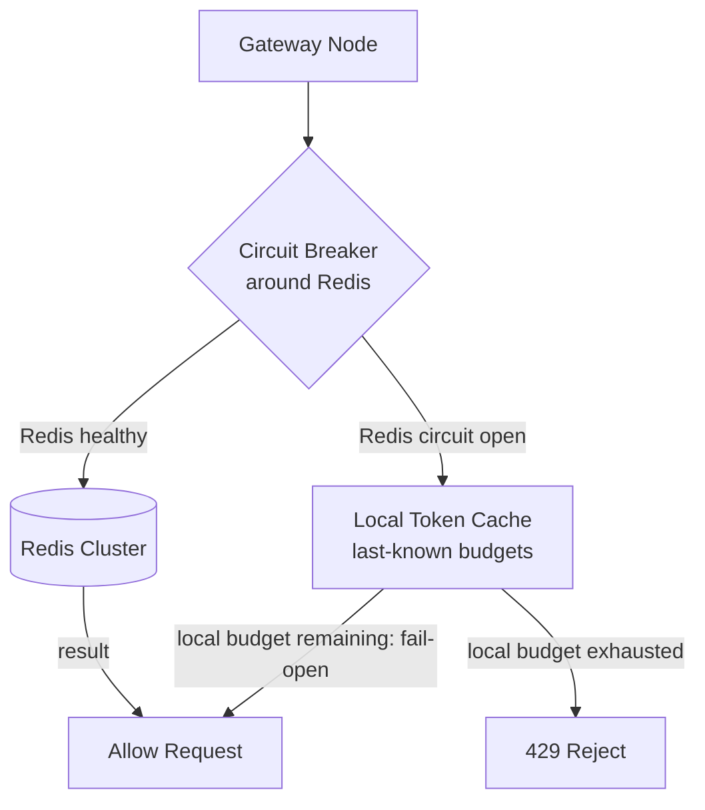
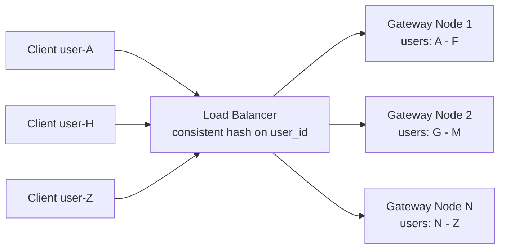
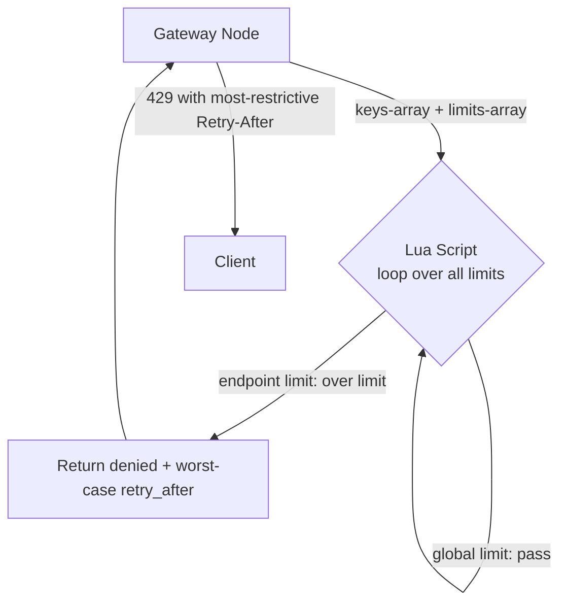
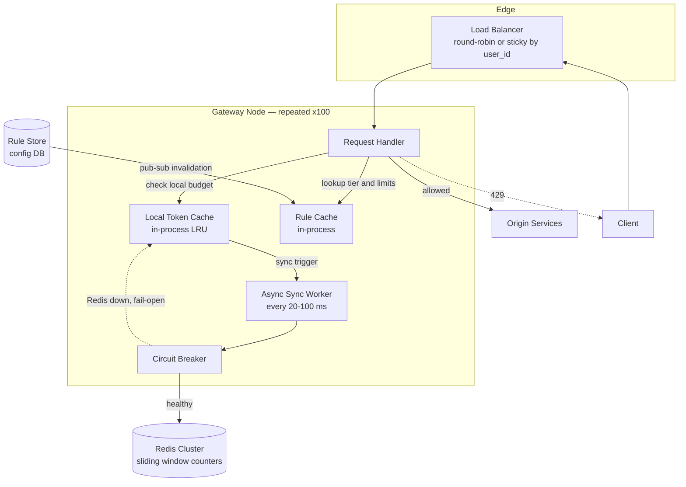

We evolve the v1 design by attacking each weakness in turn: **Problem → Modification → Justification**. Every refinement carries its own diagram so the architecture's evolution is visible.

## Refinement 1 — Choosing the right counting algorithm

**Problem.** v1 deferred the algorithm choice. The counting algorithm determines memory cost, burst behaviour, precision, and whether atomic enforcement is feasible — so it must be settled before everything else.

**Modification.** Evaluate the four main algorithms and select the best fit for our NFRs.

### Fixed Window

Divide time into fixed clock-aligned windows (e.g., every minute). One counter per window, incremented on each request. Reject when `counter ≥ limit`.

**Boundary-burst problem:** a client can send `limit` requests at 12:00:58 and another `limit` requests at 12:01:01. Both windows are legal, but the user just sent `2 × limit` requests in 3 seconds.

### Token Bucket

Each client has a bucket with capacity `burst_size`. Tokens refill at `limit / window_seconds` tokens/s. A request consumes one token (or `cost` tokens); an empty bucket means 429.

Naturally supports burst: a client idle for several seconds accumulates tokens and can fire a burst. However, maintaining `(bucket_level, last_refill_ts)` accurately across a distributed fleet requires every token-consumption decision to be serialised — the state is harder to keep consistent without a round-trip and a compare-and-swap. See {}.

### Sliding Window Log

Keep a sorted set of request timestamps per user. On each request: remove timestamps older than `window_seconds`; if `|log| < limit`, append and allow; else reject.

Exact precision — no boundary bursts. But memory cost is O(limit) entries per user. At 1000 req/min × 10M users = **10 billion entries** in the worst case. Unusable at this scale.

### Sliding Window Counter

Keep two fixed-window counters: the **current** window and the **previous** window. Estimate the request count in the true sliding window:

```
estimated = prev_count × ((window_seconds - elapsed_in_current_window) / window_seconds)
           + curr_count
```

Allow if `estimated + cost ≤ limit`; increment `curr_count`.

- ✅ **O(1) memory** — two integers per (user, endpoint) pair.
- ✅ **No boundary burst** — the weighted blend smooths the transition.
- ✅ **Atomic with a Redis Lua script** — Refinement 2.
- ❌ Approximate (weighted estimate, ±~0.5% error at steady state) — acceptable per our eventual-consistency NFR.

### Algorithm Comparison

| Algorithm | Memory per key | Burst support | Boundary burst? | Precision | Distributed complexity |
|---|---|---|---|---|---|
| Fixed Window | O(1) | ❌ | ✅ Problem | Low | Low |
| Token Bucket | O(1) | ✅ Natural | ❌ | High | High — needs sync |
| Sliding Window Log | O(limit) | ❌ | ❌ | Exact | Medium |
| **Sliding Window Counter** | **O(1)** | **Partial** | **❌** | **~99.5%** | **Low — Lua atomic** |

**Decision: Sliding Window Counter.** The `burst_factor` in the limit rules multiplies the limit to give a configurable ceiling (e.g., `burst_factor: 1.5` allows 1500 in a short burst), approximating token-bucket burst behaviour without the distributed-synchronisation overhead. See {} for deeper treatment of all four.



## Refinement 2 — Atomic enforcement: eliminating race conditions

**Problem.** A non-atomic check-then-increment has a race condition. With 100 gateway nodes all incrementing the same user counter concurrently, two nodes can both read `count = 999` (under the limit of 1000), both decide to allow, and both increment to 1000 — effectively doubling the permitted rate.

**Modification.** Execute the full sliding-window counter logic as a **single atomic Redis Lua script**. Redis runs Lua scripts single-threaded under its GIL, so the entire read → compute → write is serialised without a distributed lock. See {}.

```lua
-- Sliding Window Counter — atomic Redis Lua script
-- KEYS[1] = current window key   e.g. "rl:user:u_123:/search:1720000060"
-- KEYS[2] = previous window key  e.g. "rl:user:u_123:/search:1720000000"
-- ARGV[1] = limit          (int)
-- ARGV[2] = window_seconds (int)
-- ARGV[3] = current epoch  (float, passed by caller)
-- ARGV[4] = request cost   (int, default 1)
-- Returns: { allowed (0|1), new_estimated_count, retry_after_seconds }

local limit        = tonumber(ARGV[1])
local window       = tonumber(ARGV[2])
local now          = tonumber(ARGV[3])
local cost         = tonumber(ARGV[4])
local window_start = math.floor(now / window) * window
local elapsed      = now - window_start

local prev_count = tonumber(redis.call('GET', KEYS[2])) or 0
local curr_count = tonumber(redis.call('GET', KEYS[1])) or 0
local weight     = (window - elapsed) / window
local estimated  = math.floor(prev_count * weight) + curr_count

if estimated + cost > limit then
    local retry_after = math.ceil(window - elapsed)
    return {0, estimated, retry_after}   -- denied
end

redis.call('INCR',   KEYS[1])
redis.call('EXPIRE', KEYS[1], window * 2)  -- keep prev + curr window alive
return {1, estimated + cost, 0}            -- allowed
```



**Justification & trade-offs.** The Lua script makes the entire check-increment a single indivisible operation — no other Redis client can interleave reads or writes on those keys while the script runs. No distributed lock is needed. The downside: a buggy or slow Lua script blocks the Redis instance (single-threaded). Keep scripts short, pre-load them with `SCRIPT LOAD`, and invoke by SHA hash (`EVALSHA`) so the script is not re-parsed on every call.

## Refinement 3 — Eliminating the per-request Redis round-trip

**Problem.** Even with an efficient Lua script, each request incurs a Redis network round-trip — typically 0.5–2 ms on a LAN. At 1M req/s that generates ~2M Redis ops/s and eats most of the 1 ms p99 latency budget before any origin processing begins.

**Modification.** Add a **local token cache** at each gateway node: an in-process hash map keyed by `(identifier, endpoint)` that tracks the node's local counter and a cached estimate of the remaining global budget. The local counter serves the decision for most requests without contacting Redis. An **async sync worker** (running every 20–100 ms) pushes the node's accumulated increments to Redis via the Lua script and refreshes the local budget from the returned global count.



**Justification & trade-offs.**

| Aspect | Without local cache | With local cache |
|---|---|---|
| Redis ops/s | ~2M | ~20K (100× reduction) |
| Latency overhead per request | 0.5–2 ms (network RTT) | < 0.01 ms (in-process RAM) |
| Accuracy | Exact at sync point | ±sync_interval × local_rate |
| Worst-case over-allowance | None | nodes × sync_interval × per-user rate |

**Over-allowance quantified:** with 100 nodes, a 100 ms sync interval, and a 1000 req/min limit (~16.7 req/s), the worst-case burst across one interval is 100 × 0.1 s × 16.7 ≈ **167 extra requests** — a 16.7% over-allowance window, acceptable under our eventual-consistency NFR. Tightening the sync interval to 20 ms reduces this to ~33 extra requests at the cost of 5× more Redis traffic. This is the fundamental **accuracy ↔ latency trade-off**, a direct expression of the CAP constraint: see {}.

## Refinement 4 — Redis failure: fail-open vs fail-closed

**Problem.** Redis is the shared counter store. If Redis becomes unavailable (network partition, primary failover, OOM), the sidecar cannot check or increment counters. Without an explicit failure policy, this cascades: either all requests are blindly allowed (unlimited traffic), or the sidecar blocks all requests indefinitely (self-inflicted outage).

**Modification.** Wrap Redis calls in a **circuit breaker** with an explicit, configurable failure policy. See {}.



**Fail-open vs fail-closed — the core CAP trade-off:**

| Policy | Behaviour on Redis failure | Best for |
|---|---|---|
| **Fail-open** | Allow all requests; skip counter check | APIs where availability > fairness |
| **Fail-closed** | Reject all requests with 429 | APIs where correctness > availability |
| **Hybrid (recommended)** | Use last-known local cache; allow if budget seems available | Balance: rate-limiting degrades gracefully, not catastrophically |

The **hybrid** approach uses the local token cache (from Refinement 3) as the fallback: if the circuit is open, the sidecar consults the last-known local budget. If the local count shows the user is clearly over-limit, reject. Otherwise allow. This avoids mass rejection while still catching obviously abusive clients. See {} — we explicitly choose Availability + Partition tolerance during Redis failure, accepting that limits may be imprecisely enforced.

The circuit opens after a threshold (e.g. 5 Redis timeouts within 10 s) and probes for recovery with a single request every 30 s.

## Refinement 5 — Multi-node counter distribution and per-endpoint limits

**Problem 1 — Shared counter inaccuracy.** With round-robin routing and local caching, a user whose requests spread evenly across 100 nodes sees only 1% of their total traffic on each node. Each node's local counter shows ~10 req/min against a 1000 req/min limit — well under threshold — so every node allows freely while the global total may far exceed the limit. The sync corrects this, but the sync interval is the window of over-allowance.

**Problem 2 — Multi-limit evaluation.** A request to `/api/v1/search` must satisfy *two independent limits*: the user's global quota (1000 req/min total) and the per-endpoint search quota (100 req/min). These are separate Redis keys, and they must both pass before the request is allowed.

**Modification 1 — Sticky routing (optional, accuracy-first).** Configure the load balancer to route all requests from a given `user_id` to the same gateway node using consistent hashing on the user ID. The local counter then represents the user's *entire* traffic — it is globally accurate without waiting for a Redis sync.



**Sticky routing trade-offs:**
- ✅ Local counter = global truth → exact enforcement, negligible Redis traffic.
- ❌ Uneven load if some users generate far more traffic than others — hotspot nodes. See {}.
- ❌ A node crash forces re-hashing; the replacement node starts with a fresh counter, granting a one-window burst.
- ❌ Complicates autoscaling — adding a node requires rehashing user assignments.

For most deployments, **shared counters with a short sync interval** (20 ms) is the right default, accepting the small over-allowance. Sticky routing is reserved for strict-accuracy requirements.

**Modification 2 — Batched multi-limit Lua call.** Evaluate all applicable limits for a request in a single Redis round-trip by passing all relevant key pairs and limit values to an extended Lua script that loops over them:



The Lua script returns the result of *all* limit checks atomically. If any limit is exceeded, the request is denied and the response reflects the most restrictive `remaining` and `retry_after` across all applicable rules. This costs **one Redis round-trip regardless of how many limits apply**, keeping latency constant.

**Retry-After computation across multiple limits:** when several limits are checked simultaneously, the client-facing `Retry-After` header should reflect the *earliest* time at which all limits would allow the request — the maximum `retry_after` across all exceeded limits. The sidecar selects the worst case from the Lua response array.

## Final Architecture



## Drill-Down

### 429 Response Header Construction

When a request is denied, the sidecar constructs the response from the values returned by the Lua script:

```python
# Sidecar logic after Lua returns
if not allowed:
    response.status = 429
    response.headers["X-RateLimit-Limit"]     = limit
    response.headers["X-RateLimit-Remaining"] = 0
    response.headers["X-RateLimit-Reset"]     = window_start + window_seconds
    response.headers["Retry-After"]           = retry_after   # from Lua
    response.body = '{"error":"rate_limit_exceeded","retry_after_seconds":' + retry_after + '}'
else:
    response.headers["X-RateLimit-Limit"]     = limit
    response.headers["X-RateLimit-Remaining"] = max(0, limit - new_count)
    response.headers["X-RateLimit-Reset"]     = window_start + window_seconds
    forward_to_origin()
```

See {} for the full `X-RateLimit-*` header spec.

### Redis Key Schema

```
Pattern:  rl:{scope}:{identifier}:{endpoint_hash}:{window_start}

Examples:
  rl:user:u_99182:a3f2:1720000000   -- user global + /search, epoch-aligned 60s window
  rl:ip:203.0.113.42:ffff:1720000000 -- IP-scoped, all endpoints combined
  rl:user:u_99182:*:1720000000       -- user global limit across all endpoints
```

`endpoint_hash` is a 4–6 char hex hash of the endpoint path, keeping keys short without collisions at ~100 endpoints. Window start is `floor(epoch / window_seconds) * window_seconds`.

**TTL:** `window_seconds × 2` ensures both the current and previous window counter coexist in Redis — required by the sliding window weighted calculation. Keys self-delete at expiry with no cleanup job.

### Data Structures

| Structure | Where | Why |
|---|---|---|
| **Two integer counters (INCR)** | Redis per-window key | O(1) memory, atomic with Lua, minimal bandwidth |
| **Sorted set (ZADD/ZREMRANGEBYSCORE)** | Not used — sliding log variant | O(limit) memory: ruled out at 10B entries |
| **In-process LRU hash map** | Local token cache | O(1) lookup, bounded memory, auto-evicts cold users |
| **Atomic Lua script** | Redis enforcement | Serialised check-compute-write; avoids distributed lock |
| **In-process trie / prefix map** | Rule cache | Sub-microsecond rule lookup with wildcard endpoint matching |

### Edge Cases and Failure Handling

- **Clock skew across nodes:** all nodes derive `window_start` from `math.floor(epoch / window_seconds) * window_seconds`. Use `redis.call('TIME')` inside the Lua script to get the Redis-server's clock, avoiding dependence on the calling node's clock entirely.
- **Redis key eviction:** if Redis runs out of memory and evicts counter keys, an evicted counter resets to zero — effectively granting a free window. Prevent by setting `maxmemory-policy noeviction` on the counter cluster (Redis returns errors on writes rather than silently dropping data). Size the cluster with 20% headroom.
- **High-cardinality IP attacks:** a DDoS from millions of unique spoofed IPs creates millions of Redis keys, bloating the counter store. Mitigate upstream: use a CDN or network layer to drop clearly-illegitimate traffic before it reaches the gateway. The rate limiter is a fairness control, not a DDoS shield. See {}.
- **Limit rule changes mid-window:** when a user is upgraded from free to paid, their existing counters remain. Two choices: (a) apply the new limit from the next window start (simple — standard practice), or (b) re-read the rule on every Lua call (correct but adds per-call rule lookup overhead). Option (a) is recommended.
- **Idempotent rule updates:** rule changes are delivered via pub/sub and applied with `PUT` semantics — repeated delivery of the same rule change has no side effects. See {}.
- **Back-pressure propagation:** if origin services shed load under stress, the gateway can apply tighter rate limits adaptively — a form of back-pressure that reduces inbound traffic before it reaches overloaded services. See {}.
- **Node crash recovery:** a crashed gateway node loses its local counter. The replacement node starts with an empty local cache and a fresh sync from Redis. For one window after recovery, the user effectively gets a small additional budget from that node — acceptable under our eventual-consistency guarantee.
