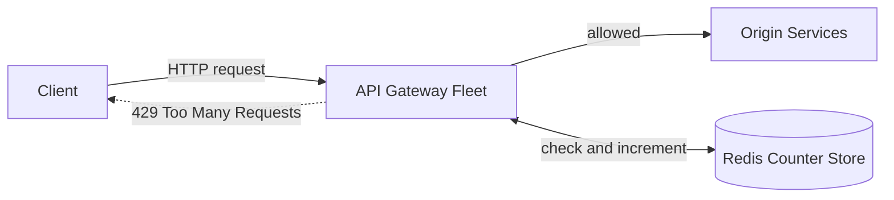
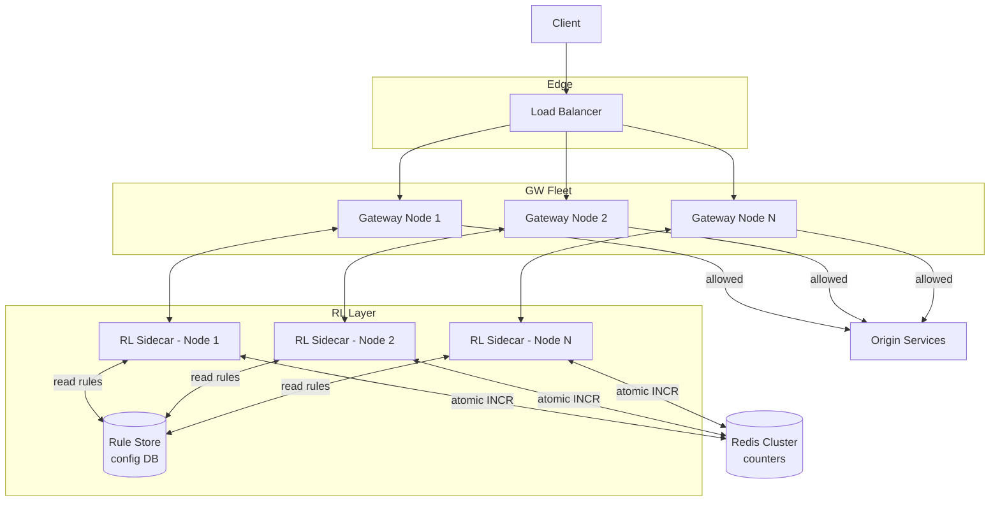

## Capacity Estimation

Start from the stated requirements and derive everything else — an interviewer wants to see the reasoning, not a memorised answer.

### Traffic

| Metric | Calculation | Result |
|---|---|---|
| Sustained gateway throughput | given | **1M req/s** |
| Peak throughput (×3 burst factor) | 1M × 3 | **3M req/s** |
| Gateway nodes (30K req/s per node) | 3M ÷ 30K | **~100 nodes** |
| Redis ops — no local cache | 1 check + 1 INCR per request | **~2M Redis ops/s** |
| Redis ops — with local node cache | periodic sync, ~100× reduction | **~20K Redis ops/s** |

The local-cache path is essential — 2M Redis ops/s saturates a typical Redis cluster and violates the 1 ms p99 latency budget with network round-trip overhead alone.

### Counter Store Sizing (Redis)

The sliding window counter algorithm (chosen in the deep dive) uses one Redis key per *(identifier, endpoint, time-window)*, expiring automatically when the window rolls over.

| Parameter | Value |
|---|---|
| Active users in any 60 s window | 10M |
| Endpoints with per-endpoint limits | ~100 |
| Active (user, endpoint) pairs | ~50M — not all users hit all endpoints |
| Bytes per Redis key | 50 B key string + 8 B counter + overhead ≈ **~70 B** |
| User counter working set | 50M × 70 B | **~3.5 GB** |
| Per-IP counters (unauthenticated) | 5M IPs × 70 B | **~350 MB** |
| **Total Redis working set** | | **~4 GB** |

A small Redis cluster (3–6 nodes with replicas) holds this comfortably. Keys auto-expire with the window — no explicit cleanup job.

### Rule Store

Limit rules (tier → QPS per endpoint) change infrequently and are tiny.

| Metric | Value |
|---|---|
| Distinct limit rules | ~10K |
| Bytes per rule | ~200 B |
| Total size | **~2 MB — fits entirely in each gateway node's RAM** |

Rules are cached in-process on each gateway node and refreshed on a pub/sub invalidation event. Zero per-request lookups to the rule store.

### Bandwidth to Redis

| Scenario | Redis ops/s | Avg payload | Bandwidth |
|---|---|---|---|
| No local cache | 2M | 100 B | **~200 MB/s** |
| With local token cache | 20K | 100 B | **~2 MB/s** |

## API Design

The rate limiter is an enforcement component embedded in (or co-located as a sidecar with) the gateway — not a public API. Two contract surfaces matter:

### Gateway-internal check

```
CheckLimit(
    identifier : string,   -- user_id (auth) or client IP (unauth)
    endpoint   : string,   -- "/api/v1/search"
    cost       : int = 1   -- token cost; some endpoints cost more
) → LimitResult {
    allowed     : bool,
    limit       : int,     -- configured max for this window
    remaining   : int,     -- tokens remaining after this request
    reset_at    : int,     -- epoch seconds when window resets
    retry_after : int|null -- seconds until next allowed attempt
}
```

### Client-facing 429 response

```
HTTP/1.1 429 Too Many Requests
X-RateLimit-Limit:     1000
X-RateLimit-Remaining: 0
X-RateLimit-Reset:     1720000060
Retry-After:           37
Content-Type: application/json

{ "error": "rate_limit_exceeded", "retry_after_seconds": 37 }
```

Always include `X-RateLimit-*` headers on *allowed* responses too — clients use `remaining` and `reset_at` to self-throttle before hitting 429. See {} for `Retry-After` and `X-RateLimit-*` conventions, and {} for 429 semantics.

### Admin rule management (ops, low-traffic)

```
PUT /admin/v1/limits/{tier}
  Body: { "endpoint": "/api/v1/search", "limit": 1000,
          "window_seconds": 60, "burst_factor": 1.5 }
  204

GET /admin/v1/limits/{user_id}
  200 → [ { "endpoint", "limit", "window_seconds", "tier" } ]
```

## Data Model

Two distinct shapes with completely different access patterns — deliberately separated:

### Limit Rules (configuration, read-heavy, rarely written)

```
limit_rules
  tier            VARCHAR     -- "free" | "paid" | "internal"
  endpoint        VARCHAR     -- "/api/v1/search" or "*" for global
  limit           INT         -- max requests per window
  window_seconds  INT         -- window duration in seconds
  burst_factor    FLOAT       -- e.g. 1.5 allows 1500 in a short burst
```

Stored in a small relational table or Redis hash. Each gateway node loads the full set on startup and re-caches on invalidation events.

### Rate Counters (transient, write-heavy, auto-expiring)

```
Redis key pattern:
  rl:{scope}:{identifier}:{endpoint_hash}:{window_start_epoch}

Examples:
  rl:user:u_99182:a3f2:1720000000   -- user u_99182, /search hash, epoch-aligned window
  rl:ip:203.0.113.42:*:1720000000   -- IP global limit
  rl:user:u_99182:*:1720000000      -- user global limit across all endpoints

Value:  integer (INCR)
TTL:    window_seconds × 2  -- keep current + previous window for sliding calculation
```

Purely Redis — never written to durable storage. Expiry is automatic. See {}.

## High-Level Architecture — v1

### Level 0 — Context



### Level 1 — Components



**Component responsibilities:**

- **Load Balancer:** distributes client connections across gateway nodes. The routing strategy — sticky vs. round-robin — has a direct impact on counter accuracy, explored in the {}. See {}.
- **Gateway Nodes:** stateless HTTP processors. Each node consults its co-located rate-limit sidecar synchronously before forwarding a request. Statelessness lets the fleet scale horizontally.
- **Rate-Limit Sidecar:** the enforcement logic. In v1 it issues a synchronous Redis call on every request — one network round-trip per check. This is the primary bottleneck the deep dive addresses.
- **Rule Store:** holds limit configurations keyed by tier and endpoint. Loaded into each node's process memory at startup; pub/sub events trigger a refresh on rule changes. No per-request I/O.
- **Redis Cluster:** the shared atomic counter backend, partitioned by key for horizontal scale. See {} for how counter keys are distributed.

**V1 weaknesses the {} addresses:**
1. Which counting algorithm to use — fixed windows have a boundary-burst problem; we need the right trade-off.
2. Non-atomic check-then-increment allows race conditions across 100 concurrent nodes.
3. Per-request Redis round-trips (0.5–2 ms each) exceed the 1 ms p99 budget.
4. Redis failure with no defined fallback makes the rate limiter a single point of failure.
5. With 100 nodes each holding partial counts, how do we prevent a user from exceeding limits by spreading requests across nodes?
