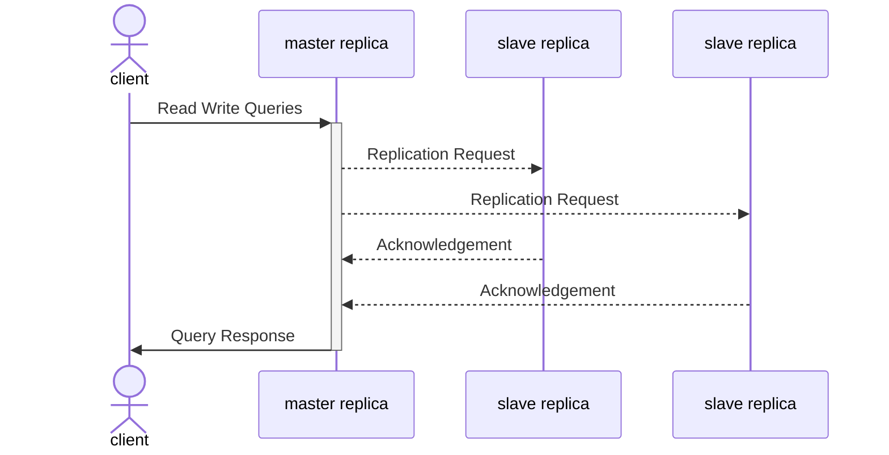
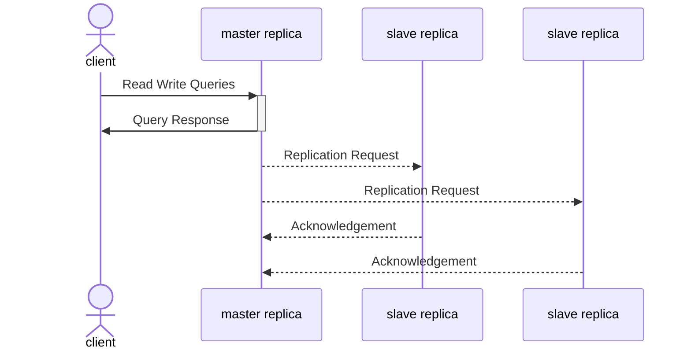
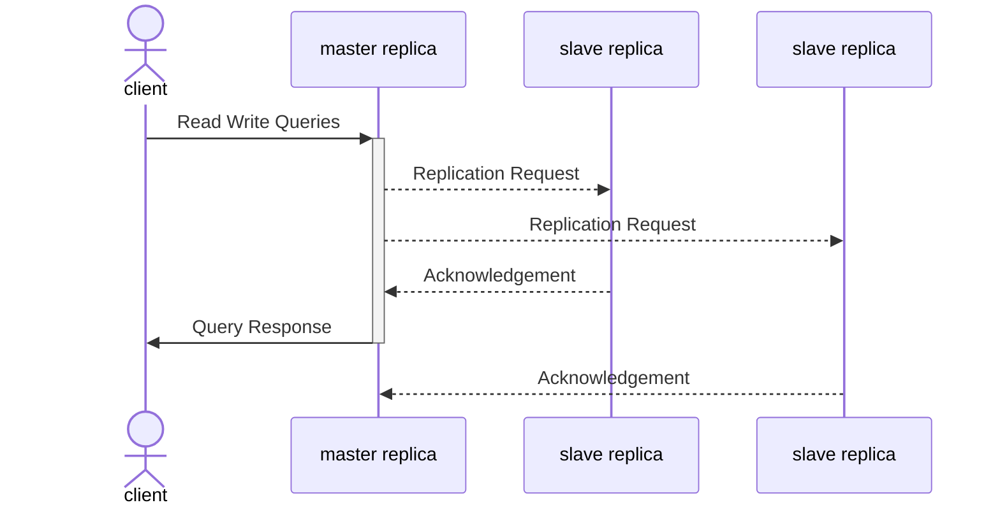

### Synchronous Replication

Client does not receive success message until all replicas complete the write query. This is referred as **Strong Consistency**.

#### Benefits

**Data Integrity**: Ensures that all nodes have the most up-to-date information at all times.

#### Draw Backs

**Single point of failure**: If the synchronous follower becomes unresponsive (due to a crash, network fault, etc.), the leader is forced to halt all write operations, patiently waiting until the synchronous replica is operational again before processing any writes.

**High Latency**: Achieving strong consistency may introduce higher latency, especially in distributed systems where nodes are geographically dispersed.

### Asynchronous Replication

Client receives success message the second that master completes the write query. This is referred as **Eventual Consistency**.

#### Benefits

**Lower Latency**: Nodes do not need to wait for acknowledgment from all other nodes before proceeding.

**Availability**: In scenarios where network partitions or node failures are common, eventual consistency can provide better availability. The leader can continue processing writes, even if all followers have fallen behind.

#### Challenges

**Durability**: If the leader fails and is unrecoverable, any writes not yet replicated to followers are lost. Despite client confirmation, durability of the write is not guaranteed.

**Stale Reads**: If an application reads from an asynchronous follower, it may see outdated information if the follower has fallen behind. 

This inconsistency is just a temporary state—if you stop writing to the database and wait a while, the followers will eventually catch up and become consistent with the leader. For that reason, this effect is known as eventual consistency.

### Hybrid Replication

The Hybrid Replication Model, also known as Semi-Synchronous Replication, combines features of both synchronous and asynchronous replication. In this model, the system processes a write operation synchronously to at least one replica (ensuring immediate acknowledgment to the client) while asynchronously replicating the write to other replicas.

