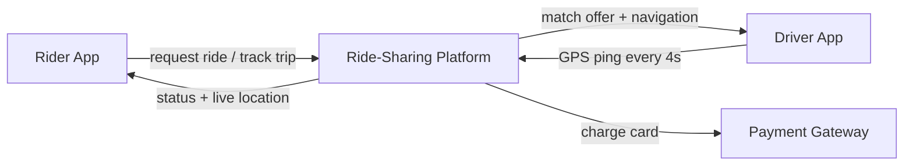
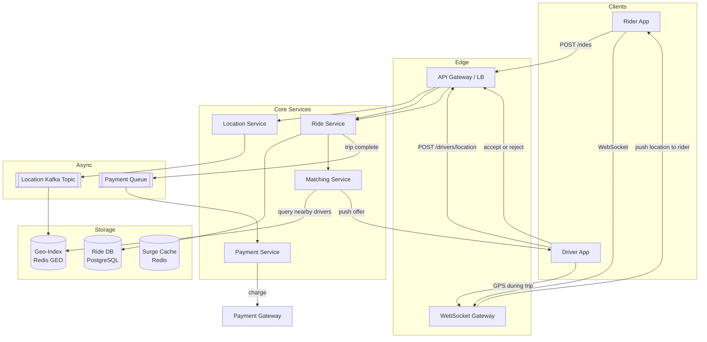

## Capacity Estimation

Start from the requirement numbers and derive everything else. Show the arithmetic — an interviewer wants to see the reasoning, not a memorised answer.

### Traffic

| Metric | Calculation | Result |
|---|---|---|
| Location write QPS (avg) | 5M drivers ÷ 4 s | **1.25M writes/s** |
| Location write QPS (peak ×2) | 1.25M × 2 | **2.5M writes/s** |
| Ride requests/s (avg) | 8M ÷ 86,400 s | **~93/s** |
| Ride requests/s (peak ×5) | 93 × 5 | **~465/s** |
| Concurrent rides (avg) | 8M rides × 20 min ÷ 1,440 min/day | **~111k** |
| Concurrent rides (peak ×3) | 111k × 3 | **~333k** |
| WebSocket connections (peak) | 333k riders + 333k drivers | **~666k** |
| Matching ops/s (peak) | ~same order as ride requests | **~500/s** |

The location-update path is the dominant write load — 2.5M/s at peak. Ride-match operations are comparatively tiny but require low latency.

### Storage

**Driver location — in-memory, current state only:**

| Field | Bytes |
|---|---|
| driver_id (int64) | 8 |
| lat / lon (float64 each) | 16 |
| status (enum byte) | 1 |
| timestamp (int64) | 8 |
| **Per driver** | **~33 B** |

5M drivers × 100 B (with metadata/padding) = **~500 MB** — the entire current-location table fits comfortably in a Redis cluster.

**Location history — analytics and fraud, not on the hot path:**

| Metric | Calculation | Result |
|---|---|
| Events/day | 1.25M/s × 86,400 s | ~108B events/day |
| Raw bytes/day | 108B × 33 B | ~3.6 TB/day |
| Compressed (×0.15) | 3.6 TB × 0.15 | **~540 GB/day** |

Store compressed Parquet partitions in object storage (Kafka sink). The hot path never touches historical location data.

**Ride records:**

| Metric | Calculation | Result |
|---|---|
| Bytes/ride | ~1 KB | — |
| Rides/day | 8M | — |
| Storage/day | 8M × 1 KB | **8 GB/day** |
| 5-year retention | 8 GB × 365 × 5 | **~14.6 TB** |

A modestly sharded relational store handles ride records comfortably.

### Memory (hot operational state)

| Tier | What | Size |
|---|---|---|
| Geo-index (current driver locations) | 5M drivers × 100 B | ~500 MB |
| Surge multiplier cache | ~1M H3 cells × 16 B | ~16 MB |
| Active ride-state cache | 333k rides × 200 B | ~67 MB |
| **Total hot state** | — | **< 1 GB** |

All hot operational state fits in a small Redis cluster (3–6 nodes with replicas).

### Derived Infrastructure

| Component | Sizing rationale | Count |
|---|---|---|
| Location ingestion nodes | 2.5M req/s peak; ~125k/node | ~20 stateless nodes |
| Kafka partitions | ~50k writes/s per partition (safe limit) | ~50 partitions |
| Location consumer nodes | Batch Redis GEOADD at ~250k updates/s/node | ~10 nodes |
| Ride / Matching app nodes | 500 ops/s peak; trivial | ~10 nodes |
| WebSocket gateway nodes | ~10k connections/node | ~70 nodes |
| Redis cluster (geo-index) | < 1 GB hot state + replication | 3-node cluster × 2 |

---

## API Design

A REST-ish contract. All rider and driver calls are authenticated via JWT at the API Gateway. Internal service calls use mTLS.

### Rider APIs

```
POST /api/v1/rides
  Body:    { "pickup_lat": 37.77, "pickup_lon": -122.42,
             "dest_lat": 37.80, "dest_lon": -122.40 }
  201  →  { "ride_id": "r_abc123", "status": "matching",
             "estimated_fare_usd": 12.50, "surge_multiplier": 1.2,
             "estimated_wait_seconds": 240 }
  503  →  No drivers available in area

GET /api/v1/rides/{ride_id}
  200  →  { "ride_id", "status", "driver": { "id", "name", "lat", "lon",
             "eta_seconds", "vehicle" }, "act_fare_usd" }
  404  →  Ride not found

DELETE /api/v1/rides/{ride_id}
  204      (rider cancels before pickup; cancellation fee may apply)

GET /api/v1/rides/{ride_id}/track
  101      WebSocket upgrade; server pushes { "lat", "lon", "eta_seconds" } every ~4 s
```

### Driver APIs

```
POST /api/v1/drivers/location
  Headers: X-Driver-Token: <jwt>
  Body:    { "lat": 37.77, "lon": -122.42, "status": "available" }
  204      (fire-and-forget; failures are silently retried by driver app)

POST /api/v1/rides/{ride_id}/offers/{offer_id}/accept
  204      Driver assigned; ride transitions to "accepted"
  409      Offer expired or already taken by another driver

POST /api/v1/rides/{ride_id}/offers/{offer_id}/reject
  204

POST /api/v1/rides/{ride_id}/complete
  Body:    { "trip_distance_km": 5.3, "duration_minutes": 18 }
  200  →  { "fare_usd": 14.70, "driver_payout_usd": 11.76 }
```

### Internal APIs

```
GET /internal/drivers/nearby
  ?lat=37.77&lon=-122.42&radius_km=5&status=available&limit=20
  200  →  [ { "driver_id", "lat", "lon", "distance_km", "eta_seconds" } ]
```

---

## Data Model

### Entities and Stores

| Entity | Key Fields | Store | Rationale |
|---|---|---|---|
| **Driver** (profile) | driver_id PK, name, car_info, rating | PostgreSQL (replicated) | Low write rate; relational for reporting |
| **DriverLocation** (current) | driver_id PK, lat, lon, h3_cell, status, updated_at | Redis Hashes + H3 Sets | Sub-ms geo-queries; pure in-memory fits easily |
| **Rider** (profile) | rider_id PK, name, payment_method_id | PostgreSQL | Same as driver profile |
| **Ride** | ride_id PK, rider_id, driver_id, status, origin, dest, fare, timestamps | PostgreSQL (sharded) | Strong consistency for billing; relational audit trail |
| **Offer** | offer_id PK, ride_id, driver_id, expires_at | Redis + TTL | Short-lived; natural auto-expiry via TTL |
| **SurgeMultiplier** | h3_cell_id PK, multiplier, computed_at | Redis | Updated every 30–60 s; must be read fast |

### Ride State Machine

```
requested → matching → offered → accepted → en_route → in_progress → completing → completed
                                  ↘ rejected or timed-out → (next candidate)
           ↘ no drivers found → cancelled
```

### Schema Sketches

```sql
-- Rides (sharded by ride_id)
CREATE TABLE rides (
  ride_id       UUID             PRIMARY KEY,
  rider_id      BIGINT           NOT NULL,
  driver_id     BIGINT,
  status        TEXT             NOT NULL,
  pickup_lat    DOUBLE PRECISION NOT NULL,
  pickup_lon    DOUBLE PRECISION NOT NULL,
  dest_lat      DOUBLE PRECISION NOT NULL,
  dest_lon      DOUBLE PRECISION NOT NULL,
  surge_mult    NUMERIC(4,2)     NOT NULL DEFAULT 1.0,
  est_fare_usd  NUMERIC(8,2),
  act_fare_usd  NUMERIC(8,2),
  created_at    TIMESTAMPTZ      NOT NULL DEFAULT now(),
  completed_at  TIMESTAMPTZ
);
```

```
-- Redis: per-driver hash
HSET driver:{driver_id}  lat 37.77  lon -122.42  h3_cell 8928308280fffff  status available  ts 1700000000

-- Redis: per-H3-cell available-driver set (updated on every move)
SADD h3:8928308280fffff:available  driver_id_1  driver_id_2 ...
```

---

## High-Level Architecture — v1

### Level 0 — Context



### Level 1 — First-Cut Components



**Component responsibilities:**

- **API Gateway / LB.** TLS termination, JWT authentication, rate limiting, and routing to stateless backend services. Scales horizontally.
- **Location Service.** Accepts driver GPS pings, validates the token, and publishes updates to Kafka. A consumer group reads from Kafka and applies updates to the in-memory geo-index. The Kafka buffer decouples ingestion from index latency. See {}.
- **Geo-index (Redis).** Stores current driver positions. In v1 this uses Redis's built-in GEO sorted set (`GEOADD`/`GEORADIUS`). Answers "nearby available drivers" queries in O(log N + results).
- **Matching Service.** Queries the geo-index for nearby available drivers, ranks by ETA, and dispatches offers one at a time. Stateless — any node can handle any match request.
- **Ride Service.** State-machine owner for each ride. Persists ride records, manages offer lifecycle (with TTL), and coordinates status transitions.
- **WebSocket Gateway.** Maintains long-lived connections for riders and drivers. Receives driver location updates via pub/sub and forwards them to the matching rider's socket. See {}.
- **Payment Service.** Processes charges at trip completion with idempotency keys to prevent double-charging. See {}.
- **Kafka (location topic).** Buffers 1.25M+ writes/s, decouples the ingestion front-door from geo-index consumers, and provides a durable replay log. See {}.

The weaknesses of v1 — absorbing the location firehose, the geospatial index algorithm, the matching cascade, surge pricing, WebSocket scaling, and payment idempotency — are addressed in the deep dives.
