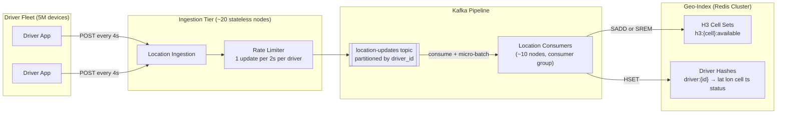
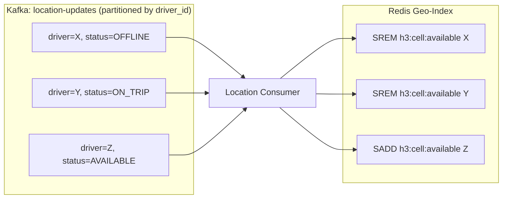

The Location Service is the foundation everything else depends on: matching can't work without an up-to-date geo-index, and the geo-index must absorb **1.25–2.5 million writes per second** from drivers' GPS hardware. This page evolves the location-write path and the geospatial index from the v1 sketch into a production-ready design.

---

## Refinement 1 — Absorbing the Location-Update Firehose

**Problem.** In v1 the Location Service writes each GPS ping directly to Redis. At 1.25M writes/s this means 1.25M individual GEOADD commands per second. A single Redis instance handles ~100–200k commands/s; naive direct writes would require 6–12 Redis primaries just for the ingestion front-door. Worse, if Redis is slow or temporarily unavailable, driver apps pile up retries and amplify load.

**Modification.** Interpose **Kafka** between the driver apps and the geo-index update. Driver apps POST to a lightweight ingestion tier that validates the JWT and publishes to a Kafka topic partitioned by `driver_id`. A consumer group reads from Kafka and applies location updates to the geo-index in micro-batches.



**Justification & trade-offs.**

- **Kafka decouples writers from consumers.** Ingestion latency is bounded by the Kafka publish round-trip (~1–5 ms), independent of Redis throughput. Consumer lag is the only source of geo-index staleness.
- **Partitioning by `driver_id`** ensures each driver's updates arrive in order; the consumer always writes the most recent reading (last-write-wins is correct here, since we only care about current position).
- **Micro-batching.** Consumers accumulate ~100 ms of updates and flush them as a Redis pipeline, reducing round-trips by ~100× compared to one-command-per-update.
- **Replay log.** If the geo-index is corrupted or a Redis node fails, the consumer can replay recent Kafka history and rebuild current state. Because each driver pings every 4 s, 15 minutes of replay fully restores the current-position picture.
- **Trade-off:** adds ~100–500 ms end-to-end latency from GPS ping to index update. Given a 4 s ping interval this is acceptable — less than one ping cycle of staleness.
- **Trade-off:** Kafka adds an operational dependency. See {}.

### Location Update Ingestion Path (Step-by-Step)

```
1. Driver app generates GPS reading (lat, lon, bearing, speed, timestamp).

2. Driver app sends HTTP POST to nearest ingestion node via a persistent
   keep-alive connection. Payload < 1 KB.

3. Ingestion node validates the driver JWT and rate-limits:
   one update accepted per ≥ 2 s per driver_id. Excess updates are dropped.

4. Ingestion node publishes to Kafka:
   partition = hash(driver_id) % num_partitions

5. Kafka consumer (in the location consumer group) reads a batch:
   For each update in the batch:
     a. If status == OFFLINE:
          SREM h3:{current_cell}:available {driver_id}
          DEL driver:{driver_id}    (or mark offline in hash)
     b. If status == AVAILABLE or EN_ROUTE:
          new_cell = h3_encode(lat, lon, resolution=9)
          old_cell = HGET driver:{driver_id} cell
          if old_cell != new_cell:
              SREM h3:{old_cell}:available {driver_id}
              SADD h3:{new_cell}:available {driver_id}
          HSET driver:{driver_id} lat lon cell new_cell ts status

6. Every 30 s: consumer aggregates available-driver count per H3
   resolution-6 cell and emits to the Surge Pricing Service.
```

The rate limiter on the ingestion side ensures misbehaving or buggy driver apps cannot flood Kafka. The floor of one update per 2 s is half the nominal 4 s cadence — generous enough for legitimate fast movement, strict enough to bound write amplification.

---

## Refinement 2 — Geospatial Index: GeoHash vs QuadTree vs H3

**Problem.** The core geo-index operation is: *given a rider's location, return all available drivers within radius R in under 5 ms.* The choice of spatial data structure determines both query latency and how accurately the system answers "nearby" without scanning all 5M drivers.

### Option A — GeoHash

**How it works.** Encode lat/lon as a base-32 string by interleaving the quantised bits of latitude and longitude. Each additional character halves a cell in one dimension — a 6-character GeoHash covers roughly 1.2 km × 0.6 km, a 7-character cell ~153 m × 153 m.

To find drivers in radius R: compute the GeoHash of the rider's position at an appropriate precision level, then query that cell and all **8 adjacent cells** (a 3×3 neighbourhood). Filter the union of candidates by Haversine distance.

```python
def nearby_drivers_geohash(lat, lon, radius_km, precision=6):
    origin_hash = geohash.encode(lat, lon, precision)
    # 8 cardinal + diagonal neighbours + self = 9 cells
    cells = [origin_hash] + list(geohash.neighbors(origin_hash).values())
    candidates = []
    for cell in cells:
        candidates += redis.zrangebylex(f"gh:{cell[:precision]}", ...)
    return [d for d in candidates if haversine(d, (lat, lon)) <= radius_km]
```

**Trade-offs:**

- ✅ Natively supported in Redis (`GEOADD` / `GEORADIUS` use GeoHash internally at ~52-bit precision).
- ✅ Simple prefix-based sharding.
- ⚠ Rectangular cells distort in area at high latitudes (less critical for cities, but introduces non-uniform coverage at scale).
- ⚠ Always needs 9 lookups; cells at boundaries require checking all neighbours to avoid missing drivers 1 metre across a cell edge.
- ⚠ Poor fit for supply aggregation: coarser prefix groups don't align cleanly with meaningful geographic areas.

See {}.

### Option B — QuadTree

**How it works.** Recursively subdivide a 2-D bounding box into four equal quadrants until each leaf contains ≤ k drivers (e.g. k = 50). The tree depth auto-adjusts: dense city cores get deeper subdivisions; rural areas stay shallow. To find nearby drivers, traverse from the root, descending into any quadrant whose bounding box intersects the search circle.

**Trade-offs:**

- ✅ Adaptive density — the tree gets finer exactly where drivers cluster.
- ✅ Efficient range queries; no fixed-precision tradeoff.
- ⚠ Complex to distribute: the tree must either live on one node (single point of failure) or be sharded by geographic region, requiring a routing layer.
- ⚠ Expensive under high churn: 5M drivers updating every 4 s means up to 1.25M tree rebalances/s — difficult at these rates.
- ⚠ Not natively supported in Redis; requires a custom in-memory engine.

See {}.

### Option C — H3 Hexagonal Index (chosen)

**How it works.** Uber's open-source H3 library tessellates the globe into hierarchical hexagonal cells at 16 resolution levels. At **resolution 9**, each cell covers ~0.1 km² with an edge length of ~174 m. Each hexagon has exactly **6 neighbours** (vs 8 for a square grid), so a k-ring neighbourhood query covers the same area with fewer cells and more uniform sampling.

**Geospatial radius query algorithm:**

```python
import h3, math, redis

def find_nearby_drivers(lat, lon, radius_km, resolution=9):
    # Step 1: encode origin to H3 cell at resolution 9
    origin_cell = h3.geo_to_h3(lat, lon, resolution)

    # Step 2: determine k-ring size from radius
    # Resolution-9 cell edge ~174 m; 1 ring step covers ~350 m diameter
    k = max(1, int(radius_km / 0.35))

    # Step 3: get all cells in k-ring (origin + concentric hex rings)
    cells = h3.k_ring(origin_cell, k)      # returns set of cell IDs

    # Step 4: batch-fetch drivers from Redis in one round-trip (pipeline)
    pipe = redis.pipeline()
    for cell in cells:
        pipe.smembers(f"h3:{cell}:available")
    results = pipe.execute()

    # Step 5: flatten and fetch driver positions
    driver_ids = set().union(*results)
    candidates = [fetch_driver_position(d) for d in driver_ids]

    # Step 6: exact Haversine filter (cells give approximate coverage)
    return [d for d in candidates
            if haversine(d.lat, d.lon, lat, lon) <= radius_km]

def haversine(lat1, lon1, lat2, lon2):
    R = 6371.0  # km
    phi1, phi2 = math.radians(lat1), math.radians(lat2)
    dphi       = math.radians(lat2 - lat1)
    dlambda    = math.radians(lon2 - lon1)
    a = math.sin(dphi/2)**2 + math.cos(phi1) * math.cos(phi2) * math.sin(dlambda/2)**2
    return R * 2 * math.asin(math.sqrt(a))
```

**Why H3 wins for this use case:**

| Criterion | GeoHash | QuadTree | H3 |
|---|---|---|---|
| **Neighbour queries** | 9 lookups (square grid) | Tree traversal (complex) | 7 lookups (hex k-ring) |
| **Cell area uniformity** | Distorts at latitude | Uniform (adaptive) | Near-uniform (hex) |
| **Distribution** | Easy (prefix sharding) | Complex (tree sharding) | Easy (cell ID as Redis key) |
| **Driver churn handling** | ZADD per update | Tree rebalance (expensive) | SADD/SREM per update (O(1)) |
| **Supply aggregation** | Awkward (prefix alignment) | Natural (leaf counts) | Natural (roll up via H3 parent) |
| **Operational complexity** | Low (Redis native GEO) | High (custom engine) | Low (Redis sets per cell) |

H3's **6-neighbour k-ring**, **near-uniform cell area**, and **natural hierarchical rollup** (resolution 9 → 6 for surge pricing) make it the best fit. The geo-index update with H3 is O(1) per driver move:

```python
# On each location update (called by the Kafka consumer):
new_cell = h3.geo_to_h3(lat, lon, resolution=9)
old_cell = redis.hget(f"driver:{driver_id}", "cell")

if old_cell and old_cell != new_cell:
    redis.srem(f"h3:{old_cell}:available", driver_id)
    redis.sadd(f"h3:{new_cell}:available", driver_id)

redis.hset(f"driver:{driver_id}", mapping={
    "lat": lat, "lon": lon, "cell": new_cell, "ts": timestamp, "status": status
})
```

Only drivers who cross a cell boundary (edge length ~174 m) trigger a SREM + SADD pair. Drivers stationary or moving within the same cell pay only the HSET cost.

---

## Refinement 3 — Handling Driver Status Transitions

**Problem.** A driver who goes offline, gets matched, or completes a ride must be instantly removed from the "available" pool. Stale entries cause the matching service to offer rides to unavailable drivers, wasting offer slots and adding latency to the rider's experience.

**Modification.** Route all driver status changes through the same Kafka topic with an `action` field (GPS_UPDATE vs STATUS_CHANGE). Because Kafka partitions by `driver_id`, the consumer sees a totally ordered stream per driver — a STATUS_CHANGE event is guaranteed to arrive before any subsequent GPS ping from that driver.



**Additional safety net — heartbeat TTL.** Each driver entry in the geo-index carries a `last_updated` timestamp (in the Redis hash). A background sweeper runs every 30 s and removes any driver whose `last_updated` is more than 60 s old (i.e. two missed ping cycles) from the available set. This handles app crashes or network loss without relying on an explicit OFFLINE event.

**Justification & trade-offs.** SADD and SREM are idempotent — replaying a Kafka message that marks a driver offline has no effect if they're already absent from the set. The heartbeat TTL ensures the index self-heals even when the explicit status event is lost. The trade-off is that a driver whose app crashes while available may remain in the "available" pool for up to 60 s, receiving offers that will time out. This is an acceptable tail latency rather than requiring a synchronous deletion acknowledgment.

---

## Final Architecture — Location Service

```mermaid
flowchart TB
    subgraph DriverApps["Driver Apps (5M)"]
      DA["Driver App"]
    end

    subgraph IngestionTier["Ingestion Tier"]
      IGN["Location Ingestion Nodes<br/>(~20 stateless)"]
      RL["Rate Limiter<br/>1 update per 2s per driver"]
    end

    subgraph KafkaTier["Kafka"]
      KF[["location-updates topic<br/>~50 partitions, partitioned by driver_id"]]
    end

    subgraph Consumers["Location Consumers (~10 nodes)"]
      LC["Consumer Group<br/>micro-batch + Redis pipeline"]
      HB["Heartbeat Sweeper<br/>(runs every 30s)"]
    end

    subgraph GeoStoreTier["Geo-Index (Redis Cluster)"]
      GEO["H3 Cell Sets<br/>h3:{cell}:available → Set of driver_ids"]
      DRVH["Driver Hash<br/>driver:{id} → lat lon cell ts status"]
    end

    SurgeSvc["Surge Pricing Service"]
    MatchSvc["Matching Service"]

    DA -->|POST every 4s| IGN
    IGN --> RL --> KF
    KF -->|consume| LC
    LC -->|SADD or SREM| GEO
    LC -->|HSET| DRVH
    LC -->|supply counts per H3 res-6 cell every 30s| SurgeSvc
    HB -->|remove stale entries| GEO
    MatchSvc -->|SMEMBERS h3:cells k-ring| GEO
    MatchSvc -->|HGETALL driver:{id}| DRVH
```
